<!--
Copyright (c) 2024-2026, Arm Limited and Contributors. All rights reserved.
SPDX-License-Identifier: Apache-2.0
-->

# One RGB camera, no depth sensor, no LiDAR

### What a quadruped can do with that, and where it stops being enough

**Waheed Brown** ([waheed.brown@arm.com](mailto:waheed.brown@arm.com)) — lead author<br>
**Sagar Surendran** ([Sagar.Surendran@arm.com](mailto:Sagar.Surendran@arm.com))<br>
**Timo Tang** ([Timo.Tang@arm.com](mailto:Timo.Tang@arm.com))<br>
**Jackie Lee** ([Jackie.Lee@arm.com](mailto:Jackie.Lee@arm.com))

Arm Limited · August 2026 · repository
[`armwaheed/mappo-arm-cloud-physical-ai`](https://github.com/armwaheed/mappo-arm-cloud-physical-ai)

---

## Abstract

**What can a quadruped do with one RGB camera, no depth sensor and no LiDAR?** Every range and
bearing here is computed from pixels and one focal length — no stereo, no time-of-flight, no
fiducial.

Two platforms: a Unitree Go2, and a Deep Robotics Lite3 Venture, specified because it carries
neither. **The Go2 is a proxy** — available in Austin for work aimed at Lite3s in Shanghai —
so the Go2 half ran on hardware and the Lite3 half essentially did not: four `--live` walks
that executed the plain goal follower rather than the policy, and one bounded axis trial.

On a Go2, RGB-only sensing walks to a detected goal, gives way to a person, maps and swerves
around an obstacle it has no detector for, and threads a 1.3 m gap. Past about a metre the
single camera runs out of geometry, and free space in the policy's observation means "nothing
recognised", not "nothing there".

The negative results carry as much weight. Monocular range fell back to constants on 417 of
4,624 sightings and on one walk drove 21 of 37 avoidance ticks, before a guard was built to
refuse them. The same weights read 13% to 68% peer recall from the launcher alone. A detector
fine-tuning run shipped nothing. The MAPPO policy collided in every unsupervised simulated
configuration and is safe only under the planner's veto. No two-robot hardware run has happened
on either platform. Appendix A logs what we got wrong and how we found out.

## Contents

- [The question](#the-question)
- [The system in one page](#the-system-in-one-page)

**[Part I — What was built](#part-i--what-was-built)**

1. [A robot that turns to calibrate its own camera](#1-a-robot-that-turns-to-calibrate-its-own-camera)
2. [Stop for a blocker: the baseline everything else is measured against](#2-stop-for-a-blocker-the-baseline-everything-else-is-measured-against)
3. [Depth from a focal length — and the guard that refuses a constant range](#3-depth-from-a-focal-length--and-the-guard-that-refuses-a-constant-range)
4. [A telemetry contract, not a console log](#4-a-telemetry-contract-not-a-console-log)
5. [Three seams: the stack moved to a second vendor](#5-three-seams-the-stack-moved-to-a-second-vendor)
6. [A planner that models its own transport](#6-a-planner-that-models-its-own-transport)
7. [An ablated control for every run, and a closed loop before the legs move](#7-an-ablated-control-for-every-run-and-a-closed-loop-before-the-legs-move)
8. [A deployed tree that names its own commit](#8-a-deployed-tree-that-names-its-own-commit)
9. [A browser dashboard that drives a real fleet](#9-a-browser-dashboard-that-drives-a-real-fleet)
10. [Peers over the mesh, not through a detector](#10-peers-over-the-mesh-not-through-a-detector)
11. [Test runs are the training corpus](#11-test-runs-are-the-training-corpus)
12. [One robot, four detectors](#12-one-robot-four-detectors)
13. [A detector training pipeline that shipped nothing, and the three things worth keeping from it](#13-a-detector-training-pipeline-that-shipped-nothing-and-the-three-things-worth-keeping-from-it)
14. [Guards proven by forcing them to fail](#14-guards-proven-by-forcing-them-to-fail)

**[Part II — What has and has not run on hardware](#part-ii--what-has-and-has-not-run-on-hardware)**

**[Part III — Reproducing this](#part-iii--reproducing-this)**

- [Appendix A — Corrections: what we got wrong, and how we found out](#appendix-a--corrections-what-we-got-wrong-and-how-we-found-out)
- [Appendix B — What a payload costs a proxy platform](#appendix-b--what-a-payload-costs-a-proxy-platform)
- [Appendix C — Platform characteristics a portable stack has to accommodate](#appendix-c--platform-characteristics-a-portable-stack-has-to-accommodate)
- [Appendix D — Figure provenance and licences](#appendix-d--figure-provenance-and-licences)
- [References](#references)

*Subheadings take their parent's number where the parent has one —
[§13.3](#133-the-finding-worth-the-section-on-its-own-a-name-scores-zero-a-description-scores-06),
[A9](#a9-our-comparison-a-verdict-decided-on-the-models-own-training-day),
[C1](#c1-the-axis-transport-is-sign-only) — and none of them is listed here: at two levels this
page would run to a screen and a half before section 1.*

---

## The question

Vendors ship quadrupeds with LiDAR and depth cameras. Many industrial deployments cannot
carry either: a monocular RGB sensor is cheaper, lighter, and costs a fraction of the power
budget. So the question this work asks is a procurement question before it is a robotics
one:

> **What can a quadruped do with one RGB camera, no depth sensor, and no LiDAR?**

Everything in this paper comes from a single RGB image stream. Every range, every bearing,
every gap and every clearance you will read is computed from pixels and one focal length.
No LiDAR return, no stereo pair, no structured light, no time-of-flight, no motion capture,
no fiducial in the room. Where a unit carries a LiDAR, this stack does not read it. The
second platform — the Deep Robotics Lite3 **Venture** — was specified for this work
precisely because it ships with neither a depth camera nor a LiDAR, so the hypothesis
cannot be quietly rescued by a sensor nobody mentioned.

The answer, measured rather than argued, is roughly: **more than we expected, out to about
a metre.** A Go2 walks to a detected goal, gives way to a person, maps an obstacle it has no
detector for, swerves around it, threads a 1.3 m gap between two of them, and clears a second
robot — all from RGB. Past about a metre the single camera runs out of geometry, and the
second half of this paper is a map of exactly where.

The learned controller in the loop is a **MAPPO** policy — multi-agent proximal policy
optimisation, trained in simulation and vendored into this repository with its checkpoint —
but the policy is not the point of the paper. The point is the sensing, the interfaces and
the guards that let *any* controller run on a real quadruped from one camera.

That boundary is the contribution we would most defend. A stack with a LiDAR gets a second
opinion for free. A stack with one camera does not, so it has to be able to say *"I cannot
range this frame"* and mean it — and for a while ours could not. That is
[§3](#3-depth-from-a-focal-length--and-the-guard-that-refuses-a-constant-range), and it is
written as a finding rather than a feature.

### How to read this

**Every claim below names the file, script or committed measurement it comes from**, and it
can be checked from a clean clone. Where a number needs a robot we say so; where a number came
from a script that is *not* in this repository we say that too. The brief for this document
was "none of this whitepaper-with-no-code nonsense", so a reader who opens the tree should be
able to falsify any sentence here, and will not have to look far.

Sections 1–14 are what was built. [Appendix A](#appendix-a--corrections-what-we-got-wrong-and-how-we-found-out)
is the log of what we got wrong and how we found out; it is cross-referenced from each
section and it is the most distinctive material in the repository. Each section carries its
own measured caveat inline, so the appendix deepens the argument rather than reversing it.

### Contributions at a glance

| # | contribution | the number that makes it checkable |
| --- | --- | --- |
| [1](#1-a-robot-that-turns-to-calibrate-its-own-camera) | The robot turns on the spot and fits its own focal length — no rig, no checkerboard, no human | committed fit: 53 samples over 80.05°, 3.13° rms residual |
| [2](#2-stop-for-a-blocker-the-baseline-everything-else-is-measured-against) | RGB-only goal following that stops for a blocker — the honest pre-policy baseline | it is what the four Lite3 live walks actually ran |
| [3](#3-depth-from-a-focal-length--and-the-guard-that-refuses-a-constant-range) | **Finding:** monocular ranges were constants, and the guard that now refuses them | 417 of 4,624 rows; 21 of 37 avoidance ticks driven by them |
| [4](#4-a-telemetry-contract-not-a-console-log) | A versioned per-tick telemetry contract with frames declared and video joined | the console log carries pose **once**, in a banner |
| [5](#5-three-seams-the-stack-moved-to-a-second-vendor) | The whole perception-to-plan core is vendor-agnostic; three narrow seams are not | second platform ported by implementing 3 bindings |
| [6](#6-a-planner-that-models-its-own-transport) | A planner that asks the transport what the legs will do before predicting where the robot goes | a validated 0.05 m/s crawl executes as a 0.30 m/s lunge |
| [7](#7-an-ablated-control-for-every-run-and-a-closed-loop-before-the-legs-move) | An ablated control paired with every run, and a closed loop before the legs move | the checkpoint carries a 6–16° bias with no obstacle present |
| [8](#8-a-deployed-tree-that-names-its-own-commit) | A deployed tree with no `.git` that recomputes and refuses on git's own tree id | 6 of 10 robot trees bit-perfect; the one in use spans 15 commits |
| [9](#9-a-browser-dashboard-that-drives-a-real-fleet) | A browser fleet dashboard over a broker-less device mesh, with a hard stop | STOP 4.23 s → 0.06 s cross-robot |
| [10](#10-peers-over-the-mesh-not-through-a-detector) | A peer-avoidance path that takes pose from the mesh rather than a detector — designed and offline-tested; **MAPPO navigation itself ran on RGB** | a 0.40 m disc, dropped **and** held after 0.6 s; **0** two-robot hardware runs |
| [11](#11-test-runs-are-the-training-corpus) | Every test run also harvests CV training data, joined tick-to-frame | 89 runs, 9,117 ticks, 4,624 detections harvested |
| [12](#12-one-robot-four-detectors) | **Finding:** the inference configuration is a larger lever than the weights | same weights, same frames: 13% to 68% recall |
| [13](#13-a-detector-training-pipeline-that-shipped-nothing-and-the-three-things-worth-keeping-from-it) | **Negative result, published rather than dropped:** a labelling and fine-tuning pipeline that recommended nothing — and the phrase-choice finding that outlives it | `a robot dog` scores **0.000**; `a small white four-legged machine` scores **0.305–0.629** |
| [14](#14-guards-proven-by-forcing-them-to-fail) | Guards are proven by breaking them, and surviving mutations are recorded too | 47 "Made to fail by …" records in test docstrings |

---

## The system in one page

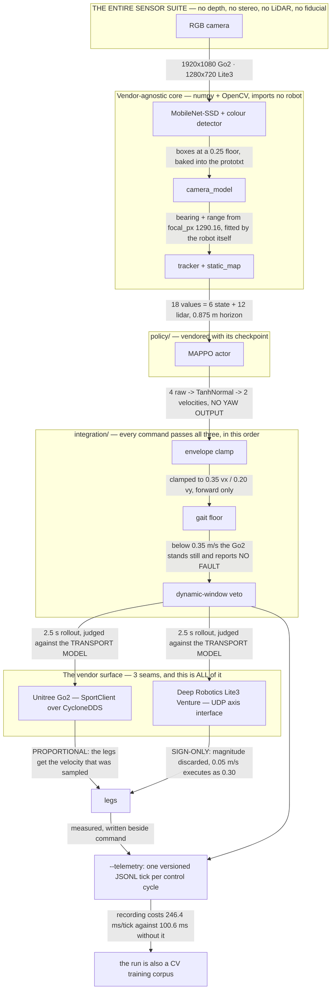

*Read the edges, not the boxes. Two of them carry the whole argument of this paper: the
policy emits **no yaw**, which is why [§6](#6-a-planner-that-models-its-own-transport) has to
re-express avoidance as pure turns and pure drives; and the Lite3 seam **discards the
magnitude it was sent**, which is why a dynamic-window planner's safety argument does not
survive the port. The `SENSING` box has one item in it on purpose.*

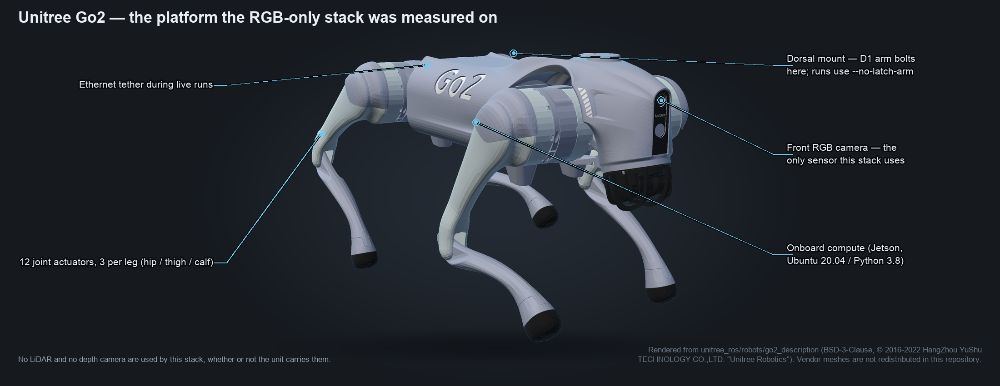

*Rendered from Unitree's own Go2 description package
([`unitree_ros/robots/go2_description`](https://github.com/unitreerobotics/unitree_ros),
BSD-3-Clause, © 2016-2022 HangZhou YuShu TECHNOLOGY CO.,LTD. "Unitree Robotics") by
[`docs/figures/make_robot_profile.py`](figures/make_robot_profile.py). The meshes are **not**
vendored here; the generator reads them from a checkout you fetch — see
[Appendix D](#appendix-d--figure-provenance-and-licences).*

Two live runs on a real Go2 anchor everything that follows.

**Going around a static obstacle, to a detected goal.**

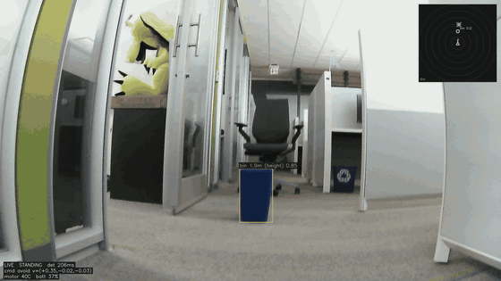

The robot has no detector for a recycling bin, so it finds it by colour, checks its shape,
and maps it in odom so it persists once the swerve takes it out of frame. The goal is the
chair, found by running the detector on a centre crop. It walked **1.89 m**, drew level with
the bin and stopped: the planner was satisfied — **0.70 m** of separation where it needed
0.60 — and the office lane ran out. `evidence/live_run.mp4`, `evidence/live_run.log` and `evidence/live_run_telemetry.jsonl`.

**Giving way to a person.**

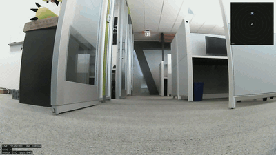

2.0 m to a dead-reckoned waypoint, arrived **0.96 m** from the goal, **145** perception
cycles, **0** errors, motors 31 → 32 °C. Of **107** control ticks: 63 `goal`, 24 `avoid`,
20 `hold` — and every one of the **12** ticks where the gap went negative commanded a full
stop. `evidence/go2_nav_run.{mp4,log}`.

### The policy, in numbers

**71,684 parameters drive a real quadruped from a Jetson.** That is the whole learned
controller: three weight matrices and three bias vectors in a 262 KiB `.npz` that is
vendored into this repository, so every number in this subsection can be printed from a
clean clone with `numpy` and nothing else.

`policy/models/mappo_actor_3agent_1910000.npz`:

| array | shape | parameters |
| --- | --- | ---: |
| `W1`, `b1` | (256, 18), (256,) | 4,864 |
| `W2`, `b2` | (256, 256), (256,) | 65,792 |
| `W3`, `b3` | (4, 256), (4,) | 1,028 |
| | **total** | **71,684** |

The checkpoint also ships a `metadata_json` array stating what it was trained with — the
only in-band record of the training constants, and `MappoController._check_against_checkpoint`
now validates the config against it rather than trusting either:

| field | value | field | value |
| --- | --- | --- | --- |
| `format` | `mappo_shared_actor_numpy_v1` | `activation` | `tanh` |
| `actor_input_dim` | 18 | `policy_distribution` | `TanhNormal` |
| `actor_hidden_dims` | [256, 256] | `deterministic_action` | `tanh(loc)` |
| `actor_raw_output_dim` | 4 | `training_n_agents` | 3 |
| `deterministic_action_dim` | **2** | `share_policy_params` | `true` |
| `training_frames` | 1,910,000 | `training_max_steps` | 100 |
| `training_lidar_range_vmas` | 0.35 | `training_agent_radius_vmas` | 0.1 |

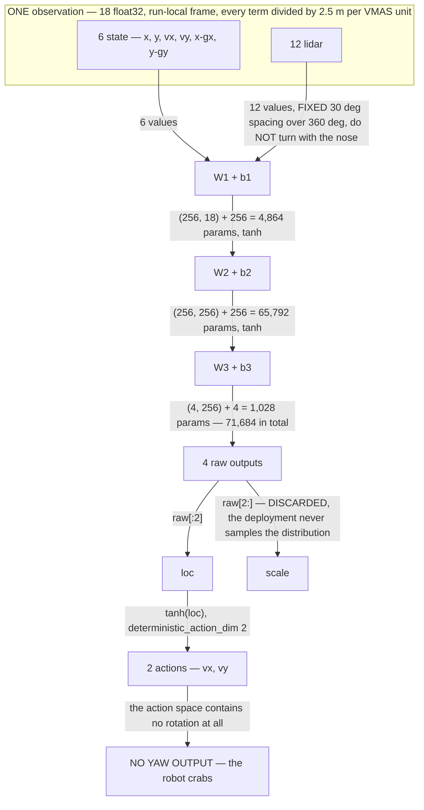

*The lidar block is **proximity, not range** — `0.35 - range`, so bigger means closer — and it
reads **0 past the 0.875 m horizon** regardless of what is in the room. That is what
`evidence/2026-08-19-what-the-policy-sees/` caught with two bins plainly in the camera at
1.7 m and 2.7 m and twelve zeros in the vector.*

**Read the collapse on the right of that diagram, because it explains more of this paper
than any other single fact about the policy.** The network emits four numbers; two of them
are a distribution's spread that the deployment throws away
(`np.tanh(raw[:2])`, `policy/physical_ai_mappo.py`), and the two that survive are a
*translational* velocity. Nothing in the action space turns the robot. That is why
[§6](#6-a-planner-that-models-its-own-transport) has to re-express avoidance as pure turns
and pure drives before a Lite3 can execute it, why `--heading-servo` defaults to `off`, and
why [A1](#a1-our-control-law-a-heading-servo-that-drove-into-a-wall) happened at all.

Two more consequences worth carrying into Part I. **The 12 rays are the policy's entire model
of the world**, and they are filled in from the stack's short list of *recognised objects*, not
from a sensor — so free space in that vector means "nothing was recognised", not "nothing is
there". And **median perception latency on this path is 309 ms** (p90 436 ms), so tracks are
extrapolated and their radii inflated to cover it; the policy sees that result, never the raw
sensor.


---

# Part I — What was built

## 1. A robot that turns to calibrate its own camera

Every range in this system is a division by one number: `focal_px`, pixels per radian off
the optical axis. A 20% error in it is a 20% error in every distance downstream. The Go2
ships no calibration for its front camera — the calibration files it does carry describe a
RealSense that is not fitted.

So the robot measures its own. `robot-stack/unitree/go2/visual_nav/calibrate_camera.py
--spin --live` **turns the robot on the spot**, tracks any recognisable object across the
frame, and uses the robot's own yaw odometry as the angular ruler: as the body rotates
through a known angle, the object's bearing must change by the same angle, and only the true
focal length makes that hold across the whole sweep. No checkerboard, no rig, no tape
measure, no size prior, no human in the loop. The script's own docstring calls this "THE
ACCURATE ONE" and explains why the two static alternatives are not: both inherit every error
in the two numbers you hand them, and at short range those errors are large.

**The artefact is committed**, so this is checkable rather than asserted —
`robot-stack/unitree/go2/visual_nav/go2_front_camera.json`:

| field | value |
| --- | --- |
| `method` | `spin` |
| `samples` | **53** |
| `yaw_span_deg` | **80.05** |
| `residual_deg_rms` | **3.1333** |
| `focal_px` | **1290.16** |
| `height_m` / `pitch_rad` | 0.32 / 0.0 |

The residual decomposes: `spin_fit_quality` separates systematic misfit from per-sample
jitter, and on this robot the residual was 3.13° against a jitter of 3.12°. The equidistant
fisheye model was blameless; a walking human simply is not a rigid fiducial. Standard error
on the mean is about 3.13/√53 ≈ 0.43°.

**It refuses rather than fitting noise.** `MIN_SPIN_SAMPLES = 8` and `MIN_SPIN_YAW_DEG =
20.0` — "below this the fit is unconstrained". The guards exist because the failure was
observed: a sweep pattern that burns the entire rotation and then fails the yaw-span check
is recorded in a comment beside the constants.

> **Caveat, inline.** The same JSON carries `hfov_deg` 85.27, and **that number does not
> follow from the measured one**: 1290.16 px at 1920 px width implies **73.31°**.
> `focal_px` is the measurement; `hfov_deg` is the spec sheet.
> `robot-stack/CAMERA-GEOMETRY.md` labels every field measured or assumed for exactly this
> reason, and **no spin calibration has ever been run on a Lite3** — see
> [§3](#3-depth-from-a-focal-length--and-the-guard-that-refuses-a-constant-range) and
> [A3](#a3-our-fallbacks-ranges-that-were-constants).

The motivation for RGB-only self-calibration — a robot you can drop into an environment,
switch on and deploy in minutes, on a platform that carries an RGB camera because depth and
LiDAR cost money and power — was published by the lead author before this repository existed
([reference 1](#references)).

## 2. Stop for a blocker: the baseline everything else is measured against

Before any learned policy, `robot-stack/unitree/go2/visual_nav/` walks the robot to a goal
and **stops** when something is in the way. That is the honest baseline, it is a real
capability, and the difference between *stopping* and *going around* is the through-line of
this entire paper: the MAPPO policy, the dynamic-window planner and the turn-drive supervisor
([§6](#6-a-planner-that-models-its-own-transport)) are all reaching for the second thing.

It matters for a second reason. The four Lite3 `--live` runs of 2026-08-26 — the ones that
walked a robot — executed **this**, not the policy. The telemetry proves it: control reasons
are only `goal` and `hold`, never `policy` or `veto-*`
(`evidence/2026-08-27-lite3-executable-avoidance/`). A reader who assumed those runs
demonstrated learned avoidance would be wrong, and so were we until we read the ticks
([A15](#a15-our-evidence-the-run-that-cleared-the-peer-did-not-avoid-it)).

## 3. Depth from a focal length — and the guard that refuses a constant range

**This section is a finding, not a working feature.**

With one camera and no LiDAR, range is `size ÷ apparent angle`. `camera_model.FisheyeCamera`
implements the equidistant model `r = f·θ` and `range_from_span` inverts it; relative range
error equals relative pixel-span error, about 4% for a 20 px error on a 520 px box, and it
is pitch-independent. That works — for an object whose size you know.

For an object whose size you do not know, `person_detector.estimate_range` falls back, and
**the fallbacks return constants**:

| source | what it means | value on the Go2 |
| --- | --- | --- |
| `width-capped` | the box is taller than the lens geometry allows at any range, so the fit is capped | **0.7194 m** |
| `frame-fill` | the box is clipped on both axes; there is no span left to measure | **0.800 m** (`FILLS_FRAME_RANGE_M`, `person_detector.py:160`) |

Across the 89-run corpus pulled off the lab Go2, **417 of 4,624 sighting rows are one of
these two constants** — 322 `width-capped` at 0.7194 m and 95 `frame-fill` at 0.800 m,
identical to four decimal places. The committed
`evidence/2026-08-27-89-runs-survived-14-can-be-dated/failure-modes.json` records it as
`"unrangeable_rows": 417` against `"sighting_rows": 4624`, and
`python3 inventory.py --corpus <pull>` regenerates it.

It got into the loop. On walk 5, **37 ticks commanded `veto-avoid`, and 21 of those 37**
carried at least one sighting whose range was one of the two constants (12 `width-capped`,
9 `frame-fill`). *The robot swerved for a distance no sensor measured.* The code comment
beside the cap quotes the live failure it came from: approaching a bin, the width span read
0.748–0.907 m across thirteen frames while the fit range was 0.719 m, so every one was
capped and the reported range was 0.719 m to three decimals for five seconds — while the
bearing tracked correctly from +13° to +25°. The robot deadlocked against a number that
could not move.

**Why this is the cost of the design, and not an embarrassment.** With no LiDAR there is no
second opinion. A constant is exactly what a single camera emits when the geometry it needs
has left the frame, and nothing was there to contradict it. The correct response is not to
find a better prior; it is to make the stack able to say *"I cannot range this frame"*.

**The guard.** The real defect was worse than a wrong number: `range_detections` **dropped**
what it could not range, and `avoidance.DynamicWindowPlanner.is_feasible` returns `True`
unconditionally on an empty obstacle list — so an unreadable frame was bit-for-bit identical
to a clear one, and the planner read it as an open arena. PR #134 fixed both halves:

- `UNRANGEABLE_SOURCES = ("frame-fill", "width-capped", "ground-clipped", "ground-horizon")`
  (`person_detector.py:175`). Constants are no longer answers; they are refusals.
- `widest_open_bearing_rad()` measures the largest gap in the camera cone using **box
  geometry only** — available exactly when ranging is not.
- `steerable_bearing_rad()` sets the floor: `asin(robot_radius / near_wall)`, where
  `near_wall` is the ground range at the **bottom corner** of the frame, **0.806 m** — not
  the 0.719 m usually quoted, which is the centre column and loses its contact point 0.09 m
  sooner. At the shipped 0.40 m radius that is **29.75°**; at 0.25 m, **18.07°**.
- Below the floor the navigator **holds, with a stated reason**, instead of walking into an
  arena it invented.

`test_person_detector.py` pins the numbers against the two committed live runs: the guard
fires on exactly 4 ticks and passes 12, with `max(fired) < 23.0°` and `min(passed) > 32.7°`
— a real separation, not a threshold fitted to one side of it.

**And a ranger that needs no size prior at all.** `camera_model.ground_range` intersects the
ray through the box's *lowest pixel* with the floor plane: `d = h / tan(elevation)`. No `L`,
no class, no prior — which is the only way an RGB-only stack can range an object a visitor
drops into the arena (issue #6). It is gated by its own error model,
`|Δd/d| = δ·(d/h + h/d)`, and `--static-detect-ground` therefore *requires*
`--static-detect-pitch-error-deg` with no default. Measured usable band on this robot:
**0.72–1.33 m** at 2° pitch error and 18% tolerated error, 0.72–1.70 m at the measured 1.6°
median (`evidence/2026-08-26-ranging-without-a-size-prior/ground_vs_prior.py`).

> **Caveats, inline.** (a) The guard has **never fired in the arena** — the run it was built
> for is not in this repository; it fires on 4 of 16 unrangeable ticks in the two committed
> runs and costs the hero run 1 tick of 59. (b) The 21-of-37 split above is quoted from a
> README and is **not** reproduced by a committed script, unlike the 417. (c) The Lite3
> camera block is **48.7° self-inconsistent** — see [A3](#a3-our-fallbacks-ranges-that-were-constants).
> (d) The scale itself is sound: fitting a printed 10 cm ArUco marker against the robot's own
> odometry over 2.2–2.6 m gives **k = 1.092** (n = 43, 4.5 cm rms) and **k = 1.020** (n = 52,
> 4.8 cm rms) — `evidence/2026-08-26-range-scale-audit/scale_audit.py`. k is a *ratio*; a tape
> is still the only thing that excludes camera and odometry being wrong by the same factor.

## 4. A telemetry contract, not a console log

The obvious way to feed a policy from a robot stack is to parse its console output. Counted
over the 107 control ticks of the give-way run, that does not work:

| what a policy needs | in the console log |
| --- | --- |
| motion commands | every tick |
| goal | a scalar *distance* — no position |
| odometry / pose | **once**, in a start-up banner |
| camera data | none (`lat=235ms` is a frame's *age*) |

A console log is also *edited to stay readable*: `people=0` became `obst=[binx1,personx1]`
inside a week. Right for prose, fatal for a parser. So `--telemetry` writes **one versioned
JSONL object per control tick**, and the header line declares **which frame every vector is
in** — `pose`, `goal` and `obstacles` are odom; `command` and `measured` are body. That is
the one thing a consumer cannot recover from the data, because the two frames agree exactly
while the robot faces its start heading and diverge only as it turns: an integration built on
the wrong assumption passes every bench test and fails in the first corner.

Four design decisions worth copying:

- **Every tick is written**, including holds and stale-perception skips — "it stood still for
  1.4 s" is a signal, not a gap.
- **`measured` sits beside `command`.** Without it, "commanded 0.12 m/s and moved nothing" is
  indistinguishable from walking. That cost three runs to see.
- **`perception.video_frame`** is the index of the matching frame in `--record`. This single
  field is what makes the run recordings a training corpus ([§11](#11-test-runs-are-the-training-corpus)).
- **`id` is stable**, and `kind` (`static` / `tracked`) is not the same as `label`. A person
  who has stopped has a bin's velocity and a person's claim on the lane.

`integration/mappo_bridge.py` maps one tick to one policy input, and three of the mappings
are not the obvious ones — each pinned by a test that says why:

| mapping | obvious answer | why it is wrong |
| --- | --- | --- |
| `velocity_frame` | `"odom"` | `measured` is the estimator's **body**-frame velocity |
| `external_hold` | `reason == "hold"` | the planner also holds for the *bin*; forwarding that zeroes the policy in the one scene it exists for |
| `timestamp_s` | wall clock | it is compared against `time.monotonic()`; an epoch makes the age ≈ −1.8e9 s and the staleness gate can never fire |

> **Caveat, inline.** The contract is only as good as what fills it. See
> [A2](#a2-our-recorder-a-control-loop-at-a-third-of-its-design-rate) — the loop that wrote
> these ticks ran at **2.78 Hz against a nominal 10 Hz** for a whole day of runs.

## 5. Three seams: the stack moved to a second vendor

Nothing about "one RGB camera and no LiDAR" is Unitree-specific, so the port to the Deep
Robotics Lite3 Venture was the test of whether the design was portable or merely working.

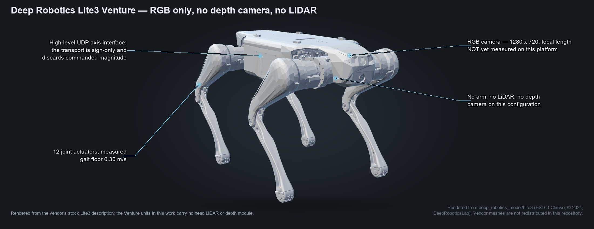

*Rendered from Deep Robotics' own Lite3 description
([`deep_robotics_model/Lite3`](https://github.com/DeepRoboticsLab/deep_robotics_model),
BSD-3-Clause, © 2024 DeepRoboticsLab) by
[`docs/figures/make_robot_profile.py`](figures/make_robot_profile.py). This is the vendor's
stock description; the Venture units in this work carry no head LiDAR and no depth module,
which is the whole reason they were chosen.*

**Everything that turns pixels into a plan moved unchanged.** `camera_model`,
`person_detector`, `colour_detector`, `tracker`, `static_map`, `avoidance`, `goal`,
`overlay`, `telemetry`, `replay` — robot-agnostic numpy and OpenCV; none of them imports a
robot. They are the majority of the module and the whole of the integration surface.

**Three narrow bindings surround the common loop**, and that is the entire vendor surface:

| seam | Unitree Go2 | Deep Robotics Lite3 Venture |
| --- | --- | --- |
| RGB camera | JPEGs from `VideoClient` | explicit V4L2 / RTSP / GStreamer BGR source with local arrival time and pose stamp |
| locomotion | `SportClient` over CycloneDDS | high-level UDP `/cmd_vel`-equivalent axis interface; the low-level MotionSDK is deliberately not used as a gait controller |
| safety | motor temperature, battery, D1 arm stow | battery and motor-temperature feeds; missing or stale data refuses a live run; **no arm flags exist** |

Two things the port taught that a single-platform stack cannot learn.

**A calibration file is platform-identified or it is a hazard.** The Lite3 wrapper runs the
same spin fit and tags the resulting JSON with the platform name, and a live Lite3 run
**refuses** a Go2, missing or malformed calibration. That refusal exists because the
alternative — silently ranging a 1280×720 Lite3 camera with a 1920×1080 Go2's focal length —
looks exactly like working.

**Absence is a simplification, not a bypass.** The D1 arm costs the Go2 stack a great deal:
it is why the robot rests prone between moves, why the envelope is derated to 0.35 m/s, and
why a run can be refused outright. The Lite3 parser has no `--no-require-arm` and no
`--no-latch-arm`, because the subsystem is absent from that platform binding rather than
disabled in it.

> **Caveat, inline.** The port is well tested and barely driven. The three Lite3 directories
> in `.github/test-inventory.tsv` carry a substantial suite, all offline. **Almost none of
> the Lite3 work has ever run on a robot**, and `robot-stack/CAMERA-GEOMETRY.md` records the
> reason the ranging half cannot yet be trusted there at all. See
> [Part II](#part-ii--what-has-and-has-not-run-on-hardware).

## 6. A planner that models its own transport

This is the most genuinely novel result the two-vendor port produced, and it exists *because*
two vendors differ this fundamentally.

**The Lite3's high-level axis transport is sign-only.** Its measured profile has
`forward_positive: 32767`, `yaw_positive: 16000`, `yaw_negative: -16000`, and
`forward_negative` and both lateral axes `null`. Past the 0.05 m/s deadband, any commanded
magnitude becomes *one fixed raw axis value*. The executable set per axis is
`{0, one evidenced speed}`. A sampled 0.05 m/s and a sampled 0.55 m/s are the same legs.

The Go2's transport is proportional, and a dynamic-window planner assumes that implicitly.
`avoidance.DynamicWindowPlanner` samples velocities, rolls each one forward, and refuses the
ones that end inside something. **That is a safety argument only if the legs receive the
velocity that was sampled.** On the Lite3 they do not, and it is not lag: a 0.05 m/s crawl
past a bin 0.72 m away executes as a **0.30 m/s walk into it** — 0.75 m of travel — with
`is_feasible` having validated the 0.05.

The fix is not a clamp, because there is no magnitude to clamp. The planner now asks the
transport what the legs will do before it predicts where the robot will be:

- `avoidance.TransportModel` is a protocol; `ProportionalTransport` is the Go2 default and is
  short-circuited so a Go2 run is unchanged to the bit.
- `Lite3AxisLocomotion.SignOnlyAxisTransport` declares `is_proportional: ClassVar = False` —
  a `ClassVar` rather than a field precisely so no keyword argument can switch it off.
- Its `executed()` returns `known=False` for a linear primitive with no measured speed, and
  for yaw-while-translating. A *pure* turn with an unmeasured rate is allowed, because its
  rollout is a point: an unmeasured axis may influence cost, never geometry.

**And then avoidance is re-expressed in the vocabulary the robot can actually speak.**
`integration/turn_drive_supervisor.py` (`mappo_drive.py --execution-supervisor turn-drive`):
when a mapped static obstacle blocks the line to the goal, the detour becomes **pure turns
and pure drives**, the only motions this Lite3's measured axis profile performs. `vy` is
always exactly 0.0 and `vx` and `wz` are never both non-zero. `HEADING_TOLERANCE_RAD` is 15°,
sized against the measured **0.857 rad/s** yaw primitive at 10 Hz (≈0.09 rad/tick);
`EXECUTION_MARGIN_M` is 2 cm over the static hard gap, because the veto compares `>=` at
exactly the number the tangent touches. The second leg starts when the straight line to the
goal is clear, **not** at a distance — the distance version deadlocked against its own veto
with 0.102 m of free space against a 0.12 m hard gap. The planner's veto still judges the
supervisor's output, so a person stepping onto the detour holds the robot.

Replaying the committed 188-tick no-motion shadow through the current chain turns 162
`policy` + 24 `veto-hold` into **160 `exec-turn` + 2 `policy` + 24 `veto-hold`**, with 20
supervisor commands vetoed — all of them while a person was present, t = 6.99–19.93 s
(`evidence/2026-08-27-lite3-executable-avoidance/replay_with_supervisor.py`).

**One tick, in the order it actually happens** — and each box below is a key the run writes
into its own telemetry, so a reader can point at any of them in a recorded `.jsonl` rather
than take this diagram's word for it. The record exists because the 2026-08-26 runs could
not say whether a `hold` was the policy's, the envelope's or the transport's:

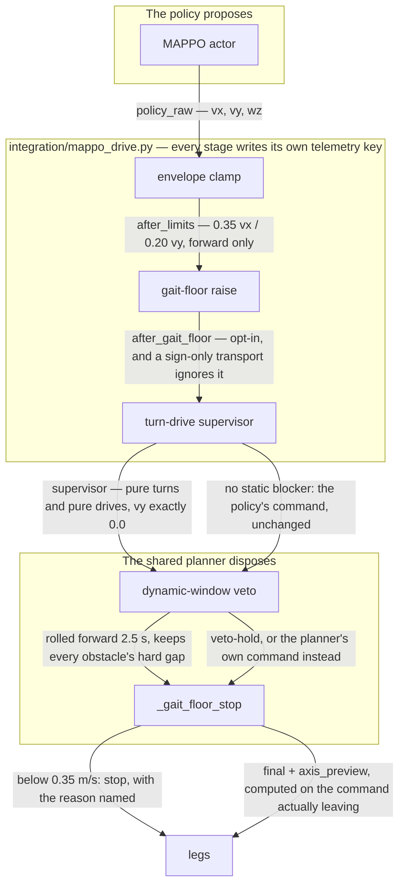

Three placements in that order are decisions rather than accidents. The **veto runs on the
supervisor's output, not beside it** — the first version returned the detour command directly
and routed around the dynamic-obstacle check, so the safety layer's own replacement would have
walked into a person stepping onto the detour. The **gait-floor stop lives in the shared
planner** rather than on this file's policy-driven path, because the bug it is about reaches
every platform and both drive modes: a Lite3 run with no policy at all got nothing from the old
placement. And the **axis preview is computed at the exit**, on the command actually leaving, so
the record can never show the axes a different candidate would have produced.

The same argument applies to the **gait floor**: the speed below which a robot stands still
without faulting. It is a platform characteristic a portable planner has to learn per robot
rather than assume — Go2 **0.35 m/s** forward (0.21 m/s stalled five runs of five), Lite3
**0.30 m/s**, and the Lite3's calibration interface exposes one floor where the robot has two
that differ by 2× (issue #42). The planner now **stops instead of crawling** below it.

> **Caveat, inline.** `--execution-supervisor turn-drive` is **offline-verified only and has
> never run on hardware.** The one bounded hardware axis trial that did run moved the robot
> 0.401 m in 1 s at a peak measured 0.729 m/s with 3,999/3,999 samples reporting
> `error_state = 0` — a proof that the axis moves the legs, not that the supervisor works.

## 7. An ablated control for every run, and a closed loop before the legs move

Two measurement disciplines that changed conclusions in this project more than any code did.

**Every replay is paired with its own control.** `integration/replay_mappo.py` runs the same
recorded ticks through a second controller with the obstacles removed. Without that, "the
policy steered 36° off the goal bearing" is not evidence of anything, because this checkpoint
carries a **6–16° heading bias with no obstacle anywhere near it**. The paired control is what
turned run 5's headline "34.8° mean deflection over 15 ticks" into the corrected **35.9° over
31 ticks — with the previously-unscored rows falling to exactly 0.0°**
(`evidence/2026-08-17-corridor-and-room-runs/`). The control is contemporaneous and
interleaved, not a remembered baseline.

**The loop is closed in simulation before it is closed on legs.** A replay is open-loop: the
shipped planner drove the path, so the policy never meets the states its own actions produce.
`integration/closed_loop_sim.py` closes it — action → actuator → pose → what the camera can
now see → next observation, through the same bridge — and runs the policy against **the
incumbent planner on identical seeded scenarios**, because "the policy arrived 18 times in 30"
is not a result without knowing what the incumbent does on the same runs.

```bash
cd integration && python3 closed_loop_sim.py --seeds 30 --scale 1.5 2.5 \
    --command-scale 0.3 0.6 1.0
```

Its verdict is the one the deployment runbook follows: the policy is safe to drive **only
under the planner's veto**. The raw policy collided in **every** configuration tested — 21 of
30 seeds at scale 1.5, 9 of 30 at the recalibrated 2.5 — while the same policy under the veto
collided **0** times at both. The incumbent planner, on the identical scenarios, arrives 14/30
with 2 collisions. Every one of these rows is in `deploy/README.md`, including the one that
argues against the most flattering configuration.

**A third instrument is worth naming.** `integration/render_observation.py` draws the camera
frame, the ray fan and the observation vector side by side, per tick. It is what produced
`evidence/2026-08-19-what-the-policy-sees/run14-t06.5-both-bins-in-view-observation-empty.png`
— both bins plainly visible in the camera at 1.7 m and 2.7 m while the policy's observation
is twelve zeros. No table would have shown that.

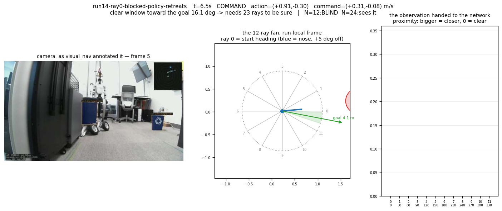

*The frame the robot saw, the fan it sampled, and the vector the policy received. Generated by
`integration/render_observation.py`; the reading is reproduced with no robot by
`evidence/2026-08-19-what-the-policy-sees/radius_latch.py`.*

> **Caveat, inline.** The closed loop is a simulation, and its actuator model is fitted from
> the same robot it is meant to predict. It sizes risk; it does not retire it.

## 8. A deployed tree that names its own commit

None of the trees running on these robots is a git checkout. There is no `.git`, so there is
no branch and no commit, and "deployed from main" is a thing people say rather than a thing
anyone measured.

`robot-stack/preflight/tree_stamp.py` (Python 3.8, stdlib only, no repo imports) recomputes
**git's own root tree id from the bytes on disk**: `sha1(b"blob %d\0" + bytes)` for files,
then `sha1(b"tree %d\0" + body)` with entries sorted by name — directories sorted as
`name + "/"`, mode `40000` and not `040000`. Get either detail wrong and you get a
self-consistent id matching nothing git ever wrote. `deploy/push-to-robot.sh` ships tracked
files only, stamps and verifies in staging, **moves** the old tree aside rather than deleting
it, swaps, and re-verifies over SSH. `integration/mappo_drive.py` calls
`require_stamped_tree()` before the stack is imported and **refuses** a tree that stopped
matching. Every run prints `commit … tree …` as its first line.

`verify()` makes three independent findings, and the second is not redundant: a stamp whose
file list was edited to match an edited tree passes the per-file check and fails the
recomputed-root check. An unlisted `.py` file refuses outright — it is on `sys.path` and can
shadow. Any other extra file is counted and named, never blocking.

What it found, on the lab Go2: **ten `~/mappo-*` trees, none a git checkout, and six are
bit-perfect commits** — `~/mappo-run` is `cb42b9a`, 226/226 files, the tip of an *unmerged*
branch, which is why an earlier attempt to reconstruct it against `main` found nothing. The
tree the launch wrappers actually source, `~/mappo-main`, is the mixture: **134 files spanning
15 commits over eight days**, 86 identical to `main`, 46 last current at an older commit, 2
held by no commit at all. It is preserved as a **20 KB manifest** rather than 3.8 MB of
duplicate blobs, and `rebuild.sh` reconstructs all 134 files from git objects with **no
differences** against the tarball pulled off the robot
(`evidence/2026-08-27-what-the-robot-was-running/`).

The corpus that survived tells the same story from the other end: **89 runs, 9,117 control
ticks, 4,624 detections, 84 videos, 544 MB** — and **only 14 of the 89 can be dated**, because
69 carry monotonic uptime (spanning 268.0 h ≈ 11.2 days of it) and 6 carry no stamp at all.

> **Caveat, inline.** The docstring states the limit and the paper repeats it: editing a file
> is caught, editing file *and* manifest entry is caught, editing the tree id as well
> **passes on the robot**. `tree_stamp.py audit` closes that off-robot. This is provenance,
> not tamper-proofing, and must not be sold as such.

## 9. A browser dashboard that drives a real fleet

`dashboard/` puts each robot on an **Arm Device Connect** mesh as a device and serves a page
that discovers it — live event stream, bounded motion, checkpoint swap, and loading a
checkpoint from S3 or a LAN server. **No broker, no etcd, no Docker, no registry:** D2D mode
finds robots by multicast on the LAN the demo already runs on.

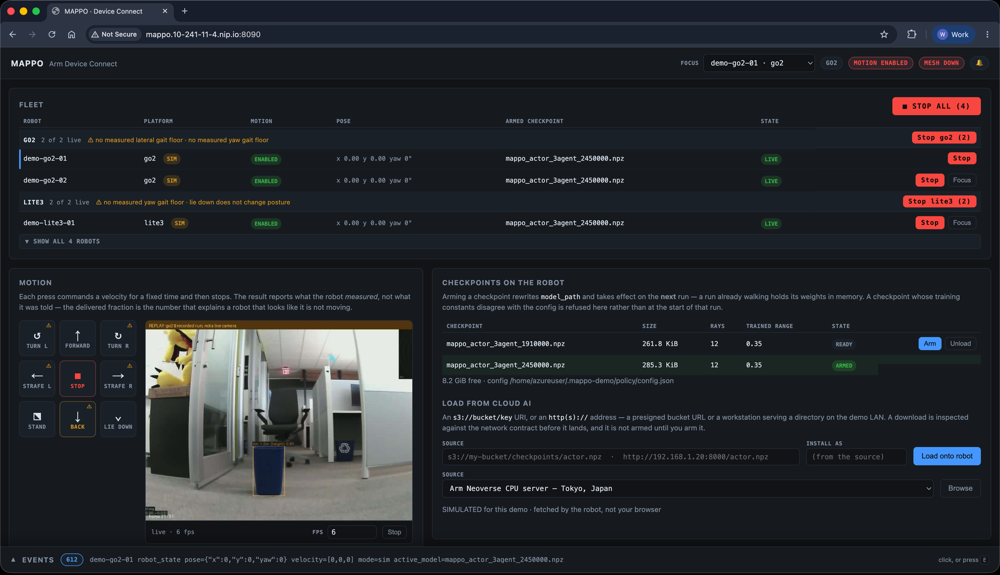

*One page, four robots. The fleet table groups by platform — two Go2, two Lite3 — and the
stop controls are layered: a `Stop` on every row, a `Stop go2 (2)` and `Stop lite3 (2)` on
every group header, and the red **`STOP ALL (4)`**, which fans out with `invoke_many` and
names which robots confirmed. `ARMED CHECKPOINT` is the column that decides what the next run
drives: arming rewrites `model_path` and takes effect on the **next** run, because a run
already walking holds its weights in memory. Left, the motion pad; centre, the camera pane;
right, the two checkpoints on this robot with their ray count and trained range read off the
files themselves; along the bottom, the event stream, 612 events deep at this instant. The
four robots here are bench doubles — the `SIM` badges and `MESH DOWN` are in the pixels — for
the reason the caveats below give.*

**The warnings in that screenshot are real, and they are the point of this section.**
`⚠ no measured lateral gait floor · no measured yaw gait floor` sits on the Go2 group and
`⚠ no measured yaw gait floor · lie down does not change posture` on the Lite3 group. Neither
is typed into the page. `dashboard/static/dashboard.js` builds them from each platform's own
`get_capabilities()` reply — every entry in `unmeasured_axes` becomes "no measured ⟨axis⟩
gait floor", and `lie_down_changes_posture === false` becomes that last phrase, which is true
because posture on a Lite3 is operator-controlled through the vendor app and `lie_down` there
only *stops* the robot. The same absences put a ⚠ on six of the nine motion buttons; the
three without one are `FORWARD`, `STOP` and `STAND`.

A dashboard that prints what it does **not** know about the robot in front of it is worth
more than one that renders a confident number, and this one prints it because the confident
number was the bug: the floors used to be hard-coded, so a Lite3 inherited a Go2's, and the
Go2's own lateral floor was recorded as *not existing* rather than as *never measured*
([A5](#a5-our-dashboard-gave-one-robot-another-robots-floors)).

The interesting engineering is a version wall. Device Connect needs Python ≥ 3.11; the Go2's
Jetson is Ubuntu 20.04 / JetPack 5 and offers 3.8.10 and 3.9.5, and a venv is built *from* an
interpreter and cannot supply a version the machine lacks. So `robot_driver.py` runs
**off-robot** on a workstation and reaches the robot by running `drive_bridge.py` (3.8,
stdlib only) as a **subprocess** inside the robot's SDK venv. That split is not a packaging
wart — it is a safety property: every command runs in a process that exits, so a driver that
hangs or is killed cannot leave a velocity latched.

Two measured results:

- **Stop latency.** Cross-robot STOP fired 1 s into a 5 s walk: **4.23 s → 0.06 s**.
  Same-robot mid-walk: **4.17 s → 0.07 s, and it now interrupts the walk.** The two causes
  were different — one mesh worker queueing the stop, and the edge runtime dispatching one RPC
  at a time per device, so a 5 s motion handler made the robot deaf for 5 s. Motion RPCs now
  return on *acceptance* and report completion as an event. `STOP ALL` uses `invoke_many` and
  names which robots confirmed.
- **Capabilities are asked for, not assumed.** The page learns each platform's rules from
  `get_capabilities()`. `lie_down` on a Lite3 only *stops* it, because posture there is
  operator-controlled through the vendor app; a Go2 strafe carries a warning because that
  robot's lateral gait floor has never been measured. Hard-coding either is
  [A5](#a5-our-dashboard-gave-one-robot-another-robots-floors).

> **Caveats, inline.** (a) **No robot has moved under this yet.** The one hardware contact
> was read-only against the Go2 at `192.168.123.18` — 18 functions enumerated, motion never
> enabled — and it immediately exposed a real defect, that the event drawer orders a batch by
> the emitting robot's clock and that Go2 reports 1970 ([C3](#c3-the-clock-is-not-set)).
> (b) The bench double reports `delivered_fraction` **1.00**, which is precisely the number no
> real robot produces: this Go2 measures ~0.45 derated and 0.70 at full command, and the Lite3
> 0.74 forward / 0.27 lateral. (c) **The page has no login**; `--host 0.0.0.0` means anyone
> who can reach the port can drive any motion-enabled robot on the mesh.

## 10. Peers over the mesh, not through a detector

**Read this before the title misleads you: every navigation result in this paper came from
RGB. MAPPO navigated on pixels. Peer poses over the mesh did not steer a single run.** No
walk reported anywhere in this document — not one Go2 run, not one of the four Lite3 runs —
took another robot's position from the mesh. Where the mesh has actually done work on
hardware it has done *fleet management*: discovery, state, checkpoint arming and STOP
([§9](#9-a-browser-dashboard-that-drives-a-real-fleet)). Where a real Go2 passed a real peer,
the peer was found by the **RGB detector** — and it was not avoided
([A15](#a15-our-evidence-the-run-that-cleared-the-peer-did-not-avoid-it)).

What follows is therefore a **design and its offline evidence**, not a result: the peer-pose
path is built, is 66 offline tests deep, and has **zero two-robot hardware runs on either
platform**. Keep that separation in mind for the rest of the section, because everything in
it is written in the present tense of code that exists rather than of a robot that has run.

**Two robots sharing a room is the demo — and in Shanghai both of them are Lite3s.** The use
case requires a **Deep Robotics Lite3 Venture to recognise another Lite3 Venture**. Every
peer-detection number anywhere in this paper is about a different object: both peer manifests
carry the label `go2wheel`, and that is a **Unitree Go2-W, the wheeled Go2** — 1,903
hand-labelled frames in `detector/labels/peer_go2wheel_20260824.json`, and a 284-frame
held-out set in `peer_crossday_20260820.json` whose 60 peer frames are the same machine.
Neither manifest holds a single Lite3. So
[§12](#12-one-robot-four-detectors)'s 13%-to-68% recall spread is a spread on a Go2 wheel,
read through a Go2's camera, and **none of it transfers to the platform the demo runs on.**

**That is why a Lite3 detector had to be trained at all**, and the shipped detector's own
number on a real Lite3 says how far there is to go. On a 60-second clip recorded through one
Lite3's camera of a second Lite3 in a Shanghai office, the deployed MobileNet-SSD lands a box
on the robot in **0 of 168** frames at the 224 px `deploy/run-peer-supervised.sh` opens at,
against 80 of 168 at 300 px — where it calls it a `chair`
(`evidence/2026-08-27-lite3-pov-clip-audit/`, every number re-derived by `python3 audit.py`).
[§13](#13-a-detector-training-pipeline-that-shipped-nothing-and-the-three-things-worth-keeping-from-it)
is what happened when a `lite3` class was trained on the six `--record-raw` clips that audit
asked for: at 224 px, nothing passed. The obvious route to two robots in a room is to teach
the detector what a quadruped looks like; we measured that route to its ceiling on the one
platform where a corpus exists, found the ceiling was the launcher rather than the weights,
and designed a different one.

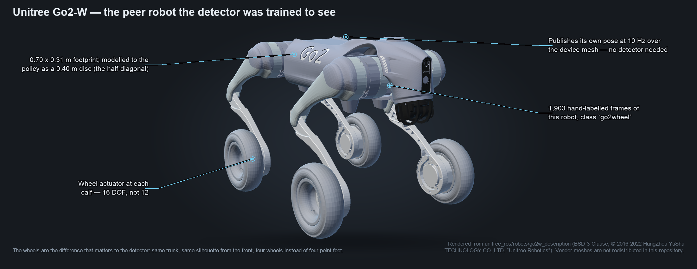

*The peer the Go2 corpus is labelled against — a Go2-W, not a Lite3. Rendered from
[`unitree_ros/robots/go2w_description`](https://github.com/unitreerobotics/unitree_ros),
BSD-3-Clause, © 2016-2022 HangZhou YuShu TECHNOLOGY CO.,LTD. "Unitree Robotics", by
[`docs/figures/make_robot_profile.py`](figures/make_robot_profile.py). Same trunk as the Go2
and nearly the same silhouette head-on, which is what makes it hard to detect and easy to
publish a pose for.*

**Each robot publishes its own pose** as a `peer_pose` event on the Device Connect mesh at
10 Hz, and the navigator consumes it as one more obstacle disc in the same list the policy
and the veto already read. No detector, no marker, no colour panel, nothing to train. It is
also what the trained policy actually describes: the simulated agents it learned against
observed each other's true positions rather than running detectors on each other.

Three details are load-bearing:

- **Two robots' odom frames have no relationship until somebody measures one.** Each begins
  at that robot's own power-on pose. `--peer-odom-align DX,DY,DYAW_DEG` is therefore the
  *enabling* flag, not an option on one: there is no code path where peer avoidance is on and
  the frames are undeclared. It is a tape measure and a floor mark, both already needed to
  stage the goal — and it decays, because two odometries drift and nothing observes that.
- **A peer pose that stops arriving is not a peer standing still.** Past 0.6 s the obstacle is
  dropped **and the robot holds** — one decision, not two. Dropping the disc is only safe
  because the legs stop. 0.6 s is `perception_timeout_s`, the same budget already spent on a
  camera that has fallen behind, because it is the same kind of blindness.
- **A peer is a 0.40 m disc, and that is the half-DIAGONAL.** A Go2 is 0.70 × 0.31 m, so the
  half-length is 0.35 and the half-diagonal 0.383. Nothing here controls which way a peer is
  facing, so the long axis is the one that has to fit.

What the mesh adds that no detector could is the peer's **velocity**, which reaches the
planner's rollout and the speed gate that decides whether a peer is handed to the policy at
all or simply stopped for.

> **Caveats, inline.** (a) **No two-robot hardware run has happened on either platform.** The
> mesh path is 66 offline tests, 11 of them mutation-checked. (b) The hardware run that *did*
> clear a peer did not avoid it — see [A15](#a15-our-evidence-the-run-that-cleared-the-peer-did-not-avoid-it).
> (c) An offline falsifier that hands the policy the peer's **exact** position still produces a
> peak lateral command of 0.108 m/s, below the gait floor
> (`evidence/2026-08-24-peer-capture-and-gait-sweeps/tools/peer_disc_encoding_sim.py`).
> Perfect sensing is not the missing piece.

## 11. Test runs are the training corpus

Every live run already records RGB video and a telemetry tick stream, and
`perception.video_frame` joins them. `detector/labels/autolabel_run.py` walks a run's JSONL,
maps each tick onto its raw video frame, and writes a label manifest — so a day of driving the
robot is also a day of gathering computer-vision training data, at no extra cost in robot time.

It refuses more than it accepts, and each refusal is a lesson:

- It **refuses an annotated `--record` video**, because the label used to be burned into the
  recorded pixels ([A7](#a7-our-recorder-burned-the-label-into-the-pixels)).
- It **refuses a video that is not the run's own recording**, because the frame index is only
  a join against the file the run actually wrote.
- It **refuses `--frames-dir == --unlabelled-dir`**, which is how a corpus quietly labels
  itself.
- Its own header says, in capitals, that **these are detector boxes and not ground truth**,
  and it names the recall they inherit: 64% class-agnostic at the deployed 0.25 floor.

Two other corpus routes are implemented. Hand labelling
(`detector/labels/pipeline/`, `LABELLING.md`) propagates eye-drawn seeds by anchor-template
NCC and background-plate differencing — 1,903 kept frames of a wheeled Go2, honestly annotated
with its own weaknesses (744 of 1,903 boxes touch a frame border; one 640-frame viewpoint is
34% of the set). And `detector/render_lite3.py` composites the vendor's own Lite3 meshes onto
real camera frames to synthesise labelled examples of a robot we could not photograph enough
of.

### 11.1 SAM-based auto-labelling: this has now landed, and it is section 13

The step after detector-box weak labels is **promptable segmentation** — take a mask's bounding
box as the label and stop inheriting the deployed detector's 64% recall. The design is the SAM
"data engine" pattern: model proposes, human verifies the fraction that needs it, model
retrains ([reference 2](#references)).

⚠️ **An earlier draft of this paper said "zero SAM-derived labels exist" and "there is no SAM
code in the tree". Both were true when written and neither is true now** — the sort of sentence
a document like this corrects out loud rather than quietly deletes. The run landed on
2026-08-27 as `evidence/2026-08-27-lite3-training-set/`, and it produced **nothing shippable**,
which is why it is written up in full as
[§13](#13-a-detector-training-pipeline-that-shipped-nothing-and-the-three-things-worth-keeping-from-it).
The two hand-labelled manifests above are unchanged and remain the corpus of record.

> **Attribution, corrected.** This technique is often described in conversation as a
> "Stability AI technique". We could not establish that provenance. Segment Anything, the
> SA-1B dataset and the model-in-the-loop data engine described above are **Meta AI** work
> (Kirillov et al., 2023 — [reference 2](#references)). Stability AI's published work is
> generative imaging; we found no auto-labelling method attributable to them, and there is no
> such citation anywhere in this repository. We cite what we can establish and say so.

## 12. One robot, four detectors

The strongest negative result in this project, and the one most likely to generalise.

The same robot runs the same MobileNet-SSD weights through **four different inference
configurations**, depending on which script launches it — two input sizes, three score floors,
two class lists. Scoring **800 checkpoints at all four**
(`evidence/2026-08-27-one-robot-four-detectors/`, `report.py`) gives:

| configuration | input | floor | classes | peer recall | false alarms |
| --- | --- | --- | --- | --- | --- |
| `go2-run-smoke` (deployed) | 300 px | 0.45 | 1 | **13%** (8/60) | 2% (5/221) |
| `go2-navigator-default` (deployed) | 300 px | 0.40 | 1 | **13%** (8/60) | 5% (10/221) |
| `go2-peer-supervised` (deployed — what the robot runs) | 224 px | 0.25 | 20 | **50%** (30/60) | 26% (57/221) |
| `mobilenet-ssd-trained` (reference — what the sweep scored) | 300 px | 0.25 | 20 | **68%** (41/60) | 49% (108/221) |

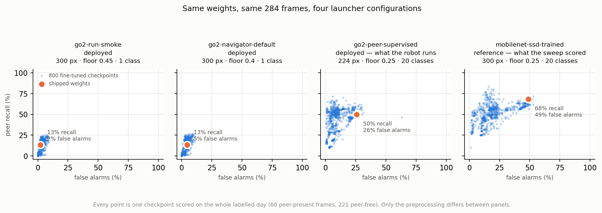

*Every point is one of 800 fine-tuned checkpoints, scored on the same 284 frames. Only the
preprocessing differs between panels, and the whole cloud moves. Regenerate with
`python3 docs/figures/make_detector_spread.py`; `--check` re-derives the four quoted recalls
from the committed JSON and fails if any has moved.*

Same weights. Same frames. **A 5× spread in recall from the launcher alone**, and the numbers
above come straight out of the committed
`evidence/2026-08-27-one-robot-four-detectors/sweep/incumbent.json`. Also:

- Checkpoints clearing every gate at **both** of any two configurations: **0**.
- At all three deployed configurations: **0**. At all four: **0**.
- The person-shaped hold — how many people the network still holds — **halves, 16 → 8**, on
  the held-out split, between the sweep's configuration and the peer launcher's.
- The published epoch grid is `{10, 15, 17, 20, 22, 25, 30, 40}`. **No epoch below 10 has ever
  been scored**, and yet every checkpoint that clears the peer launcher's gates is epoch 1–3.

The practical consequence is that the whole preceding detector effort ranked candidates
against a configuration no launcher runs. A sweep that found the best checkpoint was already
on disk — 640 checkpoints existed and at least 627 had never been evaluated, and the winner,
`k_full_pseudo03` at **89% recall / 12% false alarms**, came from the single run at
`--pseudo-labels 0.3` that nobody had scored — was scored at 300 px while
`deploy/run-peer-supervised.sh` launches at 224 px. At 224 px the shipped weights read
**50% / 26% / 25 people** against **68% / 49% / 32 people** at 300 px. The margin the
candidate was selected on does not transfer.

**The generalisable claim: in this regime the inference configuration is a larger lever than
the weights, and a detector benchmark that does not pin it is measuring the launcher.** The
repository's response is `report.py --check-readme`, which fails if the published page has
drifted from the data.

> **Caveat, inline.** No candidate detector has been run on a robot, and none is deployed. The
> gate — lose none of the people the shipped network sees — is cleared by nothing scored so
> far. The sweep scripts themselves are **not in this repository**; they ran on a training host
> and their outputs are committed byte-for-byte as JSON.

## 13. A detector training pipeline that shipped nothing, and the three things worth keeping from it

**This section reports a negative result and leads with it.** Three fine-tunes were run on a
DGX Spark, scored against the incumbent, and refused; the shipped detector is unchanged and
nothing here is recommended for deployment. It is in the paper because a repository that
publishes its wins and quietly drops the week the numbers came out badly has a publication
record that disagrees with its own evidence directory — and because three of the things this
run measured are worth more to somebody else than a checkpoint would have been.

Everything below regenerates from committed JSON with no video, no model and no network:

```bash
cd evidence/2026-08-27-lite3-training-set
python3 audit.py               # the corpus: views, boxes, ride-along drift, hand-checks
python3 summarise_scores.py    # both score tables, under both selection rules
```

### 13.1 The pipeline

Six `--record-raw` Lite3 recordings arrived from Shanghai with their telemetry — 5,854 frames,
1280×720 at 15 fps, one room, inside thirteen minutes of one morning. Camera motion measured by
ORB+RANSAC against each clip's own first frame is **0.0–1.0 px median**: the camera never moves
in any of the six, so the set holds at most six viewpoints, and sampling for novelty finds
**456 distinct views — 7.8% of the frames.** That number, not 5,854, is the ceiling on
everything that follows.

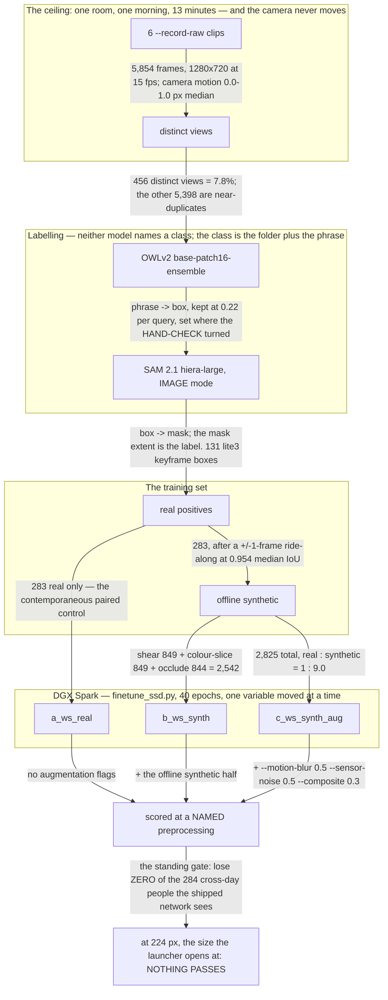


`a_ws_real` is a real contemporaneous control and not a citation to an earlier run: these
augmentation operators call `rng.random()` even at probability 0, so no previous run is
byte-reproducible under this code.

### 13.2 The transferable negative: the ablation is monotone in both directions, at every resolution

Best `lite3` epoch per run, with person retention *reported* at that epoch rather than
selected on — the argmax of one metric with the other merely quoted, which is how a
checkpoint sweep picks a winner and is not a basis for shipping anything:

| run | 224 px / 0.25 (production) | 300 px / 0.40 | 300 px / 0.45 |
| --- | --- | --- | --- |
| `a` real only | 4/36 lite3, **21** people (−4) | 7/36, **29** (+5) | 7/36, **25** (+5) |
| `b` + synthetic | 15/36, **7** (−18) | 18/36, **18** (−6) | 17/36, **16** (−4) |
| `c` + synthetic + wave-6 flags | 15/36, **1** (−24) | 19/36, **0** (−24) | 17/36, **3** (−17) |

**Every step that adds augmentation adds `lite3` hits and removes people — in both directions
at once, at all three preprocessing configurations.** Person retention falls **21 → 7 → 1** at
224 px and **29 → 18 → 0** at 300 px; quadruped hits climb 4 → 15 → 15 and 7 → 18 → 19 over the
same two steps. Run `c` at 300 px finds the robot in 19 of 36 frames and has **almost stopped
seeing people at all**. Because the sign is the same at every resolution, **this is not a
resolution artefact** — which is the one thing a reader most needs to know before repeating it.

**The most likely cause, stated rather than left to be inferred: real : synthetic = 1 : 9.0** —
283 real boxes against 2,542 synthetic ones. A network trained nine-to-one on warps of one
morning's 456 views learns that morning, and `person` is the class that pays. We did not run
the ratio sweep that would confirm it, so this is the suspicion the data supports and not a
finding; saying which is which is the point. What *is* certain is that augmentation adds
**0 viewpoints, 0 rooms and 0 days** — it multiplies examples, and 456 views from thirteen
minutes is the ceiling regardless of the multiplier.

### 13.3 The finding worth the section on its own: a name scores zero, a description scores 0.6

Twelve phrasings swept through OWLv2 over ten keyframes — five from each quadruped clip:

| phrase | light-lite3 | dim-lite3 |
| --- | --- | --- |
| `a robot dog` | **0.000 on all five** | **0.000 on all five** |
| `a robotic dog` | 0.000 on all five | 0.000 on all five |
| `a dog` | 0.000 on all five | 0.000 on all five |
| `a quadruped robot` | 0.000 on all five | 0.000 on four of five |
| `a robot` | 0.112–0.157, box on a ceiling fitting | 0.068–0.169 |
| **`a small white four-legged machine`** | **0.305–0.629** | **0.376–0.574** |

**A phrase that reads like the object's *name* scores zero; a phrase that reads like its
*description* scores 0.3–0.6.** For `light-lite3` that is the difference between 0 and 60
labelled frames — between having a dataset and not having one. It was found by sweeping, not
by guessing, and `probe_queries.py` is the sweep: about forty lines that would have saved the
labelling effort had it been run first. Any researcher doing open-vocabulary labelling can
apply this tomorrow, and it costs one afternoon to check on their own object.

### 13.4 Weak supervision was built, measured, and killed on its own number

Before reaching for a segmenter the cheap route was tried in full: re-run the *same* shipped
MobileNet-SSD over the *same* pixels with the class filter removed, and gate the result on box
aspect and on background subtraction — the camera is static, so a temporal median should be the
empty room. It recovers the Lite3 as `chair`, exactly as predicted.

| clip | hand-checked | verdict |
| --- | --- | --- |
| `light-lite3` | **12 / 12** on the robot | looks like a working method |
| `dim-lite3` | **0 / 12** — every box on the same office-chair cluster, the robot visible and unboxed beside it | it is not |

The dim clip sweeps **28 → 83 mean luminance** with frame-to-frame steps up to **37.9 grey
levels**, so the "empty room" median is not a background and the motion gate **fails open**.
One rule scoring 12/12 and 0/12 on two clips of the same robot in the same room is not a rule.
That measurement, not a preference, is what moved the labelling to a segmenter — and it was
only caught by hand-checking frames the method itself called *good*, which is the only way it
would have been caught at all.

### 13.5 Nothing is recommended

At 224 px — the size `deploy/run-peer-supervised.sh` actually launches — **no checkpoint from
any of the three runs both detects the Lite3 and holds its people**; the best that detects
anything at all keeps **7 of 284** against the incumbent's 25. One bright corner is worth
naming precisely because it is small: `a_ws_real` epoch 026 at `go2-navigator-default` finds
the Lite3 in 7 of 36 frames while keeping 29 people against the incumbent's 24 — a checkpoint
that learned a new class without paying for it in the old one. It is still unshippable: the
7/36 is same-session and 19% recall besides, 300 px / 0.40 is not what the peer launcher
passes, and +5 on a base of 284 sits only just outside this project's own ±1–3 run-to-run
noise.

**The 300-versus-224 split is the blocker, and this is the third wave to hit it**:
`finetune_ssd.py` resizes every training image to 300, the launcher opens at 224, and the class
the training produces is weakest exactly where it has to run — which is
[§12](#12-one-robot-four-detectors) arriving a second time, by a different road.

## 14. Guards proven by forcing them to fail

A guard nobody can make fire is not a guard. This repository has already shipped a latch check
that proved the robot's arm was held by asserting its joints had stopped moving — and an
**unpowered** arm is perfectly still, so the check could never fail.

The response is a written protocol rather than a tool: for every refusal branch, break the
guard, confirm the named test goes red, restore it, and **report which mutations were run and
the result of each** (`robot-stack/deep_robotics/lite3/commissioning/RUNBOOK.md`). The record
lives in the test docstrings — **47 occurrences of "Made to fail by …"** across the suites, plus
four "Verified by mutation" in the Lite3 commissioning tests. The dashboard records 24
mutation-tested guards; the peer-mesh path 11 of its 66 tests.

The part that makes it more than ceremony is that **surviving mutations are recorded too**. A
path-containment check already refused every traversal the tests spelled, so deleting the
second check changed nothing; removing only `kill -TERM` left `kill -KILL` to do the job; a
mutation deleting a sort in the static map stayed green. Each of those is a test that was
weaker than it looked, written down instead of quietly fixed.

The same instinct runs through the repository's measurement discipline.
`.github/measure-suites.sh --check` re-measures **every** per-directory test count against
`.github/test-inventory.tsv` and fails on a disagreement **in either direction**, so a suite
that runs and is not documented is an error and so is a documented suite that runs nothing.
Counts are banned from `AGENTS.md` outright — putting one back fails the build — because they
made that file a merge conflict on every change that added a test.

> **Caveat, inline.** Mutation testing here is manual and its bookkeeping is imperfect: the
> dashboard README's arithmetic for its own 24 does not reconcile with the evidence tables it
> cites. The protocol is real; the total is a hand count.

---

# Part II — What has and has not run on hardware

The single most important thing to know about this work: **the Go2 half ran on a real robot,
and the Lite3 half essentially did not.**

| | status |
| --- | --- |
| Go2 walks to a detected goal, gives way to people | **live**, real robot |
| Go2 maps a static obstacle and goes around it | **live** — walked 1.89 m, stopped for lane width |
| Go2 threads a 1.3 m gap between two obstacles | **live**, run 11 of eleven: crossed the gate plane 1.5 cm off centre in a ±0.403 m envelope |
| MAPPO policy driving the Go2's legs, empty lane | **live** — arrived 0.77 m from the chair after 2.78 m; policy drove 53/53 ticks, 0 vetoed |
| MAPPO policy driving the legs, supervised, with obstacles | **simulation only**: 21/30 arrivals and 1 collision at the walkable command scale |
| MAPPO policy driving the legs, **unsupervised** | **not a candidate** — collided in every simulated configuration |
| Policy driving *between* two obstacles | **blocked by geometry**: both obstacles inside the sensing horizon on **0 of 138** ticks across three failing runs (46 + 50 + 42), 33 of 79 on the one that worked |
| Peer avoidance over the mesh | **66 offline tests, zero two-robot hardware runs** |
| Device Connect dashboard | mesh and refusals proven end to end; **no robot has moved under it** |
| Lite3 offline port | complete and tested; **has not moved either robot** |
| Lite3 first `--live` walks (four runs) | **live** — a 0.05→0.55 m/s ramp, one arrival 0.99 m from the chair, battery gate and stall abort exercised — but these ran the **plain goal follower**, not the policy, and none avoided the box |
| Lite3 `--execution-supervisor turn-drive` | **offline only; cannot be exercised live yet** |
| Lite3 monocular ranging | **not trustworthy today** — no spin calibration exists for this platform |
| Any candidate detector from the sweeps | **never run on a robot** |

### The measured limits of the RGB-only design

- **Free space means "nothing recognised", not "nothing there."** The stack sees tracked
  people and one named coloured prop. Walls, table legs and doorframes are invisible to it.
- **No rear view.** About 85° of camera, and the robot never reverses. Everything else reads
  clear — the optimistic direction.
- **Below about 0.52 m a peer fills the camera and no open bearing exists.** With a 0.35 m
  peer in an 85.3° cone, `r_blind = 0.35 / sin(42.6°) = 0.52 m`. That is geometry, not tuning,
  and it is a limit a LiDAR would not have (issue #72). On the run where it bit, the delivered
  12-ray fan found an open window on **0 of 91** driven ticks; issue #72 separately measured
  that a 16- and a 24-ray fan find no opening either, which is why a finer fan is not the fix.
- **Perception is a few hundred ms behind reality** — median 309 ms, p90 436 ms. Tracks are
  extrapolated and their radii inflated to cover it; the policy sees the result, not the raw
  sensor.
- **For this checkpoint the sensing horizon binds, not the ray fan.** The 12-ray 360° fan
  would resolve the bin at 1.62 m; the policy's horizon at the recalibrated scale is
  **0.875 m**. Sweeping the scale buys warning and never proportionality — the steering
  response is a cliff saturated near 100° inside the horizon against 0.1° outside it, at
  **every** scale tested. Softening it needs a retrain with a larger sensing range.

---

# Part III — Reproducing this

**From a clean clone, with no robot**, the following all run. The policy package and its
262 KiB checkpoint are in the tree precisely so that every number quoted in an issue is one
anyone can reproduce.

```bash
bash .github/measure-suites.sh                    # every suite, one line per test
bash .github/measure-suites.sh --check            # ...and fail if a count has drifted

cd integration
python3 replay_mappo.py ../evidence/sample_telemetry.jsonl        # a real run, through the real checkpoint
python3 closed_loop_sim.py --seeds 30 --scale 1.5 2.5 --command-scale 0.3 0.6 1.0
```

`--check` needs Python >= 3.11 with `numpy`, `opencv-python`, `Pillow`, `pytest` and `aiohttp`
importable, and **refuses to run** rather than reporting a total short by whatever the
interpreter could not reach. Plain `measure-suites.sh` runs under 3.8, which is what the Go2's
Jetson has.

Most published figures regenerate from a committed script in their own evidence directory,
with no robot and often no dependencies — for example:

```bash
python3 evidence/2026-08-26-no-open-bearing/no_open_bearing.py          # the three geometric floors
python3 evidence/2026-08-26-range-scale-audit/scale_audit.py            # k = 1.092 and 1.020
python3 evidence/2026-08-26-ranging-without-a-size-prior/ground_vs_prior.py
python3 evidence/2026-08-19-what-the-policy-sees/radius_latch.py
python3 evidence/2026-08-27-one-robot-four-detectors/report.py --check-readme
python3 evidence/2026-08-27-lite3-executable-avoidance/replay_with_supervisor.py
python3 robot-stack/preflight/tree_stamp.py id <any-directory>
```

The dashboard runs against a bench double with no robot at all:

```bash
pip install device-connect-edge device-connect-agent-tools aiohttp    # Python >= 3.11
cd dashboard
python3 robot_driver.py --platform sim --package ../policy --allow-motion
python3 server.py --port 8080
```

**What is not reproducible from a clone**, stated plainly: the detector training corpus
pixels, the 800 checkpoints, and the sweep scripts. They live on a training host and in a
private model repository; their *outputs* are committed byte-for-byte as JSON, and the scoring
scripts that read those outputs are in the tree. The evidence directory concerned says so in
its own words: "Nothing here is re-derivable from a clone alone."

**What needs a robot**, and the ladder in `deploy/README.md` for getting there: simulate, then
shadow (`mappo_shadow.py`, which cannot move a leg), then drive under veto
(`mappo_drive.py --live`). `robot-stack/SAFETY.md` governs anything that moves a leg and is
not optional; `--live` is the only flag that moves the robot; an operator stays on the remote.

---

## Appendix A — Corrections: what we got wrong, and how we found out

This is the most distinctive material in the repository, and it is **self-critique**. Of the
forty-odd defects on record, roughly thirty are ours: our control law, our recorder, our
fallbacks, our launchers, our dashboard, our deployment practice, our tests. Four are platform
characteristics, they split across two manufacturers, and they are in
[Appendix C](#appendix-c--platform-characteristics-a-portable-stack-has-to-accommodate)
because a researcher cannot port this work without knowing which behaviours it accommodates.

Each entry names the mechanism, because the mechanism is the transferable part.

### A1. Our control law: a heading servo that drove into a wall

A heading servo that turns the body while the policy's command is expressed in the body frame
closes a loop **through the frame**: the robot chases its own rotated command, which is
positive feedback, and scaling the lateral term cannot damp it. It put the robot into a wall
three times before the shape of the failure was recognised (issue #16), and it was **opt-out**
— the unstable law was the default. Runs after the fix carry `--no-heading-servo` explicitly,
and the swerve-width study measures the servo's contribution separately: 0.360 m of swerve with
it, 0.328 m without, 27.0° of yaw against 16.3°.

### A2. Our recorder: a control loop at a third of its design rate

The control loop measured **2.78 Hz against a nominal 10 Hz** for a whole day of live runs,
because the recorder ran on the control thread and the hold path slept twice. A rate limiter
sized for the nominal period then under-accelerates by the ratio, which presents to an operator
as "check the tether". Between two runs, the fraction of forward ticks commanded below the gait
floor went **95% → 56%** on the loop-rate fix alone, with no planner change. This is why the
telemetry carries `measured` beside `command` ([§4](#4-a-telemetry-contract-not-a-console-log)),
and why timing was later split into its three passes rather than reported as one number
(issue #18).

### A3. Our fallbacks: ranges that were constants

Covered in full in [§3](#3-depth-from-a-focal-length--and-the-guard-that-refuses-a-constant-range).
The mechanism worth carrying away: **a constant is not a weak measurement, and a filter cannot
tell them apart.** An expansion filter built to reject unreliable ranges could not distinguish
"0.7194 m, four decimals, thirteen frames running" from a stable observation — it looks like the
*best* possible measurement. Two related failures share the shape. The Lite3 recordings embed a
camera block whose `focal_px` 469.63 implies a 107.46° field while its `hfov_deg` says 156.16°
— **48.7° apart**, with no `method`, `samples` or residual to say which, if either, was measured
(`robot-stack/CAMERA-GEOMETRY.md`). And `--robot-radius` is still two different physical
quantities sharing one value (issue #146).

### A4. Our launchers: four inference configurations for one robot

Covered in [§12](#12-one-robot-four-detectors). Four scripts launched the same weights four
ways and nobody had compared any candidate to the incumbent **at the configuration the incumbent
runs**. The correction cost the ranking of an entire multi-wave training effort. The mechanism:
a probe must match the production inference configuration, or the threshold it sets describes
nothing.

### A5. Our dashboard gave one robot another robot's floors

The dashboard hard-coded gait floors, so a Lite3 inherited a Go2's — and, in the same
constants, the Go2's own lateral floor was recorded as *not existing* rather than as
*never measured* (issue #82; the constants and the fix are in `dashboard/README.md`). The fix
is structural: capabilities are asked for with
`get_capabilities()` and a platform whose gait was never measured refuses motion rather than
defaulting to a neighbour's number.

### A6. Our deployment practice: a tree that matched no commit

Covered in [§8](#8-a-deployed-tree-that-names-its-own-commit). The correction inside the
correction is the instructive part: the claim "`~/mappo-run` matches no single commit" was
itself wrong. It matches `cb42b9a` exactly, 226/226 files — the tip of an **unmerged branch**,
which is why reconstructing it against `main` found nothing. The tree that really is a mixture
is `~/mappo-main`, and it is the one the launch wrappers source.

### A7. Our recorder burned the label into the pixels

`--record` drew the detector's box and label into the recorded frames. Every run this project
recorded before that was fixed is therefore **unusable as training data** — the labels are in
the pixels a model would learn from. A corpus was thrown away. `autolabel_run.py` now refuses
an annotated recording outright ([§11](#11-test-runs-are-the-training-corpus)), and a later
audit measured the residue: a masking pass over one clip still left **58.4%** of the radar
panel unmasked at 720p.

### A8. Our manifest named a path that does not exist anywhere else

A label manifest that resolves its frames through a scratchpad path on one workstation is a
corpus declared lost the moment that directory is cleaned. Manifests now resolve through an
environment variable and **refuse** rather than guessing, and `check_manifest.py` verifies that
every named frame is present — the cross-day manifest reports 284 named, 284 present, 0 missing
either way.

### A9. Our comparison: a verdict decided on the model's own training day

"Do not fine-tune the detector" was a real, documented conclusion — stock weights at 64% peer
recall and 18% false alarms against the best fine-tune's 53% and 38%. **Both figures came from
the fine-tune's own training day**, and the stock model had never been scored on the held-out
day at all. Scored cross-day under one rule for every model, the stock weights read 68% recall
at 56–57% false alarms and *every* fine-tune beats them on the peer. The verdict reversed. A
test that shares its conditions with the thing it tests is not a test.

### A10. Our threshold was in a file nobody was reading

The deployed detector's confidence floor was baked into its `prototxt` at 0.25, so every
"sub-0.25 measurement" this project had ever recorded was really 0.25, and any sweep below it
was inert (issue #68; the prototxt line and the patch are in
`evidence/2026-08-25-peer-detector-threshold-and-tracks/`). Patched to 0.01, the same frames
yield 5.4× as many detections and recall climbs 64% → 91%. In the same audit, the **18%
false-alarm rate the expansion filter was
commissioned to fix turned out to be 192 mislabelled frames**: on the 705 genuinely peer-free
frames the rate is **0.0%**. The filter was built against a number that did not exist.

### A11. Our lint was clean because we ran the wrong config

A `ruff.toml` passed with `--config` is resolved against the directory you are standing in, not
the directory it lives in, so a sibling module is first-party from below and third-party from
above and one config file returns opposite verdicts. A pull request reported "ruff clean" while
shipping 13 findings. CI now runs every config from every directory it governs *and* from the
root, and fails if the three disagree. Separately, `ruff --fix` sorts imports and will hoist a
sibling import above the `sys.path` line that makes it importable: two passing test files became
`ModuleNotFoundError` with nobody touching a test.

### A12. Our status table was wrong four times, in the same row

A summary row in `README.md` restated a total test count. It claimed 526, then 772, then 1,027
against an enforced 1,038, then 1,046 against an enforced 1,337 — each time because **a number
CI does not read cannot be kept true by anything except someone remembering**. The row now
refuses to carry a total, and the counts live in a generated file that CI re-measures on every
pull request and fails on in either direction.

### A13. Our map deleted a landmark as the robot closed on it

A converged landmark was dropped as the robot approached and re-acquired as a stranger, which
is worse than never having mapped it — the planner had been planning against the map's *least*
certain moment for the whole run. In the same family: the obstacle map accumulates, remembering
four objects for two real ones, and its 120 s time-to-live never fires on a 20 s run
(issue #19). The instrument that showed it was `render_observation.py`, not a log
([§7](#7-an-ablated-control-for-every-run-and-a-closed-loop-before-the-legs-move)).

### A14. Our safety test could never fail

A check that proved the robot's arm was latched by asserting its joints had stopped moving. An
**unpowered** arm is perfectly still, so the assertion passed on the exact failure it existed to
catch. This is now a standing rule in `AGENTS.md`: ask what would make each new test fail, and
confirm that it can. It is the origin of [§14](#14-guards-proven-by-forcing-them-to-fail).

### A15. Our evidence: the run that cleared the peer did not avoid it

**First, what the Go2 runs were for.** The Go2 tests in this paper were never the goal. The
Go2s are **proxies for the Lite3s** — the platform that was available for initial development
in **Austin, Texas**, standing in for the Deep Robotics Lite3 Venture units the work is
actually aimed at. Final development is happening in **Shanghai** and is **ongoing as of
2026-08-27**, with expected completion **Friday 4 September 2026**, for demonstrations at
**Arm Everywhere China**, **Arm Create Shanghai** and **Arm Create Shenzhen**
([armeverywhere.cn](https://armeverywhere.cn/en/) ·
[developer.arm.com/arm-create](https://developer.arm.com/arm-create)). Read every Go2 number
in this document as a proxy measurement taken to de-risk that: it is why the Go2 half ran on
a robot and the Lite3 half essentially did not, and it is why the corrections below are worth
more than the runs that produced them — and
[Appendix B](#appendix-b--what-a-payload-costs-a-proxy-platform) prices what the proxy's own
payload, an arm the target platform does not carry, cost the test robot.

A live Go2 run passed a peer robot cleanly and was written up as peer avoidance. The telemetry
disagrees: the correlation between the lateral command and the **goal** distance is **+0.951**;
between the lateral command and the **peer** range it is **+0.048**. The robot went left on
57 of 57 ticks because the goal was to the left. Put the peer *on* the goal bearing and the same
policy drives through it — that contrast run is committed beside the hero
(`evidence/2026-08-25-peer-runs/`).

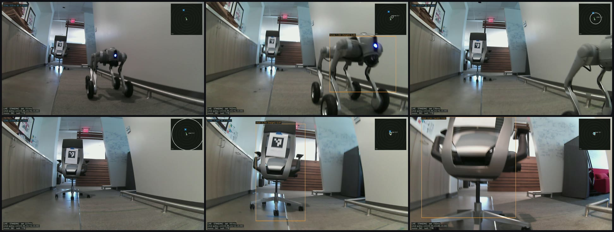

*Six frames of the run that was written up as peer avoidance. The peer is detected and correctly
placed — and labelled `horse`, which is why the deployed stack routes on box shape rather than on
the class name.*

The same reading later showed that the four Lite3 `--live`
runs were the plain goal follower and not the policy at all
([§2](#2-stop-for-a-blocker-the-baseline-everything-else-is-measured-against)).

### A16. Our charts overstated their own results

The checkpoint-sweep figure's legend says "12 other runs" while it draws 15, and its annotated
winner is the epoch-20 row at 85%/10% rather than the finer pass's 89%. The augmentation chart's
arrow claims "+4 people at identical recall"; matched by epoch it is **+3**. Both corrections are
committed in the evidence README beside the images rather than by silently redrawing them, so a
reader who has already seen the chart elsewhere can find out.

### A17. Two of our tests had never run at all

Two tests in `test_mappo_bridge.py` were never collected — one of them the human-safety rule.
Separately, a test asserting `SIGTERM` ordering signalled a handler that did not exist yet, and
a suite's `--check` leg could pass while a `ModuleNotFoundError` quietly removed whole
directories from the count. The general shape: a suite that cannot reach a test reports the same
green as a suite that passes it, which is why CI now discovers `test_*.py` by globbing and
re-measures rather than trusting a list.

## Appendix B — What a payload costs a proxy platform

The Go2s in this paper are **proxies** for the Lite3s
([A15](#a15-our-evidence-the-run-that-cleared-the-peer-did-not-avoid-it)). The Lite3 Venture
carries **no arm at all**. The proxy carried a **3.15 kg Unitree D1-550** cantilevered over its
back, and this is what that cost — the generalisable version of a lesson any lab standing one
robot in for another can act on before it buys the mount.

| what the payload bought | measured |
| --- | --- |
| `robot-stack/unitree/go2/d1_arm/` | **1,114 lines** of Python |
| arm-specific guards in `visual_nav/safety.py` | **297 lines** — `ArmStowMonitor` 150, `latch_arm` 91, `LatchResult` 23, `stand_up` 20, `lie_down` 13 |
| arm-specific constants in that file | **7 of its 11** module constants |
| thermal envelope | **70 °C abort / 55 °C warn**, against an idle reading of ~30 °C |
| standing budget | the hind legs saturated badly enough that the robot **could not hold a stand for 60 s** and squatted unannounced; `--rest-after` now lies it down after **15 s** blocked |

**Roughly 1,411 lines of guard code, and the entire thermal envelope of the test platform,
exist because of a payload the target platform does not carry.** The thermal limits are not
incidental to the arm — `safety.py:64` states the reason in the code:

> *"Conservative operating limits for the **ARM-LOADED case**, not vendor maxima. The point is
> to stop on a trend, long before the motors' own protection would act — **with the arm fitted
> there is no margin to spend.**"*

It is why the robot rests prone and stands only to walk, and why `safety.py` refuses a walk
unless forward kinematics puts the jaw within **0.30 m** of the arm base *and* within
**0.05 m** of the dorsal centreline — a compact fold that sits out over the flank passes the
first test and still unbalances the gait. Not theoretical: a live run on 2026-08-27 exited in
about three seconds on the arm-not-stowed refusal, the arm having been knocked out of stow by
an earlier collision. *(That one is an operator report, not committed evidence, unlike every
measurement in the table.)*

⚠️ **The figure below is not CAD, not a photograph, and not a vendor asset.**
`robot-stack/unitree/go2/d1_arm/urdf/d1_description.urdf` is kinematics only — joint origins,
axes and travel, with no visual, collision, inertial or mesh element, because Unitree's D1 STL
meshes are not redistributed here and nothing in this repository fetches one. So the links in
the picture are **primitive tubes**, and the barrel on each joint is drawn along **that joint's
own axis**, which is what makes the degrees of freedom visible. Every origin, axis and limit in
it is read from that 5 KB file at draw time by
[`docs/figures/make_d1_render.py`](figures/make_d1_render.py), whose `--check` re-derives all
eight and exits non-zero if any has moved.

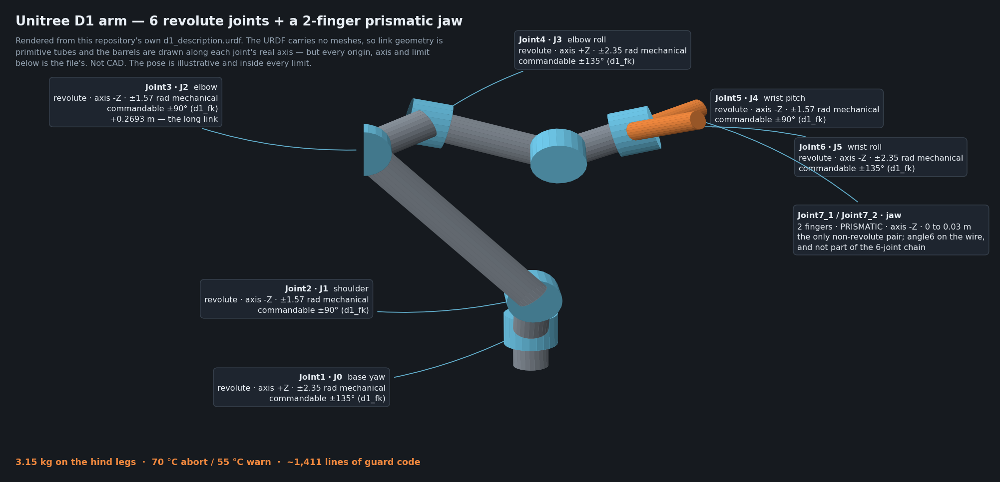

*Both numbering schemes are on every callout because confusing them is an off-by-one on a real
arm: the URDF names the joints `Joint1`–`Joint7_2`, while the wire and
`d1_fk.COMMANDABLE_LIMITS_DEG` count `J0` base-yaw to `J5` wrist-roll, and `angle6` is the jaw
and is not part of the six-joint chain. The three numbers along the bottom are this appendix's
point: a payload **the target platform does not carry** bought the proxy a stow-and-latch
preflight, a tightened thermal envelope and a shortened standing budget.*

**9 links, 8 joints: 6 revolute plus the 2 prismatic jaw fingers**, which is the whole reason
the chain branches at `Link6`. From `base_link` the jaw reaches **0.733 m** and the wrist
0.662 m; measured from the shoulder axis instead — the datum Unitree quotes from, 0.11 m higher
— the wrist reach is **0.553 m** against a published 550 mm, a 3 mm agreement that is how this
file was validated. ⚠️ **Commandable is not mechanical**, which is why the figure
carries both: the travel is what the URDF describes, while the D1 firmware clamps every
commanded angle to a tighter documented envelope (J0 ±135°, J1 ±90°, J2 ±90°, J3 ±135°,
J4 ±90°, J5 ±135°) — commanding −95° parks the shoulder at −90.3°. Plan IK against `d1_fk.COMMANDABLE_LIMITS_DEG`, or generate poses the arm can be
pushed into by hand and never driven to.

## Appendix C — Platform characteristics a portable stack has to accommodate

These are not defects; they are behaviours of shipping products, and both manufacturers appear.
A portable stack has to learn them per robot rather than assume them, and a researcher porting
this work needs them by name.

### C1. The axis transport is sign-only

The Deep Robotics Lite3's high-level axis interface **discards commanded magnitude** and keeps
only the sign, so the executable set per axis is `{0, one evidenced speed}`. The Unitree Go2's
transport is proportional. A planner that samples velocities and rolls them forward is making a
safety argument that holds on one platform and not the other, which is why the planner now
models its transport ([§6](#6-a-planner-that-models-its-own-transport)). This is a
cross-vendor portability result, and it would not have been visible on either robot alone.

### C2. The gait floor, and how many of them there are

Below some forward speed a quadruped stands still without faulting: Go2 **0.35 m/s** (0.21 m/s
stalled five runs of five), Lite3 **0.30 m/s**. The Lite3's calibration interface exposes *one*
gait floor where the robot has **two, differing by 2×** (issue #42), and the Go2's lateral floor
has never been measured at all. Delivered fraction differs the same way: this Go2 delivers about
0.45 of a derated command and 0.70 at full command; the Lite3 0.74 forward and 0.27 lateral.
None of these is inferable from a datasheet.

### C3. The clock is not set

The Unitree Go2 ships without its real-time clock set and reports **1970**. Anything that orders
events by the emitting device's own timestamp — an event drawer, a merge of two robots' streams
— silently interleaves wrongly, and the failure looks like a UI bug (issue #117;
`dashboard/README.md` records the reading). A test now pins it: two robots with unsynchronised
clocks *cannot* be interleaved by their own stamps.

### C4. Some telemetry a safety gate needs is simply not published

Motor temperatures are absent from the Lite3's high-level stream, and battery had to be
delegated through a platform combinator. A stack whose safety gate is "refuse without motor
temperature" then cannot start at all, so live Lite3 runs accept a **bounded** waiver —
`--accept-no-motor-temperatures`, capped at 120 s — rather than removing the gate. Separately,
the vendor's legacy autonomous velocity interface accepted well-formed packets at 10 Hz, moved
the robot **zero** millimetres, and reported `error 0` throughout, because the control mode it
requires cannot be entered from the AI motion state.

## Appendix D — Figure provenance and licences

**A render is a derivative work**, so this appendix exists to make each figure's source and
licence explicit rather than leaving them to be inferred.

**No vendor URDF, mesh, STL or Collada file is committed to this repository, and these figures
add none.** The tree holds exactly one URDF and no USD:
`robot-stack/unitree/go2/d1_arm/urdf/d1_description.urdf`, which predates this paper and is not
a vendor file — its own header states that it is kinematics only, authored here from
measurements of the physical arm so the stack can do forward kinematics and IK without a vendor
SDK download. Read that header before reusing it; do not take this sentence for it.

`docs/figures/make_robot_profile.py` reads the vendor descriptions from a checkout **you**
make, outside the tree, and writes only a PNG. That is deliberate: a prior Arm repository
shipped a byte-identical vendor URDF under an Arm copyright and an Apache-2.0 SPDX identifier
with no vendor attribution. That was a real licence violation and had to be corrected.
Committing a rendered PNG with explicit attribution, and leaving the source assets where their
licence found them, does not repeat it.

Licences established by reading the `LICENSE` file in each source repository:

| figure | source | licence | copyright holder, verbatim |
| --- | --- | --- | --- |
| `go2-walk-profile.png` | `unitreerobotics/unitree_ros` → `robots/go2_description` | **BSD-3-Clause** | © 2016-2022 HangZhou YuShu TECHNOLOGY CO.,LTD. ("Unitree Robotics") |
| `go2-wheel-profile.png` | `unitreerobotics/unitree_ros` → `robots/go2w_description` | **BSD-3-Clause** | as above |
| `lite3-profile.png` | `DeepRoboticsLab/deep_robotics_model` → `Lite3/` | **BSD-3-Clause** | © 2024, DeepRoboticsLab |

Licences we could **not** establish, recorded so nobody assumes otherwise:
`unitreerobotics/xr_teleoperate` carries no detected licence — GitHub reports `NOASSERTION` —
so its redistribution terms are unestablished, and nothing derived from it appears here.

### D1. Regenerating the robot figures

Fetch the descriptions into any scratch directory outside this repository:

```bash
mkdir -p "$ASSETS" && cd "$ASSETS"

# The blobless + sparse form is load-bearing: a plain clone of unitree_ros did not
# finish in five minutes, and this one brings both descriptions down in about 90 s.
# `sparse-checkout add LICENSE` is what lets you verify the copyright line above --
# sparse mode excludes it otherwise.
git clone --depth 1 --filter=blob:none --sparse \
    https://github.com/unitreerobotics/unitree_ros.git
(cd unitree_ros \
    && git sparse-checkout set robots/go2_description robots/go2w_description \
    && git sparse-checkout add LICENSE)

# deep_robotics_model's .gitattributes is empty -- nothing here is git-lfs, so a plain
# clone gets real STL bytes rather than pointer files. Its licence file is LICENSE.txt.
git clone --depth 1 https://github.com/DeepRoboticsLab/deep_robotics_model.git
```

Then, from `docs/figures/`, one command per figure:

```bash
python3 make_robot_profile.py --preset go2 \
    --urdf "$ASSETS/unitree_ros/robots/go2_description/urdf/go2_description.urdf" \
    --out go2-walk-profile.png
python3 make_robot_profile.py --preset go2w \
    --urdf "$ASSETS/unitree_ros/robots/go2w_description/urdf/go2w_description.urdf" \
    --out go2-wheel-profile.png
python3 make_robot_profile.py --preset lite3 \
    --urdf "$ASSETS/deep_robotics_model/Lite3/urdf/Lite3.urdf" \
    --out lite3-profile.png
```

The renderer is a numpy software rasteriser — no OpenGL, no trimesh, no scene-graph library —
that parses the URDF with `xml.etree`, walks the kinematic tree, loads binary STL, ascii STL
and Collada, projects, z-buffers and flat-shades. **Callout leader lines are anchored to
projected link positions**, so a label names a link and an offset in that link's own frame and
the arrow lands wherever the camera puts it; changing `--azimuth` cannot silently detach a
label from the part it points at.

**The pose is not the zero pose, and saying so matters.** `--zero-pose` walks the tree with
every joint at zero, which is what the URDF describes and is a pose neither robot can hold:
the Go2's calf joint is limited to [−2.7227, −0.8378] and the Lite3's knee to [0.524, 2.792],
so zero is outside the vendor's own `<limit>` on eight of the twelve joints between them, and
the result is a straight-legged animal on stilts. Each preset therefore carries a stance whose
every angle is inside those limits; `--print-pose` prints it.

### D2. Other figures

`detector-configuration-spread.png` is generated by
[`docs/figures/make_detector_spread.py`](figures/make_detector_spread.py) from the committed
sweep JSON; `--check` re-derives the recalls this paper quotes and exits non-zero if any has
moved.

`d1-arm-render.png` is generated by
[`docs/figures/make_d1_render.py`](figures/make_d1_render.py) from
`robot-stack/unitree/go2/d1_arm/urdf/d1_description.urdf` — **this repository's own
Apache-2.0 file, not a vendor one**, which is why it needs no scratch checkout and adds no
licence question. No D1 mesh is fetched and none exists to fetch; that is exactly why the link
geometry is primitive. Its `--check` re-derives all eight joint origins, axes and limits from
the URDF, and refuses to draw at all if any has moved, so a stale figure is a failing command
rather than a picture nobody re-ran.

The two animated runs, the observation triptych and the peer contact sheet are the authors' own
recordings of their own robots and are covered by this repository's Apache-2.0 licence.

---

## References

1. W. Brown, *Deploying robots: RGB-only camera self-calibration on a Unitree Go2*. LinkedIn,
   August 2026.
   [`linkedin.com/posts/waheedbrown_deploying-robots-calibration-ugcPost-7491672451312005121-WWtd`](https://www.linkedin.com/posts/waheedbrown_deploying-robots-calibration-ugcPost-7491672451312005121-WWtd)
   — the public statement of the motivation this paper builds on: a self-calibration routine
   relying solely on an RGB camera, because many industrial robots use RGB cameras to manage
   cost and energy, so that a robot can be dropped into an environment, switched on and deployed
   in minutes.
2. A. Kirillov, E. Mintun, N. Ravi, H. Mao, C. Rolland, L. Gustafson, T. Xiao, S. Whitehead,
   A. C. Berg, W.-Y. Lo, P. Dollár, R. Girshick. *Segment Anything.* Meta AI Research (FAIR),
   2023. [arXiv:2304.02643](https://arxiv.org/abs/2304.02643) — the promptable segmentation
   model and the model-in-the-loop data engine referenced in
   [§11](#11-test-runs-are-the-training-corpus). **Meta**, not Stability AI; see the attribution
   note in that section.
3. **Arm Device Connect** — the open standard for describing and driving physical hardware from
   software. [deviceconnect.dev](https://deviceconnect.dev/) ·
   [github.com/arm/device-connect](https://github.com/arm/device-connect)
4. Unitree Robotics, `unitree_ros` robot description packages, BSD-3-Clause.
   [github.com/unitreerobotics/unitree_ros](https://github.com/unitreerobotics/unitree_ros)
5. Deep Robotics, `deep_robotics_model` description packages, BSD-3-Clause.
   [github.com/DeepRoboticsLab/deep_robotics_model](https://github.com/DeepRoboticsLab/deep_robotics_model)
6. MobileNet-SSD, the deployed 21-class detector, and the VOC class list it was trained on.
   Vendored weights and their provenance: `detector/README.md`.

---

*Corrections to this document belong in the repository it describes. If a number here disagrees
with the tree, the tree is right — open an issue and say which.*
