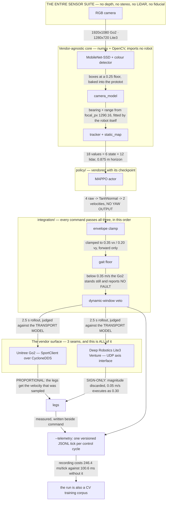
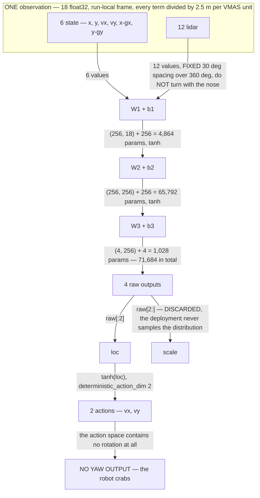
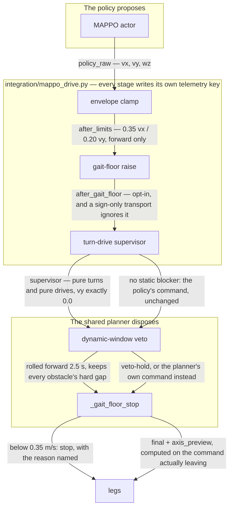
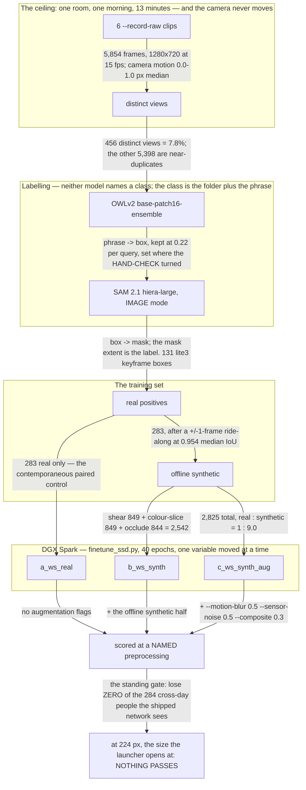
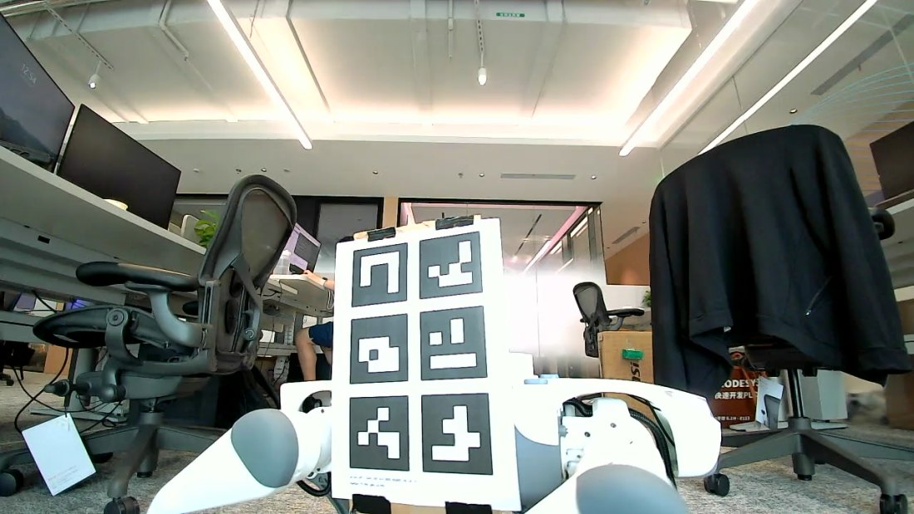
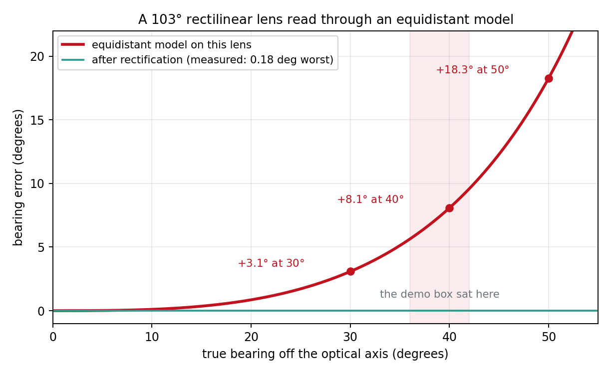
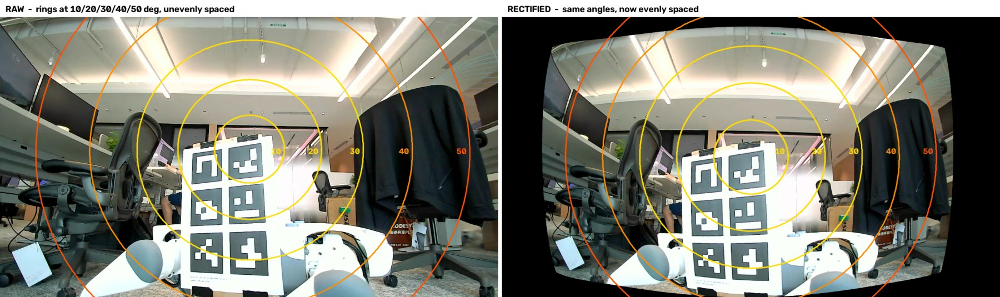

<!--
Copyright (c) 2024-2026, Arm Limited and Contributors. All rights reserved.
SPDX-License-Identifier: Apache-2.0
-->

# 一台 RGB 摄像头，没有深度传感器，没有激光雷达

[English](WHITEPAPER.md)

> 英文版 [WHITEPAPER.md](WHITEPAPER.md) 为权威版本；如两版有出入，以英文版为准。

### 四足机器人靠它能做到什么，以及它从哪里开始不够用

**Waheed Brown** ([waheed.brown@arm.com](mailto:waheed.brown@arm.com)) —— 第一作者<br>
**Sagar Surendran** ([Sagar.Surendran@arm.com](mailto:Sagar.Surendran@arm.com))<br>
**Timo Tang** ([Timo.Tang@arm.com](mailto:Timo.Tang@arm.com))<br>
**Jackie Lee** ([Jackie.Lee@arm.com](mailto:Jackie.Lee@arm.com))

Arm Limited · 2026 年 8 月 · 仓库
[`armwaheed/mappo-arm-cloud-physical-ai`](https://github.com/armwaheed/mappo-arm-cloud-physical-ai)

---

## 摘要

**一台四足机器人，只有一台 RGB 摄像头、没有深度传感器、没有激光雷达，它能做到什么？** 本文里的每一个
距离和每一个方位角，都是从像素和一个焦距算出来的 —— 没有双目、没有飞行时间、没有任何人工标志物。

两个平台：一台 Unitree Go2，以及一台云深处 Lite3 Venture —— 选它正是因为这两样它都不带。
**Go2 是替身** —— 它在奥斯汀拿得到，而工作真正瞄准的是上海的 Lite3 —— 所以 Go2 那一半跑在了真机上，
Lite3 那一半基本上没有：四次 `--live` 行走执行的是朴素目标跟随器而不是策略，外加一次有界的轴向试验。

在一台 Go2 上，纯 RGB 感知可以走向被检测到的目标、给行人让路、对一个它根本没有检测器的障碍物建图并
绕行，还能穿过一个 1.3 m 的缝隙。超过大约一米，单目摄像头的几何就不够用了；而在策略的观测里，
自由空间的含义是"没有识别到任何东西"，不是"那里什么都没有"。

负面结果的分量一点不轻。单目测距在 4,624 次目击中有 417 次回退成了常量，并且在一次行走里驱动了 37 个
避障 tick 中的 21 个 —— 直到有人建起护栏拒绝它们为止。同一份权重，仅仅因为启动脚本不同，同伴召回率
就从 13% 变到 68%。一次检测器微调运行什么都没交付 —— 而同一个种子下五次逐字节相同的训练运行产出了
五个不同的检测器，所以本项目排过序的每一个实验臂都只是一次抽样。MAPPO 策略在每一种无监督仿真配置下
都发生了碰撞，只有在规划器的否决之下才是安全的。两个平台都还没有做过双机真机运行。附录 A 记录了
我们错在哪里，以及是怎么发现的。

## 目录

- [这个问题](#这个问题)
- [一页纸看完整个系统](#一页纸看完整个系统)

**[第一部分 —— 已经建成的东西](#第一部分--已经建成的东西)**

1. [一台自己转身标定摄像头的机器人](#1-一台自己转身标定摄像头的机器人)
2. [遇到阻挡就停：其它一切都以此为基准](#2-遇到阻挡就停其它一切都以此为基准)
3. [用焦距求距离 —— 以及拒绝常量距离的护栏](#3-用焦距求距离--以及拒绝常量距离的护栏)
4. [一份遥测契约，而不是一份控制台日志](#4-一份遥测契约而不是一份控制台日志)
5. [三道接缝：这套栈迁移到了第二家厂商](#5-三道接缝这套栈迁移到了第二家厂商)
6. [一个为自己的传输层建模的规划器](#6-一个为自己的传输层建模的规划器)
7. [每次运行都配一组消融对照，并在腿动起来之前先闭环](#7-每次运行都配一组消融对照并在腿动起来之前先闭环)
8. [一棵能说出自己提交号的部署树](#8-一棵能说出自己提交号的部署树)
9. [一个真正驱动机群的浏览器仪表盘](#9-一个真正驱动机群的浏览器仪表盘)
10. [同伴位姿走网格，而不是走检测器](#10-同伴位姿走网格而不是走检测器)
11. [测试运行本身就是训练语料](#11-测试运行本身就是训练语料)
12. [一台机器人，四个检测器](#12-一台机器人四个检测器)
13. [一条什么都没交付的检测器训练流水线，以及一台噪声大到无法为它所训练的东西排序的仪器](#13-一条什么都没交付的检测器训练流水线以及一台噪声大到无法为它所训练的东西排序的仪器)
14. [靠强迫护栏失效来证明护栏](#14-靠强迫护栏失效来证明护栏)

**[第二部分 —— 哪些在真机上跑过，哪些没有](#第二部分--哪些在真机上跑过哪些没有)**

**[第三部分 —— 复现本文](#第三部分--复现本文)**

- [附录 A —— 更正：我们错在哪里，又是怎么发现的](#附录-a--更正我们错在哪里又是怎么发现的)
- [附录 B —— 一个载荷让替身平台付出了什么](#附录-b--一个载荷让替身平台付出了什么)
- [附录 C —— 一套可移植的栈必须迁就的平台特性](#附录-c--一套可移植的栈必须迁就的平台特性)
- [附录 D —— 插图来源与许可证](#附录-d--插图来源与许可证)
- [参考文献](#参考文献)

*子标题在父标题带编号时沿用父标题的编号 ——
[§13.3](#133-值得单独成节的发现名称得零分描述得-06-分)、
[A9](#a9-我们的对比在模型自己的训练当天下的结论)、
[C1](#c1-轴传输层是只有符号的) —— 而且它们一个都没有列在这里：列到两级，这一页在走到第 1 节
之前就要占掉一屏半。*

---

## 这个问题

厂商出货的四足机器人带着激光雷达和深度相机。很多工业部署两样都装不起：单目 RGB 传感器更便宜、更轻，
功耗预算只占一个零头。所以这项工作问的问题，在成为一个机器人学问题之前，先是一个采购问题：

> **一台四足机器人，只有一台 RGB 摄像头、没有深度传感器、没有激光雷达，它能做到什么？**

本文中的一切都来自单一的 RGB 图像流。你将读到的每一个距离、每一个方位角、每一个缝隙、每一段余量，
都是从像素和一个焦距算出来的。没有激光雷达回波，没有双目对，没有结构光，没有飞行时间，没有动作捕捉，
房间里也没有任何人工标志物。哪怕某台机器带着激光雷达，这套栈也不去读它。第二个平台 ——
云深处 Lite3 **Venture** —— 之所以为这项工作指定，恰恰是因为它既不带深度相机也不带激光雷达，
这样假设就不可能被某个没人提过的传感器悄悄救回来。

答案是测出来的而不是辩出来的，大致是：**比我们预期的多，到大约一米为止。** 一台 Go2 会走向被检测到的
目标、给行人让路、对一个它没有检测器的障碍物建图并绕过去、在两个障碍物之间穿过 1.3 m 的缝隙，
还能避开第二台机器人 —— 全部来自 RGB。超过大约一米，单目摄像头的几何就不够用了，而本文的后半部分
正是一张标出"究竟从哪里开始不够用"的地图。

回路里的学习式控制器是一个 **MAPPO** 策略 —— 多智能体近端策略优化，在仿真中训练，连同检查点一起
入库到本仓库 —— 但策略并不是本文的重点。重点是感知、接口，以及那些让*任何*控制器都能只靠一台摄像头
跑在真实四足机器人上的护栏。

那条边界是我们最愿意为之辩护的贡献。带激光雷达的栈白得一个第二意见。只有一台摄像头的栈没有，
所以它必须有能力说*"这一帧我测不出距离"*并且当真 —— 而我们的栈有一阵子做不到。那就是
[§3](#3-用焦距求距离--以及拒绝常量距离的护栏)，它是作为一个发现而不是一项功能写下来的。

### 如何阅读本文

**下面的每一条主张都点名它来自哪个文件、哪个脚本或哪份已入库的测量**，并且可以从一份干净的克隆里核对。
需要机器人才能得到的数字我们会说明；来自**不在**本仓库中的脚本的数字我们也会说明。这份文档的任务书是
"别搞那种有白皮书没代码的把戏"，所以一个打开代码树的读者应当能够证伪这里的任何一句话，而且不用找太远。

第 1–14 节是已经建成的东西。[附录 A](#附录-a--更正我们错在哪里又是怎么发现的)
是我们错在哪里、又是怎么发现的记录；它被每一节交叉引用，也是本仓库里最有特色的材料。每一节都在正文里
自带经过测量的告诫，所以附录是在加深论证，而不是在推翻它。

### 贡献一览

| # | 贡献 | 让它可核查的那个数字 |
| --- | --- | --- |
| [1](#1-一台自己转身标定摄像头的机器人) | 机器人原地转身，拟合出自己的焦距 —— 不用工装、不用棋盘格、不用人 | 已入库的拟合结果：80.05° 上取 53 个样本，3.13° rms 残差 |
| [2](#2-遇到阻挡就停其它一切都以此为基准) | 纯 RGB 的目标跟随，遇到阻挡就停 —— 诚实的前策略基线 | 四次 Lite3 实机行走真正跑的就是它 |
| [3](#3-用焦距求距离--以及拒绝常量距离的护栏) | **发现：** 单目距离曾经是常量，以及现在拒绝它们的那道护栏 | 4,624 行中的 417 行；37 个避障 tick 中有 21 个由它们驱动 |
| [4](#4-一份遥测契约而不是一份控制台日志) | 一份带版本号的逐 tick 遥测契约，坐标系被声明、视频被关联 | 控制台日志携带位姿的次数是**一次**，在横幅里 |
| [5](#5-三道接缝这套栈迁移到了第二家厂商) | 整个从感知到规划的核心与厂商无关；只有三道窄接缝有关 | 移植到第二个平台只实现了 3 个绑定 |
| [6](#6-一个为自己的传输层建模的规划器) | 一个在预测机器人会走到哪里之前先问传输层"腿会怎么动"的规划器 | 一次通过校验的 0.05 m/s 爬行执行成了 0.30 m/s 的猛冲 |
| [7](#7-每次运行都配一组消融对照并在腿动起来之前先闭环) | 每次运行都配一组消融对照，并在腿动起来之前先闭环 | 在完全没有障碍物时，这个检查点自带 6–16° 的偏置 |
| [8](#8-一棵能说出自己提交号的部署树) | 一棵没有 `.git` 的部署树，靠重算 git 自己的树 id 来自证并拒绝运行 | 10 棵机器人上的树有 6 棵逐字节吻合；在用的那一棵横跨 15 个提交 |
| [9](#9-一个真正驱动机群的浏览器仪表盘) | 一个跑在无中介设备网格之上的浏览器机群仪表盘，带硬停止 | 跨机 STOP 4.23 s → 0.06 s |
| [10](#10-同伴位姿走网格而不是走检测器) | 一条从网格而不是检测器取同伴位姿的避让通路 —— 已设计并做过离线测试；**MAPPO 导航本身跑的是 RGB** | 一个 0.40 m 的圆盘，超时后既丢弃**又**保持，阈值 0.6 s；**0** 次双机真机运行 |
| [11](#11-测试运行本身就是训练语料) | 每一次测试运行同时收割 CV 训练数据，逐 tick 对帧关联 | 收割了 89 次运行、9,117 个 tick、4,624 次检测 |
| [12](#12-一台机器人四个检测器) | **发现：** 推理配置是比权重更大的杠杆 | 同一份权重、同一批帧：召回率从 13% 到 68% |
| [13](#13-一条什么都没交付的检测器训练流水线以及一台噪声大到无法为它所训练的东西排序的仪器) | **负面结果，公开而不是丢弃：** 一条什么都没推荐的微调流水线，以及为什么它的任何一轮都不可信 | 同一条命令的五次 `--seed 0` 运行，**五个不同的 `.caffemodel` 文件** |
| [14](#14-靠强迫护栏失效来证明护栏) | 护栏靠打断它来证明，存活下来的变异也一并记录 | 测试文档字符串里 47 条"Made to fail by …"记录 |

---

## 一页纸看完整个系统



*读边，不要读框。其中两条边承载了本文的全部论证：策略**不输出偏航**，这就是
[§6](#6-一个为自己的传输层建模的规划器)必须把避障重新表达成纯转向加纯直行的原因；而 Lite3 那道接缝
**丢弃了发给它的幅值**，这就是动态窗口规划器的安全论证在移植之后无法成立的原因。`SENSING` 框里
只有一项，这是故意的。*


*由 [`docs/figures/make_robot_profile.py`](figures/make_robot_profile.py) 从宇树自己的 Go2 描述包
（[`unitree_ros/robots/go2_description`](https://github.com/unitreerobotics/unitree_ros)，
BSD-3-Clause，© 2016-2022 HangZhou YuShu TECHNOLOGY CO.,LTD. "Unitree Robotics"）渲染而成。
网格文件**没有**入库；生成脚本从你自己拉取的一份检出里读取它们 —— 见
[附录 D](#附录-d--插图来源与许可证)。*

两次真实 Go2 上的实机运行，为后面的一切定锚。

**绕开一个静态障碍物，走向被检测出来的目标。**


机器人没有针对回收箱的检测器，所以它靠颜色找到它、校验形状，并把它建图在 odom 坐标系里，
这样绕行把它带出画面之后它依然存在。目标是那把椅子，由检测器在中心裁剪区上运行找到。它走了
**1.89 m**，与回收箱齐平后停下：规划器是满意的 —— 需要 0.60 m 而实际有 **0.70 m** 的间距 ——
只是办公室的通道到头了。`evidence/live_run.mp4`、`evidence/live_run.log` 和 `evidence/live_run_telemetry.jsonl`。

**给行人让路。**


走向 2.0 m 外的航位推算航点，在距目标 **0.96 m** 处到达，**145** 个感知周期，**0** 次错误，
电机温度 31 → 32 °C。**107** 个控制 tick 中：63 次 `goal`、24 次 `avoid`、20 次 `hold` ——
而且间距变为负值的那 **12** 个 tick，每一个都下达了完全停止。`evidence/go2_nav_run.{mp4,log}`。

### 用数字说明这个策略

**71,684 个参数，从一块 Jetson 上驱动一台真实的四足机器人。** 整个学习式控制器就是这些：三个权重矩阵
和三个偏置向量，装在一个 262 KiB 的 `.npz` 里并入库到本仓库，所以本小节里的每一个数字，
都能从一份干净的克隆里、只用 `numpy` 打印出来。

`policy/models/mappo_actor_3agent_1910000.npz`：

| 数组 | 形状 | 参数量 |
| --- | --- | ---: |
| `W1`、`b1` | (256, 18), (256,) | 4,864 |
| `W2`、`b2` | (256, 256), (256,) | 65,792 |
| `W3`、`b3` | (4, 256), (4,) | 1,028 |
| | **合计** | **71,684** |

这个检查点还带了一个 `metadata_json` 数组，声明它是用什么训练出来的 —— 这是训练常量唯一的带内记录，
而 `MappoController._check_against_checkpoint` 现在拿配置去校验它，而不是信任其中任何一方：

| 字段 | 值 | 字段 | 值 |
| --- | --- | --- | --- |
| `format` | `mappo_shared_actor_numpy_v1` | `activation` | `tanh` |
| `actor_input_dim` | 18 | `policy_distribution` | `TanhNormal` |
| `actor_hidden_dims` | [256, 256] | `deterministic_action` | `tanh(loc)` |
| `actor_raw_output_dim` | 4 | `training_n_agents` | 3 |
| `deterministic_action_dim` | **2** | `share_policy_params` | `true` |
| `training_frames` | 1,910,000 | `training_max_steps` | 100 |
| `training_lidar_range_vmas` | 0.35 | `training_agent_radius_vmas` | 0.1 |



*那一块 lidar 是**接近度，不是距离** —— `0.35 - range`，所以越大表示越近 —— 而且**超过 0.875 m 的
感知视距它就读 0**，无论房间里有什么。这正是 `evidence/2026-08-19-what-the-policy-sees/`
抓到的东西：两个回收箱明明白白出现在 1.7 m 和 2.7 m 的画面里，而向量里是十二个零。*

**请读懂那张图右侧的坍缩，因为它比关于策略的任何其它单一事实都更能解释本文。** 网络输出四个数；
其中两个是一个分布的展宽，而部署把它扔掉了（`np.tanh(raw[:2])`，`policy/physical_ai_mappo.py`），
活下来的那两个是*平动*速度。动作空间里没有任何东西能让机器人转身。这就是为什么
[§6](#6-一个为自己的传输层建模的规划器)必须先把避障重新表达成纯转向加纯直行，Lite3 才能执行它；
为什么 `--heading-servo` 默认是 `off`；以及为什么
[A1](#a1-我们的控制律一个把机器人开进墙里的航向伺服) 会发生。

还有两个后果值得带进第一部分。**这 12 条射线就是策略对世界的全部模型**，而它们是由这套栈中
*已识别物体*的短名单填出来的，不是由传感器填的 —— 所以那个向量里的自由空间意味着
"没有识别到任何东西"，不是"那里什么都没有"。以及**这条通路上的感知延迟中位数是 309 ms**
（p90 为 436 ms），所以航迹会被外推、半径会被膨胀以覆盖它；策略看到的是这个结果，永远不是原始传感器。


---

# 第一部分 —— 已经建成的东西

## 1. 一台自己转身标定摄像头的机器人

这套系统里的每一个距离都是对一个数做除法：`focal_px`，也就是偏离光轴每弧度对应多少像素。它有 20%
的误差，下游每一个距离就有 20% 的误差。Go2 不为它的前置摄像头提供任何标定 —— 它自带的那些标定文件
描述的是一台并没有装上去的 RealSense。

所以机器人自己测。`robot-stack/unitree/go2/visual_nav/calibrate_camera.py --spin --live`
**让机器人原地转身**，跟踪画面中任何可识别的物体，并用机器人自己的偏航里程计作为角度尺：当机体转过
一个已知角度时，物体的方位角必须变化同样的角度，而只有真实的焦距才能让这个关系在整个扫掠上都成立。
不用棋盘格、不用工装、不用卷尺、不用尺寸先验、回路里不用人。脚本自己的文档字符串把这一条叫作
"THE ACCURATE ONE"，并解释了为什么另外两种静态方案不是：它们都会继承你交给它们的那两个数字里的
每一份误差，而在近距离上那些误差很大。

**产物已经入库**，所以这是可核查的而不是断言的 ——
`robot-stack/unitree/go2/visual_nav/go2_front_camera.json`：

| 字段 | 值 |
| --- | --- |
| `method` | `spin` |
| `samples` | **53** |
| `yaw_span_deg` | **80.05** |
| `residual_deg_rms` | **3.1333** |
| `focal_px` | **1290.16** |
| `height_m` / `pitch_rad` | 0.32 / 0.0 |

残差可以分解：`spin_fit_quality` 把系统性失配和逐样本抖动分开，在这台机器人上残差是 3.13°，
而抖动是 3.12°。等距鱼眼模型是无辜的；一个走动的人本来就不是刚性标志物。均值的标准误约为
3.13/√53 ≈ 0.43°。

**它宁可拒绝，也不去拟合噪声。** `MIN_SPIN_SAMPLES = 8` 且 `MIN_SPIN_YAW_DEG = 20.0` ——
"低于此值拟合是欠约束的"。这些护栏存在，是因为那次失败被观察到了：一种把整圈旋转烧光、然后在偏航跨度
检查上失败的扫掠模式，被记录在这些常量旁边的注释里。

> **正文内告诫。** 同一个 JSON 还带着 `hfov_deg` 85.27，而**那个数字并不能从测出来的那个推出来**：
> 1290.16 px 在 1920 px 宽度下意味着 **73.31°**。`focal_px` 是测量值；`hfov_deg` 是规格书。
> `robot-stack/CAMERA-GEOMETRY.md` 给每一个字段标注"实测"还是"假定"，正是为了这个原因 —— 见
> [§3](#3-用焦距求距离--以及拒绝常量距离的护栏) 和
> [A3](#a3-我们的回退本质是常量的距离)。

> **⚠️ 而在 Lite3 上，这个方法会返回一个自信的错误答案。** 2026-09-01 终于在一台 Lite3 上跑了一次
> 转身标定 —— 73.4° 偏航上的 49 次目击 —— 拟合出 **focal_px 888.85**，操作员的卷尺当场推翻了它：
> 它把一个标志物放在 5.65 m 处，而卷尺量出来是 3.00 m。脚本其实已经说过了。它报告了一个 **4.37°
> 的系统性**残差、对应 2.17° 的抖动，并警告说"等距模型可能并不描述这枚镜头，而且没有任何单一焦距
> 能修好这一点" —— 在 Go2 上为模型开脱的那同一个 `spin_fit_quality` 分解，在这里给它定了罪。
> **方法是可靠的，它的自检也有效；失效的是它底下的那个假设。** 转身标定拟合的是等距模型的一个内参，
> 所以在一枚并非等距的镜头上，它根本没有可以拟合对的参数。见
> [A19](#a19-我们的相机模型错误的方程以及为掩盖它而拟合出的四个焦距)。

纯 RGB 自标定的动机 —— 一台可以扔进某个环境、开机、几分钟内就投入使用的机器人，跑在一个因为深度和
激光雷达要花钱又费电所以只带 RGB 摄像头的平台上 —— 早在本仓库存在之前，就已经由第一作者公开发表
（[参考文献 1](#参考文献)）。

## 2. 遇到阻挡就停：其它一切都以此为基准

在任何学习式策略之前，`robot-stack/unitree/go2/visual_nav/` 会把机器人带向目标，并在有东西挡路时
**停下来**。这是诚实的基线，是一项真实的能力，而*停下来*和*绕过去*之间的差别，是贯穿本文的主线：
MAPPO 策略、动态窗口规划器和转向-直行执行监督器（[§6](#6-一个为自己的传输层建模的规划器)）
全都是在够第二件事。

它之所以重要还有第二个原因。2026-08-26 那四次 Lite3 `--live` 运行 —— 那些真让机器人走起来的运行
—— 执行的是**这个**，不是策略。遥测可以证明：控制原因只有 `goal` 和 `hold`，从来没有 `policy`
或 `veto-*`（`evidence/2026-08-27-lite3-executable-avoidance/`）。一个以为那些运行演示了学习式避障
的读者会是错的，而在我们读那些 tick 之前，我们也是错的
（[A15](#a15-我们的证据那次绕开同伴的运行并没有在躲它)）。

## 3. 用焦距求距离 —— 以及拒绝常量距离的护栏

**这一节是一个发现，不是一项能用的功能。**

只有一台摄像头、没有激光雷达时，距离就是`尺寸 ÷ 张角`。`camera_model.FisheyeCamera` 实现了等距模型
`r = f·θ`，而 `range_from_span` 求它的逆；相对距离误差等于相对像素跨度误差，一个 520 px 的框上
20 px 的误差约为 4%，而且它与俯仰无关。这行得通 —— 前提是这个物体的尺寸你知道。

对于尺寸未知的物体，`person_detector.estimate_range` 会回退，而**这些回退返回的是常量**：

| 来源 | 它的含义 | Go2 上的取值 |
| --- | --- | --- |
| `width-capped` | 框比镜头几何在任何距离上允许的都高，所以拟合被封顶 | **0.7194 m** |
| `frame-fill` | 框在两个轴上都被裁切；已经没有跨度可测 | **0.800 m**（`FILLS_FRAME_RANGE_M`，`person_detector.py:160`） |

在从实验室 Go2 上拉下来的 89 次运行语料里，**4,624 行目击中有 417 行是这两个常量之一** ——
322 行 `width-capped` 取 0.7194 m，95 行 `frame-fill` 取 0.800 m，精确到小数点后四位完全相同。
已入库的 `evidence/2026-08-27-89-runs-survived-14-can-be-dated/failure-modes.json`
把它记录为 `"unrangeable_rows": 417` 对 `"sighting_rows": 4624`，而
`python3 inventory.py --corpus <pull>` 可以重新生成它。

它进了控制回路。在第 5 次行走中，**37 个 tick 下达了 `veto-avoid`，而那 37 个里有 21 个**至少带着一次距离是
那两个常量之一的目击（12 次 `width-capped`，9 次 `frame-fill`）。*机器人为一个没有任何传感器测过的
距离而闪避。* 封顶逻辑旁边的代码注释引用了它的来源 —— 那次实机失败：接近一个回收箱时，宽度跨度在
十三帧里读到 0.748–0.907 m，而拟合距离是 0.719 m，所以每一帧都被封顶，报出的距离连续五秒都是
精确到三位小数的 0.719 m —— 与此同时方位角正确地从 +13° 跟到 +25°。机器人被一个动不了的数字
锁死了。

**为什么这是设计的代价，而不是一件丢人的事。** 没有激光雷达就没有第二意见。当单目摄像头需要的几何
离开画面时，它输出的正是一个常量，而当时没有任何东西能反驳它。正确的应对不是去找一个更好的先验；
而是让这套栈有能力说*"这一帧我测不出距离"*。

**那道护栏。** 真正的缺陷比一个错误的数字更糟：`range_detections` **丢弃**了它测不出距离的东西，
而 `avoidance.DynamicWindowPlanner.is_feasible` 在障碍物列表为空时无条件返回 `True` ——
于是一帧读不出来的画面与一帧空场在比特层面完全相同，规划器把它读成了一片开阔场地。PR #134
把两半都修了：

- `UNRANGEABLE_SOURCES = ("frame-fill", "width-capped", "ground-clipped", "ground-horizon")`
  （`person_detector.py:175`）。常量不再是答案；它们是拒绝。
- `widest_open_bearing_rad()` 只用**框的几何**测量相机锥内最大的缝隙 —— 恰恰在测不出距离的时候
  它还可用。
- `steerable_bearing_rad()` 定下门槛：`asin(robot_radius / near_wall)`，其中 `near_wall` 是画面
  **底角**处的地面距离，**0.806 m** —— 不是通常被引用的 0.719 m，那是中心列，它会早 0.09 m
  失去接地点。在出货的 0.40 m 半径下这是 **29.75°**；在 0.25 m 下是 **18.07°**。
- 低于这个门槛时，导航器会**保持不动，并说明理由**，而不是走进一片它自己发明出来的场地。

`test_person_detector.py` 用两次已入库的实机运行把这些数字钉住：护栏恰好在 4 个 tick 上触发、
放过 12 个，`max(fired) < 23.0°` 而 `min(passed) > 32.7°` —— 这是真正的分离，不是贴着一侧
凑出来的阈值。

**还有一个完全不需要尺寸先验的测距器。** `camera_model.ground_range` 把穿过框*最低像素*的射线与
地平面求交：`d = h / tan(elevation)`。没有 `L`、没有类别、没有先验 —— 而这是纯 RGB 的栈能给一个
访客随手放进场地的物体测距的唯一办法（issue #6）。它由自己的误差模型把关，
`|Δd/d| = δ·(d/h + h/d)`，因此 `--static-detect-ground` *必须*配 `--static-detect-pitch-error-deg`
且没有默认值。在这台机器人上实测的可用区间：在 2° 俯仰误差和 18% 容许误差下为 **0.72–1.33 m**，
在实测的 1.6° 中位数下为 0.72–1.70 m
（`evidence/2026-08-26-ranging-without-a-size-prior/ground_vs_prior.py`）。

> **正文内告诫。**（a）这道护栏**从未在场地里触发过** —— 它为之而建的那次运行不在本仓库里；
> 在两次已入库的运行中，它在 16 个测不出距离的 tick 里触发了 4 个，并让那次"英雄运行"付出了 59 个
> tick 中的 1 个。（b）上面 21/37 的拆分引自一份 README，与 417 不同，它**没有**被一个已入库的
> 脚本复现。（c）Lite3 的相机参数块**自相矛盾 48.7°** —— 见
> [A3](#a3-我们的回退本质是常量的距离)。（d）尺度本身是可靠的：拿一枚打印的 10 cm ArUco 标志物
> 在 2.2–2.6 m 上对着机器人自己的里程计拟合，得到 **k = 1.092**（n = 43，4.5 cm rms）和
> **k = 1.020**（n = 52，4.8 cm rms）—— `evidence/2026-08-26-range-scale-audit/scale_audit.py`。
> k 是一个*比值*；要排除相机和里程计以同一个因子一起错，卷尺仍然是唯一的手段。

## 4. 一份遥测契约，而不是一份控制台日志

从机器人栈给策略喂数据，最显而易见的办法是解析它的控制台输出。按那次让路运行的 107 个控制 tick
统计，这个办法行不通：

| 策略需要什么 | 控制台日志里有什么 |
| --- | --- |
| 运动指令 | 每个 tick 都有 |
| 目标点 | 一个标量*距离* —— 没有位置 |
| 里程计 / 位姿 | **只有一次**，在启动横幅里 |
| 相机数据 | 没有（`lat=235ms` 是一帧的*年龄*） |

控制台日志还会*为了保持可读而被改写*：`people=0` 在一周之内变成了 `obst=[binx1,personx1]`。
对散文是对的，对解析器是致命的。所以 `--telemetry` 会**每个控制 tick 写一个带版本号的 JSONL 对象**，
而文件头一行声明**每个向量位于哪个坐标系** —— `pose`、`goal` 和 `obstacles` 是 odom；
`command` 和 `measured` 是机体。这是消费方唯一无法从数据本身还原出来的东西，因为只要机器人朝着
它的起始航向，两个坐标系就完全重合，只有在它转向之后才会分开：建立在错误假设上的集成会通过每一项
台架测试，然后在第一个转弯处失败。

有四个设计决定值得照抄：

- **每一个 tick 都会写出来**，包括 hold 和感知过期导致的跳过 —— "它站着不动了 1.4 s"是一个信号，
  不是一段空白。
- **`measured` 就放在 `command` 旁边。** 没有它，"下达了 0.12 m/s 却纹丝不动"和"正在行走"
  无法区分。这花了三次运行才看见。
- **`perception.video_frame`** 是 `--record` 中对应帧的索引。就是这一个字段，让运行录像成为一份
  训练语料（[§11](#11-测试运行本身就是训练语料)）。
- **`id` 是稳定的**，而 `kind`（`static` / `tracked`）和 `label` 不是一回事。一个停下来的人
  拥有回收箱的速度，和行人对通道的占用权。

`integration/mappo_bridge.py` 把一个 tick 映射成一份策略输入，其中三处映射不是想当然的那种 ——
每一处都由一个说明理由的测试钉住：

| 映射 | 想当然的答案 | 为什么它是错的 |
| --- | --- | --- |
| `velocity_frame` | `"odom"` | `measured` 是估计器给出的**机体**坐标系速度 |
| `external_hold` | `reason == "hold"` | 规划器也会为*回收箱*而 hold；把它转发过去，会在策略唯一存在意义的那个场景里把它清零 |
| `timestamp_s` | 墙上时钟 | 它是拿去和 `time.monotonic()` 比较的；用纪元时间会让年龄变成约 −1.8e9 s，过期门永远不可能触发 |

> **正文内告诫。** 契约的质量只取决于往里填什么。见
> [A2](#a2-我们的记录器一个只跑到设计频率三分之一的控制循环) —— 写出这些 tick 的那个循环，
> 整整一天的运行里都跑在 **2.78 Hz，而标称是 10 Hz**。

## 5. 三道接缝：这套栈迁移到了第二家厂商

"一台 RGB 摄像头、没有激光雷达"这件事没有任何一处是宇树特有的，所以移植到云深处 Lite3 Venture
就是在检验这套设计究竟是可移植的，还是仅仅碰巧能用。


*由 [`docs/figures/make_robot_profile.py`](figures/make_robot_profile.py) 从云深处自己的 Lite3
描述（[`deep_robotics_model/Lite3`](https://github.com/DeepRoboticsLab/deep_robotics_model)，
BSD-3-Clause，© 2024 DeepRoboticsLab）渲染而成。这是厂商的标准描述；本工作中的 Venture 整机
不带头部激光雷达也不带深度模组，而这正是选中它们的全部原因。*

**把像素变成规划的一切都原封不动地搬了过去。** `camera_model`、`person_detector`、
`colour_detector`、`tracker`、`static_map`、`avoidance`、`goal`、`overlay`、`telemetry`、
`replay` —— 与机器人无关的 numpy 和 OpenCV；它们没有一个 import 任何机器人。它们是这个模块的大多数，
也是整个集成面。

**三个窄绑定包住这个共用的循环**，而那就是整个厂商面：

| 接缝 | Unitree Go2 | 云深处 Lite3 Venture |
| --- | --- | --- |
| RGB 摄像头 | 来自 `VideoClient` 的 JPEG | 显式的 V4L2 / RTSP / GStreamer BGR 源，带本地到达时间和位姿时间戳 |
| 运动 | CycloneDDS 之上的 `SportClient` | 高层 UDP `/cmd_vel` 等价轴接口；底层 MotionSDK 被刻意不用作步态控制器 |
| 安全 | 电机温度、电池、D1 机械臂收纳 | 电池与电机温度数据源；数据缺失或过期就拒绝实机运行；**不存在任何机械臂标志位** |

这次移植教会了两件单平台的栈学不到的事。

**标定文件要么带平台标识，要么就是一个危险源。** Lite3 的包装层跑同一个转身拟合，并把生成的 JSON
打上平台名标签，而一次 Lite3 实机运行会**拒绝**一份来自 Go2 的、缺失的或格式错误的标定。
这条拒绝之所以存在，是因为另一种情况 —— 默默地用一台 1920×1080 Go2 的焦距去给一台 1280×720
的 Lite3 相机测距 —— 看上去和正常工作一模一样。

**缺席是一种简化，不是一种绕过。** D1 机械臂让 Go2 这套栈付出了很大代价：它是机器人在两次移动之间
趴下的原因、是包络被降额到 0.35 m/s 的原因，也是一次运行会被直接拒绝的原因。Lite3 的参数解析器
没有 `--no-require-arm` 也没有 `--no-latch-arm`，因为这个子系统在那个平台绑定里是*不存在*的，
而不是被关掉的。

> **正文内告诫。** 这次移植测试很充分，被驱动得却很少。`.github/test-inventory.tsv` 里那三个 Lite3
> 目录带着相当规模的测试套件，全都是离线的。**Lite3 的工作几乎没有一项在真机上跑过**，而
> `robot-stack/CAMERA-GEOMETRY.md` 记录了为什么在那里测距这一半目前完全不可信。见
> [第二部分](#第二部分--哪些在真机上跑过哪些没有)。

## 6. 一个为自己的传输层建模的规划器

这是双厂商移植产出的最有原创性的结果，而它之所以存在，*正是因为*两家厂商在这一点上差得如此根本。

**Lite3 的高层轴传输是只有符号的。** 它实测的档案是 `forward_positive: 32767`、
`yaw_positive: 16000`、`yaw_negative: -16000`，而 `forward_negative` 和两个横向轴都是 `null`。
越过 0.05 m/s 的死区之后，任何下达的幅值都会变成*一个固定的原始轴值*。每个轴的可执行集合是
`{0, 一个有证据的速度}`。采样出的 0.05 m/s 和采样出的 0.55 m/s 是同一双腿。

Go2 的传输是成比例的，而动态窗口规划器隐含地假定了这一点。`avoidance.DynamicWindowPlanner`
对速度采样、把每一个向前推演，并拒绝那些终点落在东西里面的。**只有当腿收到的就是被采样的那个速度时，
这才是一个安全论证。** 在 Lite3 上它们收不到，而且这不是滞后：一次以 0.05 m/s 从 0.72 m 外的
回收箱旁爬过的动作，执行成了**一次 0.30 m/s 撞进去的行走** —— 走了 0.75 m —— 而 `is_feasible`
校验通过的是那个 0.05。

修法不是加限幅，因为根本没有幅值可限。规划器现在会在预测机器人将走到哪里之前，先问传输层腿会怎么动：

- `avoidance.TransportModel` 是一个协议；`ProportionalTransport` 是 Go2 的默认实现，并被短路掉，
  这样一次 Go2 运行在比特层面毫无变化。
- `Lite3AxisLocomotion.SignOnlyAxisTransport` 声明 `is_proportional: ClassVar = False` ——
  用 `ClassVar` 而不是字段，恰恰是为了让任何关键字参数都关不掉它。
- 它的 `executed()` 对没有实测速度的线性原语、以及边平动边偏航的情况，都返回 `known=False`。
  一次*纯*转向即使转速未测也是允许的，因为它的推演是一个点：一个未测量的轴可以影响代价，
  但绝不能影响几何。

**然后避障被重新表达成这台机器人真正会说的词汇。**
`integration/turn_drive_supervisor.py`（`mappo_drive.py --execution-supervisor turn-drive`）：
当一个已建图的静态障碍物挡住通往目标的直线时，绕行动作变成**纯转向加纯直行**，也就是这台 Lite3
实测轴档案里唯一能执行的动作。`vy` 永远精确为 0.0，而 `vx` 和 `wz` 从不同时非零。
`HEADING_TOLERANCE_RAD` 是 15°，按实测的 **0.857 rad/s** 偏航原语在 10 Hz 下定尺寸
（≈0.09 rad/tick）；`EXECUTION_MARGIN_M` 比静态硬间距多 2 cm，因为否决是在切线刚好触到的那个数上
按 `>=` 比较的。第二段在通往目标的直线畅通时开始，**而不是**在某个距离处开始 —— 按距离的那个版本
用 0.102 m 的自由空间对着 0.12 m 的硬间距，把自己和自己的否决锁死了。规划器的否决仍然裁判执行监督器的
输出，所以一个走上绕行路径的人依然能让机器人停住。

把已入库的 188 个 tick 的无运动影子运行重放过当前这条链，162 次 `policy` + 24 次 `veto-hold`
变成了 **160 次 `exec-turn` + 2 次 `policy` + 24 次 `veto-hold`**，其中 20 条执行监督器指令被否决 ——
全都发生在有人在场的时候，t = 6.99–19.93 s
（`evidence/2026-08-27-lite3-executable-avoidance/replay_with_supervisor.py`）。

**一个 tick，按它真实发生的顺序** —— 而下面每一个框都是这次运行写进自己遥测里的一个键，
所以读者可以在录下来的 `.jsonl` 里指着它们中的任何一个，而不必信这张图的一面之词。
这份记录之所以存在，是因为 2026-08-26 的那些运行说不出一次 `hold` 到底是策略的、包络的还是
传输层的：



那个顺序里有三处摆放是决定，不是意外。**否决跑在执行监督器的输出之上，而不是在它旁边** ——
第一版直接返回绕行指令，绕开了动态障碍物检查，于是安全层自己的替代指令本可以撞上一个走进绕行路径的人。
**步态下限停车住在共用的规划器里**，而不是住在这个文件里那条由策略驱动的通路上，因为它针对的那个 bug
波及每一个平台和两种驱动模式：一次完全不用策略的 Lite3 运行，从旧的摆放里什么都得不到。
而**轴预览是在出口处计算的**，基于真正离开的那条指令，所以这份记录永远不可能显示另一个候选会产生的轴值。

同样的论证适用于**步态下限**：机器人在这个速度之下会站着不动却不报故障。它是一项可移植的规划器必须
逐机器人去学、而不能假定的平台特性 —— Go2 前向 **0.35 m/s**（0.21 m/s 在五次运行中失速五次），
Lite3 **0.30 m/s**，而 Lite3 的标定接口只暴露一个下限，机器人却有两个、相差 2×（issue #42）。
规划器现在在低于它时**停车而不是爬行**。

> **正文内告诫。** `--execution-supervisor turn-drive` **只做过离线验证，从未在真机上跑过。**
> 唯一跑过的那次有界真机轴向试验，让机器人在 1 s 内移动了 0.401 m，峰值实测 0.729 m/s，
> 3,999/3,999 个采样报告 `error_state = 0` —— 这证明的是这个轴能让腿动起来，不是执行监督器能用。

## 7. 每次运行都配一组消融对照，并在腿动起来之前先闭环

有两项测量纪律，它们改变本项目结论的次数比任何代码都多。

**每一次重放都配它自己的对照。** `integration/replay_mappo.py` 把同一批录下来的 tick 送进第二个
控制器，只是把障碍物去掉。没有它，"策略偏离目标方位角 36°"不能证明任何事情，因为这个检查点在
**附近根本没有任何障碍物时也自带 6–16° 的航向偏置**。正是这组配对对照，把第 5 次运行那个标题式的
"15 个 tick 上平均偏折 34.8°"，修正成了 **31 个 tick 上的 35.9° —— 而此前没被计分的那些行恰好
落在 0.0°**（`evidence/2026-08-17-corridor-and-room-runs/`）。这个对照是同期且交错进行的，
不是一个凭记忆的基线。

**回路先在仿真里闭合，再在腿上闭合。** 重放是开环的：路径是出货的规划器开出来的，所以策略永远遇不到
它自己的动作所产生的那些状态。`integration/closed_loop_sim.py` 把它闭合起来 —— 动作 → 执行器 →
位姿 → 相机现在能看到什么 → 下一次观测，全程经过同一座桥 —— 并让策略在**完全相同的带种子场景上
与在位规划器**同台，因为"策略在 30 次里到达了 18 次"在不知道在位规划器在同样这些运行上表现如何
之前，根本不是一个结果。

```bash
cd integration && python3 closed_loop_sim.py --seeds 30 --scale 1.5 2.5 \
    --command-scale 0.3 0.6 1.0
```

它的结论就是部署运行手册所遵循的那一条：策略**只有在规划器的否决之下**驱动才是安全的。裸策略在
测试过的**每一种**配置下都发生了碰撞 —— 在尺度 1.5 下 30 个种子里碰了 21 个，在重新标定的 2.5 下
30 个里碰了 9 个 —— 而同一个策略在否决之下在两种配置下都碰了 **0** 次。在位规划器在完全相同的场景上
30 次到达 14 次、碰撞 2 次。这里的每一行都在 `deploy/README.md` 里，包括那一行反对最讨喜配置的。

**还有第三件仪器值得点名。** `integration/render_observation.py` 逐 tick 把相机画面、射线扇和观测
向量并排画出来。正是它产出了
`evidence/2026-08-19-what-the-policy-sees/run14-t06.5-both-bins-in-view-observation-empty.png`
—— 两个回收箱明明白白出现在 1.7 m 和 2.7 m 的相机画面里，而策略的观测是十二个零。任何表格都不会
显示出这一点。


*机器人看到的画面、它采样出的扇形，以及策略收到的向量。由 `integration/render_observation.py`
生成；这个读数由 `evidence/2026-08-19-what-the-policy-sees/radius_latch.py` 在完全没有机器人的
情况下复现。*

> **正文内告诫。** 这个闭环是一次仿真，而它的执行器模型是从它本该预测的那台机器人身上拟合出来的。
> 它给风险定尺寸；它不消除风险。

## 8. 一棵能说出自己提交号的部署树

跑在这些机器人上的树没有一棵是 git 检出。没有 `.git`，所以没有分支也没有提交，而"从 main 部署的"
是一句人们会说的话，不是一件有人量过的事。

`robot-stack/preflight/tree_stamp.py`（Python 3.8，只用标准库，不 import 仓库里的东西）
**从磁盘上的字节重算 git 自己的根树 id**：文件用 `sha1(b"blob %d\0" + bytes)`，然后
`sha1(b"tree %d\0" + body)`，条目按名字排序 —— 目录按 `name + "/"` 排序，模式是 `40000`
而不是 `040000`。这两处细节任何一处弄错，你都会得到一个自洽的、却与 git 写过的任何东西都对不上的 id。
`deploy/push-to-robot.sh` 只发送被跟踪的文件，在暂存区里打戳并校验，把旧树**挪走**而不是删掉，
切换，然后通过 SSH 再校验一次。`integration/mappo_drive.py` 在整套栈被 import 之前调用
`require_stamped_tree()`，并**拒绝**一棵已经对不上的树。每一次运行都把 `commit … tree …`
作为第一行打印出来。

`verify()` 会给出三个互相独立的结论，而第二个并不多余：一份文件清单被改得与被改过的树相吻合的
戳记，能通过逐文件检查，却会在重算根 id 那一关失败。一个未列出的 `.py` 文件会被直接拒绝 ——
它在 `sys.path` 上，可以遮蔽别的模块。任何其它多余文件都会被计数并点名，但从不阻断。

它在实验室那台 Go2 上发现了什么：**十棵 `~/mappo-*` 树，没有一棵是 git 检出，其中六棵逐字节等于
某个提交** —— `~/mappo-run` 是 `cb42b9a`，226/226 个文件，是一个*未合并*分支的顶端，这就是为什么
先前拿它去对 `main` 重建什么都找不到。启动包装脚本真正 source 的那棵树 `~/mappo-main` 才是混合物：
**134 个文件横跨八天内的 15 个提交**，86 个与 `main` 相同，46 个最后一次是当前状态是在更早的提交上，
2 个不属于任何提交。它被保存为一份 **20 KB 的清单**而不是 3.8 MB 的重复 blob，而 `rebuild.sh`
从 git 对象重建全部 134 个文件，与从机器人上拉下来的 tar 包**没有任何差异**
（`evidence/2026-08-27-what-the-robot-was-running/`）。

活下来的语料从另一端讲了同一个故事：**89 次运行、9,117 个控制 tick、4,624 次检测、84 段视频、
544 MB** —— 而这 89 次里**只有 14 次能定出日期**，因为 69 次带的是单调运行时长
（横跨其中 268.0 h ≈ 11.2 天），还有 6 次完全没有时间戳。

> **正文内告诫。** 文档字符串写明了这个限度，本文也重复一遍：改一个文件会被抓到，同时改文件*和*
> 清单条目也会被抓到，连树 id 一起改就**在机器人上能通过**。`tree_stamp.py audit` 在机器人之外
> 堵住这一点。这是溯源，不是防篡改，绝不能当成防篡改来卖。

## 9. 一个真正驱动机群的浏览器仪表盘

`dashboard/` 把每台机器人作为一个设备放到 **Arm Device Connect** 网格上，并提供一个能发现它的页面
—— 实时事件流、有界运动、检查点切换，以及从 S3 或局域网服务器加载检查点。**没有中介、没有 etcd、
没有 Docker、没有注册中心：** D2D 模式在演示本来就跑着的那个局域网上靠多播找到机器人。


*一个页面，四台机器人。机群表格按平台分组 —— 两台 Go2、两台 Lite3 —— 而停止控件是分层的：
每一行上有一个 `Stop`，每个分组表头上有 `Stop go2 (2)` 和 `Stop lite3 (2)`，还有那个红色的
**`STOP ALL (4)`**，它用 `invoke_many` 扇出并点名哪些机器人确认了。`ARMED CHECKPOINT`
是决定下一次运行驱动什么的那一列：装载会改写 `model_path` 并在**下一次**运行时生效，因为一次
已经在走的运行把权重握在内存里。左边是运动键盘；中间是相机窗格；右边是这台机器人上的两个检查点，
它们的射线数和训练距离是从文件本身读出来的；底部是事件流，此刻已有 612 条事件。这里的四台机器人是
台架替身 —— `SIM` 徽标和 `MESH DOWN` 就在像素里 —— 原因见下面的告诫。*

**那张截图里的警告是真的，而且它们正是这一节的重点。**
`⚠ no measured lateral gait floor · no measured yaw gait floor` 挂在 Go2 分组上，
`⚠ no measured yaw gait floor · lie down does not change posture` 挂在 Lite3 分组上。两者都不是
手打进页面里的。`dashboard/static/dashboard.js` 是从每个平台自己的 `get_capabilities()` 回复
构造出它们的 —— `unmeasured_axes` 里的每一项都变成"no measured ⟨axis⟩ gait floor"，而
`lie_down_changes_posture === false` 变成后面那句话，那句话是真的，因为 Lite3 上的姿态由操作员
通过厂商 app 控制，那里的 `lie_down` 只是*停下*机器人。同样这些缺席给九个运动按钮里的六个加上了
一个 ⚠；没有的那三个是 `FORWARD`、`STOP` 和 `STAND`。

一个会把自己**不**知道的东西打印出来的仪表盘，比一个渲染出自信数字的仪表盘更有价值，而这一个之所以
把它打印出来，是因为那个自信的数字就是当年的 bug：那些下限曾经是硬编码的，所以一台 Lite3 继承了
一台 Go2 的，而 Go2 自己的横向下限被记成了*不存在*而不是*从未测量*
（[A5](#a5-我们的仪表盘把一台机器人的步态下限给了另一台)）。

有意思的工程问题是一堵版本墙。Device Connect 需要 Python ≥ 3.11；Go2 的 Jetson 是 Ubuntu 20.04 /
JetPack 5，只提供 3.8.10 和 3.9.5，而 venv 是*基于*一个解释器构建的，无法提供机器上没有的版本。
所以 `robot_driver.py` **跑在机器人之外**的一台工作站上，通过在机器人的 SDK venv 里把
`drive_bridge.py`（3.8，只用标准库）作为**子进程**运行来够到机器人。这个拆分不是打包上的瑕疵 ——
它是一项安全性质：每一条指令都跑在一个会退出的进程里，所以一个卡死或被杀掉的驱动无法让某个速度
锁在那里。

两个实测结果：

- **停止延迟。** 在一次 5 s 行走开始 1 s 时触发跨机 STOP：**4.23 s → 0.06 s**。同机行走中途：
  **4.17 s → 0.07 s，而且它现在会打断行走。** 两个原因并不相同 —— 一个是某个网格 worker
  把停止指令排了队，另一个是边缘运行时对每台设备一次只派发一个 RPC，于是一个 5 s 的运动处理函数
  让机器人聋了 5 s。运动 RPC 现在在*被接受*时就返回，并把完成作为事件上报。`STOP ALL` 用
  `invoke_many` 并点名哪些机器人确认了。
- **能力是问出来的，不是假定的。** 页面从 `get_capabilities()` 学到每个平台的规则。Lite3 上的
  `lie_down` 只是*停下*它，因为那里的姿态由操作员通过厂商 app 控制；Go2 的横移带一个警告，
  因为那台机器人的横向步态下限从来没有被测量过。把两者中的任何一个硬编码，就是
  [A5](#a5-我们的仪表盘把一台机器人的步态下限给了另一台)。

> **正文内告诫。**（a）**还没有任何机器人在它之下动过。** 唯一一次真机接触是对
> `192.168.123.18` 上那台 Go2 的只读操作 —— 枚举出 18 个函数，运动从未启用 —— 而它立刻暴露了
> 一个真实缺陷：事件抽屉按发出方机器人的时钟给一批事件排序，而那台 Go2 报的是 1970
> （[C3](#c3-时钟没有校准)）。（b）台架替身报告的 `delivered_fraction` 是 **1.00**，
> 而这恰恰是任何真机都产生不出来的数字：这台 Go2 在降额时实测约 0.45、满指令时 0.70，
> 而 Lite3 是前向 0.74 / 横向 0.27。（c）**这个页面没有登录**；`--host 0.0.0.0` 意味着任何能
> 够到这个端口的人都能驱动网格上任何已启用运动的机器人。

### 9.1 一个局域网，因为一根网线不是网络

仪表盘**靠局域网上的多播**找到机器人。就这一句话决定了演示的网络，而直到 2026-09-01 才有人照它行动。

在那之前，每台机器人都是靠自己那根以太网线连到一台笔记本：

```
                 ┌───────────────┐
   laptop  en9 ──┤  robot 1      │      192.168.1.50  <-->  192.168.1.120
                 └───────────────┘

   robot 2  ......  unreachable: one adapter, one cable, one robot
```

那不是一个局域网。那是一条**点对点链路**，它有三个后果，在酒店宴会厅地板上布置演示之前很容易忽略：

1. **机群表格填不满。** D2D 发现走多播；两台机器人分处两条独立的点对点链路，不共享任何广播域，
   所以再正确的仪表盘代码也不会把它们显示成一个机群。§9 的截图里有四台机器人，是因为它们是同一网段上
   的台架替身。
2. **机器人被拴在操作员身上。** 今天每一次运行结束时，都有一根线一直连回笔记本 —— 而且穿过机器人
   本该走过去的那条通道。
3. **笔记本的路由有风险。** macOS 把以太网排在 Wi-Fi 之前，所以一台发放默认网关的路由器会悄悄
   劫持笔记本的流量。实测：它劫持过，两次，而第二次操作员把路由器拔了才把自己的网络拿回来。

答案是一台**隔离的 WiFi 路由器**，带到会场，谁也不连：

```
        corp WiFi ────── en0 ┐
        (internet)           ├── laptop        default route stays here
                             │
   ┌────────────────┐   en9 ─┘                 manual IP, NO gateway, no DNS
   │  NETGEAR RAX50 │◄────────── LAN port
   │  192.168.1.1   │
   │  WAN: EMPTY    │◄···· WiFi ····► robot 1  192.168.1.120  (DHCP reservation)
   └────────────────┘                 robot 2  192.168.1.121  (DHCP reservation)
                                      ...      one broadcast domain, multicast works
```

**WAN 口是故意空着的。** 这台路由器与 Arm 的网络之间是气隙隔离的：一个载着可以从浏览器驱动的
机器人的演示局域网，不是那种应该桥接进企业网的东西，而一个由空插座强制实现的气隙是谁也配错不了的。

**笔记本保住了自己的网络，而这是一项配置，不是一个指望。** 以太网服务被设成手动地址，
**没有路由器也没有 DNS 服务器**，所以无论服务顺序怎么说，它在结构上就不可能成为默认路由。
两次用 DHCP 的尝试证明了这一点：两次 RAX50 的网关都压过了 Wi-Fi，笔记本因此断网。

⚠️ **花掉最多时间的失败并不是路由器。** 机器人同时接着网线和 WiFi 时，`eth1` 和 `wlan0` 各自带着
`192.168.1.120`，而 Linux 按度量值给每个子网只解出一条路由。ARP 在请求到达的那个接口上回应 ——
所以地址解析总是成功 —— 而 ICMP 和 TCP 的回包却从度量值更低的那个接口出去，而那个接口一再是刚刚
被拔掉的那个。它表现得和客户端隔离一模一样，但它不是：**当 ARP 成功而它之上的一切都失败时，
先怀疑路由表，再怀疑接入点。** 现在这两个接口用的是不同的地址，而正确的修法是用不同的**子网**，
这样根本不会有任何度量值在它们之间做裁决。

## 10. 同伴位姿走网格，而不是走检测器

**在标题误导你之前先读这一段：本文中的每一个导航结果都来自 RGB。MAPPO 是靠像素导航的。
网格上的同伴位姿没有操控过任何一次运行。** 本文任何地方报告的行走 —— 没有一次 Go2 运行，
四次 Lite3 运行里也没有一次 —— 从网格上取过另一台机器人的位置。网格在真机上真正干过活的地方是
*机群管理*：发现、状态、检查点装载和 STOP（[§9](#9-一个真正驱动机群的浏览器仪表盘)）。
而在一台真实 Go2 真的经过一台真实同伴的那次运行里，同伴是被 **RGB 检测器**找到的 —— 而且它并没有
被避开（[A15](#a15-我们的证据那次绕开同伴的运行并没有在躲它)）。

因此下面写的是**一份设计及其离线证据**，不是一个结果：同伴位姿这条通路已经建好、有 66 个离线测试，
而且在两个平台上都有**零次双机真机运行**。请在这一节余下的部分里记住这一点，因为其中的一切都用的是
"代码存在"的现在时，而不是"机器人跑过"的现在时。

**两台机器人共处一室就是这个演示 —— 而在上海它们两台都是 Lite3。** 这个用例要求
**一台云深处 Lite3 Venture 认出另一台 Lite3 Venture**。本文任何地方的每一个同伴检测数字，
说的都是另一种物体：两份同伴清单携带的标签都是 `go2wheel`，而那是**一台 Unitree Go2-W，
轮式的 Go2** —— `detector/labels/peer_go2wheel_20260824.json` 里 1,903 帧手工标注，
以及 `peer_crossday_20260820.json` 里一个 284 帧的留出集，其中 60 帧同伴帧拍的是同一台机器。
两份清单里都没有一台 Lite3。所以
[§12](#12-一台机器人四个检测器) 那个 13% 到 68% 的召回率跨度，是一台 Go2 轮式机在一台 Go2 的
相机里的跨度，**其中没有任何一点能迁移到演示真正跑的那个平台上。**

**这正是为什么必须训练一个 Lite3 检测器**，而出货检测器自己在一台真实 Lite3 上的数字说明了差距还有
多大。在上海一间办公室里、用一台 Lite3 的相机录下第二台 Lite3 的一段 60 秒片段上，已部署的
MobileNet-SSD 在 `deploy/run-peer-supervised.sh` 所用的 224 px 下，**168 帧里有 0 帧**把框
落在机器人身上；而在 300 px 下是 168 帧里的 80 帧 —— 在那里它管它叫 `chair`
（`evidence/2026-08-27-lite3-pov-clip-audit/`，每一个数字都由 `python3 audit.py` 重新推导）。
[§13](#13-一条什么都没交付的检测器训练流水线以及一台噪声大到无法为它所训练的东西排序的仪器)
写的就是照那次审计的要求、在六段 `--record-raw` 片段上训练一个 `lite3` 类之后发生了什么：
在 224 px 下，什么都没通过。通往"两台机器人共处一室"的显而易见的路线，是教会检测器四足机器人长什么样；
我们在唯一存在语料的那个平台上把这条路线量到了它的天花板，发现天花板是启动脚本而不是权重，
于是设计了另一条。


*Go2 语料标注的那个同伴 —— 一台 Go2-W，不是 Lite3。由
[`docs/figures/make_robot_profile.py`](figures/make_robot_profile.py) 从
[`unitree_ros/robots/go2w_description`](https://github.com/unitreerobotics/unitree_ros) 渲染，
BSD-3-Clause，© 2016-2022 HangZhou YuShu TECHNOLOGY CO.,LTD. "Unitree Robotics"。
与 Go2 同一个躯干，正面看轮廓也几乎一样，而这正是它难以检测、却很容易为它发布一个位姿的原因。*

**每台机器人以 10 Hz 把自己的位姿**作为一个 `peer_pose` 事件发布到 Device Connect 网格上，
而导航器把它当作策略和否决本来就在读的那张列表里的又一个障碍物圆盘来消费。不用检测器、不用标志物、
不用彩色面板、没有任何东西需要训练。这也正是被训练的那个策略真正描述的东西：它学习时面对的那些仿真
智能体，观察的是彼此的真实位置，而不是互相跑检测器。

有三个细节是承重的：

- **在有人测量之前，两台机器人的 odom 坐标系之间没有任何关系。** 每一个都从那台机器人自己的上电
  位姿开始。所以 `--peer-odom-align DX,DY,DYAW_DEG` 是那个*启用*开关，而不是可选项之一：不存在
  任何一条代码路径，让同伴避让开着而坐标系没有被声明。它就是一把卷尺加一个地面标记，两样在布置目标点
  时本来就需要 —— 而且它会衰减，因为两套里程计都会漂移，而没有任何东西在观测这件事。
- **一个不再到达的同伴位姿，不等于一个站着不动的同伴。** 超过 0.6 s 之后，这个障碍物会被丢弃
  **而且机器人会保持不动** —— 这是一个决定，不是两个。丢弃这个圆盘之所以安全，只因为腿停下来了。
  0.6 s 就是 `perception_timeout_s`，也就是已经花在"相机落后了"上的那份预算，因为它们是同一种失明。
- **一个同伴是一个 0.40 m 的圆盘，而那是半对角线。** 一台 Go2 是 0.70 × 0.31 m，所以半长是
  0.35，半对角线是 0.383。这里没有任何东西控制同伴朝向哪一边，所以必须装得下的是长轴。

网格提供而检测器给不了的，是同伴的**速度**，它会进入规划器的推演，以及那道决定同伴到底是交给策略
处理还是干脆停下来让它的速度门。

> **正文内告诫。**（a）**两个平台上都还没有做过双机真机运行。** 网格通路是 66 个离线测试，
> 其中 11 个做过变异检验。（b）那次*确实*绕开了同伴的真机运行并没有在躲它 —— 见
> [A15](#a15-我们的证据那次绕开同伴的运行并没有在躲它)。（c）一个把同伴的**精确**位置直接交给
> 策略的离线证伪器，产生的横向指令峰值仍然只有 0.108 m/s，低于步态下限
> （`evidence/2026-08-24-peer-capture-and-gait-sweeps/tools/peer_disc_encoding_sim.py`）。
> 完美的感知并不是缺的那一块。

## 11. 测试运行本身就是训练语料

每一次实机运行本来就会录下 RGB 视频和一条遥测 tick 流，而 `perception.video_frame` 把它们连起来。
`detector/labels/autolabel_run.py` 走一遍某次运行的 JSONL，把每个 tick 映射到它的原始视频帧上，
并写出一份标签清单 —— 于是驱动机器人的一天，同时也是采集计算机视觉训练数据的一天，不额外花机器人时间。

它拒绝的比接受的多，而每一条拒绝都是一个教训：

- 它**拒绝一段带标注的 `--record` 视频**，因为标签曾经被烧进录下来的像素里
  （[A7](#a7-我们的记录器把标签烧进了像素里)）。
- 它**拒绝一段不是这次运行自己录像的视频**，因为帧索引只是针对这次运行真正写出的那个文件的连接键。
- 它**拒绝 `--frames-dir == --unlabelled-dir`**，因为那正是一份语料悄悄给自己贴标签的方式。
- 它自己的文件头用大写字母说明**这些是检测器的框，不是真值**，并点名它们继承的召回率：
  在已部署的 0.25 阈值下，类别无关召回率为 64%。

还实现了另外两条语料路线。手工标注（`detector/labels/pipeline/`、`LABELLING.md`）用锚点模板 NCC
和背景底板差分传播人眼画出的种子 —— 1,903 帧留用的轮式 Go2 画面，并诚实地标注了它自身的弱点
（1,903 个框中有 744 个触到画面边界；一个 640 帧的视角占整个集合的 34%）。而
`detector/render_lite3.py` 把厂商自己的 Lite3 网格合成到真实相机帧上，来合成一台我们拍不够的
机器人的带标签样本。

### 11.1 基于 SAM 的自动标注：它已经落地了，就是第 13 节

检测器框弱标签之后的下一步是**可提示分割** —— 把一个掩膜的外接框当作标签，不再继承已部署检测器的
64% 召回率。这个设计就是 SAM 的"数据引擎"范式：模型提出、人类核验其中需要核验的那一部分、模型重训
（[参考文献 2](#参考文献)）。

⚠️ **本文的一个早期草稿说过"不存在任何 SAM 衍生的标签"和"代码树里没有 SAM 代码"。写下时两句都是真的，
而现在两句都不是了** —— 这正是这类文档应当大声更正、而不是悄悄删掉的那种句子。那次运行在
2026-08-27 落地为 `evidence/2026-08-27-lite3-training-set/`，而它产出了**任何可交付的东西都没有**，
这就是为什么它被完整写进
[§13](#13-一条什么都没交付的检测器训练流水线以及一台噪声大到无法为它所训练的东西排序的仪器)。
上面那两份手工标注清单没有变化，仍然是记录在案的语料。

> **署名，已更正。** 这项技术在交谈中常被说成"Stability AI 的技术"。我们无法确认这个出处。
> Segment Anything、SA-1B 数据集，以及上面描述的模型在环数据引擎，都是 **Meta AI** 的工作
> （Kirillov 等，2023 —— [参考文献 2](#参考文献)）。Stability AI 已发表的工作是生成式成像；
> 我们没有找到任何可以归于他们的自动标注方法，本仓库任何地方也没有这样的引用。我们只引用我们能确认的，
> 并把这一点说出来。

## 12. 一台机器人，四个检测器

本项目里最强的负面结果，也是最可能推广的一个。

同一台机器人把同一份 MobileNet-SSD 权重跑过**四套不同的推理配置**，取决于由哪个脚本启动它 ——
两种输入尺寸、三个分数阈值、两份类别列表。**在全部四套配置下给 800 个检查点打分**
（`evidence/2026-08-27-one-robot-four-detectors/`，`report.py`）得到：

| 配置 | 输入 | 阈值 | 类别数 | 同伴召回率 | 误报率 |
| --- | --- | --- | --- | --- | --- |
| `go2-run-smoke`（已部署） | 300 px | 0.45 | 1 | **13%**（8/60） | 2%（5/221） |
| `go2-navigator-default`（已部署） | 300 px | 0.40 | 1 | **13%**（8/60） | 5%（10/221） |
| `go2-peer-supervised`（已部署 —— 机器人真正跑的那个） | 224 px | 0.25 | 20 | **50%**（30/60） | 26%（57/221） |
| `mobilenet-ssd-trained`（参考 —— 扫描打分用的那个） | 300 px | 0.25 | 20 | **68%**（41/60） | 49%（108/221） |


*每个点都是 800 个微调检查点之一，在同样的 284 帧上打分。面板之间只有预处理不同，而整片点云都在移动。
用 `python3 docs/figures/make_detector_spread.py` 重新生成；`--check` 会从已入库的 JSON
重新推导这四个被引用的召回率，任何一个变了就失败。*

同一份权重。同一批帧。**仅仅因为启动脚本不同，召回率就有 5× 的跨度**，而上面这些数字直接来自已入库的
`evidence/2026-08-27-one-robot-four-detectors/sweep/incumbent.json`。此外：

- 在任意两套配置下**都**通过全部门槛的检查点：**0** 个。
- 在三套已部署配置下都通过的：**0** 个。四套全通过的：**0** 个。
- 那个"人形保持量" —— 网络仍然能保住多少人 —— 在留出集上，从扫描所用的配置到同伴启动脚本的配置之间
  **减半，16 → 8**。
- 已发布的 epoch 网格是 `{10, 15, 17, 20, 22, 25, 30, 40}`。**从来没有任何低于 10 的 epoch 被
  打过分**，而通过同伴启动脚本各道门槛的每一个检查点都是 epoch 1–3。

实际后果是，此前整个检测器工作是在一套没有任何启动脚本会跑的配置下给候选排序。有一次扫描发现最好的
检查点其实早就在磁盘上 —— 存在 640 个检查点，其中至少 627 个从未被评估过，而赢家
`k_full_pseudo03` 以 **89% 召回率 / 12% 误报率**胜出，来自那次唯一没人打过分的
`--pseudo-labels 0.3` 运行 —— 但它是在 300 px 下打分的，而 `deploy/run-peer-supervised.sh`
启动时用的是 224 px。在 224 px 下，出货权重读到的是 **50% / 26% / 25 个人**，而在 300 px 下是
**68% / 49% / 32 个人**。当初挑选候选所依据的那个差距，迁移不过去。

**可推广的主张是：在这个区间里，推理配置是比权重更大的杠杆，而一个不把它钉死的检测器基准测的是启动
脚本。** 仓库的应对是 `report.py --check-readme`，它在已发布的页面与数据发生漂移时失败。

**而且"同一份权重四种跑法"还说轻了：这四种里有两种是不同的网络。** `finetune_ssd.py` 在
2026-08-27 之前没有 `--input-size` —— `INPUT_SIZE = 300` 是一个模块常量，被先验框生成器、
镜像检查、教师推理和数据集缩放同时读取。把这个方形尺寸贯穿这四处，就能看出改它的代价：PriorBox
从数据 blob 里取它的 `img_width`，所以头部来源特征图从 19/10/5/3/2/1 个格子变成 14/7/4/2/1/1，
网络在 224 px 下携带 **1,014 个先验框，而在 300 px 下是 1,917 个**。一个 224 px 的启动脚本
不是一个被缩小评估的 300 px 模型；它是建立在不同先验网格上的第二个架构。这就是带上数字的 issue #129，
而 `evidence/2026-08-27-lite3-synthetic-ratio/audit.py` 从每次训练运行启动时打印的内容重新推导
出这两个数。

**同一次审计还有两个溯源发现，报告了但没有修。** 产出上面那些被打分的检查点的训练器，
**不是本仓库里的那个训练器**：训练主机上的 `finetune_ssd.py` 有 1,000 行，实现了 `motion_blur`、
`sensor_noise` 和 `composite_onto_background`，而 2026-08-27 之前入库的那份是 **811** 行，
在其它方面逐函数是它的严格子集，这三样一个都没实现 —— 早先每一轮都传过的 `--motion-blur`、
`--sensor-noise` 和 `--composite` 这些标志**从来没有入过库**。而
`ssd_torch.verify_against_cv2` —— `export_caffemodel` 的文档字符串把它称作"机器人会跑它所训练的
东西的唯一证据" —— 在整棵树里**没有任何调用点**。再加上
[§13.2](#132-可迁移的负面结果五次完全相同的运行五个不同的检测器)，那些轮次在两个互相独立的意义上
都不可复现。

> **正文内告诫。** 没有任何候选检测器在机器人上跑过，也没有任何一个被部署。那道门槛 ——
> 一个不丢的、出货网络能看到的人 —— 到目前为止没有任何被打过分的东西通过。那些扫描脚本本身
> **不在本仓库里**；它们跑在一台训练主机上，而它们的输出以 JSON 形式逐字节入库。

## 13. 一条什么都没交付的检测器训练流水线，以及一台噪声大到无法为它所训练的东西排序的仪器

**这一节报告一个负面结果并把它放在最前面 —— 而其中最强的东西并不是关于检测器的。** 十四条微调实验臂
在一台 DGX Spark 上分两轮跑完，在点名的预处理配置下与在位模型对比打分，然后被否决；出货的检测器
没有变化，这里没有任何东西被推荐用于部署。它之所以出现在本文里，是因为一个只发表自己的胜利、
而把数字难看的那一周悄悄丢掉的仓库，它的发表记录会和它自己的证据目录互相矛盾。第二轮在通往那个结论
的路上发现的东西，比任何一个检查点都值钱：**这个训练器在固定种子下无法复现自己**，
所以本项目排过序的每一条实验臂 —— 包括支撑出货检测器排名的那些 —— 都只是从一个没人测量过的分布里
抽的一次样。

下面的一切都能从已入库的 JSON 重新生成，不需要视频、不需要模型、不需要网络：

```bash
cd evidence/2026-08-27-lite3-training-set
python3 audit.py               # the corpus: views, boxes, ride-along drift, hand-checks
python3 summarise_scores.py    # both score tables, under both selection rules

cd ../2026-08-27-lite3-synthetic-ratio
python3 audit.py               # the determinism probe, the priors, the trainer hashes
python3 summarise_ratio.py     # eleven arms, three profiles, and the replicate spread
```

### 13.1 这条流水线

六段 `--record-raw` 的 Lite3 录像连同它们的遥测从上海送来 —— 5,854 帧，1280×720，15 fps，
同一个房间，在同一个上午的十三分钟之内。用 ORB+RANSAC 对每段片段自己的第一帧测出的相机运动是
**0.0–1.0 px 中位数**：这六段里相机从未移动过，所以这个集合至多只有六个视角，而按新颖度采样找到
**456 个不同视角 —— 占全部帧的 7.8%。** 是这个数字、而不是 5,854，构成了后面一切的天花板。




`a_ws_real` 是一组真正同期的对照，不是对某次更早运行的引用。当初给出的第一个理由 ——
"这些增强算子即使在概率 0 时也会调用 `rng.random()`，所以在这份代码下没有任何先前的运行是
逐字节可复现的" —— 是**错的**，而
[§13.2](#132-可迁移的负面结果五次完全相同的运行五个不同的检测器)说明了为什么。在正确的理由下
这个对照依然成立，而且那个理由更强。

**第二轮重用了这份数据集，一帧、一个框、一张合成图都没有改**
（`evidence/2026-08-27-lite3-synthetic-ratio/`），并动了第一轮混淆在一起的两个变量：每条实验臂
看到多少合成数据 —— `1:1 ⊂ 1:3 ⊂ 1:9`，嵌套，不用 RNG —— 以及训练器把图像扭曲成的方形尺寸，
224 还是 300。它的五条实验臂是按**梯度步数**而不是 epoch 对齐的（约 5,200 步，相差在 0.7% 以内，
一条以步数为自变量的余弦调度），因为第 7 轮的 `a` 只跑了它的 `b` 的十分之一步数，于是"只用真实数据"
和"训练不足"是同步变动的，那次消融根本分不开这两者。然后其中六条实验臂又被重跑了一遍，什么都没改。

### 13.2 可迁移的负面结果：五次完全相同的运行，五个不同的检测器

对 `finetune_ssd.py` 的五次逐字节相同的调用，每一次都带 `--seed 0`，同一台机器，同一份数据，
每次一个 epoch：

| 运行 | conf loss | `matched/batch` | 导出权重的 md5 |
| ---: | ---: | ---: | --- |
| 1 | 5.4547 | 98.3 | `9e4091e06858d928…` |
| 2 | 5.4540 | 98.3 | `05f85fbc40beecf1…` |
| 3 | 5.4411 | 98.3 | `a1d919985d4db335…` |
| 4 | **5.3261** | 98.3 | `c65bb9b4fc0b48af…` |
| 5 | **5.4765** | 98.3 | `463e53568e27cc9c…` |

**五次运行，五个不同的 `.caffemodel` 文件**，单个 epoch 之后分类损失的跨度是 **2.82%**，
而且没有任何两个导出的检查点共享同一个哈希。`matched/batch` 在**五次里全是 98.3**，
而正是那一列让这件事成为一个具体的发现而不是一次耸肩：它是数据流水线的性质 —— 哪些图像、
按什么顺序、带什么增强 —— 所以**采样器和增强是确定性的，分歧出在 GPU 计算上**。`audit.py`
两半都检查，哈希全不相同、`matched/batch` 恒定，所以这条主张会让构建失败，而不是躺在散文里。

⚠️ **早先的诊断是错的，而错误的诊断才是昂贵的那一半。** 第 7 轮 ——
[§13.1](#131-这条流水线)里那次运行 —— 在它的 README 和 `run_lite3_ws.sh` 里把不可复现归因于
**增强的随机数流**，这暗示只要把这个流钉死就能修好。它修不好：这个流本来就是确定性的，
而权重照样发散。任何照那句话行动的人都会去钉住它、重跑一遍、得到不同的权重，然后完全不知道为什么。
那份 README 现在把更正放在原来的主张**旁边**，而不是替换掉它
（[A18](#a18-我们的诊断怪罪了随机数流)）。

**这对本项目里的每一次排序意味着什么。** 把一条实验臂重跑三次，什么都不改，然后在三套已部署预处理
配置下给它的所有检查点打分：

| `r1x1_224`，同一个配方跑三次 | 保住的人数中位数，共 284 | 通过在位模型人数门槛的 epoch 数 |
| --- | --- | --- |
| `go2-peer-supervised` 224/0.25 | 12.5 / 6.0 / 16.0 | 144 个里的 4 / 1 / 2 |
| `go2-navigator-default` 300/0.40 | 13.0 / 18.0 / 22.0 | 144 个里的 1 / 0 / 42 |
| `go2-run-smoke` 300/0.45 | 10.0 / 15.5 / 21.0 | 144 个里的 1 / 0 / **108** |

重跑一条实验臂，会把它跨天人员保持量的中位数挪动多达 **12.5 个人**，把它通过门槛的 epoch 数从
**0 挪到 108** —— 在同一个条件内部的这个跨度，比任何一轮被设计出来去检测的条件之间的差异都要大。
**本项目里的每一轮，比较各条实验臂用的都是 n=1。**

> **如果我像此前每一轮那样只跑一个种子，这个目录就会发布一个通过门槛的生产检查点。**
>
> —— `evidence/2026-08-27-lite3-synthetic-ratio/README.md`

它指的那个检查点是 `r1x1_224` 的 epoch 037：15/36 个 `lite3`，人数恰好是 284 里的 25，
通过生产门槛。重新*打分*每次都返回 25，因为 `cv2` 在固定的帧上跑一张固定的计算图。变的是重新跑
*训练*，而它的两次重复在同一道门槛下打出 **0/36 和 12/36** —— 其中第一个是 `ep001`，即基础权重。

**没有复现出来的是：比例。** 在每个条件只跑一次时它看上去是决定性的 —— 224 px / 0.25 下的人数
中位数在 1:1 时是 **12.5**，在 1:9 时是 **3.5**。每个条件跑三次就终结了它：均值是 **11.5 对 11.2**，
而条件内部的样本标准差是 **5.1 和 6.7**。那个 3.5 是一次低抽样；它的重复打出 16.0 和 14.0，
稳稳落在 1:1 的范围里。诚实的说法不是"比例不重要" —— 而是**这个实验回答不了它被设计出来要回答的
那个问题**，因为条件之间的差异是 0.3 到 5.5 个人，而条件内部的跨度是 5 到 12。

这也决定了这一节从前用作开场的那次消融还剩下什么。第 7 轮那三次运行，每个条件一次，读数是：

| 运行 | 224 px / 0.25（生产） | 300 px / 0.40 | 300 px / 0.45 |
| --- | --- | --- | --- |
| `a` 只用真实数据 | 4/36 个 lite3，**21** 个人（−4） | 7/36，**29**（+5） | 7/36，**25**（+5） |
| `b` + 合成数据 | 15/36，**7**（−18） | 18/36，**18**（−6） | 17/36，**16**（−4） |
| `c` + 合成数据 + 第 6 轮的标志 | 15/36，**1**（−24） | 19/36，**0**（−24） | 17/36，**3**（−17） |

对照上面测出的跨度，`a` → `b` 那一步的 14 个人大于噪声，而 **`b` → `c` 那一步的 6 个人不是**。
所以"在两个方向上单调"一半有支撑、一半落在噪声带里 —— 而哪一半是哪一半，从每个条件只跑一次里
根本无从得知。这一节从前发表的那个猜测 —— 1 : 9.0 的真实对合成比例是害掉那些人的原因 ——
正是第二轮被委派去检验的那一个，而它回来的结果是无法判定，不是被确认。仍然确定的是那个天花板：
增强增加了 **0 个视角、0 个房间、0 个日子**，而十三分钟里的 456 个视角限定了每一个乘数。

**为什么这两列的噪声不一样大，而这才是值得带走的机理。** 让人数那一列散开 12.5 的同样那三次运行，
给出的是一个*稳定*的 `lite3` 列 —— 36 个里的中位数分别是 19、17、18，跨度是 **2**。`lite3`
是被**训练**的类；`person` 是被**保住**的类，靠蒸馏和伪标签保住，而每一个被保留下来的人框都是一个
压在分数阈值上的边缘检测 —— 这恰恰是运行间的不确定性会把它推过阈值的那种东西。
**稳定的那一列是被训练的那一列；有噪声的那一列是门槛。** 这也是为什么稳定那一列里有一个结果确实活了
下来：在 224 下训练，在 224 下打分时买到约 **+6/36** 帧的 Lite3 —— 在 1:1 时中位数 16/36
对 10/36，在 1:9 时 19/36 对 12/36 —— 跨比例、跨选择规则都一致。
[§12](#12-一台机器人四个检测器)那个训练/部署尺寸不匹配是真实的，而且确实在损失检测。
它只是不是把那些人拿掉的原因。

**复现出来的是什么 —— 作为一项能力而不是一个数值，而且只在 300 px 下。** `r1x1_300` ——
283 个真实正样本对 283 个合成样本，在 300 下训练 —— 跑了三次。在保住至少和在位模型一样多的人的那些
epoch 里，取最好的 `lite3` 成绩，并注明 epoch，好让一个几乎没被动过的网络无法冒充一个训练过的：

| `r1x1_300` | 运行 1 | 运行 2 | 运行 3 | 在位模型 |
| --- | --- | --- | --- | --- |
| `go2-navigator-default` 300/0.40 | **17/36** @ep031 | **8/36** @ep016 | **14/36** @ep036 | **0/36** |
| `go2-run-smoke` 300/0.45 | **17/36** @ep039 | **11/36** @ep033 | **13/36** @ep037 | **0/36** |
| `go2-peer-supervised` 224/0.25 | 6/36 @ep022 | 2/36 @ep016 | 1/36 @ep005 —— 基础权重 | **0/36** |

**三次运行里三次都产出了一个*训练过的*检查点，它在两套 300 px 部署配置下都能检测到 Lite3，
同时保住至少和出货网络一样多的跨天人员 —— 而出货网络在 36 帧里找到机器人的次数是 0。**
那两行上每一个获胜的 epoch 都在 144 个里的第 16 到第 39 之间，分类损失比它自己的 `ep001`
低 **2.7×** —— 不是 `ep001` 的假象。这是两轮里唯一经受住了一次证伪尝试的主张。那个**数值**
没有活下来：36 里的 17、8 和 14 是两倍的差距，所以没有一个是"那个"数字。而在 224 px、
也就是生产启动所用的那个方形尺寸下，同样这三次运行给出的是 **6、2 和 1/36**，第三个还是基础权重。

### 13.3 值得单独成节的发现：名称得零分，描述得 0.6 分

十二种措辞在十个关键帧上扫过 OWLv2 —— 每段四足机器人片段各取五帧：

| 措辞 | light-lite3 | dim-lite3 |
| --- | --- | --- |
| `a robot dog` | **五帧全为 0.000** | **五帧全为 0.000** |
| `a robotic dog` | 五帧全为 0.000 | 五帧全为 0.000 |
| `a dog` | 五帧全为 0.000 | 五帧全为 0.000 |
| `a quadruped robot` | 五帧全为 0.000 | 五帧中有四帧为 0.000 |
| `a robot` | 0.112–0.157，框落在一个天花板灯具上 | 0.068–0.169 |
| **`a small white four-legged machine`** | **0.305–0.629** | **0.376–0.574** |

**一个读起来像物体*名称*的短语得零分；一个读起来像它的*描述*的短语得 0.3–0.6 分。**
对 `light-lite3` 来说，那就是 0 帧和 60 帧标注数据之间的差别 —— 也就是有没有数据集的差别。
它是扫出来的，不是猜出来的，而 `probe_queries.py` 就是那个扫描器：大约四十行代码，如果先跑它，
就能省下整个标注工作。任何在做开放词表标注的研究者明天就能用上它，而在自己的物体上核对一遍
只要一个下午。

### 13.4 弱监督被建了出来、被测量，并被它自己的数字否决

在够向分割器之前，便宜的那条路线被完整试过一遍：在*同样*的像素上重跑*同一个*出货的 MobileNet-SSD，
去掉类别过滤，然后用框的长宽比和背景差分给结果把关 —— 相机是静止的，所以一个时域中值应当就是空房间。
它把 Lite3 恢复成 `chair`，完全如预测。

| 片段 | 人工核查 | 结论 |
| --- | --- | --- |
| `light-lite3` | **12 / 12** 落在机器人上 | 看上去像一个能用的方法 |
| `dim-lite3` | **0 / 12** —— 每个框都落在同一簇办公椅上，机器人就在旁边、清晰可见却没有框 | 它不是 |

那段昏暗片段的平均亮度从 **28 扫到 83**，逐帧跳变最大达 **37.9 个灰阶**，所以那个"空房间"中值
根本不是背景，运动门**失效为放行**。一条在同一房间、同一台机器人的两段片段上分别打出 12/12 和
0/12 的规则，不是一条规则。是那次测量、而不是某种偏好，把标注工作推向了分割器 ——
而它之所以被抓到，只是因为有人手工核查了方法自己认为*好*的那些帧，这也是它唯一可能被抓到的方式。

### 13.5 什么都不推荐

三句话，分开来说，因为把它们揉在一起正是四轮各自得出不同答案的原因。**有一项能力是真实的、
并且复现出来了**，那就是上面 `r1x1_300` 那几行。**不应当引用它的任何数值**：同样那三次运行给出
36 里的 17、8 和 14，而这一节里每一个 `lite3` 数字都是**同场次**的 —— 同样六个三脚架镜头的一个
留出时间块，同一个房间，十三分钟，456 个不同视角，0.0–1.0 px 的相机运动。在它训练的那个上午上
拿到 47% 召回率，不是一场演示的检测率，而唯一那一列跨天数据坐在持平而不是领先的位置上。
**而且在 224 px 下什么都不管用**，也就是 `deploy/run-peer-supervised.sh` 打开的那个方形尺寸：
6、2 和 1/36，而第 7 轮在那里最好的成绩是保住 284 里的 7 个人，在位模型是 25 个。这是**第四**轮
撞上这道裂缝，而现在它有了代价标注 —— 那个通过门槛的检查点，只在不传 `--input-size` 的启动脚本下
才通过（[§12](#12-一台机器人四个检测器)，issue #129）。

所以推荐是*什么都不推荐*，而理由是具体的，不是一次耸肩：

> **这道门槛根本分辨不出一次训练改动。** 284 帧跨天数据，一个保住其中 25 帧的在位模型，
> 以及一个 12.5 的运行间跨度。你无法调优你无法测量的东西，而现在已经有四轮试过了。

这改变了下一次测量该测什么。此前每一次"我们需要更多数据"的说法指的都是更多**训练**数据，
而增强已经展示了那能买到什么：0 个视角、0 个房间、0 个日子。约束在另一半 ——
**更多数据既扩大*评估*集也扩大训练集，而用完的是评估集。** 一次会场录制在
**2026 年 8 月 31 日星期一**于上海西岸美高梅安排，针对的正是这一点，而
[`robot-stack/deep_robotics/lite3/RECORDING-TRAINING-FOOTAGE.md`](../robot-stack/deep_robotics/lite3/RECORDING-TRAINING-FOOTAGE.md)
的 §2 和 §3 —— 移动相机、换一天再来 —— 就是它应当照着跑的东西。

## 14. 靠强迫护栏失效来证明护栏

一道谁也没法让它触发的护栏不是护栏。本仓库已经出货过一个"锁臂检查"，它靠断言机械臂关节已经停止运动
来证明机械臂被锁住了 —— 而一条**断电的**机械臂是完全静止的，所以这个检查永远不可能失败。

对策是一份写下来的协议，而不是一个工具：对每一条拒绝分支，把护栏打断，确认点名的那个测试变红，
再恢复它，并**报告跑了哪些变异以及每一个的结果**
（`robot-stack/deep_robotics/lite3/commissioning/RUNBOOK.md`）。记录存在测试的文档字符串里 ——
各套测试里共 **47 处"Made to fail by …"**，另加 Lite3 验收测试里的四处"Verified by mutation"。
仪表盘记录了 24 道经过变异测试的护栏；同伴网格通路是它 66 个测试里的 11 个。

让它不止于形式的地方在于**存活下来的变异也一并记录**。一个路径包含性检查已经拒绝了测试写得出的每一种
穿越，所以删掉第二个检查什么都没变；只去掉 `kill -TERM` 还留着 `kill -KILL` 来干活；一个删掉静态地图
里某次排序的变异始终是绿的。这里每一个都是一个比它看上去更弱的测试，被写下来而不是被悄悄修掉。

同样的本能贯穿本仓库的测量纪律。`.github/measure-suites.sh --check` 对
`.github/test-inventory.tsv` 重新测量**每一个**按目录统计的测试数，并在**任一方向**上不一致时失败，
所以一个跑起来却没有被写进文档的套件是错误，一个写在文档里却什么都不跑的套件也是。计数在
`AGENTS.md` 里被彻底禁止 —— 放一个回去就会让构建失败 —— 因为它们让那个文件在每一次新增测试的改动上
都变成一处合并冲突。

> **正文内告诫。** 这里的变异测试是手工的，它的账目并不完美：仪表盘 README 为自己那 24 道算的账
> 与它引用的证据表格对不上。协议是真的；总数是手点的。

---

# 第二部分 —— 哪些在真机上跑过，哪些没有

关于这项工作最重要的一件事：**Go2 那一半跑在了真实机器人上，而 Lite3 那一半基本上没有。**

| | 状态 |
| --- | --- |
| Go2 走向被检测到的目标、给行人让路 | **实机**，真实机器人 |
| Go2 对静态障碍物建图并绕过去 | **实机** —— 走了 1.89 m，因通道宽度而停下 |
| Go2 在两个障碍物之间穿过 1.3 m 的缝隙 | **实机**，十一次里的第 11 次：在 ±0.403 m 的包络里，越过门线时偏离中心 1.5 cm |
| MAPPO 策略驱动 Go2 的腿，空通道 | **实机** —— 走了 2.78 m 后在距椅子 0.77 m 处到达；策略驱动了 53/53 个 tick，0 个被否决 |
| MAPPO 策略驱动腿，有监督，有障碍物 | **仅仿真**：在可行走的指令尺度下 30 次到达 21 次、碰撞 1 次 |
| MAPPO 策略驱动腿，**无监督** | **不是候选方案** —— 在每一种仿真配置下都发生了碰撞 |
| 策略从两个障碍物*之间*穿过 | **被几何阻断**：三次失败运行的 **138 个 tick 中有 0 个**两个障碍物同时落在感知视距内（46 + 50 + 42），而在成功的那一次里是 79 个中的 33 个 |
| 网格上的同伴避让 | **66 个离线测试，零次双机真机运行** |
| Device Connect 仪表盘 | 网格与拒绝逻辑端到端验证通过；**还没有任何机器人在它之下动过** |
| Lite3 离线移植 | 完成并测试过；**两台机器人都没有让它动起来** |
| Lite3 首批 `--live` 行走（四次运行） | **实机** —— 一段 0.05→0.55 m/s 的斜坡，一次在距椅子 0.99 m 处到达，电池门和失速中止都被触发过 —— 但这些跑的是**朴素目标跟随器**而不是策略，而且没有一次躲开那个箱子 |
| Lite3 `--execution-supervisor turn-drive` | **仅离线；目前还无法实机验证** |
| Lite3 单目测距 | **2026-09-01 已更正，而这次更正不是一个焦距。** 跑了一次转身标定，返回 888.85，被操作员的卷尺推翻；镜头是直线透视的，不是模型假定的等距形状（52.9 px RMS 对 2.9）。现在每一帧都被重映射进一个合成的等距投影，在 −51°..+28° 上实测最坏距离误差 0.9%、最坏方位角误差 0.18°，而此前是 281% 的距离摆动。绝对尺度仍然继承一个 2.94 px 的针孔拟合，且画面上三分之一没有覆盖 —— 好到几个百分点，不会更好。见 [A19](#a19-我们的相机模型错误的方程以及为掩盖它而拟合出的四个焦距) |
| 扫描里的任何候选检测器 | **从未在机器人上跑过** |

### 纯 RGB 设计已测量到的边界

- **自由空间的含义是"没有识别到任何东西"，不是"那里什么都没有"。** 这套栈看得见被跟踪的人和一件
  点名的彩色道具。墙、桌腿和门框对它是隐形的。
- **没有后视。** 大约 85° 的相机视角，而机器人从不后退。其余一切都读作畅通 —— 也就是乐观的方向。
- **低于大约 0.52 m 时，一个同伴会填满相机，不存在任何张开的方位角。** 一个 0.35 m 的同伴处在
  85.3° 的锥内，`r_blind = 0.35 / sin(42.6°) = 0.52 m`。这是几何，不是调参，而这是激光雷达
  不会有的限制（issue #72）。在它咬人的那次运行里，交付出来的 12 射线扇在**91 个被驱动的 tick 中
  找到张开窗口的次数是 0**；issue #72 另外测量了 16 射线和 24 射线的扇形同样找不到任何开口，
  这就是为什么更细的扇形不是解法。
- **感知落后现实几百毫秒** —— 中位数 309 ms，p90 436 ms。航迹会被外推、半径会被膨胀以覆盖它；
  策略看到的是这个结果，不是原始传感器。
- **对这个检查点而言，起约束作用的是感知视距，不是射线扇。** 12 射线 360° 的扇形能在 1.62 m 处
  分辨出那个回收箱；而在重新标定的尺度下策略的视距是 **0.875 m**。扫描这个尺度买到的是预警，
  永远不是比例性 —— 转向响应是一道悬崖，在视距之内接近饱和到 100°，在视距之外只有 0.1°，
  在测试过的**每一个**尺度上都如此。要把它变软，需要用更大的感知距离重新训练。

---

# 第三部分 —— 复现本文

**从一份干净的克隆，不用任何机器人**，下面这些全都能跑。策略包和它 262 KiB 的检查点就在代码树里，
正是为了让 issue 里引用的每个数字任何人都能复现。

```bash
bash .github/measure-suites.sh                    # every suite, one line per test
bash .github/measure-suites.sh --check            # ...and fail if a count has drifted

cd integration
python3 replay_mappo.py ../evidence/sample_telemetry.jsonl        # a real run, through the real checkpoint
python3 closed_loop_sim.py --seeds 30 --scale 1.5 2.5 --command-scale 0.3 0.6 1.0
```

`--check` 需要 Python >= 3.11，且 `numpy`、`opencv-python`、`Pillow`、`pytest` 和 `aiohttp`
可以 import，否则它会**拒绝运行**，而不是报出一个少了解释器够不到的那部分的总数。朴素的
`measure-suites.sh` 在 3.8 下能跑，而 3.8 正是 Go2 的 Jetson 上有的版本。

大多数已发表的图都能从它们自己证据目录里一个已入库的脚本重新生成，不用机器人，而且往往不用任何依赖
—— 例如：

```bash
python3 evidence/2026-08-26-no-open-bearing/no_open_bearing.py          # the three geometric floors
python3 evidence/2026-08-26-range-scale-audit/scale_audit.py            # k = 1.092 and 1.020
python3 evidence/2026-08-26-ranging-without-a-size-prior/ground_vs_prior.py
python3 evidence/2026-08-19-what-the-policy-sees/radius_latch.py
python3 evidence/2026-08-27-one-robot-four-detectors/report.py --check-readme
python3 evidence/2026-08-27-lite3-synthetic-ratio/audit.py                 # the determinism probe
python3 evidence/2026-08-27-lite3-executable-avoidance/replay_with_supervisor.py
python3 robot-stack/preflight/tree_stamp.py id <any-directory>
```

仪表盘可以在完全没有机器人的情况下对着一个台架替身运行：

```bash
pip install device-connect-edge device-connect-agent-tools aiohttp    # Python >= 3.11
cd dashboard
python3 robot_driver.py --platform sim --package ../policy --allow-motion
python3 server.py --port 8080
```

**从一份克隆里复现不了的东西**，直说：检测器训练语料的像素、那 800 个检查点，以及扫描脚本。
它们住在一台训练主机和一个私有模型仓库里；它们的*输出*以 JSON 形式逐字节入库，而读取这些输出的
打分脚本在代码树里。相关的证据目录用它自己的话说过：
"Nothing here is re-derivable from a clone alone."

[§13](#13-一条什么都没交付的检测器训练流水线以及一台噪声大到无法为它所训练的东西排序的仪器)
背后的语料和权重在**私有的** Hugging Face 数据集 `armwaheed/go2-peer-detection` 的
`lite3_20260827/` 下：3,179 帧的标注语料、每一份清单和每一个打分 JSON、每条实验臂的逐 epoch 损失
和它的教师模型给出的旧类别标签，以及 **1,111 个检查点中的 359 个** ——
就在那一节里每一个人员数字所对照的 `aug20_crossday/` 帧旁边。`published_checkpoints.json`
点名了被扣下的那 752 个以及排除它们的规则。权重被发布出来而不是留给别人去重新生成，
理由正是 [§13.2](#132-可迁移的负面结果五次完全相同的运行五个不同的检测器)测出来的那件事：
**重跑训练器复现不出它们**，所以一个权重丢失了的负面结果，谁也无法核查。它是私有的，而且会一直私有
—— 这份语料里有一个可识别的人，而 `publish_to_hub.py` 会拒绝对一个公开仓库运行，而不是信任它不是。

**需要机器人的部分**，以及 `deploy/README.md` 里通往那里的阶梯：先仿真，再影子运行
（`mappo_shadow.py`，它动不了一条腿），再在否决之下驱动（`mappo_drive.py --live`）。
`robot-stack/SAFETY.md` 管辖任何会让腿动起来的事情，而且不是可选的；`--live` 是唯一会让机器人
动起来的标志；操作员始终握着遥控器。

---

## 附录 A —— 更正：我们错在哪里，又是怎么发现的

这是本仓库里最有特色的材料，而且它是**自我批评**。在案的四十来个缺陷中，大约三十个是我们自己的：
我们的控制律、我们的记录器、我们的回退、我们的启动脚本、我们的仪表盘、我们的部署实践、我们的测试。
有四个是平台特性，它们分属两家制造商，被放进
[附录 C](#附录-c--一套可移植的栈必须迁就的平台特性)，因为一个研究者在不知道这套栈迁就了哪些行为的
情况下没法移植这项工作。

每一条都点名机理，因为机理才是可迁移的那部分。

### A1. 我们的控制律：一个把机器人开进墙里的航向伺服

一个在策略指令以机体坐标系表达的同时去转动机体的航向伺服，是**通过坐标系**闭合了一条回路：
机器人在追自己被旋转过的指令，这是正反馈，而缩放横向项无法给它加阻尼。它在这个失败的形状被认出来
之前，把机器人送进墙里三次（issue #16），而且它是**选择退出**的 —— 那条不稳定的控制律是默认值。
修复之后的运行都显式带着 `--no-heading-servo`，而绕行宽度研究单独测量了这个伺服的贡献：
带它时绕行宽度 0.360 m，不带时 0.328 m，偏航 27.0° 对 16.3°。

### A2. 我们的记录器：一个只跑到设计频率三分之一的控制循环

在整整一天的实机运行里，控制循环实测 **2.78 Hz，而标称是 10 Hz**，因为记录器跑在控制线程上，
而 hold 那条路径睡了两次。一个按标称周期定尺寸的限速器于是会按这个比例欠加速，对操作员表现出来
就是"检查一下线缆"。仅靠修复循环频率、不改动任何规划器，两次运行之间下达速度低于步态下限的前向 tick
比例就从 **95% → 56%**。这就是为什么遥测在 `command` 旁边携带 `measured`
（[§4](#4-一份遥测契约而不是一份控制台日志)），也是为什么后来把计时拆成三段而不是报成一个数
（issue #18）。

### A3. 我们的回退：本质是常量的距离

在 [§3](#3-用焦距求距离--以及拒绝常量距离的护栏) 里有完整叙述。值得带走的机理是：**一个常量不是一次
弱测量，而滤波器分辨不出这两者。** 一个为了剔除不可靠距离而建的膨胀滤波器，无法把"0.7194 m，
四位小数，连续十三帧"和一次稳定观测区分开 —— 它看上去像是*最好*的那种测量。另外两个失败共享同一个
形状。Lite3 的录像里嵌着一个相机参数块，它的 `focal_px` 469.63 意味着 107.46° 的视场，
而它的 `hfov_deg` 说的是 156.16° —— **相差 48.7°**，而且没有 `method`、`samples` 或残差来说明
到底哪一个（如果有的话）是测出来的（`robot-stack/CAMERA-GEOMETRY.md`）。而 `--robot-radius`
至今仍是两个不同的物理量共用一个值（issue #146）。

### A4. 我们的启动脚本：一台机器人四套推理配置

在 [§12](#12-一台机器人四个检测器) 里有叙述。四个脚本用四种方式启动同一份权重，而没有人
**在在位模型运行的那套配置下**把任何候选与在位模型比较过。这次更正把一整个多轮训练工作的排序推翻了。
机理是：一个探针必须匹配生产推理配置，否则它定出的阈值什么都不描述。

### A5. 我们的仪表盘把一台机器人的步态下限给了另一台

仪表盘硬编码了步态下限，于是一台 Lite3 继承了一台 Go2 的 —— 而且在同一批常量里，Go2 自己的横向下限
被记成了*不存在*而不是*从未测量*（issue #82；常量和修法都在 `dashboard/README.md` 里）。
修法是结构性的：能力用 `get_capabilities()` 问出来，而一个步态从未被测量过的平台会拒绝运动，
而不是退回到邻居的数字。

### A6. 我们的部署实践：一棵对不上任何提交的树

在 [§8](#8-一棵能说出自己提交号的部署树) 里有叙述。更正里的更正才是有教益的那部分：
"`~/mappo-run` 对不上任何单个提交"这个说法本身就是错的。它精确地对上了 `cb42b9a`，226/226
个文件 —— 那是一个**未合并分支**的顶端，这就是为什么拿它去对 `main` 重建什么都找不到。
真正是混合物的那棵树是 `~/mappo-main`，而它正是启动包装脚本 source 的那一棵。

### A7. 我们的记录器把标签烧进了像素里

`--record` 把检测器的框和标签画进了录下来的画面。因此本项目在修好之前录下的每一次运行，
**作为训练数据都不可用** —— 标签就在模型将要学习的那些像素里。一份语料被丢掉了。
`autolabel_run.py` 现在直接拒绝一段带标注的录像（[§11](#11-测试运行本身就是训练语料)），
而后来一次审计测量了残留：对某一段片段做一遍遮罩处理之后，在 720p 下雷达面板仍有 **58.4%**
没有被遮住。

### A8. 我们的清单指向了一条别处并不存在的路径

一份靠某台工作站上的临时目录路径来解析帧的标签清单，在那个目录被清理的那一刻就宣告语料丢失。
清单现在通过一个环境变量来解析，并且**拒绝**而不是猜测，而 `check_manifest.py` 会校验每一个被点名的
帧都在 —— 跨天清单报告点名 284 个、存在 284 个、两个方向上缺失 0 个。

### A9. 我们的对比：在模型自己的训练当天下的结论

"不要微调检测器"曾经是一个真实的、有据可查的结论 —— 原始权重同伴召回率 64%、误报率 18%，
对最好的微调结果 53% 和 38%。**这两个数字都来自那次微调自己的训练当天**，而原始模型在留出那一天上
根本从来没有被打过分。在对所有模型用同一条规则的跨天打分下，原始权重读到 68% 召回率、
误报率 56–57%，而*每一个*微调都在同伴上胜过它们。结论反转了。一个与被测对象共享条件的测试不是测试。

### A10. 我们的阈值藏在一个没人读的文件里

已部署检测器的置信度阈值被烤进了它的 `prototxt`，取值 0.25，所以本项目此前记录过的每一次
"低于 0.25 的测量"其实都是 0.25，而任何低于它的扫描都是空转（issue #68；prototxt 那一行和补丁
都在 `evidence/2026-08-25-peer-detector-threshold-and-tracks/`）。打补丁改成 0.01 之后，
同样的帧产生了 5.4× 的检测数，召回率从 64% 爬到 91%。在同一次审计里，那个膨胀滤波器被委派去修复的
**18% 误报率，结果是 192 帧标错**：在真正没有同伴的 705 帧上，这个比率是 **0.0%**。
这个滤波器是针对一个并不存在的数字建起来的。

### A11. 我们的 lint 是干净的，因为我们跑错了配置

用 `--config` 传入的 `ruff.toml` 是相对于你站的那个目录解析的，不是相对于它自己所在的目录，
所以一个同级模块从下面看是第一方、从上面看是第三方，同一个配置文件给出相反的结论。一个 pull request
在带着 13 处问题出货的同时报告"ruff clean"。CI 现在从每个配置管辖的每一个目录*以及*从根目录跑它，
三者不一致就失败。另外，`ruff --fix` 会给 import 排序，并会把一个同级 import 提到让它可被 import
的那行 `sys.path` 之上：两个原本通过的测试文件在没有人碰过测试的情况下变成了 `ModuleNotFoundError`。

### A12. 我们的状态表在同一行上错了四次

`README.md` 里有一行摘要重述了一个测试总数。它先后声称 526、772、1,027（而强制值是 1,038）、
1,046（而强制值是 1,337）—— 每一次都是因为**一个 CI 不去读的数字，除了靠人记得，没有任何东西
能让它保持为真**。那一行现在拒绝携带任何总数，而计数住在一个生成的文件里，CI 在每一个 pull request
上重新测量它，并在任一方向上不一致时失败。

### A13. 机器人越靠近，我们的地图越把地标删掉

一个已收敛的地标在机器人接近时被丢弃、然后作为一个陌生对象被重新捕获，这比从来没有建过图还糟 ——
整整一次运行里，规划器一直在对着地图*最不*确定的那个时刻做规划。同一族问题里还有：障碍物地图会累积，
为两个真实物体记住四个对象，而它 120 s 的生存期在一次 20 s 的运行里从来不会触发（issue #19）。
把它显示出来的仪器是 `render_observation.py`，不是日志
（[§7](#7-每次运行都配一组消融对照并在腿动起来之前先闭环)）。

### A14. 我们的安全测试永远不可能失败

一个靠断言机械臂关节已经停止运动来证明机械臂被锁住的检查。一条**断电的**机械臂是完全静止的，
所以这条断言恰恰在它存在意义所要抓的那种失效上通过了。这现在是 `AGENTS.md` 里的一条长期规则：
问一问是什么会让每一个新测试失败，并确认它做得到。这就是 [§14](#14-靠强迫护栏失效来证明护栏) 的由来。

### A15. 我们的证据：那次绕开同伴的运行并没有在躲它

**先说 Go2 的那些运行是干什么的。** 本文里的 Go2 测试从来不是目的。那些 Go2 是**Lite3 的替身**
—— 是在**德克萨斯州奥斯汀**做初期开发时拿得到的平台，替的是这项工作真正瞄准的云深处 Lite3 Venture
整机。最终开发在**上海**进行，截至 **2026-08-27** 仍在**进行中**，预计在
**2026 年 9 月 4 日星期五**完成，用于在 **Arm Everywhere China**、**Arm Create 上海**和
**Arm Create 深圳**上的演示（[armeverywhere.cn](https://armeverywhere.cn/en/) ·
[developer.arm.com/arm-create](https://developer.arm.com/arm-create)）。请把本文里每一个 Go2
数字都读作为了给那件事降风险而做的替身测量：这就是为什么 Go2 那一半跑在了机器人上而 Lite3 那一半
基本上没有，也是为什么下面这些更正比产生它们的那些运行更值钱 —— 而
[附录 B](#附录-b--一个载荷让替身平台付出了什么)给替身自己的载荷（一条目标平台并不携带的机械臂）
让测试机器人付出的代价定了价。

一次实机 Go2 运行干净地经过了一台同伴机器人，并被写成了同伴避让。遥测不同意：横向指令与**目标**
距离的相关系数是 **+0.951**；横向指令与**同伴**距离的相关系数是 **+0.048**。机器人在 57 个 tick
里 57 次往左走，是因为目标在左边。把同伴放*在*目标方位角上，同一个策略会直接开过去 ——
那次对照运行就入库在这次"英雄运行"旁边（`evidence/2026-08-25-peer-runs/`）。


*那次被写成同伴避让的运行的六帧。同伴被检测到并被正确定位 —— 而且被标成了 `horse`，
这就是为什么已部署的栈按框的形状而不是按类别名做路由。*

同一次判读后来还表明，那四次 Lite3 `--live` 运行跑的是朴素目标跟随器，根本不是策略
（[§2](#2-遇到阻挡就停其它一切都以此为基准)）。

### A16. 我们的图表夸大了自己的结果

检查点扫描图的图例写着"12 other runs"，而它画了 15 条；它标注的赢家是 85%/10% 那个 epoch-20 行，
而不是更细那一遍的 89%。增强图的箭头声称"+4 people at identical recall"；按 epoch 对齐之后
是 **+3**。这两条更正都入库在证据 README 里、就在图旁边，而不是靠悄悄重画图来解决，
这样一个已经在别处看过这张图的读者能够知道。

### A17. 我们有两个测试从来没有跑过

`test_mappo_bridge.py` 里有两个测试从来没有被收集到 —— 其中一个是人身安全规则。另外，一个断言
`SIGTERM` 顺序的测试所发信号的处理函数当时还不存在；而一个套件的 `--check` 那一支可以在
`ModuleNotFoundError` 悄悄把整个目录从计数里移走的情况下通过。一般的形状是：一个够不到某个测试的
套件，报出的绿色和一个通过了它的套件一模一样 —— 这就是为什么 CI 现在用通配发现 `test_*.py`
并重新测量，而不是信任一份列表。

### A18. 我们的诊断怪罪了随机数流

一次在固定种子下无法复现的训练运行是一个发现。但别人会照着行动的是那个*解释*，而我们的解释是错的。
第 7 轮在它的 README 和跑它的那个 shell 脚本里记录说，它的增强算子"即使在概率 0 时也会调用
`rng.random()`，所以在这份代码下没有更早的运行是逐字节可复现的"，把不可复现归因于增强的随机数流。
在 `--seed 0` 下五次逐字节相同的调用产出五个不同的 `.caffemodel` 文件，而 `matched/batch`
在五次里完全相同，所以采样器和增强是确定性的，分歧出在 GPU 计算上
（[§13.2](#132-可迁移的负面结果五次完全相同的运行五个不同的检测器)）。钉住那个流不会改变任何事情。
更正入库在第 7 轮自己 README 里原主张的**旁边**，而不是替换掉它，这样已经照它行动过的人能够知道。
值得带走的机理是：**一个错误的机理比一个无法解释的观察代价更高**，因为只有错误的机理是可以照着做的。

### A19. 我们的相机模型：错误的方程，以及为掩盖它而拟合出的四个焦距

`camera_model.FisheyeCamera` 是一个**等距**模型 —— `radius_px = focal_px · θ`，一个内参，
没有畸变项 —— 而这套系统里每一个距离和方位角都是通过它算出来的。在 Lite3 上它是错误的方程。
2026-09-01 从机器人自己的视频流拍的 26 张 ArUco 栅格板视图上测得：

| 模型 | RMS 重投影误差 |
| --- | --- |
| `cv2.fisheye.calibrate` —— 等距，也就是这套栈假定的 | **52.9 px** |
| `cv2.calibrateCamera` —— 针孔 + 畸变 | **2.9 px** |



*那件仪器。板子骑在同伴机器人身上，这就是为什么这次拟合对画面上三分之一没有覆盖 ——
一台站在地上的四足机器人没法把标靶举到那里。*

这枚镜头非常接近**直线透视**：`fx` 508.74、`fy` 494.93、`cx` 640.90、`cy` 339.51，
水平视场 103°。因为在光轴附近 `tan θ ≈ θ`，这两个模型**在光轴上一致，并随角度发散**。
等距模型对一个真实方位角报出的是：

| 真实离轴角 | 报出值 | 误差 |
| --- | --- | --- |
| 10° | 10.1° | +0.1° |
| 20° | 20.9° | +0.9° |
| 30° | 33.1° | +3.1° |
| 40° | 48.1° | **+8.1°** |
| 50° | 68.3° | **+18.3°** |



**机理，也是可迁移的那部分：一个模型类别的错误会表现成一个标定误差，并邀请你用一个标量去修它。**
一天之内为这枚镜头拟合出了四个焦距 —— 出货的 469.63、`--spin` 得到的 888.85、按卷尺量距下面板宽度
得到的 660，以及按卷尺量到目标标志物的距离拟合出的 392.4。每一个*在它被拟合的那个方位角上都是对的*，
在别处则是错的，所以每一次新的测量看上去都在推翻上一次，而这种互相矛盾读起来像是测量马虎，
而不是关于模型的证据。四个里有两个是因为叠加的原因被撤回的，值得单独点名：660 是在检测器的中值滤波、
7×7 形态学开运算和 `sat_min 200` 阈值全都把它腐蚀过之后，从一个色块上读出来的，然后又拿一个箱子
早已被挪走的场景去验证；392.4 则是为了让目标距离对上一位操作员从未用卷尺量过的**目视估计**
而拟合出来的。

让它显形的是一次实机运行，不是一次分析。在 `live-goal-avoid-20260831T110648Z` 里，
机器人在平移 0.08 m 的同时扫过了 **63° 的偏航**，而它到一个**静止**箱子的距离从 **1.27 m 塌到
0.33 m —— 摆动 281%**，而那个障碍物根本没动过。规划器正确地按一个错误的数字做了否决保持；
随后失速检测器报告*"有东西在拽住机器人 —— 检查线缆"*，把操作员送去找一个从不存在的挂点。
配对的对照是同一套系统、目标**正前方**：在 0.66 m 的行程里报出的距离缩短了 0.62 m，
误差是 **−6%**。在光轴附近这个模型没问题。那个对比就是完整的诊断，而且在做任何标定之前，
它就已经在遥测里了。

**修法没有动模型。** `robot-stack/deep_robotics/lite3/visual_nav/camera_rectify.py`
把每一帧重映射进一个已知焦距的*合成等距投影*，而 `--calibration` 声明那个焦距 ——
于是入库的几何在整幅画面上**按构造**就是正确的，同时不改动 `robot-stack/unitree/`，
而 [PROVENANCE.md](../PROVENANCE.md) 禁止就地编辑它。`focal_out` 是**不**裁掉任何视场的最大等距
焦距；起约束作用的是竖直方向，因为传感器是 16:9 而等距映射是径向的，所以代价是用不上的四角
而不是被丢掉的边缘 —— 而边缘正是障碍物在机器人尚未把自己交给某条路径之前出现的地方。



*同一帧，同样的角度。左边圆环之间是 90、95、109、133 和 179 px —— 也就是等距模型错误地假定为恒定的
那个间距。右边它们全都是 95 px，而这正是让入库几何为真的原因。黑色的四角是诚实的：没有射线到达那里。*
在同样的 26 张视图上，对着一个准确的针孔位姿做端到端测量，方位角从 −51° 到 +28°：

| | 之前 | 之后 |
| --- | --- | --- |
| 距离误差 | 摆动 281% | 均值 **+0.0%**，sd 0.2%，最坏 **0.9%** |
| 方位角误差 | 40° 处 +8.1° | 均值 **+0.01°**，最坏 **0.18°** |

**它修不了什么，产物自己写明了。** 这次校正忠实地转换了实测的针孔模型，而且不可能胜过它。
那次拟合的 RMS 是 2.94 px，`fx/fy` 是 1.028，而且对画面上三分之一没有覆盖 —— 板子骑在一台站在
地上的机器人身上，够不到画面顶部。跨方位角的稳定性被修好了；**绝对**尺度继承了那些限制，
不应当被引用得比几个百分点更好。

### A20. 我们的检查全过了，而机器人两次都是哑的

这个演示会说话：被挡在路上的人拦住时，它先说*不好意思,请让一下。*，然后说
*"Excuse me. Please step out of my path."* 中文在前，因为演示在上海，而那个被请求让路的人
不应该先等完一句英语。

它出货时是哑的，后来出货时又变成自己压自己的声，而**两次每一项自动检查都通过了**。机理是同一个的
两次重演：**一个进程退出不等于一件工作完成**，而一个退出码被允许顶替所有人真正在意的那件事。

**第一次：一个来自黑洞的零退出码。** 跑演示的那个账号不在 `audio` 组里，所以声音设备打不开。
于是 PulseAudio 退回到了它的 `auto_null` 汇 —— 一个什么都接受、什么都不播的设备 —— 而 `aplay`
往里写完之后**退出码 0**。探测跑过了，退出码被读了，"playback OK"被报告了。没有任何声音是能听见的。
它之所以被抓到，是因为操作员说了一句*"我没听见机器人说话"*。

`Voice.probe()` 现在会**在第一次尝试之前**真的把设备打开并读取 STDERR，因为 ALSA 会把
`audio open error` 报在那里，同时仍然以成功退出。如果什么都不会被听见，它会提前说出来，并说明原因。

**第二次：英语压在中文上面开始播。** 声音恢复之后，两句话被交给同一次播放器调用；后来在只听得见中文
的时候，又改成用 `;` 串起来的两次调用。那把两个**进程**串行化了，而那并不是任何人听到的东西：
`aplay -D pulse` 把缓冲区交给 PulseAudio 就退出了，而汇还在渲染。在短提示上它听起来是对的。
在较长的中文句子上，英语从底下开始了。抓到它的方式是同一个 —— 靠有人在听。

播放现在是一个读取队列的工作线程，而每一句话都要花掉它自己那个文件的墙上时间，从 WAV 头里读出来，
无论播放器返回得多早。

**那些测试做错了什么才是可迁移的部分。** 它们断言的是*命令的形状* —— 两次调用、用 `;` 而不是
`&&`、中文在前 —— 而在机器人听不见的时候、以及后来在它自己压自己声的时候，每一条都通过了。
一个检查某物排列方式的测试，看不见它里面的时序 bug。替代它们的测试通过一个假播放器断言**顺序和
互斥性**，并钉住真正的成因：一个立刻退出的播放器仍然必须花掉那个文件的时长。

这两个 bug 都是房间里的人发现的，不是 CI，而这就是诚实的总结。

### A21. 我们的解码器假定整个机群跑同一套固件，而错误的布局也能解码成功

第二台 Lite3 就是驱动不起来。每一次尝试都以同一种方式收场：

    Lite3LinkLost: no Lite3 state frame arrived on 127.0.0.1:43897 within 5s.
    The motion host sends to exactly one address: check 'ip' in
    ~/jy_exe/conf/network.toml against this host's address

这条消息**自信地错着**，而且是我们写的。它把网络点名为原因，是因为在第一台机器人上原因确实*总是*
网络。所以第一个小时花在了一个无辜的文件上：读 `network.toml`、改写它、重启运动服务、重启机器人。
而一个绑到那个端口上的套接字全程都在收到帧。

**状态帧以 34 Hz 到达，并被我们自己的解码器丢弃。** 它按数据报长度分派，而长度是 212 字节，
第一台机器人发的是 220。两者携带同一个 `robot_state` 码。第二台机器人的固件声明的 `RobotState`
**不含 `robot_policy_state`**：前面是两个 int 而不是三个，而且没有对齐填充，因为 8 本来就是
双字对齐的。于是那个 18 个 double 的块从负载偏移 8 而不是 16 开始，负载是 200 字节而不是 208。

**危险的部分是你如果靠放松长度检查来"修"这个问题会发生什么。** 用 208 字节的布局去解一个 212 字节
的帧不会抛异常。每一个字段都错开一个 double，而且仍然解出一个看上去可信的数：重力挪出了 z 轴，
电池读出一个平静的 `0.0`。输出里没有任何东西宣告它是胡说。这就是为什么两种布局是按长度区分的两个
独立结构体，也是为什么测试从各自的字段偏移量而不是从它们要检查的那个格式串来构造每一帧 ——
一个用它拿来解包的同一个结构体去打包的测试，无论两边错得多离谱，都会和自己一致。

这个布局不是猜出来的。机器人会发布一个我们的解码器本来就读得对的 `ImuData` 帧，所以同一批数值有两处
可得：把 IMU 帧里的每一个 float32 拿去在状态数据报里搜一个 float64。`rpy` 在负载偏移 8 处被找到，
`xyz_acc` 在 56 处 —— 都恰好比长布局低 8，而这正是去掉一个前导 int 和它的填充所造成的结果。
这样解出来每一个字段在物理上都说得通：重力在 z 上是 9.75，电池 74%，机器人静止不动时速度为零。

**有一项安全检查没有活下来，它被记录下来而不是被悄悄丢掉。** 轴门在 `robot_policy_state == 0`
之外拒绝运动。在一份从不发送这个字段的固件上没有可比较的测量，所以解码器报告 `None` ——
*未测量* —— 而这道门跳过那一条子句。用 `0` 顶替是显而易见的捷径，也是错的那一个：这道门把一个
被测出来的 `0` 读作放行许可，所以一个默认值等于从一个机器人从未发送的字段里制造出同意。
另外四条子句 —— `error_state`、力控 `basic == 6`、档案里的步态集合，以及运动状态 —— 仍然适用，
而一个测试钉住了在一帧策略状态缺失的帧上它们各自仍然会拒绝。

**可迁移的教训是关于错误消息的，不是关于云深处的。** 我们的消息陈述了一个原因，而不是一个症状。
它只可能出自一个已经调试过这件事一次的人之手，而那个人把那一次经验编码成了此后所有人的答案。
那条消息诚实的版本会点名被观察到的东西 —— 没有收到预期长度的帧 —— 并列出什么可能造成它。
一起买回来的两台机器人，跑着同一套厂商栈，在一个结构体上不一样，而一句曾经对过一次的诊断把我们
送到了错误的文件。

### A22. 我们配好了 WiFi，同时关掉了机器人的手动控制通路

这个演示希望两台机器人都上会场路由器，这样就没有东西拖着以太网线。把第二台机器人的 `wlan0`
接到那台路由器上是成功的：它拿到了地址、能应答 SSH、跑通了驱动通路，也说了话。我们有的每一项检查
都是绿的。

**然后厂商的手柄找不到机器人了。** 它已经不再广播自己的接入点。手柄是操作员用手停下一台正在运动的
机器人的方式，所以一个归档在"网络"下的改动移除了一条手动控制通路，而没有任何检查注意到，
因为它们每一个跑的都是那条仍然可用的接口。

成因是一条驱动明明白白写出来的硬件限制：

    #{ managed, P2P-client } <= 2, #{ AP, P2P-GO } <= 1, total <= 2, #channels <= 1

一个射频。它会**同时**提供一个接入点**和**一个 station —— 机器人正是为此有一个虚拟的 `p2p0`
接口，它的 MAC 与 `wlan0` 只差一位 —— 但两者必须在**同一个信道**上。机器人的 AP 被钉在 5 GHz
的 36 信道，而路由器坐在 2.4 GHz 的 10 信道。两个信道，一个射频：AP 被拒绝了，被报告成
*"802.1X supplicant took too long to authenticate"*，而 `p2p0` 停在了 `managed` 模式。
**一个永远变不成 `type AP` 的接口，和一个坏掉的射频无法区分。**

所以那个"显而易见"的架构 —— 手柄在一个频段、基础设施在另一个频段、互不干扰 ——
恰恰是这套硬件拒绝的那一种配置。修法与直觉相反：把**两者放在同一个信道上**。它们于是能共存，
而且 AP 甚至会自己跟着 station 跑到它的信道上去。

**三次修复尝试失败了，原因值得单独一句话。** `nmcli` 在每一次编辑时校验*整条*连接，
所以在 5 GHz 信道还设着的时候清掉频段会被拒绝 —— `'36' is not a valid channel` ——
先设信道也一样。每一半单独都是无效的；只有 `band` 和 `channel` **在同一条命令里**才被接受。
这个工具把它报告成一个坏取值，读起来像是"这个信道在这里不被允许"，会把你送去查监管域。
它的意思是"*还*不被允许"。

**可迁移的部分不是关于 WiFi 的。** 我们有一条规则说实机运动需要实测数字，也有一份急停检查清单。
我们没有一条规则说手动控制通路是被测系统的一部分，所以一次对网络的改动被允许成为一次对安全的改动，
而没有任何人把它归到那一类里。机器人全程可达、可驱动、也会说话 —— 从笔记本这边看。没有人问过手柄。

### A23. 语音在 SSH 下能响，同一台机器人做成服务就哑了

这个演示被挪到一个 `systemd` 单元后面，好让操作员能从仪表盘而不是一次 SSH 会话里启动它。
运行成功了。机器人是哑的，而它之所以哑的原因是谁也不会去测的那种，因为检查这件事的动作本身就会
创造出那个缺失的东西。

    [mission] ⚠️  NOTHING WILL BE AUDIBLE: aplay: audio open error: Connection refused

**一次 SSH 登录会创建一个用户会话；一个系统服务不会。** 会话正是让这个账号在 `/run/user/1000`
拥有 `XDG_RUNTIME_DIR` 的东西，而 PulseAudio 的套接字就住在里面。一个由 `systemd` 启动的单元
两者都没有，所以 `aplay` 无处可连而失败 —— 而同一条命令几秒钟前通过 SSH 在同一台机器人上敲下去
播得好好的。更糟的是，没有 `loginctl enable-linger` 的话，那个目录在有人登录之前**根本不存在**，
所以开机之后机器人是哑的，直到某个人打开一个 shell —— 而那恰恰是把它做成服务本该消除的需求。

修法是两行加一个开关：`loginctl enable-linger`，以及在单元里加上 `XDG_RUNTIME_DIR` 和
`PULSE_SERVER`。

**这是 [A20](#a20-我们的检查全过了而机器人两次都是哑的) 的第三次，而这个模式现在值得单独说出来。**
声音在这里已经用三种方式失败过 —— 一个组成员身份、一个在汇排空之前就返回的播放器，以及现在这个
缺失的会话 —— 而每一次自动检查都通过了，因为每一次检查跑的上下文都恰好具备真实上下文所缺的东西。
*从你部署所用的那个 shell 里测试，对你部署出来的那个服务什么都证明不了。* 能抓到它的探测必须跑在
**工作将要运行的地方**：在任务内部、在单元之下的 `Voice.probe()`，而不是终端里的 `aplay`。

**同一次改动里还有第二件事是错的，而且它也是无声的。** `run_control` 用 `-u` 启动这次运行，
并把它的 stdout 流给仪表盘，但那个垫片 exec 的是一个**带缓冲的** `mission.py`。一次 25 秒的运行
在机器人上产生了 **199 条遥测记录，而操作员屏幕上有三行** —— 一台工作正常的机器人躲在一块空白面板
后面。缓冲是不可见的，直到读输出的那个东西是一个等着看它的人。

### A24. 已关联、已拿到租约、却不可达：机器人从错误的那根线上回话

这个演示需要两台机器人都上一台会场路由器，而且身上不拖任何线缆。每台机器人都加入了 WiFi、
拿到了租约，然后就是够不到。仪表盘显示*网格上没有机器人*，而一个小时花在了路由器上：
连接设备列表、隔离设置、一次除了路由器和笔记本什么都没找到的子网扫描。

每一项报告 WiFi 状况的诊断都说 WiFi 没问题：

    iw dev wlan0 link   ->  Connected to NETGEAR93, freq 2457
    nmcli ... NETGEAR93 ->  IP4.ADDRESS 192.168.1.2/24, IP4.GATEWAY 192.168.1.1
    ping 192.168.1.1    ->  nothing

已关联、已拿到租约、网关正确、不可达。**路由表是唯一能看见它的地方**，而没有任何东西把你指向那里，
因为故障不在症状所暗示的任何一层里：

    192.168.1.0/24 dev eth1  src 192.168.1.118 metric 100   <- wins
    192.168.1.0/24 dev wlan0 src 192.168.1.2   metric 600

两个接口持有同一个子网，度量值更低的那个赢了，而机器人发往任何 `192.168.1.x` 地址的每一个包
都从**以太网**离开 —— 进入一根另一头此刻在路由器里、而不在机器人上的线。机器人可以被*够到*，
却*回不了话*。每台机器人一行就修好了：在 WiFi 配置上设 `ipv4.route-metric 50`。

**可迁移的部分是关于一个测试测的是哪个方向的。** 我们跑的每一样东西问的都是"笔记本能不能够到
机器人"，而答案是一个超时，它把嫌疑指向两者之间的网络。没有任何东西问过机器人那个互反的问题 ——
*你把这个往哪儿发* —— 而 `ip route get 192.168.1.1` 一行就回答了它。在一台有两个接口位于同一个
子网的机器上，可达性不是对称的，而一个只测一个方向的工具，会一直描述问题的错误那一半，直到你不让它。

**它还附带了第二个教训，我们在一小时里为它付了两次钱。** 网格驱动在启动时挑选自己的接口，
而且从不重跑发现，所以每一次挪线缆都留下一个 `active` 却对着没有人发布的驱动，以及一个报告空机群的
仪表盘。两次机器人都是好的。*一个在启动时绑定到某个网络的服务，在网络变化时需要重启*，
而服务和仪表盘都不会说这件事。

## 附录 B —— 一个载荷让替身平台付出了什么

本文里的 Go2 是 Lite3 的**替身**
（[A15](#a15-我们的证据那次绕开同伴的运行并没有在躲它)）。Lite3 Venture **完全不带机械臂**。
而这个替身背上悬臂式地驮着一条 **3.15 kg 的宇树 D1-550**，下面就是它的代价 ——
这个教训的可推广版本，任何一个拿一台机器人替另一台的实验室，都可以在买安装座之前照它行动。

| 这个载荷买来了什么 | 实测 |
| --- | --- |
| `robot-stack/unitree/go2/d1_arm/` | **1,114 行** Python |
| `visual_nav/safety.py` 里针对机械臂的护栏 | **297 行** —— `ArmStowMonitor` 150、`latch_arm` 91、`LatchResult` 23、`stand_up` 20、`lie_down` 13 |
| 那个文件里针对机械臂的常量 | 它 11 个模块常量中的 **7 个** |
| 热包络 | **70 °C 中止 / 55 °C 告警**，而空载读数约为 30 °C |
| 站立预算 | 后腿饱和到机器人**站不住 60 s** 的程度，会不打招呼地蹲下去；`--rest-after` 现在在被阻塞 **15 s** 之后让它趴下 |

**大约 1,411 行护栏代码，以及这个测试平台的整个热包络，都是因为一个目标平台并不携带的载荷而存在的。**
那些热限值并不是与机械臂无关的 —— `safety.py:64` 在代码里写明了理由：

> *"Conservative operating limits for the **ARM-LOADED case**, not vendor maxima. The point is
> to stop on a trend, long before the motors' own protection would act — **with the arm fitted
> there is no margin to spend.**"*

这就是为什么机器人趴着休息、只有要走路时才站起来，也是为什么 `safety.py` 会拒绝行走，
除非正运动学把爪部算在机械臂基座的 **0.30 m** 之内*并且*在背部中线的 **0.05 m** 之内 ——
一个探到侧翼上方的紧凑折叠姿态能通过第一项检查，却仍然会让步态失衡。这不是理论：2026-08-27
的一次实机运行在大约三秒内因"机械臂未收纳"的拒绝而退出，因为机械臂被一次更早的碰撞撞出了收纳位。
*（那一条是操作员报告，不是入库的证据，与表里的每一项测量不同。）*

⚠️ **下面这张图不是 CAD、不是照片，也不是厂商资产。**
`robot-stack/unitree/go2/d1_arm/urdf/d1_description.urdf` 只有运动学 —— 关节原点、轴和行程，
没有任何 visual、collision、inertial 或 mesh 元素，因为宇树的 D1 STL 网格不在这里再分发，
本仓库里也没有任何东西去取一个。所以图里的连杆是**基本管状体**，而每个关节上的那个筒是沿着
**该关节自己的轴**画的，这正是让自由度看得见的原因。图里每一个原点、轴和限位，都是由
[`docs/figures/make_d1_render.py`](figures/make_d1_render.py) 在绘图时从那个 5 KB 的文件里
读出来的，而它的 `--check` 会重新推导全部八个，任何一个变了就以非零码退出。


*每一条标注上都同时写着两套编号，因为把它们搞混就是在一条真实机械臂上差一位：URDF 把关节命名为
`Joint1`–`Joint7_2`，而线序和 `d1_fk.COMMANDABLE_LIMITS_DEG` 从 `J0` 基座偏航数到 `J5`
腕部翻滚，而 `angle6` 是夹爪，不属于那条六关节链。底部那三个数字就是本附录的论点：一个**目标平台
并不携带**的载荷，给替身买来了一套收纳与锁定预检、一个被收紧的热包络，以及一个被缩短的站立预算。*

**9 个连杆，8 个关节：6 个转动关节加 2 根移动式夹爪手指**，而这正是这条链在 `Link6` 处分叉的全部
原因。从 `base_link` 起，夹爪够到 **0.733 m**，腕部 0.662 m；改从肩轴起算 —— 也就是宇树引用的
基准，高 0.11 m —— 腕部可达是 **0.553 m**，对已发布的 550 mm，这 3 mm 的吻合正是这个文件被校验的
方式。⚠️ **可下达的不等于机械的**，这就是为什么图里两者都写：行程是 URDF 描述的东西，
而 D1 固件把每一个下达的角度都夹到一个更紧的、有文档的包络里（J0 ±135°、J1 ±90°、J2 ±90°、
J3 ±135°、J4 ±90°、J5 ±135°）—— 下达 −95° 会把肩部停在 −90.3°。请对着
`d1_fk.COMMANDABLE_LIMITS_DEG` 做 IK 规划，否则你会生成一些机械臂可以被手推进去、却永远无法被
驱动到的位姿。

## 附录 C —— 一套可移植的栈必须迁就的平台特性

这些不是缺陷；它们是在售产品的行为，而且两家制造商都出现。一套可移植的栈必须逐机器人去学它们，
而不能假定它们，而一个移植这项工作的研究者需要按名字知道它们。

### C1. 轴传输层是只有符号的

云深处 Lite3 的高层轴接口**丢弃下达的幅值**、只保留符号，所以每个轴的可执行集合是
`{0, 一个有证据的速度}`。宇树 Go2 的传输层是成比例的。一个对速度采样并把它们向前推演的规划器，
是在做一个在一个平台上成立、在另一个平台上不成立的安全论证，这就是为什么规划器现在给自己的传输层
建模（[§6](#6-一个为自己的传输层建模的规划器)）。这是一个跨厂商的可移植性结果，
而它在任何一台机器人上单独都不会显形。

### C2. 步态下限，以及一台机器人有几个

在某个前向速度之下，一台四足机器人会站着不动却不报故障：Go2 是 **0.35 m/s**（0.21 m/s
在五次运行中失速五次），Lite3 是 **0.30 m/s**。Lite3 的标定接口暴露*一个*步态下限，
而机器人有**两个，相差 2×**（issue #42），而 Go2 自己的横向下限从来没有被测量过。
交付比例也一样有差别：这台 Go2 对一条降额指令交付约 0.45，满指令时 0.70；Lite3 是前向 0.74、
横向 0.27。这些没有一个能从数据手册推出来。

### C3. 时钟没有校准

宇树 Go2 出货时实时时钟没有设置，报的是 **1970**。任何按发出方设备自己的时间戳给事件排序的东西
—— 一个事件抽屉、两台机器人数据流的归并 —— 都会静默地错误交错，而这个失败看上去像一个 UI bug
（issue #117；`dashboard/README.md` 记录了这个读数）。现在有一个测试钉住了它：
两台时钟不同步的机器人*无法*按它们自己的时间戳交错。

### C4. 安全门需要的部分遥测根本就不发布

电机温度在 Lite3 的高层数据流里根本没有，而电池只能通过一个平台组合器代理出来。一套安全门是
"没有电机温度就拒绝"的栈于是根本启动不了，所以 Lite3 实机运行接受一个**有界的**豁免 ——
`--accept-no-motor-temperatures`，上限 120 s —— 而不是移除这道门。另外，厂商遗留的自主速度接口
会以 10 Hz 接受格式正确的数据包、让机器人移动**零**毫米，并且全程报告 `error 0`，
因为它所要求的控制模式无法从 AI 运动状态进入。

## 附录 D —— 插图来源与许可证

**一次渲染是一件演绎作品**，所以本附录存在，是为了把每张图的来源和许可证写明白，而不是留给别人去推断。

**本仓库没有入库任何厂商的 URDF、mesh、STL 或 Collada 文件，这些插图也没有增加任何一个。**
这棵树里恰好只有一个 URDF 且没有 USD：`robot-stack/unitree/go2/d1_arm/urdf/d1_description.urdf`，
它早于本文存在，而且不是厂商文件 —— 它自己的文件头写明它只有运动学，是在这里根据对实体机械臂的测量
写出来的，好让这套栈不下载厂商 SDK 也能做正运动学和 IK。重用它之前请读那个文件头；不要拿这句话
当它。

`docs/figures/make_robot_profile.py` 从**你自己**在树外做的一份检出里读取厂商描述，只写出一个 PNG。
这是刻意的：此前有一个 Arm 仓库把一份逐字节相同的厂商 URDF 挂在 Arm 版权和 Apache-2.0 SPDX
标识之下出货，且没有任何厂商署名。那是一次真实的许可证违规，必须被更正。入库一张带明确署名的渲染
PNG，并把源资产留在它们的许可证找到它们的地方，不会重蹈覆辙。

通过阅读每个来源仓库里的 `LICENSE` 文件确认的许可证：

| 插图 | 来源 | 许可证 | 版权持有者，原文照录 |
| --- | --- | --- | --- |
| `go2-walk-profile.png` | `unitreerobotics/unitree_ros` → `robots/go2_description` | **BSD-3-Clause** | © 2016-2022 HangZhou YuShu TECHNOLOGY CO.,LTD. ("Unitree Robotics") |
| `go2-wheel-profile.png` | `unitreerobotics/unitree_ros` → `robots/go2w_description` | **BSD-3-Clause** | 同上 |
| `lite3-profile.png` | `DeepRoboticsLab/deep_robotics_model` → `Lite3/` | **BSD-3-Clause** | © 2024, DeepRoboticsLab |

我们**无法**确认的许可证，记录下来以免有人做别的假定：`unitreerobotics/xr_teleoperate`
没有可检测到的许可证 —— GitHub 报告 `NOASSERTION` —— 所以它的再分发条款未经确认，
本文也没有任何东西衍生自它。

### D1. 重新生成机器人插图

把这些描述取到本仓库之外的任何一个临时目录里：

```bash
mkdir -p "$ASSETS" && cd "$ASSETS"

# The blobless + sparse form is load-bearing: a plain clone of unitree_ros did not
# finish in five minutes, and this one brings both descriptions down in about 90 s.
# `sparse-checkout add LICENSE` is what lets you verify the copyright line above --
# sparse mode excludes it otherwise.
git clone --depth 1 --filter=blob:none --sparse \
    https://github.com/unitreerobotics/unitree_ros.git
(cd unitree_ros \
    && git sparse-checkout set robots/go2_description robots/go2w_description \
    && git sparse-checkout add LICENSE)

# deep_robotics_model's .gitattributes is empty -- nothing here is git-lfs, so a plain
# clone gets real STL bytes rather than pointer files. Its licence file is LICENSE.txt.
git clone --depth 1 https://github.com/DeepRoboticsLab/deep_robotics_model.git
```

然后，在 `docs/figures/` 里，每张图一条命令：

```bash
python3 make_robot_profile.py --preset go2 \
    --urdf "$ASSETS/unitree_ros/robots/go2_description/urdf/go2_description.urdf" \
    --out go2-walk-profile.png
python3 make_robot_profile.py --preset go2w \
    --urdf "$ASSETS/unitree_ros/robots/go2w_description/urdf/go2w_description.urdf" \
    --out go2-wheel-profile.png
python3 make_robot_profile.py --preset lite3 \
    --urdf "$ASSETS/deep_robotics_model/Lite3/urdf/Lite3.urdf" \
    --out lite3-profile.png
```

这个渲染器是一个 numpy 软件光栅化器 —— 没有 OpenGL、没有 trimesh、没有场景图库 —— 它用
`xml.etree` 解析 URDF、遍历运动学树、加载二进制 STL、ascii STL 和 Collada，做投影、z 缓冲和
平面着色。**标注引线锚定在投影后的连杆位置上**，所以一条标签点名的是一个连杆和它在那个连杆自己坐标系
里的一个偏移，而箭头落在相机把它放到的地方；改 `--azimuth` 不可能悄悄把标签和它所指的部件分开。

**这个位姿不是零位姿，而说出这一点是有意义的。** `--zero-pose` 用每个关节都为零来遍历这棵树，
那正是 URDF 描述的东西，也是两台机器人都摆不出来的姿势：Go2 的小腿关节被限制在
[−2.7227, −0.8378]，而 Lite3 的膝关节在 [0.524, 2.792]，所以零在它们之间十二个关节里的八个上
落在厂商自己的 `<limit>` 之外，结果是一只踩着高跷、腿绷得笔直的动物。因此每个预设都带着一个每个角度
都落在那些限位之内的站姿；`--print-pose` 会把它打印出来。

### D2. 其它插图

`detector-configuration-spread.png` 由
[`docs/figures/make_detector_spread.py`](figures/make_detector_spread.py) 从已入库的扫描 JSON
生成；`--check` 会重新推导本文引用的那些召回率，任何一个变了就以非零码退出。

`d1-arm-render.png` 由 [`docs/figures/make_d1_render.py`](figures/make_d1_render.py) 从
`robot-stack/unitree/go2/d1_arm/urdf/d1_description.urdf` 生成 —— **那是本仓库自己的
Apache-2.0 文件，不是厂商的** —— 这就是为什么它不需要临时检出，也不带来任何许可证问题。
没有任何 D1 网格被取回，也不存在可取的；这恰恰是连杆几何是基本体的原因。它的 `--check`
会从 URDF 重新推导全部八个关节原点、轴和限位，任何一个变了就干脆拒绝绘图，
这样一张过期的图是一条失败的命令，而不是一张没人重跑过的图片。

`lite3-equidistant-bearing-error.png` 由
[`docs/figures/make_lens_error_chart.py`](figures/make_lens_error_chart.py) 从已入库的
`lite3_front_camera_rectify_20260901.json` 生成，这样曲线和机器人真正跑的内参不会分道扬镳。
它的 `--check` 会重新推导
[A19](#a19-我们的相机模型错误的方程以及为掩盖它而拟合出的四个焦距)引用的那三个误差，
任何一个变了就以非零码退出。请注意焦距在那次推导中会**约掉**：这个误差是两种投影的性质，
不是任何一次标定的性质，这也是为什么任何焦距的取值都无法减小它。

`lite3-calibration-board-in-situ.jpg` 和 `lite3-rectification-before-after.jpg` 是
2026-09-01 那次标定采集期间来自机器人自己相机的帧，而第二张是同一帧被画了两遍 ——
一次是原始的，一次是经过已入库的校正的 —— 上面用图表所用的同一个模型叠加了固定真实方位角上的圆环。

那两段动画运行、观测三联图、同伴接触图，以及那两帧 Lite3 标定画面，都是作者们对自己机器人的录制，
受本仓库的 Apache-2.0 许可证覆盖。

---

## 参考文献

1. W. Brown，*Deploying robots: RGB-only camera self-calibration on a Unitree Go2*。LinkedIn，
   2026 年 8 月。
   [`linkedin.com/posts/waheedbrown_deploying-robots-calibration-ugcPost-7491672451312005121-WWtd`](https://www.linkedin.com/posts/waheedbrown_deploying-robots-calibration-ugcPost-7491672451312005121-WWtd)
   —— 本文所依托的动机的公开陈述：一套只依赖 RGB 摄像头的自标定流程，因为许多工业机器人为了控制成本
   和能耗而使用 RGB 摄像头，从而使一台机器人可以被扔进某个环境、开机，并在几分钟内投入使用。
2. A. Kirillov、E. Mintun、N. Ravi、H. Mao、C. Rolland、L. Gustafson、T. Xiao、S. Whitehead、
   A. C. Berg、W.-Y. Lo、P. Dollár、R. Girshick。*Segment Anything.* Meta AI Research (FAIR)，
   2023。[arXiv:2304.02643](https://arxiv.org/abs/2304.02643) ——
   [§11](#11-测试运行本身就是训练语料)中引用的可提示分割模型与模型在环数据引擎。
   是 **Meta**，不是 Stability AI；见那一节里的署名说明。
3. **Arm Device Connect** —— 用软件描述并驱动物理硬件的开放标准。
   [deviceconnect.dev](https://deviceconnect.dev/) ·
   [github.com/arm/device-connect](https://github.com/arm/device-connect)
4. 宇树科技，`unitree_ros` 机器人描述包，BSD-3-Clause。
   [github.com/unitreerobotics/unitree_ros](https://github.com/unitreerobotics/unitree_ros)
5. 云深处，`deep_robotics_model` 描述包，BSD-3-Clause。
   [github.com/DeepRoboticsLab/deep_robotics_model](https://github.com/DeepRoboticsLab/deep_robotics_model)
6. MobileNet-SSD，已部署的 21 类检测器，以及它训练所用的 VOC 类别列表。
   入库的权重及其来源：`detector/README.md`。

---

*对本文的更正属于它所描述的那个仓库。如果这里的某个数字与代码树不一致，以代码树为准 ——
请开一个 issue 并说明是哪一个。*
