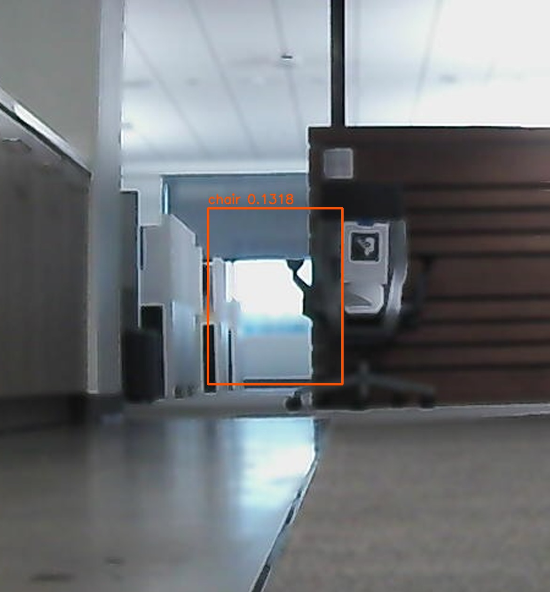
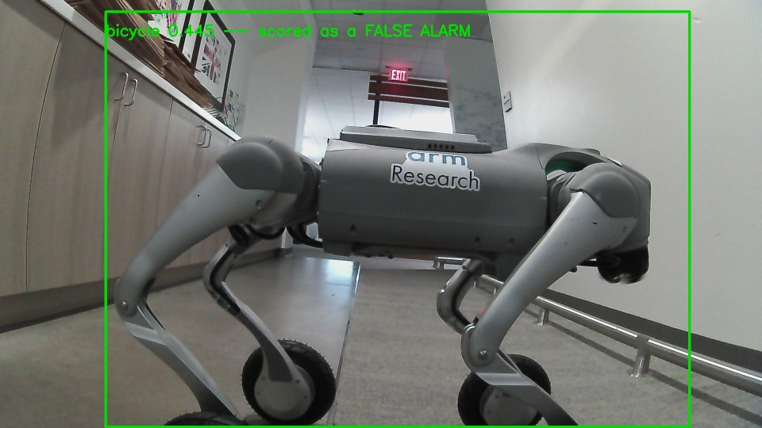
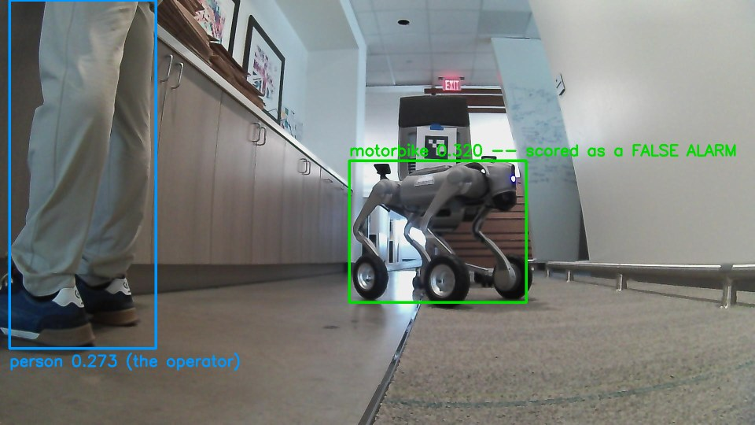
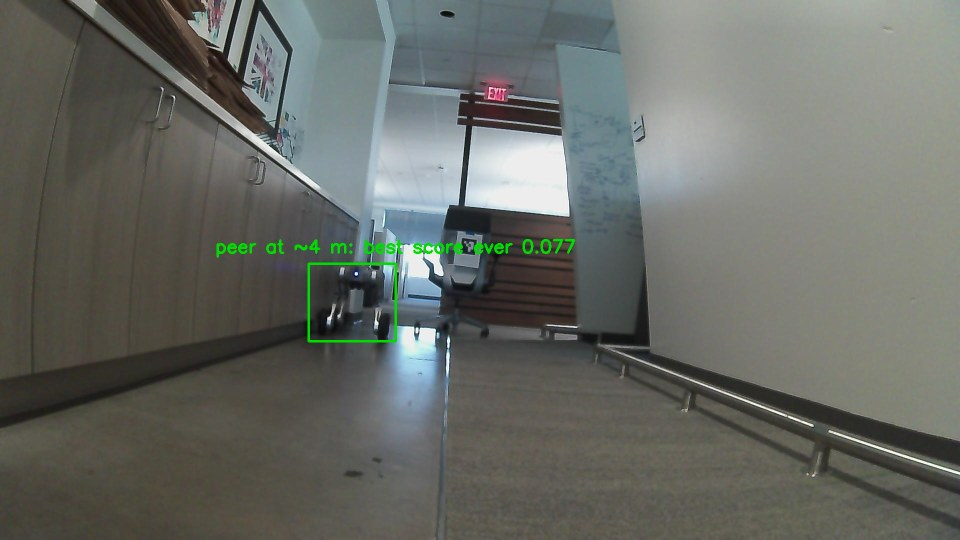

<!--
Copyright (c) 2024-2026, Arm Limited and Contributors. All rights reserved.
SPDX-License-Identifier: Apache-2.0
-->

# 2026-08-25 — the detector's floor was baked into the prototxt, and the false-alarm rate was never real

Two measurements against the 2,800-frame staged peer corpus, using the robot's **own**
weights (`23,147,564` bytes, 127 layers — BatchNorm folded, not a chuanqi305 release) and
the **real** `ObstacleTracker` from `robot-stack/unitree/go2/visual_nav/`.

Reproduce everything with [`detector/peer_recall.py`](../../detector/peer_recall.py); the
full numbers are in [`report.json`](report.json).

## Bottom line

| claim going in | what the measurement says |
| --- | --- |
| "class-agnostic recall is 64%" | Correct **at 0.25** — but 0.25 was a floor nothing could get under. At 0.15 it is **81.2%**, at 0.14 **83.2%**. |
| "false-alarm rate is 18% on peer-free frames" | **Not real.** Every one of those alarms is a correct detection of an unlabelled peer. On genuinely peer-free frames the rate is **0/705 = 0.0%** at every threshold ≥ 0.14. |
| "the peer at ~4 m is invisible" | **Not invisible — it scores up to 0.077.** But it is still unusable, because a backlit doorway in the same corridor scores **0.1318**. No global threshold separates them. |
| "the tracker turns 64% per-frame into ~100% per-track" | **No.** Held to one criterion, the lifecycle adds **+4.7 points** (81.7% → 86.4%) at the operating point. The recall came from removing the floor, not from tracking. |

---

## 1. The floor was real, and the old sweep was one forward pass wearing four hats

`MobileNetSSD_deploy.prototxt` line 1910, inside `DetectionOutput`:

```
confidence_threshold: 0.25
```

Nothing below 0.25 has ever left this network, so every "0.15" row this project has
produced was the 0.25 row. That is now **proved rather than argued**. Two full inference
passes over all 2,800 frames — one at the stock prototxt, one with that single line
changed to `0.05` — then compared box by box:

```
frames compared            : 2800
frames differing at >=0.25 : 0
boxes in HIGH not in LOW   : 0        <-- keep_top_k evicts nothing
boxes in LOW not in HIGH   : 0
total detections, LOW      : 11347
total detections, HIGH     : 2104
```

The edit is **purely additive**: it exposes 5.4x more boxes and changes not one of the
boxes that already existed. That matters beyond bookkeeping — it is what makes the sweep
monotonic *by construction*. The one mechanism by which a lower threshold could have
**reduced** recall is `keep_top_k: 100`, which caps detections across all classes and
could in principle let a flood of new low-scoring boxes evict a high-scoring one. It does
not, because NMS and `keep_top_k` both rank by score. `peer_recall.py verify` is that
check, kept as a permanent guard: a non-monotonic sweep here would be a bug, and without
this it would look like a finding.

### The sweep

Class-agnostic (any VOC label counts — the planner needs a box, not a name), IoU ≥ 0.30,
1,903 labelled frames against **705 genuinely peer-free** frames:

| conf | recall (box ON peer) | false alarm | FA boxes |
| --- | --- | --- | --- |
| 0.05 | **91.1%** | 83.3% | 1720 |
| 0.10 | 86.6% | 38.2% | 271 |
| 0.12 | 85.6% | 3.7% | 26 |
| 0.13 | 84.2% | 0.7% | 5 |
| **0.14** | **83.2%** | **0.0%** | **0** |
| **0.15** | **81.2%** | **0.0%** | **0** |
| 0.20 | 71.6% | 0.0% | 0 |
| **0.25** (shipped) | **64.4%** | 0.0% | 0 |
| 0.40 | 34.6% | 0.0% | 0 |

**There is free recall down there, and it is worth about 17 points.** Dropping the
prototxt floor from 0.25 to 0.15 takes class-agnostic recall from 64.4% to 81.2% with
**zero** measured false alarms across 705 empty-corridor frames. It costs one line of
text, no retraining and no GPU.

0.14 is where the last false alarm disappears, but **0.14 is a fitted number** — it is the
largest false alarm actually observed (0.1318) plus 6%, measured in one corridor under one
lighting condition. 0.15 is the same performance with a little air under it. Below 0.13
the alarms climb fast (3.7% at 0.12, 38% at 0.10), so this is a cliff, not a gentle
trade — the whole usable gain sits in the narrow band 0.14–0.25.

### The separability ceiling

The single highest-scoring detection anywhere in all 705 genuinely peer-free frames:

**`chair` 0.1318**, box `[712, 523, 822, 667]`, in `neg_prone_0236.jpg`.

That number is the hard bound on what lowering the floor can ever buy. No global threshold
admits a peer scoring below 0.1318 without also admitting this object.



**And it is not what the corpus predicted.** `LABELLING.md` warns that "a persistent hard
negative sits in every corridor frame: an office chair with an ArUco marker parked
mid-corridor… it is the thing most likely to generate false positives." That chair is
plainly visible in the crop above — to the **right** of the box, marker and star base and
all — and it is **not** what fired. The detector is firing `chair` on a **blown-out
backlit doorway** further down the corridor. The documented hard negative is innocent;
the corridor's own backlighting is the culprit. I only found this by zooming in on the
pixels — the class name `chair` plus the corpus's own warning made the wrong answer look
obvious.

---

## 2. The 18% false-alarm rate was measuring the peer

`anyclass.py` partitions frames as "in the label file" vs "not in the label file", and
treats everything unlabelled as peer-free. **192 of those 897 unlabelled frames contain
the peer.**

| segment | frames | status |
| --- | --- | --- |
| `neg_prone` | 434 | genuinely empty corridor ✅ |
| `neg_standing` | 271 | genuinely empty corridor ✅ |
| `smoke` | 58 | **peer present**, dropped from the label file |
| `p1b_close_broadside_STANDING` | 134 | **peer present**, never labelled at all |

`smoke` is documented in the corpus's own `LABELLING.md` — "a byte-for-byte duplicate
*viewpoint* of peer01… smoke_\* and peer01_\* even show the peer in the same place",
dropped "as instructed". `p1b_close_broadside_STANDING` is not mentioned in `LABELLING.md`
anywhere. Both were confirmed by looking at the pixels:




The detections in those frames land squarely on the peer. Median firing box in `smoke` is
`[885, 408, 1337, 769]`; the `peer01` label box, same viewpoint, is `[852, 403, 1332,
778]`. In `p1b` the median box is `[285, 55, 1728, 1074]` against `p1`'s label `[232, 0,
1783, 1042]`.

`smoke` is worse than mislabelled peer frames alone: the human operator is standing in
shot, and the detector calls him `person` at 0.273. So a frame in the "peer-free" set is
scoring **two** correct detections — a robot and a person — as false alarms, and one of
them is the safety-critical class.

So the reported false-alarm rate was not merely inflated — **it was entirely this**:

| conf | FA over all 897 unlabelled | FA over the 705 real negatives |
| --- | --- | --- |
| 0.15 | 20.8% | **0.0%** |
| 0.25 | 17.7% | **0.0%** |
| 0.40 | 10.4% | **0.0%** |

The empty corridor produces **zero** detections above 0.14, in 705 frames. That is
consistent with the figure already in `detector/README.md` from a different room ("139
frames of an empty office — ZERO false positives all the way down to 0.2").

---

## 3. Is the ~4 m peer invisible, or merely under 0.25?

**Merely under 0.25 — and still not usable.** Per staged position, IoU ≥ 0.30:

| segment | n | @0.05 | @0.15 | @0.25 | best score ever on the peer |
| --- | --- | --- | --- | --- | --- |
| `p1_close_broadside` | 97 | 100% | 100% | 100% | 0.984 |
| `p2_close_headon_stand` | 98 | 100% | 100% | 98% | 0.928 |
| `p3_close_rearon_stand` | 133 | 100% | 100% | 100% | 0.707 |
| `p4_mid_sweep_stand` | 208 | 46% | 23% | 12% | 0.854 |
| **`p5_1_far_left_stand`** | 109 | **47%** | **0%** | **0%** | **0.077 — below the ceiling** |
| `p5_23_far_centre_then_right_stand` | 206 | 100% | 62% | 0% | 0.259 |
| `p6_1_trunc_left_stand` | 140 | 100% | 100% | 77% | 0.423 |
| `p6_2_trunc_right_stand` | 136 | 100% | 100% | 89% | 0.427 |
| `p6_3_trunc_half_left_stand` | 136 | 100% | 100% | 99% | 0.731 |
| `peer01` | 640 | 100% | 98% | 80% | 0.760 |

`p5_1` is the ~4 m case: its label box is 174 x 155 px, which the size prior ranges to
3.35 m at a 0.40 m trunk height and 4.60 m at 0.55 m — bracketing the operator's "about
4 m".

The peer there **is** in the logits: at 0.05 it is found in 47% of frames. But its best
score across all 109 frames is **0.077**, against a false-alarm ceiling of **0.1318**. The
strongest evidence the network ever produces for a peer at 4 m is 1.7x *weaker* than its
strongest evidence for an empty backlit doorway. **No global confidence threshold
separates them**, so this is not a threshold problem and lowering the floor does not fix
it.



Note *why*, because it is not range alone: `p5_23` sits at essentially the same distance
(180 x 158 px, 3.26 m / 4.49 m) and reaches 0.259, giving 62% recall at 0.15. The
difference is photometric — `LABELLING.md` describes `p5_1` as "backlit through a glass
door, the robot is a dark silhouette against a dark bench". The far peer and the
ceiling-setting false alarm are the **same kind of object to this network**: a
low-contrast silhouette against this corridor's blown-out doorway. (Each segment was shot
from a different camera pose — phase correlation between segment first-frames shifts by
48–162 px at response ≤ 0.03 — so these are the same corridor, not the same viewpoint.)

`p4_mid_sweep_stand` is the other weak segment, and for a related reason: through it the
peer's best class-agnostic score hovers near 0.07–0.085 while a **static chair in the same
frames scores 0.20–0.26**. The corridor furniture outscores the robot.

---

## 4. Track level: the lifecycle helps, but it is not where the recall came from

Scored through the real `ObstacleTracker`, with the confirm/coast lifecycle exactly as
shipped (`CONFIRM_HITS=2`, `MAX_MISSES=4`, `COAST_TIMEOUT_S=3.0`).

**The comparison is held to one criterion.** Track matching has to be done on bearing —
39% of these boxes touch a frame border, so their range comes from `width-capped` or
`frame-fill`, which are *constants*, and reprojecting a track into pixels would fold the
size prior's scale error into the score. Bearing does not depend on the prior. But bearing
is looser than IoU ≥ 0.30, so it is applied **per frame as well**; otherwise the
frame→track comparison changes the lifecycle and the criterion at once and credits the
tracker with the difference.

| conf | per-frame | per-track | lifecycle gain | median simultaneous tracks on the one peer | max |
| --- | --- | --- | --- | --- | --- |
| 0.05 | 94.5% | 95.7% | +1.2 | **4.0** | 8 |
| 0.10 | 87.5% | 88.8% | +1.3 | 2.0 | 6 |
| **0.15** | **81.7%** | **86.4%** | **+4.7** | 2.0 | 5 |
| 0.25 | 64.7% | 72.9% | +8.2 | 1.0 | 4 |

Three things follow.

**The tracker does not rescue recall.** 64% → ~95% is real, but the decomposition is
mostly the threshold: removing the floor moves per-frame recall 64.7% → 94.5%, and the
lifecycle adds 1.2 more. At the shippable operating point (0.15) the lifecycle is worth
+4.7 points. Useful, not transformative. The reason is structural and worth saying
plainly: **this corpus is static**, so a confirm/coast lifecycle has almost nothing to do.

**One peer arrives as several obstacles.** At 0.05 the median number of *simultaneous
confirmed tracks* sitting on the single physical peer is **4**, peaking at 8; at 0.15 it is
2, peaking at 5. The planner is handed four obstacles where there is one robot.

I expected the cause to be the association gate's label check — `_associate` refuses to
match an observation to a track of a different label, and a class-agnostic stream flips
between `person`, `chair`, `bicycle`, `motorbike`, `aeroplane` and `horse` on the same
object. **That guess was wrong.** Collapsing every label to one name changes recall by
half a point (86.4% → 86.9%) and leaves the multiplicity *identical* (median 4 at 0.05,
still 8 at peak). It only trims the confirmed-track count 89 → 74. The real cause is
metric: overlapping boxes of different sizes on one object produce different size-prior
*ranges*, so they land at different odom positions and fail the Mahalanobis gate whatever
they are called. A one-line label fix would not have fixed this.

**Where tracking does earn its keep is motion.** `p4_mid_sweep_stand` is the only segment
with real target movement (ground-truth `x0` sweeping 157 → 1308 over 208 frames):

| conf | per-frame | per-track | gain |
| --- | --- | --- | --- |
| 0.05 | 51% | 65% | **+14** |
| 0.15 | 27% | 36% | +9 |
| 0.25 | 15% | 22% | +7 |

Three times the lifecycle gain of the static segments. This is the one number here that
generalises toward a walking robot, and it rests on 208 frames.

### Correlated vs uncorrelated false alarms — and coast making it worse

This is what only track-level scoring can show.

| segment | conf | frames w/ detection | frames w/ **confirmed track** | confirmed ids | longest-lived |
| --- | --- | --- | --- | --- | --- |
| `neg_prone` | 0.05 | 99% | 99% | 18 | 99% of segment |
| `neg_standing` | 0.05 | 58% | **93%** | 5 | 69% |
| `neg_prone` | 0.10 | 62% | **89%** | 7 | 39% |
| `neg_standing` | 0.10 | 1% | 0% | 0 | — |
| `neg_prone` | **0.15** | **0%** | **0%** | **0** | — |
| `neg_standing` | **0.15** | **0%** | **0%** | **0** | — |

At the operating point this is a clean zero: no detections, so no phantom tracks, in 705
frames. **But look at what happens below it.** In `neg_standing` at 0.05, only 58% of
frames contain a detection — yet **93%** carry a confirmed track. In `neg_prone` at 0.10,
62% of frames become 89%.

The coast logic is *filling in the gaps*. Against an uncorrelated false alarm that is
exactly right — the phantom never accumulates two associated hits and never confirms. But
against a **correlated** one it runs the wrong way: the longest-lived phantom in
`neg_prone` holds a bearing of **+8.5° with a spread of 0.5°** for 430 of 434 frames. It
satisfies every premise the lifecycle relies on, so confirm admits it and coast *extends*
it, turning an intermittent false alarm into a continuous obstacle. No tuning of
`CONFIRM_HITS` or `MAX_MISSES` removes that; it is a real object being read as the wrong
class.

That asymmetry is the actual argument for keeping the threshold at 0.15 rather than
chasing the last 10 points of recall at 0.05.

---

## 5. What could not be measured here, and what would settle it

**These are staged stills, not walking footage, and that limits Measurement 2 much more
than Measurement 1.** Ten of the eleven labelled segments are rigid-static: the peer does
not move and neither does the camera robot (`LABELLING.md`: worst-case global phase
correlation against frame 0 is 1.5 px, and exactly 0.0 px for three segments). The tracker
was therefore run at a **fixed pose** — measured, not assumed — and the consequence is
that the track-level numbers exercise the confirm/coast lifecycle and the association gate
**only**. Specifically **not** exercised:

* **The constant-velocity motion model.** Every track's true velocity is zero, so the
  filter's ability to extrapolate a moving peer is untested. `p4` is the one segment that
  moves, and 208 frames of one crossing is a hint, not a result.
* **Odom-frame ego-motion cancellation**, which the tracker's docstring calls the whole
  reason the module exists. It cannot fail when the robot does not move. A turning robot
  is precisely where body-frame differencing would inject phantom velocity.
* **`is_visible` coasting.** Nothing leaves the field of view, so the out-of-shot branch
  never runs. (The range gate at least did not silently disable miss-counting: at 0.15,
  **zero** observations exceeded `max_range_m=6.0`, so unmatched tracks really were
  penalised.)
* **Motion blur, rolling shutter and changing backlight** on a peer being tracked while
  both robots walk — the conditions under which the far-peer contrast problem in §3 would
  get worse, not better.

**What would settle it: one recorded walk-past.** Both robots moving, the peer crossing
from ~4 m to ~1 m and out of frame, with the navigator's own pose logged per frame. That
single clip would test all four items above and would make the `p4` column into a real
measurement.

Two further caveats on the numbers as they stand:

* **The metric scale is a stated prior, not a measurement.** `0.40 x 0.31 m` for the peer.
  The corpus records no ranges, and "about 4 m" is a verbal estimate. Every range in
  `report.json` is proportional to it. The *recall* numbers do not depend on it at all
  (bearing and IoU are both prior-free); the phantom-track ranges do.
* **`SizePrior.of_height` is wrong for a quadruped and this is a live deployment bug, not
  just a scoring detail.** It fills width in from a *person's* aspect ratio (0.50/1.70),
  giving 0.118 m for a 0.40 m robot against a real body width nearer 0.31 m — and a
  broadside length nearer 0.70 m. Width is what ranges a vertically-clipped box, and 39%
  of this corpus's boxes touch a frame border, so on the close segments it reports the
  peer at 0.09–0.14 m. That is inside the robot. This script passes width explicitly to
  sidestep it; `person_detector` still has it.

## Reproducing

```bash
# 1. the one-line prototxt edit
sed 's/confidence_threshold: 0.25/confidence_threshold: 0.05/' \
    MobileNetSSD_deploy.prototxt > proto_t005.prototxt

# 2. one cached forward pass per prototxt (~30 s each for 2800 frames)
python3 detector/peer_recall.py cache --prototxt proto_t005.prototxt \
    --weights MobileNetSSD_deploy.caffemodel --frames $CORPUS --out cache_t005.json
python3 detector/peer_recall.py cache --prototxt MobileNetSSD_deploy.prototxt \
    --weights MobileNetSSD_deploy.caffemodel --frames $CORPUS --out cache_t025.json

# 3. prove the edit is purely additive (the monotonicity guard)
python3 detector/peer_recall.py verify --low cache_t005.json --high cache_t025.json

# 4. frame- and track-level scoring
python3 detector/peer_recall.py score --cache cache_t005.json --labels $LABELS \
    --root $CORPUS --visual-nav robot-stack/unitree/go2/visual_nav \
    --camera go2_front_camera.json --out report.json
```

Needs `cv2` with `readNetFromCaffe` — **OpenCV 4.x only**; 5.x dropped it.
