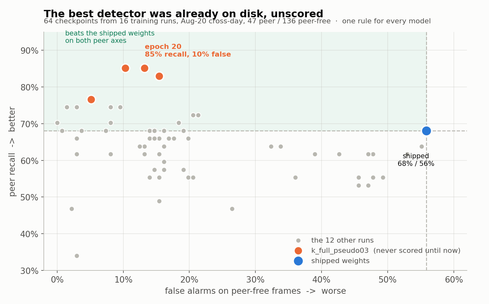
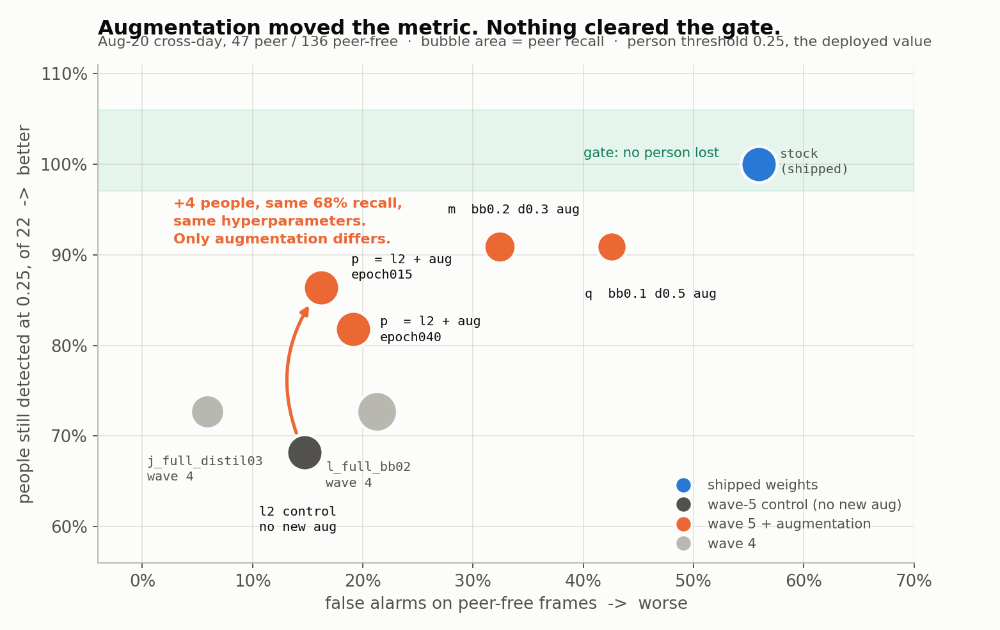

<!--
Copyright (c) 2024-2026, Arm Limited and Contributors. All rights reserved.
SPDX-License-Identifier: Apache-2.0
-->

# 2026-08-26 — the best detector was already on disk, and nobody had scored it

Sixteen training runs x 40 epochs = **640 checkpoints**. **Thirteen model/epoch rows had ever
been scored** — the thirteen
[#91](https://github.com/armwaheed/mappo-arm-cloud-physical-ai/pull/91) rescored when it
repaired the split, one of which is the shipped model itself. So at least **627 of the 640 had
never been evaluated**, and a fifth training wave was started before they were. When 64 of them
finally were, the best detector in the whole set turned out to be sitting in a run **no document
in this repository had ever named**.

That is the finding. It is about order of work, not about weights.

Check it against the tree: of the sixteen run names below, `git grep` finds four —
`f_full_distil01`, `i_full_pseudo`, `j_full_distil03`, `l_full_bb02`. The other twelve,
including the winner, appear nowhere on `main` before this directory.



> ⚠️ **Two things about that figure, which is committed as generated and not regenerated
> here.** Its legend says *"the 12 other runs"*; the plot draws **15** other runs (60 grey
> points plus 4 orange is the 64 in the title). The 12 is the wave-1-to-4 run count, left in a
> hard-coded label after wave 5 added four more. And the point it annotates as the winner,
> `epoch 20` at 85%/10%, is the best of the four *coarse* epochs it plots — the 89% row in the
> table below comes from a finer pass over the winning run, which this figure does not show.

## What was scored, and how

Every model — shipped and candidate alike — through the deployed `cv2.dnn` path at the
prototxt's own `confidence_threshold: 0.25`, on the **Aug-20 cross-day held-out split**:
**47 peer-present frames and 136 peer-free**, none of them trained on.

**One rule for every model: a frame counts as a fire if any detection at >= 0.25 has box
aspect h/w < 2.0.** That is *not person-shaped*, which is what the deployed stack routes to
the policy as an obstacle rather than holding for (`person_detector.PERSON_ASPECT_MIN`,
[#73](https://github.com/armwaheed/mappo-arm-cloud-physical-ai/pull/73)). The column is
therefore the thing the robot would actually do, not a detector statistic.

**`people` counts, of the 22 frames where the *shipped* network sees a person at 0.25, how
many the candidate still sees.** 0.25 is the value the peer runs are launched with —
`deploy/run-peer-supervised.sh:87`, and both 2026-08-25 peer telemetry files. It is **not**
the 0.45 the three `detector/` pages quote; 0.45 is the older bin-and-person work's value,
and at 0.25 the denominator grows from 15 frames to 22, which makes "keep all of them"
strictly harder rather than easier.

### The denominators, checked against the manifest in this repository

`detector/labels/peer_crossday_20260820.json` holds 284 frames. Counting them by split:

| split | peer present | peer absent | ambiguous (`present: null`) |
| --- | ---: | ---: | ---: |
| `select` | 13 | 85 | 1 |
| **`test`** | **47** | **136** | 2 |

So 47 / 136 is the manifest's own test split, and the **134** that three `detector/` pages
still quote was the derived split on the training host, shifted by one frame —
[#91](https://github.com/armwaheed/mappo-arm-cloud-physical-ai/pull/91) found it, repaired
it, and rescored all thirteen rows: every numerator identical, the shipped weights' false
alarms moving 76/134 = 57% to **76/136 = 56%**. This sweep is scored on the repaired 136, so
its shipped row reads 56% where the older tables read 57%. Nothing else moves.

⚠️ The 22-frame person denominator has no such check. It was computed on the Spark against
the shipped weights and **cannot be re-derived from a clone** — the corpus pixels are not in
this repository. It is recorded here as attributed.

## The result

| model | peer recall | false alarms | people |
| --- | ---: | ---: | ---: |
| **stock 21-class — what ships today** | 68% (32/47) | **56%** (76/136) | **22/22** |
| `k_full_pseudo03` ep022 | **89%** | 12% | 17/22 |
| `k_full_pseudo03` ep020 | 85% (40/47) | 10% (14/136) | 17/22 |
| `k_full_pseudo03` ep017 | 83% | 12% | **19/22** |
| `k_full_pseudo03` ep010 | 77% (36/47) | 5% (7/136) | 18/22 |
| `p_bb02_d01_aug` ep020 | 70% (33/47) | 18% (25/136) | **19/22** |
| `l_full_bb02` ep040 | 72% (34/47) | 21% (29/136) | 16/22 |
| `f_full_distil01` ep020 | 74% (35/47) | **1%** (2/136) | 5/22 |

**13 of the 64 scored checkpoints beat the shipped weights on both peer axes** — recall
higher *and* false alarms lower. That count is re-derivable from `sweep_all.json` beside this
file and comes out at exactly 13.

**All 64 beat it on false alarms alone.** The shipped weights are the worst of the 65 models
on that axis, by a margin: 56% against a candidate range of 0% to 55%.

> ⚠️ **Two rows above are not in `sweep_all.json`, and a third disagrees with it.**
>
> * **ep022 and ep017 are not there.** That file is the coarse pass — epochs 10/20/30/40 of
>   all sixteen runs, 64 rows, which is where the "64 scored checkpoints" count comes from. The
>   two odd epochs come from a finer pass over the winning run alone, made on the Spark
>   afterwards. The 89%/12%/17 row is independently quoted in the wave-6 launch script's own
>   header comment; it is attributed here, not verified from this repository.
> * **`f_full_distil01` ep020 keeps 5 of 22, not 4.** The published table says 4.
>   `sweep_all.json` says 5, and says 4 for that run's **ep010** — which looks like a
>   transcription slip of one row. One frame of 22. The 5 is what the archived data supports
>   and is what this page states.

### The whole 64, so the eight rows above can be read against what they were picked from

`peer recall / false alarms / people kept`, **bold** where the checkpoint beats the shipped
weights on both peer axes:

| run | ep010 | ep020 | ep030 | ep040 |
| --- | --- | --- | --- | --- |
| `a_careful` | 62% / 53% / 19 | 55% / 49% / 19 | 53% / 47% / 18 | 53% / 46% / 18 |
| `b_limit` | 34% / 3% / 1 | 47% / 2% / 3 | 66% / 3% / 6 | 68% / 4% / 6 |
| `c_trunk_frozen` | 47% / 26% / 10 | 55% / 20% / 6 | 57% / 19% / 6 | 57% / 19% / 6 |
| `d_conv5_distil1` | 62% / 53% / 19 | 55% / 48% / 19 | 53% / 46% / 18 | 55% / 46% / 18 |
| `e_conv5_distil01` | 49% / 15% / 8 | 55% / 14% / 7 | 62% / 15% / 7 | 66% / 15% / 6 |
| `f_full_distil01` | **74% / 3% / 4** | **74% / 1% / 5** | **70% / 0% / 5** | 68% / 1% / 5 |
| `g_trunk_pseudo` | 55% / 20% / 18 | 57% / 16% / 18 | 55% / 15% / 18 | 60% / 16% / 18 |
| `h_conv5_pseudo` | 55% / 21% / 19 | 57% / 15% / 16 | 66% / 14% / 15 | 68% / 16% / 16 |
| `i_full_pseudo` | **74% / 10% / 10** | **74% / 8% / 11** | **70% / 8% / 12** | 68% / 7% / 12 |
| `j_full_distil03` | 62% / 3% / 14 | 62% / 8% / 15 | 64% / 13% / 14 | 64% / 12% / 14 |
| **`k_full_pseudo03`** | **77% / 5% / 18** | **85% / 10% / 17** | **83% / 15% / 18** | **85% / 13% / 17** |
| `l2_bb02_d01_control` | 62% / 13% / 20 | 66% / 15% / 17 | 68% / 14% / 15 | 68% / 15% / 15 |
| `l_full_bb02` | 66% / 17% / 19 | 66% / 18% / 15 | **72% / 21% / 16** | **72% / 21% / 16** |
| `m_bb02_d03_aug` | 62% / 39% / 20 | 55% / 36% / 20 | 64% / 34% / 20 | 64% / 32% / 20 |
| `p_bb02_d01_aug` | 64% / 16% / 20 | **70% / 18% / 19** | 66% / 20% / 19 | 68% / 19% / 18 |
| `q_bb01_d05_aug` | 64% / 55% / 20 | 62% / 48% / 20 | 62% / 47% / 20 | 62% / 43% / 20 |

## The lever is `--pseudo-labels`, and nobody had swept it

`k_full_pseudo03` is the **only run of the sixteen at `--pseudo-labels 0.3`**. Every other
run used 0.5, or carried no old-class labels at all. That is asserted by the wave-6 launch
script, and it is corroborated inside this repository: `detector/UNFROZEN-FINE-TUNE.md`'s
old-class-labels table lists nine configurations and exactly one of them carries the 312 boxes
that 0.3 produces, against 209 for every 0.5 row.

The mechanism is already written down one directory up, in `UNFROZEN-FINE-TUNE.md`'s section
*Fine-tuning on a one-class corpus teaches the network that people are background*: the
threshold decides how many of the starting network's own confident detections are carried
into training as old-class ground truth, and nearly all of them are `person`. **Lower
threshold, more `person` supervision** — which is the one axis every run in this sweep failed
on. That page already measured 0.5 to 0.3 as worth five `person` detections and two points of
new-class recall, and called it *"the single most effective knob in this work"*. It was right
and the knob was never turned again.

Wave 6 sweeps 0.1 / 0.2 / 0.3 and is running as this is written. **No conclusion about its
outcome is recorded here, and none should be until it has numbers.**

## Augmentation, measured against a contemporaneous control

`l2_bb02_d01_control` and `p_bb02_d01_aug` share every hyperparameter — `--backbone-lr-scale
0.2 --pseudo-labels 0.5 --distil 0.1`, 40 epochs, same corpus, same batch size — and differ
in exactly three augmentations no earlier wave ran: **motion blur, sensor noise, and
compositing the peer onto a peer-free frame.**

`l2` is a control run *in the same wave*, not a citation of an earlier run's numbers, and it
had to be: the new operators call `rng.random()` even at probability 0, so the RNG stream
shifted and `l_full_bb02` is no longer byte-reproducible under wave-5 code. This project has
been burned by recorded baselines before; a re-run control is a different and much stronger
claim than a table lookup.



**Epoch-matched, from `sweep_all.json`:**

| epoch | `l2` control | `p` = control + 3 augmentations | Δ people |
| ---: | --- | --- | ---: |
| 010 | 62% / 13% / **20** | 64% / 16% / **20** | 0 |
| 020 | 66% / 15% / 17 | 70% / 18% / 19 | +2 |
| 030 | **68%** / 14% / 15 | 66% / 20% / 19 | +4, but 2 points of recall lower |
| 040 | **68%** / 15% / 15 | **68%** / 19% / 18 | **+3 at identical recall** |

⚠️ **The published figure's arrow says +4 at identical 68% recall, and it compares `l2`
epoch040 against `p` epoch015** — both at 68% peer recall, but not the same epoch, and
epoch015 is not in the coarse sweep. Epoch-matched, the same claim is **+3** (15/22 to
18/22). Both are true statements about the same pair of runs; the epoch-matched one is the
conservative one, and it is the one to quote. The direction is not in doubt — the augmented
run keeps more people at every epoch from 020 on — and it costs 3 to 6 points of false-alarm
rate throughout.

### The composite stands the peer on a fitted ground plane

Pasting the peer at a random row produces robots floating at head height, whose only
learnable feature is the rectangle itself. The row is fitted from the corpus instead:

```
contact_row = 0.472 x box_height + 0.585        r2 = 0.702, n = 1,256
```

Both in fractions of frame height. **This is the one number on this page that can be
re-derived from a clone**, because the boxes — though not the pixels — are committed:

```sh
python3 - <<'EOF'
import json
H = 1080
r = json.load(open("detector/labels/peer_go2wheel_20260824.json"))["records"]
# "unclipped" is the BOTTOM edge only: a box clipped left or right still has a
# visible contact row, and a box clipped at y2 does not.
b = [rec["box"] for rec in r if rec["box"][3] < H]
x = [(v[3] - v[1]) / H for v in b]; y = [v[3] / H for v in b]
n = len(x); mx = sum(x) / n; my = sum(y) / n
m = sum((a - mx) * (c - my) for a, c in zip(x, y)) / sum((a - mx) ** 2 for a in x)
c0 = my - m * mx
sse = sum((c - (m * a + c0)) ** 2 for a, c in zip(x, y))
sst = sum((c - my) ** 2 for c in y)
print(f"contact_row = {m:.3f} x box_height + {c0:.3f}   r2 = {1 - sse / sst:.3f}, n = {n:,}")
EOF
```

which prints `contact_row = 0.472 x box_height + 0.585   r2 = 0.702, n = 1,256`.

⚠️ **The 1,256 is the count of boxes whose bottom edge is inside the frame, not the count of
whole robots.** 744 of the 1,903 labelled boxes touch some frame edge and only 1,159 touch none —
a peer close enough to matter is usually clipped — but a box clipped at the left or right margin
still carries a usable contact row, and one clipped at `y2` does not.
Taking the stricter "touches no edge" set instead gives a materially different line —
`0.760 x box_height + 0.500`, r2 = 0.754, n = 1,159 — so the definition is load-bearing and
is stated rather than implied.

## ⛔ Nothing here is deployable, and the last column is the reason

This robot's shipped safety property is **gives way to people**. It is the behaviour in the
hero run at the top of the repository README, and it is the one thing the peer work must not
cost.

**No checkpoint of the 64 keeps all 22.** The best is 20 of 22, reached by ten rows across
four runs — and *every one of those ten is below the shipped weights' 68% peer recall*, at
55% to 64%. The set of checkpoints that beat the shipped weights on both peer axes and keep
at least 20 people is **empty**.

The best peer row on the table, `k_full_pseudo03` ep022, keeps 17 of 22 — it loses **five**
people. The published summary of this sweep says the best candidate "still loses 3"; that is
ep017, at 19/22, which is a different and lower-recall checkpoint. Both are stated above; the
gate is cleared by neither.

**A checkpoint that finds more peers and drops a person is not an improvement to a stack
whose first job is not to walk into someone.**

The gate is unchanged in kind and larger in size: **lose none of the 22 people the shipped
network sees at 0.25** — restated from the 15-at-0.45 in the three `detector/` pages, because
0.25 is what the peer runs launch with.

## ⚠️ Read the denominators before quoting any of this

**47 positives and 136 negatives, one corridor, one held-out day.** This project has been
burned three times by evidence sets too small and too like themselves — the refusal gate's
0 of 705 same-session negatives, the fifteen stills of which nine held no peer, and the
47-positive ranking in `UNFROZEN-FINE-TUNE.md` — and each time the set flattered the thing
being tested.

What this sweep is good for is the comparison it makes: **65 models, one rule, the same
frames, the same day, the same code path.** It is not a claim about buildings in general, and
a two-point difference between two rows is inside its noise. The result that survives that
caveat is the one at the top of this page, and it is not a number about a model.

## Provenance — what is here, and what a clone cannot re-derive

| | where it lives | reachable from a clone? |
| --- | --- | --- |
| the 64 coarse rows | `sweep_all.json`, beside this file | **yes** |
| both figures | beside this file, committed as generated | **yes** |
| the cross-day split | `detector/labels/peer_crossday_20260820.json` | **yes** |
| the ground-plane fit | `detector/labels/peer_go2wheel_20260824.json` | **yes**, command above |
| the 640 checkpoints | `arm-seattle-spark-02:~/ssdft/runs/` | no |
| 18 published checkpoints | Hugging Face `armwaheed/go2-peer-detector` | no — reported not public |
| the 2,800 corpus JPEGs | `arm-seattle-spark-02:~/go2-peer-dataset-20260824/` | no |
| the corpus archive | Hugging Face dataset `armwaheed/go2-peer-detection` | no — reported not public |
| `sweep_all.py`, `wave5_eval.py` | `arm-seattle-spark-02:~/`, archived under `reproduce/` in the Hugging Face model repository above | **no — neither script is in this repository** |
| the wave launch scripts | `arm-seattle-spark-02:~/run_wave5.sh`, `~/run_wave6.sh`, also under `reproduce/` | no |

**Neither scoring script is in this repository, and a reader has to be told where to look.**
`sweep_all.py` produced `sweep_all.json`; `wave5_eval.py` produced the points in the wave-5
figure, which are hand-entered into the plotting script rather than read from a data file —
so that figure has no archived data file behind it, and its four non-coarse epochs (`p` ep015,
`j_full_distil03` ep015) cannot be checked against one. Both scripts live on the Spark and are
reported to be archived under `reproduce/` in the Hugging Face model repository. **That
location is attributed, not verified** — see the 401 below.

⚠️ **Both Hugging Face repositories returned HTTP 401 to an unauthenticated request while
this was written**, which is what Hugging Face returns for a private repository *and* for one
that does not exist. `detector/labels/peer_go2wheel_20260824.json` already records the
dataset as *"NOT public, so it could not be verified from outside this repository"*. The
model repository is recorded here on the same terms: **attributed, not verified.**

⚠️ **`sweep_all.json` is committed exactly as the Spark wrote it** — no added provenance
block, so it can be diffed byte-for-byte against the copy on the training host. Everything
that would normally go in such a block is on this page instead. That is the opposite of the
choice `detector/labels/`'s manifests make, and it is deliberate: a manifest is *read* by a
script and has to carry its own locations, and this file is read by a person who is already
here.

## Continues in

* [#77](https://github.com/armwaheed/mappo-arm-cloud-physical-ai/issues/77) *Still open* item
  1 — "the wave-5 result is unwritten" — is what this directory closes, and item 2, the
  22-frame retention denominator, is recorded here as attributed rather than verified.
* Wave 6, running: `--pseudo-labels` 0.1 / 0.2 / 0.3, augmentation on, with a paired control
  on the winner's configuration. No result.
