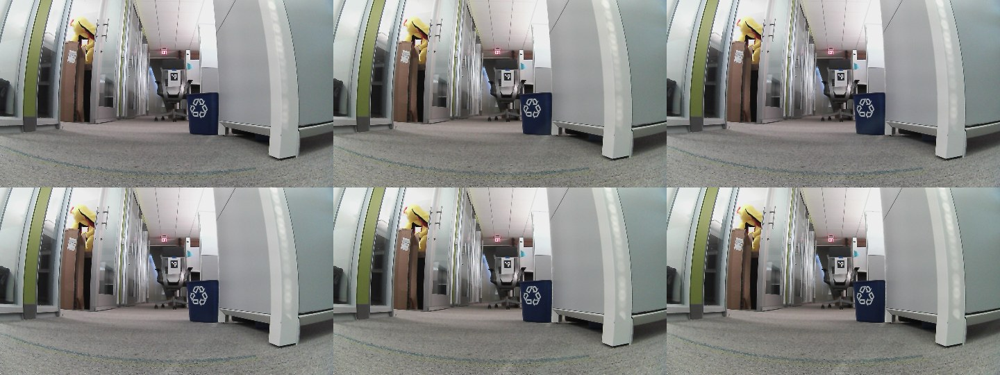

<!--
Copyright (c) 2024-2026, Arm Limited and Contributors. All rights reserved.
SPDX-License-Identifier: Apache-2.0
-->

# 2026-08-26 — the candidate detector was ranked against a baseline the robot does not run

`s_pseudo02_aug/20` is the best peer detector this project has produced and it should
**not** ship. The reason is not its peer numbers, which are good. It is that the baseline
those numbers beat was measured at **300 px**, and the peer runs this repository reports
execute at **224 px** — and at 224 the shipped detector is a different detector.

Reproduce every number below:

```bash
python3 reproduce.py --model-dir ~/go2_models     # cross-day + live
python3 reproduce.py                              # live only, no weights needed
```

The first form recovers the clips and decodes them into `_reproduce/` — about 30 MB,
git-ignored here, and re-derivable from the commit named at the bottom of this page. The
second needs no weights, no robot and no network. **OpenCV 4.x**: OpenCV 5 removed
`readNetFromCaffe`, and the robot runs 4.2.

## The number that decides it

The shipped MobileNet-SSD, on the 2026-08-20 cross-day held-out day, one rule, one
process, one weights file. **The only thing that changes between the rows is the square
the frame is squashed into.**

| shipped weights, whole held-out day | peer recall | false alarms | people held |
| --- | ---: | ---: | ---: |
| **at 300 px** — what every scorer in `detector/` uses | 41/60 = **68%** | 108/221 = **49%** | 32 |
| **at 224 px** — what `run-peer-supervised.sh` launches | 30/60 = **50%** | 57/221 = **26%** | **25** |

The candidate is quoted as *"+12 points of recall at a 4.5x lower false-alarm rate"*. Both
halves of that are differences against the 300 px row. Against the row the robot actually
runs, 80% recall is **+30 points**, and 11% false alarms is **2.4x** lower, not 4.5x — and
neither figure has ever been measured, because **no candidate checkpoint has ever been
scored at 224.**

That is the whole finding. It is not that the candidate is bad. It is that the margin it
was selected on was measured through a preprocessing path production does not use, so the
ranking of 94 checkpoints does not transfer, and neither does the gate.

## Where the 224 comes from, and why it was missed

[`deploy/run-peer-supervised.sh`](../../deploy/run-peer-supervised.sh) is the script that
launches the peer runs. Two of its lines matter here:

```
80:  --input-size 224
87:  --confidence 0.25
```

`evidence/2026-08-26-checkpoint-sweep/README.md` cites **line 87** by name — *"0.25 is the
value the peer runs are launched with — `deploy/run-peer-supervised.sh:87`"* — and takes
the confidence from it. It does not read **line 80**, seven lines above. The sweep took one
inference parameter from the launch script and left the other at the scorer's default.

The script's own comment on line 77 says why 224 is there, and it is not a rounding choice:

> `224 rather than 300: measured 12/12 detections of this peer against 2/12 at 300, and
> faster. Non-monotonic in input size, which is a marginal-detection smell — do not read it
> as a rule.`

So the effect was known to be large and known to be non-monotonic. On that clip 224 was
**6x better** than 300 on the peer; on the cross-day day measured here it is **18 points
worse**. Both are true. That is what non-monotonic means, and it is exactly why a number
measured at one size cannot be quoted at the other.

⚠️ **The telemetry cannot tell you which size produced a run.** Both 2026-08-25 peer
telemetry headers record `"confidence": 0.25` and the full 20-class `classes` list — which
is how they were matched to this launch script — and **neither records the input size at
all**. A run's own record is silent on half of its preprocessing.

## Was the preprocessing otherwise matched? Yes

Everything except the square is identical, and that is worth stating so the one difference
is not lost in a list of suspicions.

| | `detector/` scorers | `person_detector.py` (production) |
| --- | --- | --- |
| scale | `1.0 / 127.5` | `_SSD_SCALE = 1.0 / 127.5` |
| mean | `127.5` | `_SSD_MEAN = 127.5` |
| colour order | `blobFromImage` default, no `swapRB` → **BGR** | same call, same default → **BGR** |
| score floor | prototxt `confidence_threshold: 0.25` | same file, same layer |
| **input size** | **`INPUT_SIZE = 300`** | **`--input-size 224`** |

`eval_class_agnostic.py`, `eval_detector.py`, `ssd_torch.py`, `train_new_class.py` and
`finetune_ssd.py` all hardcode `INPUT_SIZE = 300`; `peer_recall.py` hardcodes the literal
`(300, 300)`. So the training pipeline, the scoring pipeline and the published tables are
all 300, coherently — and all of them are one number away from production.

## Is the eval set contaminated? No — and this is the part that holds up

**The eval is genuinely cross-day, and the check is cheap.** Training is the Aug-24 corpus;
evaluation is seven clips shot on Aug-20.

| | training | evaluation |
| --- | --- | --- |
| images | `~/go2-peer-dataset-20260824` | seven clips recorded 2026-08-20 |
| labels | `peer_go2wheel_20260824.json` | `detector/labels/peer_crossday_20260820.json` |
| negatives | `$D/neg_*.jpg`, i.e. Aug-24 | the peer-free frames of the same seven clips |

`run_wave6.sh` passes `--images "$D"` and `--negatives-glob "$D/neg_*.jpg"` with
`D=$HOME/go2-peer-dataset-20260824`, and names no other image source. **No Aug-20 pixel
enters training.** The splits are by clip rather than at random, which matters at 7 fps
where neighbouring frames are near-duplicates.

⚠️ **One step of that is inference, not inspection.** `--composite 0.3` is the augmentation
that would be the leak, because it pastes the peer onto a peer-free frame — and the flag does
not exist in `detector/finetune_ssd.py` on `main`, so which directory it draws backgrounds
from cannot be read from this repository. The launch script gives the trainer exactly two
image sources and both are Aug-24, so a leak would require the trainer to reach for a path
nobody passed it. That is a strong argument and it is not the same thing as having read the
code. **Confirming it needs the wave-6 trainer**, which is the same gap that stops the
candidate being runnable at all.

`reproduce.py` recovers all 284 frames from the commit `CROSSDAY.md` names and refuses to
score unless the extraction matches the manifest in both directions:

```
manifest: 284 frames named, 284 present, 0 either way
```

## Two denominators this repository could not check, now checked

**The 22 is real.** `evidence/2026-08-26-checkpoint-sweep/README.md` records its person
denominator as *"computed on the Spark … cannot be re-derived from a clone — the corpus
pixels are not in this repository"*. They are: the clips are in git history, and scoring the
shipped weights at 300 on the `test` split gives **person = 22**, exactly. The whole
shipped row re-derives with it — **32/47 = 68% recall and 76/136 = 56% false alarms**, all
three numbers matching the published row to the frame. That is also the evidence that the
weights used here are the shipped network: three independent counts do not agree by
accident.

**The people denominator in the published table is the wrong one, and it flatters the
candidate.** `wave6_wholeday.json` counts frames in which the shipped network emits a box
*labelled* `person` at 0.25 — 54 of them, of which the candidate keeps 50, losing 4 (7%).
But the label does not decide whether the robot stops. `person_detector.person_shaped`
does, on box aspect h/w ≥ 2.0, and its own docstring is explicit that the VOC label cannot
be trusted for this: *"on 12 consecutive live frames the Go2 Wheel was labelled `person`
every single time"*. Filter the denominator by the gate the stack actually applies and it
falls to **31** (this script gets 32, one frame apart), of which the candidate keeps 26.

| denominator | shipped | candidate | lost |
| --- | ---: | ---: | ---: |
| frames with a `person` **label** at 0.25 | 54 | 50 | 4 = **7%** |
| frames with a **person-shaped** `person` box — what the hold path sees | 31 | 26 | 5 = **16%** |

The regression on the safety-relevant class is **twice** what the published table reports,
on the denominator that matches the robot's own rule.

⚠️ **And the shipped baseline's own people count is a 300 px artifact.** At 224 the shipped
detector holds for **25**, not 32. So "the shipped network keeps 31/31" is not a property of
the shipped network; it is a property of the shipped network run at a size it is not run at.
The gate itself — *lose none of the people the shipped network sees* — has never been
evaluated at production's preprocessing, for any checkpoint, including the incumbent.

## What the live frames showed, and why they settle nothing

149 frames of the Go2's own camera, pulled over HTTP from `dashboard/go2_frame_server.py`
on 2026-08-26 while this was written — the server
[#123](https://github.com/armwaheed/mappo-arm-cloud-physical-ai/pull/123) merged at
18:46 and the capture began at 18:53, so this is the first measurement anything has taken
through it. It ran 2 min 43 s. Read-only: `curl` against `:8801`, no SSH, no
motion, no lease. `capture_live.sh` beside this file is the exact procedure; it samples on
the server's `seq` changing rather than on a timer, so a stalled pump yields fewer frames
instead of N copies of one. 150 were captured and **one was dropped** for ending mid-scan,
which is why every live denominator here is 149.



**At the shipped 0.25 floor, both sizes detect nothing: 0/149 frames fire, 0/149 hold.**
The scene is an office corridor with a bin, a chair and a cardboard box, and no person and
no peer in it.

⛔ **That result discriminates nothing, and it is the same trap this project has already
documented twice.** `detector/README.md` warns that 0-of-705 on staged empty-corridor
negatives *"is a property of the room and does not"* generalise; a static peer-free scene
cannot separate two detectors, and cannot test recall at all because there is nothing to
recall. It is reported here because it was run, not because it decides anything. **The live
A/B the brief asked for could not be performed** — see the next section.

What the same frames do show, with the prototxt floor patched to 0.01 so the network's
suppressed rows are visible, is that the two sizes are not seeing the same scene:

| on 149 peer-free, person-free frames | 300 px | 224 px |
| --- | ---: | ---: |
| detections ≥ 0.01 | 7,489 | 11,517 |
| of them labelled `person` | 394 | **3,331** |
| best `person` score anywhere | **0.0202** | **0.1144** |
| distance of that best `person` from the 0.25 floor | 12x below | **2.2x below** |

At 300 the best person hypothesis on empty office furniture is 0.02 and the floor is a
comfortable margin away. At 224 it is 0.11 — the same furniture, 5.7x closer to emitting a
spurious hold. That is a behavioural difference at production's own input size, in the
direction that costs the robot needless stops, and it is invisible to every table this
project has published.

## ⛔ The candidate could not be run at all

Independently of everything above, `s_pseudo02_aug/20` is not shippable today because it
cannot be obtained:

| route | result, 2026-08-26 |
| --- | --- |
| `arm-seattle-spark-02:~/ssdft/runs/` | host does not resolve from here |
| Hugging Face `armwaheed/go2-peer-detector` | **HTTP 401** unauthenticated |
| Hugging Face dataset `armwaheed/go2-peer-detection` | **HTTP 401** unauthenticated |
| any `.caffemodel` in this repository | none — the weights are deliberately not vendored |

Nor is the code that produced it. `detector/finetune_ssd.py` on `main` has **no
`--composite`, `--motion-blur` or `--sensor-noise` flag** — `grep -c` returns 0 for all
three — and those three augmentations are what defines every wave-5 and wave-6 run,
`s_pseudo02_aug` included. The trainer that made the candidate is a newer file that lives
only on the Spark.

So the candidate is, from this repository: unrunnable, unverifiable, unreproducible, and
un-A/B-able. **A detector cannot be made the default when its weights cannot be fetched.**

## Verdict

**Do not ship `s_pseudo02_aug/20`.** Three independent reasons, in the order they bite:

1. **The comparison is invalid.** It ranks candidates at 300 against a baseline at 300,
   and production runs 224. Measured cost of that mismatch on the incumbent alone: 18
   points of recall, 23 points of false alarms, 7 people.
2. **The people regression is 16%, not 7%**, on the denominator that matches the hold path.
   The project's own stated gate — lose none — is not met, and was not met by any of the 94
   checkpoints scored.
3. **The artifact does not exist here.** No weights, no trainer, no corpus.

None of this retracts the peer result. `--pseudo-labels 0.2` with augmentation really does
look like the best configuration found, and the wave-6 conclusion that the lever is the
pseudo-label threshold is untouched — those are comparisons *between* candidates, all
scored the same way, and a shared preprocessing error cancels in a ranking. It does not
cancel in a comparison against the incumbent, which is the only comparison that decides
whether to ship.

## What would change the answer

In this order, because the first is cheap and may reorder the rest:

1. **Re-score at 224.** The checkpoints are already on disk; this is one evaluation pass,
   not a training run. It is the same lesson the checkpoint sweep drew — *measure what you
   have before you make more of it* — applied to the axis that sweep did not vary. Score
   both sizes and report both.
2. **Decide which size production runs**, and make it one number in one place. Right now
   `visual_nav.py` defaults to 300, `run-peer-supervised.sh` passes 224, and `goal.py` uses
   224 on a half crop. That is three answers to one question.
3. **Record `input_size` in the telemetry header**, beside the `confidence` that is already
   there. Neither peer run can currently be attributed to a preprocessing path from its own
   log.
4. **Re-state the gate on the person-shaped denominator**, since that is the set the hold
   path acts on, and re-measure the incumbent against it at 224.
5. **Publish the weights somewhere a clone can reach**, or vendor the winning checkpoint.
   Until then no candidate is shippable whatever it scores.

## Provenance

| | reachable from a clone? |
| --- | --- |
| the seven Aug-20 clips, 284 frames | **yes** — `git show f7b158f3…`, done by `reproduce.py` |
| the manifest and its splits | **yes** — `detector/labels/peer_crossday_20260820.json` |
| every cross-day number on this page | **yes** — `reproduce.py --model-dir …` |
| that script's own output, as it wrote it | **yes** — `crossday_stock_300_224.json` |
| the live detections, both sizes | **yes** — `live_detections.json`, committed |
| the live *pixels* (27 MB, 149 JPEGs) | no — the scene has moved on; the capture is `capture_live.sh` |
| the candidate's weights | **no** — see the table above |

**The weights are not vendored**, matching `robot-stack/unitree/go2/visual_nav/README.md`:
put `MobileNetSSD_deploy.prototxt` and `.caffemodel` in `~/go2_models`. The copy measured
here was fetched from the `PINTO0309/MobileNet-SSD-RealSense` mirror of the published
MobileNet-SSD release:

```
761c86fbae3d8361dd454f7c740a964f62975ed32f4324b8b85994edec30f6af  MobileNetSSD_deploy.caffemodel
d6ff8f177ceb07550ae51fefe7be2e6b67a4508083777c6e7d3d04b9207bc28a  MobileNetSSD_deploy.prototxt
```

Its `detection_output_param` carries the documented `confidence_threshold: 0.25`, and `num_classes: 21`.

⚠️ **That file is the BN-merged variant and `detector/README.md`'s fingerprint is not.**
That page records *"194 layers, 117 with weights, 5,821,468 params"*; the file used here
parses as **127 layers, 47 with weights, 5,783,417 params** — the difference is BatchNorm
and Scale folded into the convolutions they follow, which changes the file and not the
function. The evidence that they are the same network is behavioural and is on this page:
the shipped row re-derives as 32/47, 76/136 and 22, three published numbers to the frame.
Anyone re-running this against the robot's own copy should get the same rows; if they do
not, that is a finding and this page is wrong.

⚠️ **Frame counts differ from the published tables by one to three frames.** This page has
221 peer-free frames on the whole day where `wave6_wholeday.json` has 218, and 56 person
frames where it has 54. `CROSSDAY.md` already explains the mechanism — *"the same model
scored 56% and 60% false-positive rate on the same frames extracted twice at different JPEG
qualities"* — and the manifest's own `present_false` is 221, which is what this extraction
produces. Quote these rates to a few points, not to the percent. **The 18-point recall gap
between 300 and 224 is an order of magnitude larger than that noise**, which is why it is
the number this page rests on.

## Continues in

* [#77](https://github.com/armwaheed/mappo-arm-cloud-physical-ai/issues/77) — the peer
  detector work this measures.
* `evidence/2026-08-26-checkpoint-sweep/` — the sweep whose shipped baseline this corrects.
