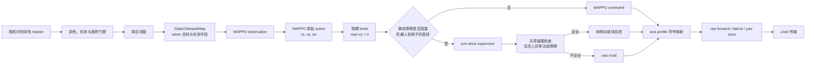

<!--
Copyright (c) 2024-2026, Arm Limited and Contributors. All rights reserved.
SPDX-License-Identifier: Apache-2.0
-->

# Lite3 可执行避障：当前进展 — 2026-08-27

## 结论

当前已经找到此前演示没有完成避障的主要原因，并实现了一个离线测试通过的最小执行层修复；
**尚未宣称实机避障成功，也尚未在本次修改后让 Lite3 行走**。

已经确认的事实：

- 2026-08-26 的四次 `--live` 运行调用的是普通 `lite3_visual_nav.py`，遥测原因只有
  `goal` / `hold`，没有 MAPPO 的 `policy` 或 `veto-*`。因此这四次运行不能作为“MAPPO
  驱动 Lite3”的证据。
- 旧颜色配置在检测器的 `0.5` 缩放图上要求 `min_area_px=400`，而实拍绿色 marker 的
  轮廓面积只有 **165.5–185.5 px**。111 帧中旧阈值通过 **0/111**；有证据支持的
  `min_area_px=150` 通过 **111/111**。
- 纸箱原配置半径为 `0.20 m`，实测平面半径为 **0.28–0.33 m**。修正后的静态地图规划
  半径还会加入定位不确定度；本次 shadow 中为 **0.410–0.494 m**。
- LITE3-A 的 simple-axis profile 只有实测前进与左右原地转向。横移和倒退均为 `null`；
  且映射只保留符号，任何超过 deadband 的非零速度都会变成一档固定 raw axis 值。
- 当前 MAPPO checkpoint 是 holonomic 策略，能请求非零 `vy`；`--max-vy 0` 会把该横移
  意图删除。这不是单纯调参问题，而是策略动作空间与物理执行接口不一致。

因此当前采用的最小修复是：保留 MAPPO 负责目标方向和正常行走；检测到静态障碍阻塞直线
后，由一个可审计的 **turn-drive execution supervisor** 把绕行动作投影成三种已经实测的
primitive：左原地转、右原地转、直线前进。它不使用未标定横移，也不假定“前进 + 偏航”
组合会形成连续模型预测的圆弧。

## 避障链路

新增遥测在同一 tick 内记录：MAPPO 原始 action、limits 后速度、gait-floor 后速度、执行
监督器阶段、最终 command、预期 axis translation，以及 live 模式下 locomotion backend
实际接受的 raw axes。stale、无目标和站立切换等未调用 planner 的 tick 不会再错误继承上一
tick 的策略决策。

## 旧四次 live 运行复核

证据源为本机已有的
`/Users/timtan01/workspace/MAPPO/evidence/2026-08-26-lite3-live-demo/`。

| 运行 | tick | marker / 静态地图 | 控制原因 | 结果 | 能否证明 MAPPO 避障 |
| --- | ---: | --- | --- | --- | --- |
| `live-20260826T120718Z` | 40 | 12 个 tick 有 raw sighting；38 个 tick 有静态障碍 | 2 `goal`, 38 `hold` | stall abort；期望 0.40 m、实际 0.03 m | 否；未运行 MAPPO |
| `live-20260826T121054Z` | 596 | 585 个 tick 有 sighting；584 个 tick 有静态障碍 | 12 `goal`, 584 `hold` | 60 s timeout；前进约 0.54 m | 否；未运行 MAPPO，也没有绕行 |
| `live-20260826T122658Z` | 195 | 0 sighting，0 静态障碍 | 195 个 tick 无 command | 20 s 内未检测到椅子 | 否；无目标也无障碍输入 |
| `live-20260826T123724Z` | 7 | 0 sighting，0 静态障碍 | 6 `goal`, 1 无 command | 到椅子 0.99 m，判定 arrived | 否；只证明普通 goal follower 在空障碍输入下到达 |

旧 telemetry schema 不包含 MAPPO 原始 action、limits 后 command 或实际 raw axes，不能从
这些文件补推出它们；这正是本次新增逐层 decision/transport 遥测的原因。

## 修正 marker 后的无运动 shadow

运行：`shadow-marker-fixed-20260827T023516Z`，`live=false`。

| 指标 | 结果 |
| --- | ---: |
| 控制 tick | 188，`t=0.401–19.926 s` |
| 感知周期 / 错误 | 101 / 0 |
| marker raw sighting | 183/188 tick，首末 `0.401–19.926 s` |
| 静态地图 `landmark-1` | 186/188 tick，首末 `0.558–19.926 s` |
| marker range | 0.984 m 中位数；0.984–1.073 m |
| 静态规划半径 | 0.410 m 中位数；0.410–0.494 m |
| command | 162 `policy`, 24 `veto-hold`, 2 无 command |
| 人员轨迹 | 81/188 tick；从 6.987 s 起出现 |

这证明修正后的绿色 marker 能进入并持续留在静态地图中，也证明当人员进入场景时共享安全
层仍会介入。它尚不能证明物理绕行，因为该 release 没有本次 turn-drive 修改，而且是
`live=false`。

## 真实场景回放：`replay_with_supervisor.py`

把上面的 shadow 遥测逐 tick 重新跑过**当前**链路（真实 checkpoint、`MappoPlanner`、
`--execution-supervisor turn-drive`、机器人半径 0.40 m、包线 0.55/0/0.90、policy scale 4.0
—— 即 scale 闸门对该半径与该 checkpoint 要求的值）。脚本自带断言，结果可复现：

| 指标 | 结果 |
| --- | --- |
| 重新规划的 tick | 186 |
| 记录的原因分布 | 162 `policy` + 24 `veto-hold` |
| 回放的原因分布 | **160 `exec-turn`** + 2 `policy` + 24 `veto-hold` |
| supervisor 接管 | 160 tick —— 纸箱在真实场景中持续阻塞目标线时，链路现在给出**可执行**的转向命令 |
| supervisor 命令被 veto 拒绝 | 20 tick，**全部**发生在人员在场时（t=6.99–19.93）——安全层按设计介入 |
| supervisor 拒绝接管的 veto-hold | 4 tick（t=0.56–0.88），此时 landmark 刚确认、半径被定位不确定度撑大到 0.464–0.494 m，机器人在纸面上处于间距圈内部，切线绕行不存在，supervisor 诚实地不交棒；地图收敛到 0.41 m 后（t≈0.9 起）绕行立即接管 |

两点解读：

- shadow 机器人从未移动，所以 160 个接管 tick 全部停在转向阶段（鼻子没转到绕行方向上，
  就不会进入前进阶段）；前进阶段与到达由 `test_mappo_drive.py` 的端到端运动学测试覆盖。
- 4 个"膨胀期" tick 在实际演示布局中不会触发：演示要求机器人从距椅子约 2.5 m 处起步，
  纸箱在两者中间，机器人距箱心约 1.3 m 以上，处于间距圈之外。即便触发，行为也是安全
  刹停并在地图收敛后自动恢复。

## 当前代码改动

分支：`codex/lite3-executable-avoidance`，基线：`4d79b45`（当前 `origin/main`）。

| 改动 | 目的 |
| --- | --- |
| 新增 `integration/turn_drive_supervisor.py` | 用实测的左转、右转、前进 primitive 生成两段 waypoint 绕行；不使用横移或未标定组合圆弧 |
| 更新 `integration/mappo_drive.py` | 接入 `--execution-supervisor turn-drive`；记录 policy → limits → supervisor → axis 全链路；override 后仍执行共享动态碰撞检查 |
| 更新 Lite3 axis locomotion | 报告最终 raw `forward/lateral/yaw` axes，明确映射为 sign-only |
| 更新共享 telemetry 与 navigator | 每个有效 planner tick 写入 `decision`，每个命令 tick 写入 `transport`；无规划 tick 不继承旧 decision |
| 新增/更新回归测试 | 覆盖半径修正、直穿拒绝、可执行绕行、raw axis 映射、人员介入 hold、缺失检测不伪装成避障 |
| 删除两个根目录临时 Markdown | `lite3-chair-bin-live-readiness-20260825.md` 与 `lite3-control-mode-alignment-20260824.md` 按要求删除 |

审查中发现并修复了一项安全问题：最初实现的 turn-drive override 会直接返回，从而绕过对
动态障碍的共享可行性检查。现在任何人员进入拟执行路径都会把 command 降为
`veto-hold`；对应测试会在删除该检查时失败。

随后在"supervisor 逐 tick + 共享 veto 逐步 rollout"的联合仿真中又发现并修复了两处会导致
**死锁**的几何问题（机器人会在纸箱前被自己的安全层永久刹停）：

1. **切线贴边 vs veto 阈值**：绕行腿按构造恰好贴着所需间距走切线，而 veto 用 `>=` 在同一个
   数值上判定 —— 零余量下"放行还是拒绝"由浮点舍入和 veto 的 0.125 s 采样落点决定。
   supervisor 现在在静态硬间距之上多留 **2 cm 执行余量**（`EXECUTION_MARGIN_M`），
   让整条绕行腿严格落在 veto 的放行区域内。
2. **到达判定切弯**：waypoint 到达半径（0.30 m）会让机器人在**到达拐角之前**就切向目标，
   而拐角前的目标直线仍穿过纸箱的间距圈 —— 实测距拐角 0.12 m 处朝目标行驶只剩 0.102 m
   自由空间（硬间距 0.12 m），veto 拒绝、supervisor 下 tick 重发、死锁。现在切换到目标腿
   的条件是"当前位置到目标的直线对所有静态障碍都满足间距"，而不再是单纯的距离判定；
   几何上这等价于机器人真正走到目标侧切线（即拐角）才换腿。

修复后同一联合仿真：39 tick 完成绕行（14 转向 / 25 前进），**每一个前进命令都通过共享
veto**，随后 supervisor 在目标直线恢复畅通处把控制权交还 MAPPO。

## 当前测试结果

以下均使用 Mac 的 `py312` conda 环境：

| 测试 | 结果 |
| --- | ---: |
| `integration/test_turn_drive_supervisor.py` | 11/11 |
| `integration/test_mappo_drive.py` | 79/79 |
| `robot-stack/unitree/go2/visual_nav/test_telemetry.py` | 46/46 |
| `robot-stack/unitree/go2/visual_nav/test_visual_nav.py` | 93/93 |
| `robot-stack/deep_robotics/lite3/locomotion/test_lite3_axis_locomotion.py` | 17/17 |
| 上述受影响目录 `ruff check .` | 全部通过 |

这是受影响范围的 **246 个测试**，不是仓库全量完成声明。

## 本机录像与图片

| 文件 | 用途 | SHA-256 |
| --- | --- | --- |
| `/Users/timtan01/Downloads/calibration/shadow-marker-fixed-20260827T023516Z.mp4` | 修正 marker 阈值后的 20 s shadow | `a239e4cba80371ff0e56a6b7b6a30adcf1f39ff82e6b196dfe1f2a02792dabee` |
| `/Users/timtan01/Downloads/calibration/shadow-marker-fixed-20260827T023516Z.jsonl` | 对应逐 tick 遥测 | `619034d3584adcce15f9c70d1f66be4c0d79e5bbf713567fa8642d93998ec001` |
| `/Users/timtan01/Downloads/calibration/lite3-pov-20260827T024720Z-60s.mp4` | 60 s Lite3 第一视角、无运动 | `e9be3eda2f0e527f38f77e6aa10818f750b5e0ebe8fe936ce3752be4d234cd7a` |
| `/Users/timtan01/Downloads/calibration/lite3-pov-20260827T024720Z-frame30.jpg` | 60 s 录像约 30 s 的现场帧 | — |
| `/Users/timtan01/Downloads/calibration/lite3-pov-20260827T024720Z-frame58.jpg` | 60 s 录像约 58 s 的现场帧 | — |

60 s 视频期间脚本为 dry-run，没有 `--live`，机器人没有移动。旧机器人端 recorder 以固定
7 FPS 封装 324 个感知帧，原文件回放为 46.286 s；Mac 上的 `-60s.mp4` 只校正时间轴到
60.000 s，保留相同 324 帧。

## 当前现场与安全状态

最近一次被动状态探测：`basic_state=6`、`gait_state=0`、`policy_state=0`、
`motion_state=0`、`error_state=0`、电量 **94%**。该信息只描述探测时刻，不替代 live
前重新检查。

60 s 第一视角实际显示：

- 约 30 s 时纸箱位于画面左侧，绿色 marker 没有出现在纸箱朝向相机的一面；另一台
  quadruped 位于机器人与椅子方向上。
- 约 58 s 时一名人员和另一台 quadruped 都在近距离通道内。

因此该画面不是可授权行走的现场。live 前必须重新确认：绿色 marker 朝向相机且 shadow
连续入图、纸箱确实阻塞机器人到椅子的直线、两侧绕行宽度足够、第二台机器人断电并移出
通道、所有人员离场、网线有余量、操作员手持遥控器并准备急停。

电机温度仍未出现在 Lite3 高层状态流中。`--accept-no-motor-temperatures` 只能作为单次、
最长 120 s 的显式 waiver，不能关闭电池门，也不能视为永久解决；该问题继续留给
Deep Robotics。

## 下一步

1. ~~修正 `README.md` 中把旧四次普通 visual-nav 运行写成 Lite3 MAPPO 成功的状态行。~~
   **已完成于本次 PR**：状态行改写为如实描述（真实行走成立、但由普通 visual-nav 完成、
   避障未生效），并新增 turn-drive supervisor 的独立状态行。
2. ~~更新 Lite3 SOP。~~ **已完成于本次 PR**：障碍摆放改为位于机器人与椅子连线**上**、
   两侧留够绕行宽度；运行入口改为 `mappo_drive.py` + `--execution-supervisor turn-drive`，
   保留实测半径和所有安全门。
3. 将当前 commit 部署为新的、可追溯 release，并在机器人上建立 SOP 要求的 venv；不在
   机器人上安装新包。
4. 在清空后的最终场景运行无运动 shadow，验证 marker 连续、静态地图持续、MAPPO 原始
   action、limits、supervisor 和 axis translation 全部出现在同一 telemetry tick。
5. 只有 shadow 通过后，重新读取电量与状态，并向现场人员取得明确行走许可。每一次
   `--live` 测试都同时录制 MP4 和 JSONL，完成后立刻复制到 Mac 并校验 SHA-256。
6. 成功标准同时包含：肉眼可见绕过纸箱，以及随后到达椅子；仅“走起来”不算成功。
7. 完成全量测试和对抗式 diff 审查，提交、推送、创建 PR，并在 issue #13 写 continuation
   comment；尚未完成的事实必须在评论中保留。

