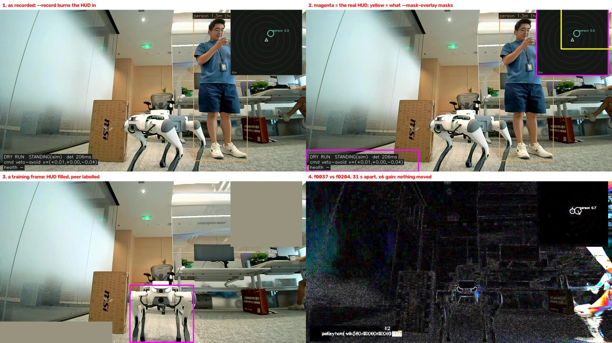

<!--
Copyright (c) 2024-2026, Arm Limited and Contributors. All rights reserved.
SPDX-License-Identifier: Apache-2.0
-->

# 2026-08-27 — the Lite3 clip is one photograph, and production's input size cannot see the robot in it

A 60-second recording through a Lite3's own camera, of a second Lite3 in a Shanghai
office, arrived to be turned into a training set. Two measurements decide what it is worth,
and both of them are worse than "324 frames of a peer robot" sounds.

**The camera never moves.** Recovered by homography against the first frame, the median
displacement over the whole minute is 0.19 px and the maximum is 7.14 px; not one frame of
324 moves more than 10 px. The robot's own burned-in status line says `DRY RUN
STANDING(sim)` from beginning to end — it never walked. This is a tripod shot. It contains
**one viewpoint**, and no amount of shear, crop or colour filtering manufactures a second
one.

**And the frames the burned-in overlay leaves alone are one unbroken block in which
nothing moves.** 156 of 324 frames carry the detector's own orange outline painted into
the pixels. The 168 that do not are frames 37–204 — a single contiguous run, 31.1 s, in
which the peer's image region deviates 3.11 grey levels from the block median against 2.42
for inert carpet. The peer is parked. So the *usable* half of this clip is not 168 samples;
it is one image, 168 times.

Reproduce every number below with no video, no model and no network:

```bash
python3 audit.py
```



*1: as recorded — `--record` composites the HUD into the pixels, including an orange box
around the detector's own `person` prediction. 2: magenta is where the overlay really is;
yellow is where `detector/eval_detector.py --mask-overlay` paints, on this frame size.
3: a training frame after the two panels are filled with the frame's own median. 4: frames
37 and 204, 31 s apart, differenced at 6x gain — everything outside the HUD is sensor
noise.*

## ⛔ Ask for `--record-raw`, and ask for the telemetry

This is the finding that matters more than anything measured here, and it costs the
recording operator one flag.

`robot-stack/unitree/go2/visual_nav/visual_nav.py` already has `--record-raw`, added for
exactly this reason. `--record` writes the *annotated* canvas; `--record-raw` writes the
same frames before anything is drawn on them, advanced by the same gate, so frame *n* of
one is frame *n* of the other and both join to the same `perception.video_frame` in the
telemetry. `detector/render_lite3.py` says the same thing in its own docstring:
compositing onto annotated frames "teaches the network that a peer comes with an orange
rectangle and a black radar square."

Three things to ask for, in priority order:

| # | ask | why it is worth more than anything in this directory |
| --- | --- | --- |
| 1 | re-record with **`--record-raw`** | removes the contamination at the source; no colour-keying, no fabricated pixels, no discarded frames |
| 2 | **the `.jsonl` telemetry** for the clip we already have | it may carry `sightings` for these 324 frames, which would be labels joined by frame index rather than recovered from pixels |
| 3 | **walk the robot**, and record in more than one place | this is the only one that fixes the real problem, which is that the clip holds one viewpoint |

⚠️ A fourth ask is a prerequisite for the *synthetic* half, and has not been done at all:
`detector/COLLECTING-LITE3-DATA.md` Step 0 requires `lite3_front_camera.json` and the
camera's height above the floor before any Lite3 is rendered, because
`render_lite3.py --focal-px` defaults to a **Go2's** 1290.2 px and every apparent size
scales linearly on it. No Lite3 calibration exists in this repository.

## What the clip holds

| | measured |
| --- | --- |
| frames | **324** — container `nb_frames`, decoded frame count, packet count and OpenCV all agree |
| rate | **5.40 fps** measured (324 / 60 s). The container disagrees with itself: `r_frame_rate` 7/1, `avg_frame_rate` 27/5 |
| size | 1280x720 |
| camera poses | **1** (median displacement 0.19 px, max 7.14 px, zero frames past 10 px) |
| frames with an outline burned onto the scene | **156 / 324 = 48.1%** |
| frames without one | **168 / 324 = 51.9%**, and they are **one contiguous block**, frames 37–204 |
| peer motion inside that block | none — 3.11 grey levels, against 2.42 for inert carpet and 0.01 for the synthetic radar panel |

The radar panel is the control in that last row: it is drawn, not photographed, so pixels
that genuinely cannot change read 0.01. An inert *photographed* surface reads 1.0–2.4. The
peer reads 3.11, which is that floor and not a robot moving.

## The overlay's boxes are not free labels

The orange outline is the incumbent detector's own output, so recovering it would give
boxes with a stated range for nothing. It does not survive contact:

* **It is the wrong class, and it always will be.** Every recovered rectangle is drawn on
  the *person*; across every frame inspected the peer quadruped — large, central,
  unoccluded — is never boxed. That is not evidence the network cannot see it. The
  navigator draws only the classes it is *configured* to track, and every Aug-20 telemetry
  header reads `"classes": ["person"], "confidence": 0.45`. So the burned-in boxes carry
  no peer supervision by construction, whatever the detector scored — and the labels on
  offer are for the one class we already have.
* **72% of them are destroyed by the radar.** Of the rectangles recoverable at all, 56 of
  78 overlap the plan-view inset, which is opaque and painted over the box's own corner.
* **Recovery is not reliable.** See the section at the bottom; two thresholds one step
  apart returned 100% and 0%.

Even if all three were solved, the labels would be the incumbent's predictions on the clip
we are training from — a network taught to agree with itself.

## ⚠️ `--mask-overlay` masks the wrong rectangle on 1280x720 footage

`detector/eval_detector.py` carries the two overlay regions as fractions of the frame:

```python
RADAR_REGION = (0.834, 0.0, 1.0, 0.287)
PLATE_REGION = (0.0, 0.930, 0.215, 1.0)
```

They were fitted off the Aug-20 stills, which are 1920x1080. But `overlay.py`'s
`draw_plan_view()` places the panel in **pixels**, at `(width - size_px - 16, 16)` with
`size_px = 300`. At 1920 wide that is x 1604, and 1604/1920 = 0.835 — the fraction is
correct there and only there. At 1280 wide the panel is at x 964, and 964/1280 = 0.753.

| | panel `overlay.py` draws | what `RADAR_REGION` masks here |
| --- | --- | --- |
| 1280x720 | x 964..1263, y 16..315 | x 1067..1279, y 0..205 |

**58.4% of the radar panel survives the mask** (52,570 of 90,000 px), and the mask also
paints 16 px of clean scene that never had an overlay on it. The status plate is measured
at x 0..469, y 630..719; `PLATE_REGION` covers x 0..274, y 669..719, so most of that is
missed too. A number quoted "masked" on Lite3 footage is not masked. This is the repo's own
warning — *do not assume Go2 constants transfer* — landing inside the repo's own scorer.

## The incumbent on this robot, at the size production launches

`deploy/run-peer-supervised.sh` passes `--input-size 224`. Every scorer in `detector/`
hardcodes `INPUT_SIZE = 300` (issue #129). Both are reported; the 224 row is the one that
describes what ships.

| input size | lands on the peer @0.25 | best IoU, any class, any score | called |
| --- | --- | --- | --- |
| **224 — production** | **0 / 168 = 0%** | **0.041** | — |
| 300 | 80 / 168 = 48% | 0.576 | `chair` |

At 224 the shipped MobileNet-SSD fires *somewhere* in 166 of 168 frames and never once
puts a box on the robot: the single detection above 0.25 is a `sofa` at 0.27 lying across
the desks. **At the size production runs, the incumbent is blind to a Lite3 that fills
266x240 px of the frame.**

## The fine-tunes, and the trap they walked into

Two runs, on the 168 outline-free frames, with the augmentation recipe read off
`~/ssdft/run_wave6.sh` rather than invented — `--motion-blur 0.5 --sensor-noise 0.5
--composite 0.3`, on top of the stock photometric/expand/crop/flip that waves 1–4 already
ran. `b_lite3_ctl` is a **contemporaneous paired control** with those three off, because
the operators call `rng.random()` even at probability 0 and a cited older run is no longer
byte-reproducible.

| run | best `lite3` @300 | `lite3` @**224** | people kept @300 |
| --- | --- | --- | --- |
| `a_lite3_aug` ep040 | 104 / 168 | **0 / 168** | 3 of 17 |
| `b_lite3_ctl` ep025 | **168 / 168** | **0 / 168** | 5 of 17 |

Every checkpoint of both runs, at every epoch, scores **0 at 224** — including the control
that scores a perfect 168/168 at 300 **on the frames it was trained on**. This is not a
threshold artefact: at 224 the new class emits no box at all in 40 of 40 sampled frames
(best score 0.000), while the same weights at 300 fire at 0.55–0.66 on every one.
`finetune_ssd.py` resizes every training image to `INPUT_SIZE = 300`; the deployment
launches 224; the class the training produced does not exist at that size.

⛔ **Neither checkpoint is shippable, and not only because of the input size.** The Go2
gate is *lose zero of the people the shipped network sees at 0.45*. Against a base that
holds 17 of 120 cross-day frames, the augmented run keeps 3 and the control keeps 5. Both
fail it by a wide margin.

## What is same-session, and therefore unproven

**The `lite3` column is train-on-eval.** The 168 frames scored are the 168 frames trained
on, and they are one camera pose of one peer pose. A number near 100% there means one
image was memorised — which is why the *control*, with augmentation off, scores higher
(168/168) than the augmented run (104/168). On a same-session eval, overfitting wins. That
is the eval being wrong, not the control being better.

This project has already measured **0/705 same-session against 60/159 cross-day** for one
model. Nothing in the `lite3` column survives that comparison, because there is no
cross-day Lite3 data at all — not a second day, not a second room, not a second lighting
condition. **There is no measurement in this directory that says the detector would find a
Lite3 tomorrow.**

The one column that *is* cross-day is `people kept`: those 120 frames are Aug-20 Go2
footage, a different day and a different building. It is the only number here that
generalises, and both runs fail it.

## What is real and what is synthetic in the dataset

`lite3_shanghai_20260827.json` — 168 records, one box each.

| | |
| --- | --- |
| real photographed pixels | 100% of the scene, **minus 14.4%** per frame |
| synthetic | the two HUD rectangles, 132,300 of 921,600 px, filled with each frame's own median colour |
| fabricated content | **none** — the fill is flat, at a fixed location, and neither region ever overlaps the peer box |
| labels | 1, hand-seeded on frame 120 off a ruled render, verified on 37 and 204; the peer does not move, so one box is the whole set |
| independent viewpoints | **1** |
| in-domain negatives | **0** — every frame contains the peer. The 705 negatives used for training are Go2 corridor frames from another building |

Filling was chosen over cropping because a crop that removes both panels changes the frame
aspect from 1.78 to 0.69, and apparent aspect is a scale prior the network learns. Filling
keeps production geometry exactly. It is still fabrication, which is why it is in the table.

## Numbers established on this date

* **324** frames, agreed by four independent counts; **5.40 fps**, not the container's 7.
* **1** camera pose. Median displacement 0.19 px over 60 s; 0 of 324 frames past 10 px.
* **156 / 324 = 48.1%** of frames carry a burned-in detection outline.
* The 168 that do not are **one contiguous block**, frames 37–204, 31.1 s.
* Peer motion within it: **3.11** grey levels, against **2.42** inert carpet and **0.01**
  for the drawn radar panel.
* `--mask-overlay` leaves **58.4%** of the radar panel unmasked at 1280x720.
* Incumbent at **224**: **0 / 168** on the peer, best IoU **0.041**. At 300: 80/168 = 48%,
  as `chair`, best IoU 0.576.
* Every fine-tune checkpoint at **224**: **0 / 168**. The control at 300: **168 / 168**.
* Person retention, cross-day: base **17 / 120**; augmented keeps **3**, control keeps **5**.

## A metric that lied, kept on the record

The first pass at recovering the orange outlines reported **100% of frames carry a
recoverable rectangle**. It was wrong twice over: the threshold was `S >= 120`, and the
brown MSI cardboard box in the left of every frame clears it, so the "rectangle" being
recovered was a cardboard edge — visible in the constant `x0 = 480` across frames that
share nothing else.

Tightening it to `S >= 165` then reported **0%**, because the overlay is alpha-blended and
its right and bottom strokes sit at S 158–160, below the new floor. Two thresholds one step
apart, 100% and 0%, neither of them the answer.

The answer came from reading the stroke instead of guessing at it: every overlay pixel has
hue **exactly 17**, and a 594 px perfectly straight constant-hue run is a thing no cardboard
box produces. That gives 78 of 324 — and hand-checking a stratified sample *including
negatives* immediately found two frames scored "no box" that plainly had one, because the
radar hides the corner the recovery needed. The presence rate, measured without requiring a
whole rectangle, is 48.1%.

⚠️ **The lesson is the sampling, not the threshold.** The 100% figure would have survived
any check that only looked at frames the method called positive. It died on the first
negative anybody looked at.

## Continues in

The re-record, the telemetry `.jsonl`, and `lite3_front_camera.json`. Until at least the
first arrives, there is no Lite3 detector work worth doing that is not blocked on data —
and the `--input-size` split in issue #129 has to be settled first regardless, because a
checkpoint that scores 168/168 at 300 and 0/168 at 224 is not a checkpoint anybody can ship.
