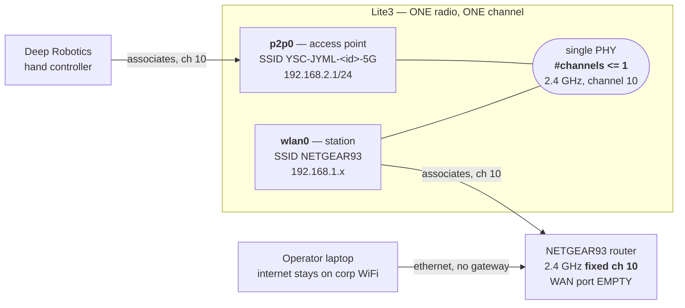
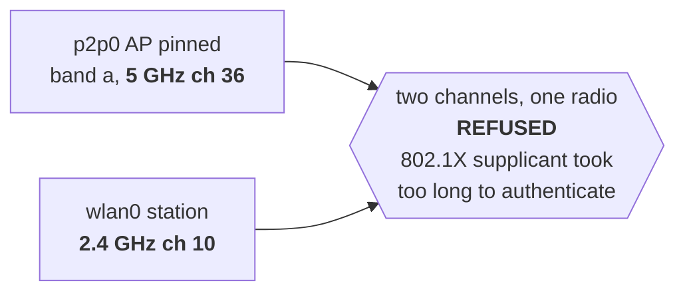

<!--
Copyright (c) 2024-2026, Arm Limited and Contributors. All rights reserved.
SPDX-License-Identifier: Apache-2.0
-->

# Demo network — one isolated LAN, no tethers / 演示网络 —— 独立局域网，无网线牵绊

**EN** — Every robot and the operator's laptop on one airgapped WiFi LAN, so the robots walk
untethered and the Device Connect dashboard can actually discover them.
**中文** —— 所有机器人与操作笔记本接入同一个隔离的 WiFi 局域网：机器人无需拖线行走，
Device Connect 面板也才能发现它们。

## Why not just use the Ethernet cable

Three reasons, and only the first is about tidiness.

1. **A cable runs through the lane the robot is meant to walk down.** Every run on
   2026-09-01 ended with one.
2. **A tether is not a LAN.** Device Connect's D2D discovery is **multicast**. Two robots on
   two point-to-point cables to one laptop share no broadcast domain, so the fleet table
   cannot fill however correct the dashboard is. One WiFi LAN fixes this by construction.
3. **The laptop's routing is at risk.** macOS ranks Ethernet above Wi-Fi, so a router
   offering a default gateway captures the laptop's traffic. It happened twice.

## The topology

```
      corp WiFi ───────── en0 ┐
      (internet, unchanged)   ├── operator laptop
                              │
  ┌──────────────────┐  en9 ──┘   manual IP, NO gateway, NO DNS
  │ NETGEAR RAX50    │◄─── LAN port (optional; WiFi works too)
  │ 192.168.1.1      │
  │ WAN: EMPTY       │◄··· WiFi ···► robot 1  192.168.1.120
  └──────────────────┘                robot 2  192.168.1.2
         airgapped                     one broadcast domain
```

## Router settings

| setting | value | why |
| --- | --- | --- |
| SSID | `NETGEAR93` (+ `-5G`) | both bands: 5 GHz is faster, 2.4 GHz reaches further in a hall |
| Security | **WPA2-PSK** | not WPA3 — WPA2 is what the robot's NetworkManager was verified against |
| LAN | `192.168.1.0/24`, router `.1` | matches the robots' existing addressing; nothing on the robot needed changing |
| Address reservation | robot MAC → fixed IP | the robots reboot often; a moving IP mid-demo is an avoidable failure |
| 2.4 GHz channel | **FIXED, not auto** (10) | the robots' controller AP must share this channel — see below. A router that hops channels breaks the hand controller mid-demo |
| Client isolation | **off** | this model exposes no such control on the main SSID; verified by test, not by checkbox |
| WAN port | **EMPTY** | airgap from the Arm network, enforced by an unpopulated socket |

⚠️ **Change the admin password before the venue.** `admin`/`password` is tolerable on an
office island and not in a hotel where the SSID is visible to everyone in range.

## The hand controller and the router, on one radio / 手柄与路由器共用一个射频

The Lite3 serves the Deep Robotics hand controller from its **own access point**, and joins
the venue router as a **station**, on the **same radio**. The driver states the limit:

```
$ iw phy | grep -A1 "valid interface combinations"
    * #{ managed, P2P-client } <= 2, #{ AP, P2P-GO } <= 1, total <= 2, #channels <= 1
```

**`#channels <= 1` is the whole story.** One AP plus one station is supported — but both
must sit on **one channel**. There is no 2.4 GHz-controller / 5 GHz-router split on this
hardware: it is not a tuning preference, it is refused.



**The configuration that does NOT work**, and cost an afternoon:



The AP never reaches `type AP`; it stays `managed` and the controller sees no SSID at all.
The symptom is indistinguishable from a broken radio.

### ⚠️ `netplan apply` drops the hand controller's access point

This bit both robots, a day apart, and the second time was avoidable.

`/etc/netplan/config.yaml` uses `renderer: NetworkManager`, so `netplan apply` regenerates
NetworkManager's connections and restarts it. That **deactivates the `p2p0` AP**, and if the
AP profile has `connection.autoconnect: no` — which is how both robots shipped — it never
comes back. The robot stays reachable over Ethernet and WiFi throughout, so nothing looks
wrong until somebody picks up the controller.

**Any change to the wired addressing takes the controller down with it.** Treat a netplan
edit as touching the manual-control path, and check the controller afterwards.

Both robots are now set so this cannot recur silently:

```bash
# band and channel in ONE command (nmcli validates the whole connection), matching the
# router's fixed channel, and autoconnect so an NM restart brings it back by itself
sudo nmcli con mod myap50G 802-11-wireless.band bg 802-11-wireless.channel 10
sudo nmcli con mod myap50G connection.autoconnect yes connection.autoconnect-priority 60
sudo nmcli con up myap50G
```

| robot | AP SSID | `p2p0` | autoconnect |
| --- | --- | --- | --- |
| robot 1 | `YSC-JYML-dj6ipv-5G` | `192.168.2.1/24` | yes, priority 60 |
| robot 2 | `YSC-JYML-gg9uma-5G` | `192.168.2.1/24` | yes, priority 60 |

### Which of the two AP mechanisms is yours

These robots ship with **two** ways to raise that AP, and only one is active per unit:

| mechanism | SSID | interface | subnet | DHCP |
| --- | --- | --- | --- | --- |
| NetworkManager profile `myap50G` | `YSC-JYML-<id>-5G` | `p2p0` | `192.168.2.1/24` | NM shared (dnsmasq) |
| `multi_master.service` → `master_start.sh` → `hostapd` | from `/home/ysc/master/host.conf` | `p2p0` | `192.168.3.1/24` | `isc-dhcp-server` |

Both robots here use the **NetworkManager** one; `multi_master` is disabled from the
factory and its `host.conf` still carries the placeholder SSID `lite3_xxx_master`. Do not
enable it to "fix" a missing hotspot — you get a differently-named AP on a different
subnet, which the controller will not join.

### Restoring the hotspot

⚠️ **Putting `wlan0` on the venue router does not by itself break the controller** — but
pinning the AP to a different channel does. If the controller stops seeing the robot:

```bash
# band and channel MUST be set in ONE command. nmcli validates the whole connection,
# so changing band while the old 5 GHz channel is still set is rejected outright:
#   Error: 802-11-wireless.channel: '36' is not a valid channel
sudo nmcli con mod myap50G 802-11-wireless.band bg 802-11-wireless.channel 10
sudo nmcli con mod myap50G connection.autoconnect yes connection.autoconnect-priority 60
sudo nmcli con up myap50G

iw dev | grep -E "Interface|type|ssid|channel"   # p2p0 must say: type AP
```

Both links coming up together, which is the state to check before the demo starts:

```
Interface p2p0        ssid YSC-JYML-gg9uma-5G   type AP        channel 10
Interface wlan0       ssid NETGEAR93            type managed   channel 10
p2p0   192.168.2.1/24        wlan0   192.168.1.2/24
```

**A WiFi change can disable the manual-control path.** The controller is how an operator
stops a robot by hand. Reconfiguring `wlan0` is not a networking-only change, and it
belongs to the same pre-run checklist as the e-stop.

## Laptop — the setting that stops it losing the internet

Set the Ethernet service to a **manual address with the router field EMPTY**, and clear its
DNS. With no gateway it is structurally incapable of becoming the default route, whatever
the service order says.

```sh
sudo networksetup -setmanual "USB 10/100 LAN" 192.168.1.50 255.255.255.0 ""
sudo networksetup -setdnsservers "USB 10/100 LAN" Empty
netstat -rn -f inet | grep default      # MUST still name the Wi-Fi interface
```

The empty final argument is the whole fix. DHCP does not work here: the RAX50 advertises
itself as a gateway, macOS ranks Ethernet above Wi-Fi, and the laptop's internet stops.

If the browser bounces to `routerlogin.net` and fails, corp DNS is resolving it to the real
internet host. Point it locally:

```sh
sudo sh -c 'echo "192.168.1.1 www.routerlogin.net routerlogin.net" >> /etc/hosts'
```

## Robot

```sh
sudo nmcli device wifi connect NETGEAR93 password <passphrase> ifname wlan0
sudo nmcli connection modify NETGEAR93 connection.autoconnect-priority 100
sudo nmcli connection modify GuestAccess connection.autoconnect no
```

**Disabling other saved networks is not tidiness.** `GuestAccess` is in range at the office,
was set to autoconnect, and would compete for `wlan0` on every boot — and these robots reboot
several times an hour during setup. A robot that silently joins the wrong network at the venue
is a demo that cannot be driven.

Audio, if the robot is to speak — the account must be in the `audio` group or PulseAudio
falls back to a null sink and `aplay` exits 0 while making no sound:

```sh
sudo usermod -aG audio "$USER"     # then start a NEW session
```

## Addressing, both robots

Two Lite3s ship with the **same** factory address, `192.168.1.120`, so the second one to
join a shared LAN collides with the first. Give each robot's wired interface a distinct
address before it ever meets the other.

| | robot 1 (LITE3-A) | robot 2 |
| --- | --- | --- |
| `wlan0` (demo path) | `192.168.1.120` | `192.168.1.2` |
| `wlan0` MAC | `54:ef:33:9e:88:2a` | `54:ef:33:9e:1a:8d` |
| `eth1` (cable fallback) | `192.168.1.119` | `192.168.1.118` |
| DHCP reservation | done | **still to do** |

### Every interface, both robots

Three interfaces are live on each robot at once. They serve different people and they fail
independently, so check all three, not just the one you are SSH'd over.

**Robot 2** — measured 2026-09-01, all three up simultaneously, and the hand
controller confirmed paired by the operator while `wlan0` held the router link:

| interface | role | SSID | channel | address | MAC | serves |
| --- | --- | --- | --- | --- | --- | --- |
| `p2p0` | **access point** | `YSC-JYML-gg9uma-5G` | 10 | `192.168.2.1/24` | `56:ef:33:9e:1a:8d` | the hand controller |
| `wlan0` | **station** | `NETGEAR93` | 10 | `192.168.1.2/24` | `54:ef:33:9e:1a:8d` | the venue router / dashboard |
| `eth1` | wired | — | — | `192.168.1.118/24` | `2c:16:bd:d4:9d:fd` | a laptop, direct or via the router |

**Robot 1** — the AP row is observed from a scan; the rest is from this robot's own setup
and is **not re-verified since it was last powered on**. Confirm before the demo:

| interface | role | SSID | channel | address | MAC | serves |
| --- | --- | --- | --- | --- | --- | --- |
| `p2p0` | **access point** | `YSC-JYML-dj6ipv-5G` | 10 (observed) | `192.168.2.1/24` (assumed) | `56:ef:33:9e:88:2a` | the hand controller |
| `wlan0` | **station** | `NETGEAR93` | 10 | `192.168.1.120` | `54:ef:33:9e:88:2a` | the venue router / dashboard |
| `eth1` | wired | — | — | `192.168.1.119` ⚠️ **not persisted** | — | a laptop, direct or via the router |

⚠️ **Robot 1's `eth1` reverts to `192.168.1.120` on reboot.** Its
`/etc/netplan/config.yaml` still carries the factory address, so the running `.119` is not
the configured one. Fix netplan on robot 1 before the venue, or it rejoins the LAN on the
same address robot 1's `wlan0` already holds.

Note both AP MACs are the wired/`wlan0` MAC with one bit flipped (`54:` → `56:`): `p2p0`
is a virtual interface on the same radio, which is why the one-channel rule above binds.

⚠️ **`jy_exe` sends robot state to exactly one address**, set in
`/home/ysc/jy_exe/conf/network.toml`. It ships as `192.168.1.120`, so **moving the wired
interface off `.120` silently breaks the drive path** — `mappo_drive` then dies with *"no
Lite3 state frame arrived on 127.0.0.1:43897 within 5s"*. Robot 1 kept working only by
luck: its `wlan0` inherited `.120`, so the vendor's target still resolved.

Set it to `127.0.0.1`. The drive runs **on** the robot, so localhost is both correct and
immune to any future address change:

```toml
ip = '127.0.0.1'
target_port = 43897
local_port = 43893
```

It takes effect when `jy_exe` restarts. **Restarting it is a motion-controller restart** —
do it with an operator present, not remotely on an unattended robot.

## Bootstrapping a robot with no internet

The robots are airgapped, so Python dependencies cannot be fetched on the robot, and
`python3 -m venv` on this image cannot `ensurepip`. Neither is a problem: **wheels are zip
files**, so cross-download them on a laptop and extract them onto a `PYTHONPATH` directory.
The venv still exists because `preflight/venv_guard.py` requires one for `--live`; it simply
holds no packages.

```sh
# on the laptop
pip download --only-binary=:all: --platform manylinux2014_aarch64     --python-version 38 --implementation cp --abi cp38     "numpy<1.25" "opencv-python-headless<4.10" -d wheels/

# on the robot, after copying wheels/ across
cd ~/mappo-lite3-stage/python && for w in ~/mappo-lite3-stage/wheels/*.whl; do
  python3 -c "import zipfile,sys; zipfile.ZipFile(sys.argv[1]).extractall('.')" "$w"
done
export PYTHONPATH=$HOME/mappo-lite3-stage/python
```

**This installs nothing into the system interpreter**, which `AGENTS.md` forbids outright.

The detector model is not in this repository and must be copied across too: `--model-dir`
expects `MobileNetSSD_deploy.prototxt` and `MobileNetSSD_deploy.caffemodel`, the **stock**
published pair. ⚠️ Checksum a newly-fetched copy against a working robot's before trusting
it — this repository's detector measurements are tied to specific weights.

## ⚠️ The trap that cost the most time

**Do not let two interfaces hold the same address.** With a cable in *and* WiFi up, `eth1`
and `wlan0` both carried `192.168.1.120`. Linux keeps one route per subnet and picks it by
metric, so:

- **ARP worked**, because ARP replies leave by the interface the request arrived on — the
  laptop happily resolved the robot's MAC;
- **ICMP and TCP did not**, because replies left by whichever interface had the lower metric,
  which was repeatedly the one that had just been unplugged.

It presents exactly like client isolation. **When ARP succeeds and everything above it fails,
read the routing table before blaming the access point.**

`eth1` now sits on `192.168.1.119` so the two no longer collide. The better fix, still to do,
is putting `eth1` on a **different subnet** (`192.168.137.0/24`, the vendor default) so no
metric arbitrates between them at all.

## When a robot cannot reach the router it is associated with

A robot can be **associated with the venue WiFi, hold a valid address on it, and still not
reach the router**, with no error anywhere. It looks like a broken router or a bad PSK. It
is neither.

```
$ iw dev wlan0 link
Connected to 38:94:ed:65:7a:83 (on wlan0)   SSID: NETGEAR93   freq: 2457
$ ping 192.168.1.1
(nothing)

$ ip route
192.168.1.0/24 dev eth1  proto kernel scope link src 192.168.1.118 metric 100
192.168.1.0/24 dev wlan0 proto kernel scope link src 192.168.1.2   metric 603
```

**Two interfaces, one subnet.** A laptop cabled straight to `eth1` puts that cable on
`192.168.1.0/24`, and the router's WiFi puts `wlan0` on the same `192.168.1.0/24`. The
kernel picks by metric, `eth1` wins at 100, and every packet for `192.168.1.1` goes down a
cable the router is not on. Nothing is misconfigured in the WiFi sense, which is why this
reads as a hardware fault.

This is the same shape as the duplicate-address trap below: one address space reachable
two ways, arbitrated by a rule nobody was thinking about.

**To reach the router anyway**, without unplugging anything, pin that one host to `wlan0`:

```bash
sudo ip route add 192.168.1.1/32 dev wlan0 src 192.168.1.2 metric 50
ip route get 192.168.1.1        # must say: dev wlan0
```

⚠️ **This is a diagnostic workaround, not a fix, and it does not survive a reboot.** The
real answer at the venue is that a robot has **one** path to `192.168.1.0/24`: WiFi, with
the direct laptop cable unplugged. Two live paths to one subnet is a coin toss decided by
metrics, and the coin is not weighted the way you expect.

### ⚠️ The robot answers the router down the cable, not the radio

This is the one that cost the most, and it is not the same bug as the section above. There,
a laptop could not reach the router. Here, **the robot cannot**, while every check says it
is fine:

```
$ iw dev wlan0 link
Connected to 38:94:ed:65:7a:83   SSID: NETGEAR93   freq: 2457      # associated
$ nmcli -f IP4.ADDRESS,IP4.GATEWAY con show NETGEAR93
IP4.ADDRESS[1]: 192.168.1.2/24    IP4.GATEWAY: 192.168.1.1         # leased, gateway right
$ ping 192.168.1.1
(nothing)
```

Associated. Leased. Correct gateway. Unreachable. The routing table is the only place it
shows:

```
192.168.1.0/24 dev eth1  src 192.168.1.118 metric 100   <- wins
192.168.1.0/24 dev wlan0 src 192.168.1.2   metric 600
```

**Both interfaces hold the same subnet and the lower metric wins**, so every packet the
robot sends to a `192.168.1.x` address — the router, the operator laptop, the dashboard —
leaves by **Ethernet**. With the laptop on the router and nothing in the robot's Ethernet
port, each reply goes into a cable connected to nothing. The robot is reachable *to* and
mute *from*, which presents as the router dropping it.

**The fix is one persistent line per robot**, making the radio own the subnet:

```bash
sudo nmcli con mod NETGEAR93 ipv4.route-metric 50   # below eth1's 100
sudo nmcli con up NETGEAR93
ip route get 192.168.1.1                            # must say: dev wlan0
```

⚠️ **Applying it will drop an SSH session that is on the Ethernet cable**, because that
session's replies move to the radio mid-command. Pin the laptop to `eth1` first, and remove
the pin when the cable moves:

```bash
sudo ip route replace 192.168.1.50/32 dev eth1 src <robot eth1 addr> metric 10
# ... make the change, verify, then before the cable moves:
sudo ip route del 192.168.1.50/32 dev eth1
```

Both robots now carry `ipv4.route-metric 50`, which NetworkManager persists across reboots.

### The venue configuration, as measured

Laptop on the router by Ethernet; **both robots wireless, no tethers**; each robot serving
its own controller AP on the same radio.

| | robot 1 (LITE3-A) | robot 2 |
| --- | --- | --- |
| `wlan0` (the demo path) | `192.168.1.120` | `192.168.1.2` |
| `eth1` (debug only) | `192.168.1.119` | `192.168.1.118` |
| `p2p0` controller AP | `YSC-JYML-dj6ipv-5G` @ `192.168.2.1` | `YSC-JYML-gg9uma-5G` @ `192.168.2.1` |
| `wlan0` route metric | 50 | 50 |
| camera for the dashboard | `:8801`, `lite3-frame-server` | `:8801`, `lite3-frame-server` |
| driver | `mappo-dc-driver`, enabled | `mappo-dc-driver`, enabled |
| calibration | its own, measured | ⚠️ robot 1 placeholder |

**Two rules that explain most of a lost afternoon:**

1. ⚠️ **After any network change, restart the driver** — `sudo systemctl restart
   mappo-dc-driver`. Mesh discovery picks its interface when the driver starts and never
   re-runs, so a robot that moved between Ethernet and WiFi is simply absent from the
   dashboard, with the driver `active` and publishing to nobody.
2. ⚠️ **After any reboot, check the controller before you need it** — `iw dev` must show
   `p2p0 ... type AP`. The AP profile reverts to 5 GHz with `autoconnect: no` on both
   robots.

### Reaching the router's web UI from a laptop that is not on its LAN

The operator laptop keeps its internet on corp WiFi and is often cabled to a **robot**, not
to the router — so it cannot open `192.168.1.1` at all. Rather than re-cabling, tunnel
through a robot that is on the router's WiFi:

```bash
ssh -f -N -L 18080:192.168.1.1:80 user@<robot eth1 address>
# then browse to http://127.0.0.1:18080/
```

The robot needs the host route above for this to work, for the reason just given.

## Verifying it, in order

Do these **before** removing the cable — the whole point is to prove the new path works while
the old one is still there.

```sh
netstat -rn -f inet | grep default          # 1. laptop default route unchanged
ping 192.168.1.120                          # 2. robot answers
arp -a | grep 192.168.1.120                 # 3. and the MAC is the WIRELESS one
ssh user@192.168.1.120 'echo ok'            # 4. SSH, which is what actually matters
ssh user@192.168.1.120 \
  'curl -m 6 --interface wlan0 https://github.com'   # 5. MUST fail — airgap intact
```

Step 3 matters: with a cable also attached, step 2 can pass over Ethernet and tell you
nothing about the WiFi.

## If the WiFi fails at the venue

`eth1` keeps `192.168.1.119` and `192.168.137.120`, so a direct laptop-to-robot cable still
works as a fallback. Set the laptop's Ethernet to `192.168.1.50` (as above) and connect to
`192.168.1.119`.
