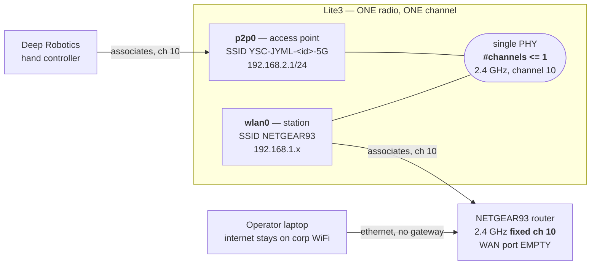
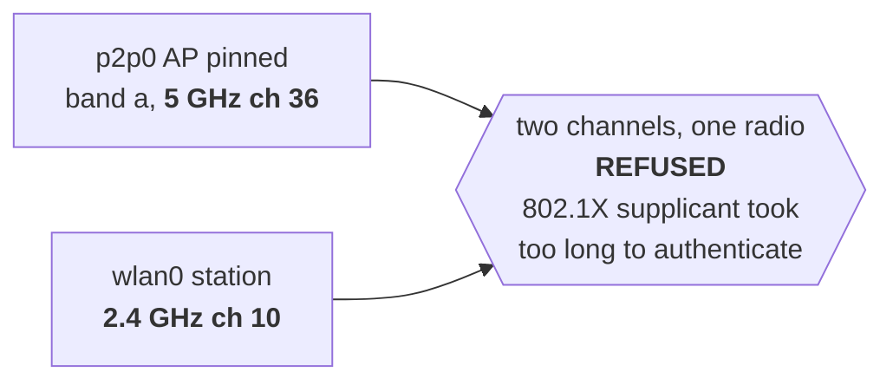

<!--
Copyright (c) 2024-2026, Arm Limited and Contributors. All rights reserved.
SPDX-License-Identifier: Apache-2.0
-->

# 演示网络 —— 独立局域网，无网线牵绊

[English](DEMO-NETWORK.md)

> 英文版 [DEMO-NETWORK.md](DEMO-NETWORK.md) 为权威版本；如两版有出入，以英文版为准。

所有机器人与操作笔记本接入同一个隔离的 WiFi 局域网：机器人无需拖线行走，
Device Connect 面板也才能发现它们。

## 为什么不直接用网线

三个理由，而且只有第一个是关于整洁的。

1. **一根线会横穿机器人本该走过的那条通道。** 2026-09-01 的每一次运行都是以此收场的。
2. **一根系绳不是一个局域网。** Device Connect 的 D2D 发现是**组播**的。两台机器人各用一条
   点对点网线连到同一台笔记本，它们不共享任何广播域，于是不论面板本身写得多正确，
   机队列表都填不满。一个 WiFi 局域网从结构上解决了这个问题。
3. **笔记本的路由有风险。** macOS 把以太网排在 Wi-Fi 之前，所以一台提供默认网关的路由器
   会把笔记本的流量全部劫走。这件事发生过两次。

## 拓扑

```
      corp WiFi ───────── en0 ┐
      (internet, unchanged)   ├── operator laptop
                              │
  ┌──────────────────┐  en9 ──┘   manual IP, NO gateway, NO DNS
  │ NETGEAR RAX50    │◄─── LAN port (optional; WiFi works too)
  │ 192.168.1.1      │
  │ WAN: EMPTY       │◄··· WiFi ···► robot 1  192.168.1.120
  └──────────────────┘                robot 2  192.168.1.2
         airgapped                     one broadcast domain
```

## 路由器设置

| 设置项 | 取值 | 为什么 |
| --- | --- | --- |
| SSID | `NETGEAR93`（+ `-5G`） | 两个频段都开：5 GHz 更快，2.4 GHz 在大厅里传得更远 |
| 安全性 | **WPA2-PSK** | 不用 WPA3 —— 机器人的 NetworkManager 是针对 WPA2 验证过的 |
| LAN | `192.168.1.0/24`，路由器 `.1` | 与机器人已有的地址分配一致；机器人上什么都不用改 |
| 地址保留 | 机器人 MAC → 固定 IP | 这些机器人经常重启；演示中途 IP 变了是一个本可避免的故障 |
| 2.4 GHz 信道 | **固定，不要 auto**（10） | 机器人的手柄 AP 必须与它同信道 —— 见下文。一台会跳信道的路由器会在演示中途弄坏手柄 |
| 客户端隔离 | **关闭** | 这个型号在主 SSID 上并未提供该开关；这是通过实测确认的，不是靠勾选框 |
| WAN 口 | **空置** | 与 Arm 网络的物理隔离，由一个不插线的插座来保证 |

⚠️ **去场地之前改掉管理员密码。** `admin`/`password` 在办公室孤岛上还可以忍受，
在一家酒店里、SSID 对所有在覆盖范围内的人都可见时就不行。

## 手柄与路由器共用一个射频

Lite3 用**它自己的接入点**为云深处手柄提供服务，同时以**station** 身份接入场地路由器，
而且用的是**同一路射频**。驱动本身声明了这个限制：

```
$ iw phy | grep -A1 "valid interface combinations"
    * #{ managed, P2P-client } <= 2, #{ AP, P2P-GO } <= 1, total <= 2, #channels <= 1
```

**`#channels <= 1` 就是全部答案。** 一个 AP 加一个 station 是支持的 —— 但两者必须处在
**同一个信道**上。这套硬件上不存在"2.4 GHz 给手柄、5 GHz 给路由器"的分离方案：
这不是一个调优偏好，而是会被直接拒绝。



**行不通的那种配置**，代价是一个下午：



AP 永远到不了 `type AP`；它停留在 `managed`，而手柄根本看不到任何 SSID。
症状与射频损坏无法区分。

### ⚠️ `netplan apply` 会让手柄的接入点掉线

这件事把两台机器人都咬了一次，相隔一天，而第二次本来是可以避免的。

`/etc/netplan/config.yaml` 使用 `renderer: NetworkManager`，所以 `netplan apply` 会重新生成
NetworkManager 的连接并重启它。这会**让 `p2p0` AP 失效**，而如果 AP 配置里带着
`connection.autoconnect: no`（两台机器人出厂就是这样），它就再也不会回来。
整个过程中机器人通过以太网和 WiFi 都仍然可达，所以在有人拿起手柄之前，看不出任何异常。

**对有线地址的任何改动都会顺带把手柄弄掉线。** 把一次 netplan 编辑当作在动手动控制路径，
改完之后去检查手柄。

现在两台机器人都做了设置，使这件事不会再静默发生：

```bash
# band and channel in ONE command (nmcli validates the whole connection), matching the
# router's fixed channel, and autoconnect so an NM restart brings it back by itself
sudo nmcli con mod myap50G 802-11-wireless.band bg 802-11-wireless.channel 10
sudo nmcli con mod myap50G connection.autoconnect yes connection.autoconnect-priority 60
sudo nmcli con up myap50G
```

| 机器人 | AP SSID | `p2p0` | autoconnect |
| --- | --- | --- | --- |
| 机器人 1 | `YSC-JYML-dj6ipv-5G` | `192.168.2.1/24` | 是，优先级 60 |
| 机器人 2 | `YSC-JYML-gg9uma-5G` | `192.168.2.1/24` | 是，优先级 60 |

### 两套 AP 机制，你用的是哪一套

这些机器人出厂时带着**两种**拉起那个 AP 的方式，而每台机器只有一种是启用的：

| 机制 | SSID | 接口 | 子网 | DHCP |
| --- | --- | --- | --- | --- |
| NetworkManager 配置 `myap50G` | `YSC-JYML-<id>-5G` | `p2p0` | `192.168.2.1/24` | NM 共享（dnsmasq） |
| `multi_master.service` → `master_start.sh` → `hostapd` | 取自 `/home/ysc/master/host.conf` | `p2p0` | `192.168.3.1/24` | `isc-dhcp-server` |

这里的两台机器人用的都是 **NetworkManager** 那一套；`multi_master` 出厂即禁用，
它的 `host.conf` 里还留着占位 SSID `lite3_xxx_master`。不要为了"修好丢失的热点"去启用它 ——
那样你得到的是一个名字不同、子网也不同的 AP，手柄不会连上去。

### 恢复热点

⚠️ **把 `wlan0` 接到场地路由器上，本身并不会弄坏手柄** —— 但把 AP 钉在另一个信道上会。
如果手柄看不到机器人了：

```bash
# band and channel MUST be set in ONE command. nmcli validates the whole connection,
# so changing band while the old 5 GHz channel is still set is rejected outright:
#   Error: 802-11-wireless.channel: '36' is not a valid channel
sudo nmcli con mod myap50G 802-11-wireless.band bg 802-11-wireless.channel 10
sudo nmcli con mod myap50G connection.autoconnect yes connection.autoconnect-priority 60
sudo nmcli con up myap50G

iw dev | grep -E "Interface|type|ssid|channel"   # p2p0 must say: type AP
```

两条链路同时起来的样子，也就是演示开始前要确认的状态：

```
Interface p2p0        ssid YSC-JYML-gg9uma-5G   type AP        channel 10
Interface wlan0       ssid NETGEAR93            type managed   channel 10
p2p0   192.168.2.1/24        wlan0   192.168.1.2/24
```

**一次 WiFi 变更可以关掉手动控制路径。** 手柄是操作员用手停下机器人的方式。
重新配置 `wlan0` 不是一次"只涉及网络"的改动，它和急停属于同一份运行前检查清单。

## 笔记本 —— 让它不至于断网的那一项设置

把以太网服务设为**手动地址、且路由器字段留空**，并清空它的 DNS。没有网关，
它在结构上就不可能成为默认路由，不论服务顺序怎么排。

```sh
sudo networksetup -setmanual "USB 10/100 LAN" 192.168.1.50 255.255.255.0 ""
sudo networksetup -setdnsservers "USB 10/100 LAN" Empty
netstat -rn -f inet | grep default      # MUST still name the Wi-Fi interface
```

最后那个空参数就是整个修复的关键。这里不能用 DHCP：RAX50 会把自己通告为网关，
macOS 把以太网排在 Wi-Fi 之前，于是笔记本就断网了。

如果浏览器跳到 `routerlogin.net` 然后失败，那是公司 DNS 把它解析到了真正的互联网主机上。
把它指到本地：

```sh
sudo sh -c 'echo "192.168.1.1 www.routerlogin.net routerlogin.net" >> /etc/hosts'
```

## 机器人

```sh
sudo nmcli device wifi connect NETGEAR93 password <passphrase> ifname wlan0
sudo nmcli connection modify NETGEAR93 connection.autoconnect-priority 100
sudo nmcli connection modify GuestAccess connection.autoconnect no
```

**禁用其它已保存的网络不是为了整洁。** `GuestAccess` 在办公室里处于覆盖范围内、
而且被设成自动连接，它会在每次开机时争抢 `wlan0` —— 而这些机器人在调试期间每小时要重启好几次。
一台在场地上悄悄连错网络的机器人，就是一场驱动不了的演示。

音频，如果机器人要说话 —— 账号必须在 `audio` 组里，否则 PulseAudio 会退回到一个 null sink，
而 `aplay` 会以 0 退出却不发出任何声音：

```sh
sudo usermod -aG audio "$USER"     # then start a NEW session
```

## 地址分配，两台机器人

两台 Lite3 出厂带着**相同**的地址 `192.168.1.120`，所以后加入共享局域网的那一台会与第一台冲突。
在两台机器人见面之前，先给每台机器人的有线接口一个不同的地址。

| | 机器人 1（LITE3-A） | 机器人 2 |
| --- | --- | --- |
| `wlan0`（演示路径） | `192.168.1.120` | `192.168.1.2` |
| `wlan0` MAC | `54:ef:33:9e:88:2a` | `54:ef:33:9e:1a:8d` |
| `eth1`（网线兜底） | `192.168.1.119` | `192.168.1.118` |
| DHCP 保留 | 已完成 | **仍待办** |

### 每一个接口，两台机器人

每台机器人上同时有三个接口在工作。它们服务于不同的人，而且各自独立地失败，
所以三个都要检查，不能只看你 SSH 进来的那一个。

**机器人 2** —— 2026-09-01 实测，三个接口同时在线，且在 `wlan0` 保持路由器链路期间，
操作员确认手柄已配对：

| 接口 | 角色 | SSID | 信道 | 地址 | MAC | 服务对象 |
| --- | --- | --- | --- | --- | --- | --- |
| `p2p0` | **接入点** | `YSC-JYML-gg9uma-5G` | 10 | `192.168.2.1/24` | `56:ef:33:9e:1a:8d` | 手柄 |
| `wlan0` | **station** | `NETGEAR93` | 10 | `192.168.1.2/24` | `54:ef:33:9e:1a:8d` | 场地路由器 / 面板 |
| `eth1` | 有线 | —— | —— | `192.168.1.118/24` | `2c:16:bd:d4:9d:fd` | 一台笔记本，直连或经路由器 |

**机器人 1** —— AP 那一行是从一次扫描中观察到的；其余来自这台机器人自己的配置过程，
且**自上次上电以来未重新核实**。演示前请确认：

| 接口 | 角色 | SSID | 信道 | 地址 | MAC | 服务对象 |
| --- | --- | --- | --- | --- | --- | --- |
| `p2p0` | **接入点** | `YSC-JYML-dj6ipv-5G` | 10（观察值） | `192.168.2.1/24`（假定值） | `56:ef:33:9e:88:2a` | 手柄 |
| `wlan0` | **station** | `NETGEAR93` | 10 | `192.168.1.120` | `54:ef:33:9e:88:2a` | 场地路由器 / 面板 |
| `eth1` | 有线 | —— | —— | `192.168.1.119` ⚠️ **未持久化** | —— | 一台笔记本，直连或经路由器 |

⚠️ **机器人 1 的 `eth1` 在重启后会退回 `192.168.1.120`。** 它的
`/etc/netplan/config.yaml` 里仍然写着出厂地址，所以运行中的 `.119` 并不是配置里的那个。
去场地之前先修好机器人 1 的 netplan，否则它会以机器人 1 的 `wlan0` 已经占用的那个地址重新加入局域网。

注意两个 AP 的 MAC 都是有线/`wlan0` 的 MAC 翻转了一个比特（`54:` → `56:`）：`p2p0`
是同一路射频上的虚拟接口，这正是上面那条"一个信道"规则会起作用的原因。

⚠️ **`jy_exe` 只把机器人状态发往一个地址**，该地址设在
`/home/ysc/jy_exe/conf/network.toml` 里。它出厂值是 `192.168.1.120`，所以**把有线接口从
`.120` 挪走会静默地弄坏驱动路径** —— 此时 `mappo_drive` 会以
*"no Lite3 state frame arrived on 127.0.0.1:43897 within 5s"* 死掉。机器人 1 之所以还能工作
纯属运气：它的 `wlan0` 继承了 `.120`，所以厂商的目标地址仍然解析得到。

把它设成 `127.0.0.1`。驱动是**在**机器人上跑的，所以 localhost 既正确，
又不受将来任何地址变更的影响：

```toml
ip = '127.0.0.1'
target_port = 43897
local_port = 43893
```

它在 `jy_exe` 重启时生效。**重启它就是重启运动控制器** —— 要在有操作员在场时做，
不要对一台无人看管的机器人远程操作。

## 给一台没有互联网的机器人做引导安装

这些机器人是物理隔离的，所以 Python 依赖无法在机器人上下载，而且这个镜像上的
`python3 -m venv` 无法执行 `ensurepip`。这两件事都不是问题：**wheel 就是 zip 文件**，
所以在笔记本上交叉下载它们，再解压到一个 `PYTHONPATH` 目录里。虚拟环境依然要存在，
因为 `preflight/venv_guard.py` 在 `--live` 时要求有一个；它只是不装任何包。

```sh
# on the laptop
pip download --only-binary=:all: --platform manylinux2014_aarch64     --python-version 38 --implementation cp --abi cp38     "numpy<1.25" "opencv-python-headless<4.10" -d wheels/

# on the robot, after copying wheels/ across
cd ~/mappo-lite3-stage/python && for w in ~/mappo-lite3-stage/wheels/*.whl; do
  python3 -c "import zipfile,sys; zipfile.ZipFile(sys.argv[1]).extractall('.')" "$w"
done
export PYTHONPATH=$HOME/mappo-lite3-stage/python
```

**这不会往系统解释器里安装任何东西**，而那正是 `AGENTS.md` 明令禁止的。

检测器模型不在本仓库里，也必须一并拷贝过去：`--model-dir` 期望
`MobileNetSSD_deploy.prototxt` 和 `MobileNetSSD_deploy.caffemodel`，即**官方发布的原始**那一对。
⚠️ 在信任一份新下载的副本之前，先与一台工作正常的机器人上的副本做校验和比对 ——
本仓库的检测器测量结果与特定的权重文件绑定。

## ⚠️ 代价最大的那个陷阱

**不要让两个接口持有同一个地址。** 在网线插着*而且* WiFi 也起来的情况下，`eth1` 与
`wlan0` 同时携带 `192.168.1.120`。Linux 每个子网只保留一条路由，并按 metric 选择，于是：

- **ARP 是通的**，因为 ARP 应答是从请求到达的那个接口发出去的 —— 笔记本很顺利地解析到了
  机器人的 MAC；
- **ICMP 和 TCP 不通**，因为应答是从 metric 更低的那个接口发出去的，
  而那个接口反复地正是刚刚被拔掉的那一个。

它表现得和客户端隔离一模一样。**当 ARP 成功而它之上的一切都失败时，先读路由表，
再去责怪接入点。**

`eth1` 现在挪到了 `192.168.1.119`，两者不再冲突。更好的修法（仍待办）是把 `eth1` 放到一个
**不同的子网**上（`192.168.137.0/24`，即厂商默认值），这样两者之间根本不需要 metric 来仲裁。

## 当一台机器人连上了路由器却够不着它

一台机器人可以**关联上场地 WiFi、在上面持有一个有效地址、却依然到不了路由器**，
而且哪里都不报错。它看起来像路由器坏了或者 PSK 填错了。两者都不是。

```
$ iw dev wlan0 link
Connected to 38:94:ed:65:7a:83 (on wlan0)   SSID: NETGEAR93   freq: 2457
$ ping 192.168.1.1
(nothing)

$ ip route
192.168.1.0/24 dev eth1  proto kernel scope link src 192.168.1.118 metric 100
192.168.1.0/24 dev wlan0 proto kernel scope link src 192.168.1.2   metric 603
```

**两个接口，一个子网。** 一台直接用网线接到 `eth1` 的笔记本把那根线放进了
`192.168.1.0/24`，而路由器的 WiFi 又把 `wlan0` 放进了同一个 `192.168.1.0/24`。
内核按 metric 选择，`eth1` 以 100 胜出，于是每一个发往 `192.168.1.1` 的包都走了一根
路由器并不在其上的网线。从 WiFi 的意义上讲没有任何配置是错的，所以这看起来像硬件故障。

这与下文的重复地址陷阱是同一种形状：一个地址空间有两条到达路径，由一条谁都没在想的规则来仲裁。

**要在不拔任何线的前提下够到路由器**，把那一个主机地址钉到 `wlan0` 上：

```bash
sudo ip route add 192.168.1.1/32 dev wlan0 src 192.168.1.2 metric 50
ip route get 192.168.1.1        # must say: dev wlan0
```

⚠️ **这是一个诊断用的临时绕过，不是修复，而且重启后不会保留。** 在场地上的真正答案是：
一台机器人到 `192.168.1.0/24` 只有**一条**路径 —— WiFi，并且把直连笔记本的网线拔掉。
到一个子网有两条活的路径，就是一次由 metric 决定的抛硬币，而这枚硬币的偏向并不是你以为的那一边。

### ⚠️ 机器人是顺着网线、而不是顺着射频去回应路由器的

这是代价最大的一个，而且它和上一节不是同一个 bug。上一节里，是笔记本够不到路由器。
这里，是**机器人**够不到，而每一项检查都说一切正常：

```
$ iw dev wlan0 link
Connected to 38:94:ed:65:7a:83   SSID: NETGEAR93   freq: 2457      # associated
$ nmcli -f IP4.ADDRESS,IP4.GATEWAY con show NETGEAR93
IP4.ADDRESS[1]: 192.168.1.2/24    IP4.GATEWAY: 192.168.1.1         # leased, gateway right
$ ping 192.168.1.1
(nothing)
```

已关联。已获址。网关正确。却不可达。只有路由表能显示出来：

```
192.168.1.0/24 dev eth1  src 192.168.1.118 metric 100   <- wins
192.168.1.0/24 dev wlan0 src 192.168.1.2   metric 600
```

**两个接口持有同一个子网，而 metric 更低的那个胜出**，所以机器人发往任何 `192.168.1.x`
地址的包 —— 路由器、操作笔记本、面板 —— 都从**以太网**离开。而笔记本在路由器那一侧，
机器人的以太网口上什么也没插，于是每一个回应都进了一根什么都没接的网线。
机器人是"可被到达"而"发不出去"的，表现出来就像路由器把它丢了。

**修复是每台机器人加一行持久配置**，让射频拥有这个子网：

```bash
sudo nmcli con mod NETGEAR93 ipv4.route-metric 50   # below eth1's 100
sudo nmcli con up NETGEAR93
ip route get 192.168.1.1                            # must say: dev wlan0
```

⚠️ **应用它会断掉一条走以太网线的 SSH 会话**，因为那条会话的回应会在命令执行途中挪到射频上。
先把笔记本钉到 `eth1` 上，等网线要挪走时再把这条钉子去掉：

```bash
sudo ip route replace 192.168.1.50/32 dev eth1 src <robot eth1 addr> metric 10
# ... make the change, verify, then before the cable moves:
sudo ip route del 192.168.1.50/32 dev eth1
```

两台机器人现在都带着 `ipv4.route-metric 50`，NetworkManager 会在重启后保留它。

### 实测得到的场地配置

笔记本经以太网接到路由器；**两台机器人都走无线，没有系绳**；每台机器人在同一路射频上
为自己的手柄提供 AP 服务。

| | 机器人 1（LITE3-A） | 机器人 2 |
| --- | --- | --- |
| `wlan0`（演示路径） | `192.168.1.120` | `192.168.1.2` |
| `eth1`（仅调试） | `192.168.1.119` | `192.168.1.118` |
| `p2p0` 手柄 AP | `YSC-JYML-dj6ipv-5G` @ `192.168.2.1` | `YSC-JYML-gg9uma-5G` @ `192.168.2.1` |
| `wlan0` 路由 metric | 50 | 50 |
| 供面板使用的相机 | `:8801`，`lite3-frame-server` | `:8801`，`lite3-frame-server` |
| 驱动 | `mappo-dc-driver`，已启用 | `mappo-dc-driver`，已启用 |
| 标定 | 自有，已实测 | ⚠️ 机器人 1 的占位值 |

**能解释掉大半个丢失下午的两条规则：**

1. ⚠️ **任何网络变更之后，重启驱动** —— `sudo systemctl restart mappo-dc-driver`。
   网格发现在驱动启动时选定接口，之后再也不会重跑，所以一台在以太网与 WiFi 之间挪动过的
   机器人会干脆从面板上消失，而驱动是 `active` 的，只是在向谁都不在的地方发布。
2. ⚠️ **任何重启之后，在你需要手柄之前先检查它** —— `iw dev` 必须显示
   `p2p0 ... type AP`。两台机器人的 AP 配置都会退回 5 GHz 且 `autoconnect: no`。

### 从一台不在路由器局域网上的笔记本访问路由器的 Web 界面

操作笔记本把互联网留在公司 WiFi 上，而且常常是用网线接在一台**机器人**上、而不是接在路由器上 ——
所以它根本打不开 `192.168.1.1`。与其重新插线，不如通过一台已经在路由器 WiFi 上的机器人做隧道：

```bash
ssh -f -N -L 18080:192.168.1.1:80 user@<robot eth1 address>
# then browse to http://127.0.0.1:18080/
```

出于刚刚给出的理由，机器人需要上面那条主机路由这才能工作。

## 按顺序验证

这些都要在**拔掉网线之前**做 —— 整件事的意义就在于：趁旧路径还在，先证明新路径是通的。

```sh
netstat -rn -f inet | grep default          # 1. laptop default route unchanged
ping 192.168.1.120                          # 2. robot answers
arp -a | grep 192.168.1.120                 # 3. and the MAC is the WIRELESS one
ssh user@192.168.1.120 'echo ok'            # 4. SSH, which is what actually matters
ssh user@192.168.1.120 \
  'curl -m 6 --interface wlan0 https://github.com'   # 5. MUST fail — airgap intact
```

第 3 步很重要：在网线也接着的情况下，第 2 步可能是走以太网通过的，那它就没有告诉你任何
关于 WiFi 的信息。

## 如果 WiFi 在场地上失效

`eth1` 保留着 `192.168.1.119` 和 `192.168.137.120`，所以笔记本到机器人的直连网线仍然可以作为
兜底方案。把笔记本的以太网设成 `192.168.1.50`（如上），然后连到 `192.168.1.119`。
