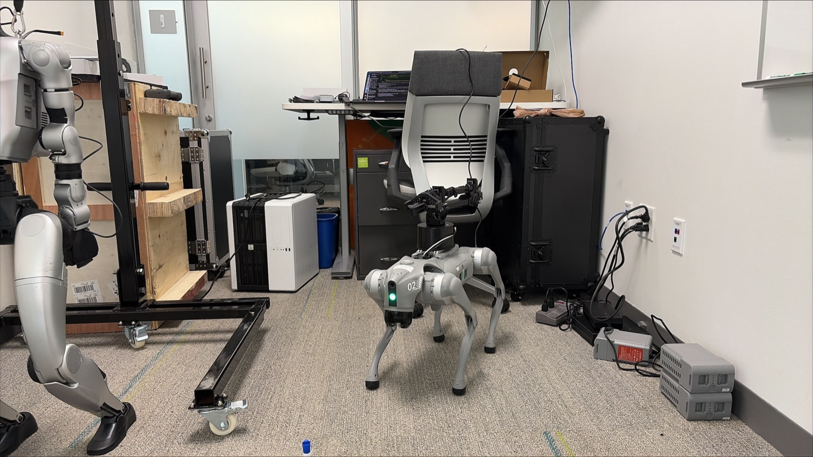

# Unitree Go2 EDU (+ Unitree D1 arm) — control + perception stack

The control + perception stack for the **Unitree Go2** quadruped carrying a **Unitree D1** servo arm on its
back. Same pattern as [`unitree/g1`](https://github.com/arm/arm-mhs-unitree-g1/blob/main/unitree/g1/): robot-scoped capability modules, each a `SKILL.md` beside
verified code, all driven by the one [robot descriptor](https://github.com/arm/arm-mhs-robotkit/blob/main/skills/discover-robot/descriptors/unitree_go2_edu.json).
The robot-agnostic control lives in [`lib/`](https://github.com/arm/arm-mhs-robotkit/blob/main/lib/); this tree is the Go2 binding of it.

> ⚠️ **Before any on-hardware control, read [`SAFETY.md`](../../SAFETY.md).** The Go2's high-level
> `SportClient.Move` commands a **persistent** velocity with no dead-man, and the low-level `rt/lowcmd`
> path holds the legs rigidly — both run the robot away if mishandled. Drive motion only through the
> closed-loop helpers or a `try/finally: stop()`, keep the [controller abort](controller/) + physical
> e-stop in reach, and never `kill -9` a control process.

<p align="center">
  
</p>

<p align="center"><em>The Go2 (D1 arm stowed on its back) in the robotics-lab test scene, facing the open
south door — the environment the stack was brought up in.</em></p>

## The stack

| Module | Capability |
|---|---|
| [`connect/`](connect/SKILL.md) | Put a host on the Go2's `192.168.123.0/24` net + CycloneDDS. Start here. |
| [`install/`](install/SKILL.md) | `unitree_sdk2py` env bring-up + a read-only `--verify` DDS probe (links CycloneDDS against the robot's existing `~/cyclonedds_ws`). |
| [`locomotion/`](locomotion/SKILL.md) | Walk / navigate — `SportClient` velocity on **measured `rt/sportmodestate`**, with the Go2 **motion-mode + lease** handling the G1 doesn't need. |
| [`d1_arm/`](d1_arm/SKILL.md) | The **D1 back arm** (6-DOF + jaw) over DDS `ArmString` (funcode JSON), clamped to the spec envelope. |
| [`lidar_sight/`](lidar_sight/SKILL.md) | Onboard **L1 dome LiDAR** → body frame, **cropped to the room** (the open door leaks scans); occupancy + `Navigator`. |
| [`controller/`](controller/SKILL.md) | Handheld remote → **any-button abort** (same 40-byte struct as the G1). Software halt, not the e-stop. |
| [`deploy/`](deploy/README.md) | Low-level `rt/lowcmd` `RobotIO` for the RL de-risk ladder, incl. the SDK↔Isaac **joint-order remap**. Scaffold — read the warnings. |
| [`depth_camera_sight/`](depth_camera_sight/README.md) | The front camera (VideoHub) + the add-on RealSense (VIO). Characterization **PENDING** an on-robot capture. |
| [`driver/go2`](../../driver/go2/SKILL.md) | The Go2 as an **MHS device** — walk / stand / arm / status RPCs over the fabric (the two-env bridge). |

## The robot — as discovered

The Go2 EDU exposes its full "AI" DDS surface on `192.168.123.0/24`:

| Host | Role |
|---|---|
| `192.168.123.161` | sport/motion MCU — `rt/lowstate`, `rt/sportmodestate`, `rt/api/sport/request` |
| `192.168.123.18` | onboard nav/AI Jetson (Orin, Ubuntu 20.04) — LiDAR graph-SLAM + SVO VIO; the SSH host |
| `192.168.123.100` | **expansion dock** (piggyback board) — bridges the **D1 arm's RJ45** onto DDS |

The **D1 arm** is a detachable 6-DOF + jaw payload (0.5 kg, ~0.55 m reach, 24 V/RJ45). It is not wired to
your host: the **expansion dock** bridges it onto the CycloneDDS bus as `rt/arm_Command` /
`rt/arm_Feedback` (`unitree_arm/ArmString`). It is a `payloads[]` entry + a `compute[].location:"expansion"`
node in the descriptor — see [`d1_arm/README.md`](d1_arm/README.md).

## What's different from the G1 (best-of-breed, not a mirror)

- **Velocity-first, gait-rich** locomotion (SportClient `Move` + named gaits) — not the G1's whole-body
  arm-reach ladder. Plus mandatory **motion-mode + lease** handling.
- **Reuse the onboard LiDAR-SLAM** (`rt/uslam/*`, `rt/utlidar/*`, `rt/api/slam_operate`) for navigation;
  the G1 has none, so its `lidar_sight` reimplements A* — here that's the fallback.
- The **arm is a payload**, not integral DOF (the G1's arms are `effectors`).
- **Cross-quadruped by design:** the reuse is the `LocomotionController` ABC + descriptor, so a
  DEEP Robotics dog drops in via [`lib/ros2_twist_locomotion.py`](https://github.com/arm/arm-mhs-robotkit/blob/main/lib/ros2_twist_locomotion.py)
  (`cmd_vel`/`odom`) with no native code. See
  [`operate the Go2 vendor-neutrally`](https://github.com/arm/arm-mhs-robotkit/blob/main/skills/quadruped-locomotion/SKILL.md).

## Verified status — honest

`verified_on_hardware: false` on this unit, by design. **Confirmed LIVE:** the full DDS/interface surface
(sport, `rt/lowstate`/`rt/sportmodestate`, `rt/utlidar/*`, `rt/uslam/*`, the wireless remote), the **D1
arm interface**, the **expansion dock**, and the onboard SLAM/VIO modules. **Read-only verified:** the
locomotion/arm/lidar/deploy code compiles, and every pure algorithm (arm protocol, LiDAR room-crop,
joint-order remap, controller latch, Twist mapping, driver RPC plumbing) is **unit-tested off-robot**
(44 cases). **Not yet done:** reading this unit's live `rt/lowstate` for its exact gains, a `lidar_sight` scan for the LiDAR
envelope, and one supervised motion + D1 move. The [descriptor's `provenance`](https://github.com/arm/arm-mhs-robotkit/blob/main/skills/discover-robot/descriptors/unitree_go2_edu.json)
lists the exact promote-to-verified steps.

## Quick start

```bash
# 1. connect + install (on the robot's Jetson or a host on its net)
./unitree/go2/install/install.sh --verify          # PASS/FAIL DDS probe, no motion

# 2. read-only sanity (no motion): mode + measured pose, then arm feedback, then LiDAR
python3 unitree/go2/locomotion/go2_locomotion.py --iface eth0 --seconds 5
python3 unitree/go2/d1_arm/d1_arm.py --iface eth0 --seconds 5
python3 unitree/go2/lidar_sight/go2_lidar_sight.py --iface eth0 --room -2 3 -2 2 --seconds 5

# 3. motion (clear area + abort + e-stop): typed confirmation required
python3 unitree/go2/locomotion/go2_locomotion.py --iface eth0 --forward 1.0
```
