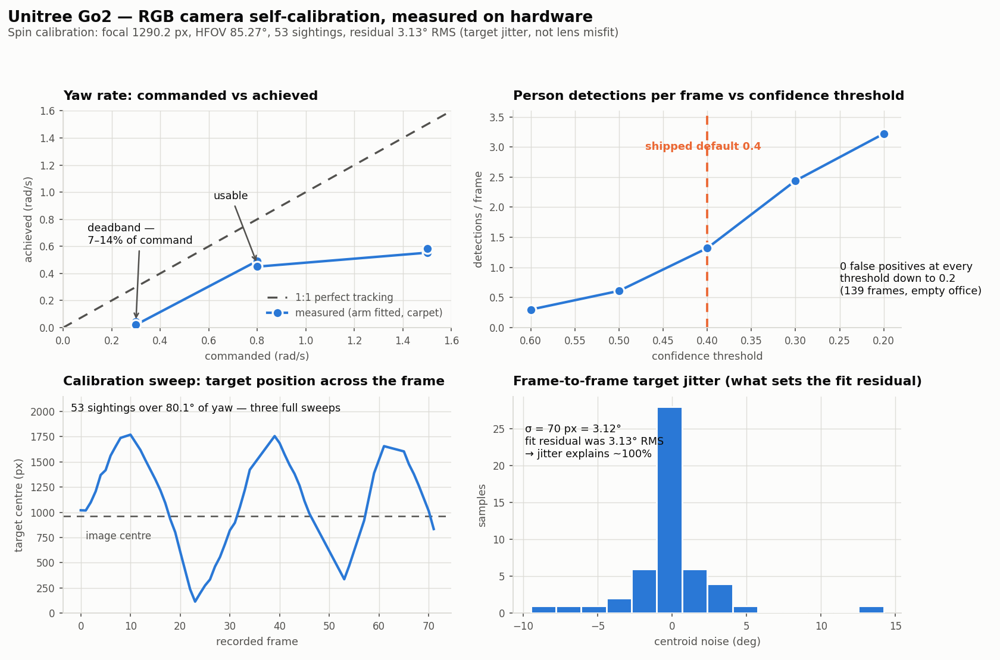

<!--
Copyright (c) 2024-2026, Arm Limited and Contributors. All rights reserved.
SPDX-License-Identifier: Apache-2.0
-->

# Unitree Go2 — visual navigation (walk to a goal, around obstacles, avoiding people)

Walk the Go2 to a goal using **only its front RGB camera**, going around a static
obstacle and giving way to people who walk across its path. No depth camera, no LiDAR,
no external tracking.


A live run on this robot: 2.0 m to a dead-reckoned waypoint, `arrived (0.96 m from
goal)`, giving way to a person who repeatedly crossed its path. Detections carry their
monocular range and the prior that produced it; the inset is the planner's own belief —
tracked people with velocity arrows, the latched goal, and the chosen command arc.
Measured over the run: 145 perception cycles at ~7 Hz with 0 errors, latency median
285 ms, motors 31 → 32 °C. Playback is real time.

```
VideoClient JPEG ─→ MobileNet-SSD person boxes ─→ fisheye bearing + size-prior range
                            │
                            ▼
         constant-velocity tracker in the ODOM frame (velocity, not just position)
                            │
                            ▼
    dynamic-window planner scored against PREDICTED people positions ─→ SportClient
```

## Quick start

```bash
source ../install/setup_env.sh          # LD_LIBRARY_PATH — mandatory, see below

# measure the camera. No tape measure needed: the robot turns and uses its own yaw
# odometry as the angular ruler. Stand ~2.5 m in front and stay still.
python3 calibrate_camera.py --spin --live --object-class person \
        --spin-rate 0.8 --spin-max-yaw 35 --start-delay 20 --latch-arm \
        --record calib.mp4 --out go2_front_camera.json

# rehearse: everything runs for real, nothing moves
python3 visual_nav.py --calibration go2_front_camera.json --marker-size 0.20 \
        --record dry.mp4

# live: stands, walks, lies back down
python3 visual_nav.py --calibration go2_front_camera.json --marker-size 0.20 \
        --live --record run.mp4

# walk to a detected CHAIR, going around a blue recycling BIN, giving way to people
python3 visual_nav.py --calibration ~/go2_front_camera.json \
        --goal-class chair --goal-height 1.0668 --goal-width 0.62 \
        --static-prop bin --arrive 0.8 --confidence 0.45 \
        --robot-radius 0.25 \
        --record run.mp4
```

`--live` is the only thing that moves a leg. Without it every stage runs against the
real camera and the planner prints what it *would* command.

**`--robot-radius 0.25` is not decoration.** `PlannerConfig.robot_radius_m` defaults to
0.40 m — the half-diagonal of the whole body, a defensible worst case and not what
anybody has flown. Every recorded run on this robot, including the two whose footage is
in this README and every telemetry header in `evidence/`, passed 0.25. At the default you
plan with a footprint 60% larger than every measured number here was taken with, and get
more `hold`s and wider berths than this document describes.

## Going around something the detector has never heard of

MobileNet-SSD knows twenty PASCAL VOC classes. A recycling bin is not one of them and
no confidence threshold reaches it — run the real detector over this robot's own
footage at 0.20 with all twenty classes enabled and nothing bin-like fires at all. Two
pieces close that gap, and they are separate on purpose.

**`colour_detector.py` finds it.** The bin being *blue* is the usable property. HSV
segmentation costs 10.2 ms against the person detector's 114 ms, so it rides along with
the person pass, and everything downstream — box, size prior, ranging — is reused
unchanged. Colour alone is not enough: the same mask also returns a strip of the glazed
wall and a blue tag on a cubicle, so three **shape** gates do the discriminating, of
which fill (contour area over box area) is the one that matters. Measured on the staged
scene: bin 0.85, wall strip 0.35.

**`static_map.py` remembers it.** A static obstacle must be *mapped*, not tracked, and
feeding a bin to the constant-velocity tracker is wrong three ways. It invents velocity
(an 18%-noisy range differentiates into motion the planner then swerves around); it
forgets (tracks prune at 3 s, and rounding an obstacle is exactly when it leaves a
120° field of view); and it re-learns from scratch on every re-sighting. A landmark
instead accumulates by information filter, so repeated sightings sharpen it rather than
move it, and it survives leaving the frame because nothing about a bin depends on being
looked at. Landmarks expire on *disagreement* — being looked straight at and repeatedly
not found — never on time.

Mapping the bin pays for one more thing. A landmark casts an angular **shadow**, and
`tracker.is_visible` now uses it: a person who steps behind the bin is *hidden*, not
absent. Without it the two ways of losing sight of someone got opposite treatment, and
the asymmetry ran the wrong way — 3.0 s of coast for leaving the camera cone against
0.57 s for vanishing inside it. That was observed live in issue #9: a volunteer stepped
into a doorway, the track was deleted, the robot read the lane as clear, accelerated,
and they reappeared already 0.19 m inside the hard gap.

### The goal, and why cropping is the whole trick

The chair is a VOC class, so it needs no colour trick — but at full frame the detector
does not see it either. SSD squashes its input to 300×300 whatever comes in, so a chair
240 px wide in a 1920-wide frame is **37 px** to the network. Run at full frame with all
classes at confidence 0.15 and `chair` does not fire once. Run the identical detector on
a **half-size centre crop** and it fires on 8 of 8 frames at 0.98. It was never too dark,
too far, or too occluded by the bin in front of it. It was too few pixels.

The crop is a translation, so boxes shift back by the crop origin and the full-resolution
camera model applies unchanged. The second inference is throttled to one pass every
`--goal-refresh` seconds (default 3.0) once a goal is held, because a latched goal only
needs re-measuring as fast as the odometry under it drifts.

## What is measured, on this robot

| Property | Measured |
| --- | --- |
| Camera | 1920×1080, **14.7 new frames/s** (67 ms apart, very steady) |
| JPEG decode (1080p) | ~25 ms |
| MobileNet-SSD @300² | **131 ms** (7.6 fps) — CPU, 4 cores |
| MobileNet-SSD @224² | 76 ms (13.2 fps) |
| ArUco detect @960×540 | ~29 ms |
| **End-to-end perception latency** | person only: **130–320 ms**; with colour + goal passes: **median 309 ms, p90 436, max 598** |
| Control loop | 10 Hz, decoupled from perception |
| False positives, empty office | **0 in 139 frames, down to confidence 0.2** |
| D1 arm at rest | jaw 0.137 m from base (max reach 0.733 m) |
| Leg motors idle | ~30 °C |
| **Velocity actually achieved** | **0.45 × commanded** (translation); **0.44** (yaw) |

### ⚠️ The robot delivers under half the velocity it is commanded

Over the 116 standing ticks of the approved run it travelled **2.09 m against 4.32 m
commanded**. A least-squares fit of pose-derived body velocity against the command gives
0.45 for translation and 0.44 for yaw, with 0.07 m/s of residual.

**Fit it against `measured` and you get a different and wrong answer** — "unbiased, sd
0.17 m/s", i.e. the entire shortfall charged to noise. The pose is what settles it: the
estimator's own error is only 0.041 m/s against pose-derived velocity, so what is missing
is real motion and not a bad reading. It is the same phenomenon the calibration section
already documents for yaw (`0.30 rad/s commanded → 0.02–0.04 achieved`), which is worth
noting because it means the effect is **rate-dependent** — small commands achieve
proportionally less — and 0.45 is the fit across the range this run used.

Anything that plans in *time* has to halve its speed assumption. "2 m at 0.35 m/s = 6 s"
is out by a factor of two, and a `--max-seconds` budget set from it cannot be met.

One run, tethered, with the 3.15 kg D1 arm, on the derated envelope. It is a property of
that configuration rather than of a Go2, and it is the first thing to re-measure on any
other robot.

**⚠️ 0.45 is the DERATED figure and does not hold at full speed.** On an arriving run at
the shipped `0.35 m/s` (2026-08-14) the robot delivered a mean **0.240 m/s — a ratio of
0.70**, with a 0.415 m/s peak. So the gain is strongly rate-dependent across the whole
range, not just near the floor: roughly 0.45 derated, 0.70 at full command, and 0.0 below
the gait floor documented in the next section. Use 0.70 when budgeting `--max-seconds`
for a full-speed run and 0.45 for a derated one — and if the two matter to a decision,
measure rather than interpolate, because the one thing this curve has proven is that it
is not linear.

### 🛑 THE ROBOT WILL NOT WALK BELOW ~0.35 m/s — IT STANDS STILL AND REPORTS NOTHING

**This is the same rate-dependence as above, taken to its endpoint.** "Small commands
achieve proportionally less" does not decay gracefully to zero: below roughly the shipped
`0.35 m/s` the gait never engages at all. The robot stands up, takes a few asymmetric
one-or-two-leg steps, and then stands **perfectly still** while it is still being
commanded forward. It does not fall over. It raises no fault. `MIN_GAIT_COMMAND_M_S` in
`avoidance.py` carries the number and `visual_nav.py` prints a loud warning below it.

Measured 2026-08-14, on carpet, with the 3.15 kg D1 arm fitted:

| commanded | what the legs did | outcome | runs |
| --- | --- | --- | --- |
| **0.21 m/s** | 10–23° of knee swing in bursts, one or two legs at a time, then **3 s at exactly 0.0°** | travelled 0.34–0.43 m and stopped | **5** |
| **0.35 m/s** | 15–28°, continuous, all four | **2.07 m in 9 s, arrived** | 1 |

**Why this costs hours rather than minutes.** The failure is indistinguishable from being
physically stuck, and every instrument agrees with every other one:

- the joint encoders read **0.0°** of swing — the legs really have stopped;
- the state estimator correctly reports no motion, so odom and `measured` are *right*;
- the stall gate then fires with *"something is holding the robot — check the tether"*.

So the log names the tether, the odometry corroborates it, and the encoders confirm the
robot is not moving. All true, all pointing away from the cause. Five runs went on
tethers, walls and the Go2's built-in obstacle-avoidance setting before the speed itself
was tested.

**The traps that get you here without typing a slow number:**

- `--derate 0.6` on the shipped envelope is **exactly 0.21 m/s**, the measured failure.
- A "speed-matched" A/B control that caps `--max-vx` to match another controller puts
  **both arms** below the floor, so the comparison looks environmental and exonerates
  whatever you were testing. That is how these five runs happened.
- The MAPPO package previously shipped `command_scale` **0.6**, which multiplies the
  same `0.35`; it now ships 1.0 because the 0.21 m/s result did not sustain a gait.

**0.35 is the lowest speed observed to work, not a measured threshold.** Anything between
0.21 and 0.35 is untested. Treat it as a floor, and re-measure on any other robot — like
the 0.45 figure above, it is a property of *this* robot, tethered, with the arm fitted.

### ⚠️ `hold` can be terminal — there is no recovery behaviour

`hold` is a fallback taken when no sampled command clears the hard gap, and reverse is
never sampled. Together those make it possible for the planner to walk itself into a
position it cannot leave, and then hold until the run budget expires.

Measured in closed-loop simulation, 30 seeded scenarios, one static obstacle 0.9–1.9 m out
and within ±0.35 m of the straight line, in a 3 m arena:

| | |
| --- | --- |
| arrived | 14/30 |
| **timed out holding** | **14/30** |
| collided | 2/30 |

A representative failure parks at 0.09 m of clearance — inside `STATIC_HARD_GAP_M` — and
emits `hold` for the remaining 40 s without moving. Raising the actuator model to perfect
tracking recovers it to 23/30, which says the deadlock is substantially **caused by the
velocity gain above**: the rollout assumes the command is achieved, so the planner
consistently over-estimates its own progress and commits to gaps it then cannot make.

A long stationary `hold` therefore needs intervention rather than patience.

## The five decisions worth knowing

**1. Range comes from angular size, not from the ground plane.** The obvious
monocular ranger intersects the ray through a person's feet with the floor. It is
unusable here: the camera is ~0.32 m up, so a person at 3 m sits only 6° below the
horizon and range goes as `h/tan(elevation)` — 2° of trunk pitch (a trotting Go2 does
more) swings the estimate from 2.3 m to 4.4 m. Angular size gives
`d = L / (2·tan(Δθ/2))`, whose relative error is just the relative error in the pixel
span, and which does not care about pitch at all.

**2. A person closer than ~2.1 m has their head out of frame.** Work the geometry
through: camera 0.32 m up, ~67° vertical field, 1.7 m person. That is precisely the
band where avoidance matters, and a clipped box is *shorter* than the person, so a
naive height prior reports them FURTHER away — the one error direction that gets
someone walked into. `estimate_range` switches to a shoulder-width prior when the box
is vertically clipped and caps it at the fit distance, and reports a fixed close range
when the box is clipped both ways. Width is noisier (a person in profile reads ~0.3 m
not ~0.5 m) but that error makes them seem *nearer*, which is safe.

**3. Tracking happens in the odom frame, so ego-motion cannot masquerade as obstacle
motion.** Differencing body-frame positions while the robot turns at 0.6 rad/s gives
every stationary person ~1.8 m/s of phantom sideways velocity — exactly the signal the
planner would swerve on. Each measurement is converted to the estimator's fixed odom
frame first, using the pose sampled at **local frame arrival**, not after inference.
The Go2 RPC does not expose a sensor shutter timestamp, so transport latency remains
part of the measured calibration and safety margin.
`test_tracker.py::test_ego_rotation_does_not_create_phantom_velocity` pins it.

**4. People are planned against where they will BE.** `lib/navigation.py` (A\* over an
inflated occupancy grid) is the right tool for walls and the wrong one for a walking
person — a grid is a snapshot, so the robot re-plans around where someone *was* and
chases their trail. The dynamic-window planner rolls each candidate velocity forward
2.5 s alongside each person's predicted motion, so the robot commits to a gap that is
still open when it arrives, and passes behind a crosser rather than into the space
they are vacating.

**5. Swerve early, stop late.** When no sampled command clears the hard gap, the
planner commands a **stop**, not the highest-clearance escape. Lunging a 15 kg robot
sideways on a monocular estimate, at the moment that estimate is worst, into space
this pipeline has never observed, is worse than freezing — and people walk around a
stationary robot instinctively. The 2.5 s horizon is what makes the graceful sidestep
happen earlier, while there is still room. Reverse is never sampled at all: there is
no rear-facing sensing on this unit.

## Resting the legs

The D1 arm (3.15 kg, cantilevered) loads the hind legs continuously; a previous
session found them saturating badly enough that the robot could not hold a stand for
60 s and squatted unannounced. So **standing is treated as a cost, not the default
posture**:

- the run starts **prone** and acquires its goal prone — perception is fully
  functional lying down, which is what makes this practical rather than merely careful
- it stands only when the planner has a move to make
- if the path stays blocked for `--rest-after` seconds (default 15) it **lies back
  down** and keeps watching, standing again when the way clears
- every exit path — arrival, timeout, abort, exception, Ctrl-C — stops and lies down

`safety.py` refuses to walk unless the arm is stowed, judged by forward kinematics
rather than by joint angles — **both** that the jaw is within 0.30 m of the arm base
*and* that it sits within 0.05 m of the dorsal centreline, because a compact arm
swung out over the flank keeps its reach exactly while its mass moves. It aborts the
run on motor temperature or battery.

**Locking the arm is a hard requirement, not an option.** An unpowered D1 back-drives:
its base yaw is free and crept **13.4°** during a turning test, and 3.15 kg off the
centreline throws the vendor locomotion controller off balance. So `visual_nav.py`
latches by default and **refuses the run if the latch did not take**; `--no-latch-arm`
exists only for an arm already locked by other means. `calibrate_camera.py` keeps its
opt-in `--latch-arm` for the same reason before a spin.

Apart from that latch the arm is **read**, never driven. `latch_arm()` issues funcode 5
damp-enable, holding each joint at the angle it is *already* at — no trajectory is ever
commanded, so it cannot fling the arm. The operator hand-poses it flat along the spine
first; see [`SKILL.md`](SKILL.md) for the procedure and the measured stow coordinates.

## Calibration

`focal_px` is the single number the whole metric scale rests on, and this robot ships
no intrinsics for its front camera (its VIO calibration describes a RealSense that is
not fitted). Without `--calibration` the code says so on every run and uses a nominal
120° field of view.

**Measured on this unit: focal 1290.2 px, HFOV 85.27°** (`go2_front_camera.json` —
this robot only, not transferable). Full method, media and evidence in
[`SKILL.md`](SKILL.md).

<picture>
  <source media="(prefers-color-scheme: dark)" srcset="images/go2-calibration-charts-dark.png">
  
</picture>

- `calibrate_camera.py --spin --live` — **the accurate one.** The robot turns on the
  spot and its own yaw odometry is the angular ruler: no tape measure, no size prior,
  no printed fiducial, and it samples the model right across the frame. Needs
  ~0.8 rad/s (below ~0.4 this robot will not turn at all) and a target visible from
  the **standing** pose.
- `calibrate_camera.py --marker 1.500` — ArUco at a tape-measured distance. No motion.
- `calibrate_camera.py --object 0.51 --object-height 0.254` — any detected object of
  known height. Convenient, least precise: an SSD box measured ~8% taller than the
  object it bounds on this robot, and that error goes straight into the focal length.

For either static method, measure at the **longest** distance the target is still
detected: placement error is roughly constant in metres, so ±3 cm is 8% at 0.37 m and
2% at 1.5 m.

## Detection range, and what limits it

MobileNet-SSD squashes the frame to 300×300, where a person at range `d` is about
`433/d` pixels tall. Measured recall falls away below ~45 px — about **9.6 m**. So:

| Range | Person height in the network input | Detection |
| --- | --- | --- |
| 2 m | 217 px | reliable (head clipped in frame; width prior takes over) |
| 4 m | 108 px | reliable |
| 6 m | 72 px | good |
| ~9.6 m | 45 px | marginal |

The tracker's `max_range_m` is set to 6 m for this reason — it is a property of the
detector, not of the camera. Beyond it, a missing detection does not count against a
track, so someone at the edge of detectability coasts through a flickering detection
instead of being repeatedly created and destroyed.

Confidence defaults to **0.4**, below the customary 0.5, because the errors are not
symmetric: a false positive costs a needless stop, a miss costs walking into someone.
On hard footage 0.5 → 0.4 took detections from 0.61 to 1.32 per frame; on 139 frames
of the robot's own empty office there were zero false positives all the way down to
0.2. (0.4 rather than 0.2 because that figure comes from one static scene.)

## Scope — read before trusting it near furniture

**This pipeline models moving obstacles plus one named static prop. That is not
static-obstacle sensing.** With `--static-prop` the robot finds a *specific* object it
has been told the colour and size of and maps it in odom — it recognises one thing it
was told to expect. A monocular camera with a size prior can range a *person* because it
knows how big people are, and can range the bin because it was handed a tape measure. It
still knows nothing about a wall, a table leg or a doorframe. Keep the lane clear of
everything except the props and keep an operator on the remote. For general static
geometry the robot's LiDAR and `lib/navigation.py` are the right tools; fusing the two is
the obvious next step rather than something this module quietly pretends to do.

Other limits worth stating plainly:

- Only `person` is tracked as a mover by default (`DYNAMIC_CLASSES`). A pushed trolley
  is invisible. `--static-prop` adds a *colour-segmented* static prop, which is a
  different and much narrower mechanism — it finds one known colour, not objects.
- **Colour segmentation is fragile by construction.** It finds the staged bin reliably
  and will find anything else of the same blue that passes the shape gates. Record every
  run; `replay.py --static-prop bin` re-runs the gates against the footage off-robot.
- **The default detector confidence produces a phantom person in this office.** On the
  staged lane a dark doorway with a plush toy on top scores `person` 0.41–0.45 on ~6% of
  frames, ranged at 2.91 m — sparse, but a hit every 3 s is enough to hold a track alive
  indefinitely, and it sits squarely in the robot's path. Measured separation: the
  phantom never exceeds **0.45**, while every real-person detection from the issue-#9
  footage survives at 0.45 (9 of 9, the same count 0.40 gives). `--confidence 0.45` is
  the right setting for this staging. The module default stays at 0.40, which is
  justified by a measurement in a different scene; this is a per-scene call and the log
  line (`obst=[binx1,personx1]`) is what makes it visible.
- The odom frame drifts. Goals are re-latched on every sighting, so an ArUco goal
  self-corrects; an `--waypoint` goal does not.
- Perception is a few hundred ms behind reality — median 309 ms, p90 436 ms with the
  colour and goal passes running, against a 0.6 s staleness guard whose worst observed
  cycle was 0.598 s. Tracks are extrapolated to the present and
  their radii grown to cover it, but a person who changes direction sharply inside
  that window is modelled worse than one walking steadily.
- The Go2's own obstacle-avoidance modes are left off, so that what the robot does is
  attributable to this pipeline. Turning them on would add a safety layer and destroy
  that attribution.

## Files

| File | What it is |
| --- | --- |
| `visual_nav.py` | the runnable — wiring, lifecycle, watchdogs, CLI |
| `camera.py` | threaded `VideoClient` grabber; drops repeat JPEGs before decoding |
| `camera_model.py` | equidistant fisheye: pixel ↔ bearing, angular-size range |
| `person_detector.py` | MobileNet-SSD + the truncation-aware ranger |
| `tracker.py` | multi-target constant-velocity KF in the odom frame |
| `expansion.py` | ego-motion consistency gate: drops a track whose range does not fall as odometry demands |
| `avoidance.py` | dynamic-window planner over predicted obstacle motion |
| `goal.py` | ArUco beacon / detected object / dead-reckoned waypoint, latched in odom |
| `colour_detector.py` | HSV segmentation of a known-coloured prop the detector cannot see |
| `static_map.py` | odom-frame landmarks for things that do not move, + occlusion shadows |
| `safety.py` | arm-stow (FK) and thermal/battery guards |
| `overlay.py` | annotated debug view + top-down plan inset |
| `calibrate_camera.py` | focal-length measurement, three methods (spin / marker / object) |
| `replay.py` | run the detector + tracker over any video, no robot needed |
| `telemetry.py` | machine-readable JSONL record of every control tick — the downstream interface |
| `test_*.py` | **311 offline tests**, no robot: `for t in test_*.py; do python3 $t; done` |
| `ruff.toml` | this directory's lint contract (line length, py38 target) |
| `go2_front_camera.json` | the measured camera model for THIS unit |
| `images/` | live-run and calibration GIFs, measured-data charts, setup photo |

## `--expansion-filter` — checking a size prior against the robot's own odometry

⚠️ **Off by default, and it should stay off until a walking run says what it catches.**

Every range this pipeline produces comes from a size prior, so a detector that no longer
knows what it is looking at produces ranges that are wrong by whatever factor the prior
is wrong by. MEASURED on the 2026-08-24 peer corpus, read class-agnostically: a Go2 Wheel
filling the frame is ranged at **2.05 m** by the 1.70 m person prior, and the same peer
at mid-corridor at **6.05 m**. Both are out by about 4x, and no single frame can tell.

Ego-motion can. Range from a size prior is exactly proportional to true range, so the
LOGARITHMIC rate is prior-free: `d(ln R)/dt = -v_closing / R_true`. Hold the odom point a
track claims to occupy fixed, walk the robot's own poses past it, and compare the rate
that predicts with the rate observed. A box drawn around the far wall does not shrink the
way a thing at 2 m has to.

`--expansion-filter` withholds a confirmed track from the planner when its range falls
**more slowly** than odometry demands, by 4 sigma, *and* the observed rate puts contact
beyond 8 s. It is one-sided by construction: a track shrinking FASTER than predicted —
nearer than reported, or walking at the robot — raises no verdict at all, so the gate can
only ever discard a threat it had over-estimated. A withheld track is NOT deleted; it
keeps being tracked and can be restored.

What it costs and what it reaches, from the measured noise floor
(`sigma(ln R) = 3.07%` per sample with the ranging source held):

| reported range | drops when really this many times further, at 0.35 m/s | at 0.8 m/s |
| --- | --- | --- |
| 1.5 m | 2.75x | never |
| 2.0 m | 2.05x | 6.35x |
| 3.0 m | 1.35x | 3.25x |
| 4.0 m | 1.20x | 2.35x |

Read down the "really this far away, in metres" column instead and it is nearly flat: the
gate starts dropping when the object is really about **4.1 m** off at the gait floor and
**9.4 m** at 0.8 m/s. It looks like a test of the size prior and behaves like a test of
true range.

**It has never run against a moving robot.** The corpus that set its threshold is 2,800
frames of a PARKED one — net camera motion at most 14.7 px at 480-wide over an entire
clip — so it measures the noise and says nothing about the signal. See
`evidence/2026-08-25-expansion-as-a-false-positive-filter/` for what that corpus did and
did not settle, including that the 18% class-agnostic false-alarm rate it was built to
reduce turned out to be 192 mislabelled frames and is actually 0 of 705.

Two limits worth knowing before switching it on:

* **A mis-scaled ghost and a retreating real obstacle are the same measurement.** One
  monocular range series cannot separate them. Bearing parallax could — it is immune to
  radial target motion — and is degenerate straight ahead, which is where obstacles are.
* **The dangerous half of the error is untouched.** A person prior on a small robot
  reports it too FAR, and this gate is deliberately silent on that.

## Telemetry — the interface for anything downstream

The console log is for a person. `--telemetry run.jsonl` is for a program.

```bash
python3 visual_nav.py ... --record run.mp4 --telemetry run.jsonl
```

One JSON object per **control tick** — including the ticks that commanded nothing, since
a hold is as much a part of an episode as a stride. Every line carries the robot's pose,
the goal in odom coordinates, the full obstacle list with positions, velocities and
radii, the command with the planner's reason, and `perception.video_frame` — the index of
the matching frame in `--record`, which is the join key to the footage.

### `--record-raw`, for the half of the run that is data rather than evidence

`--record` writes the frame **after** the HUD, the plan-view inset and a box around every
detection are drawn on it. That is what makes it readable, and it is exactly what makes it
useless as training data: the label is burned into the pixels a model would have to learn
from, and the only frames without a box drawn on them are the ones the detector missed.

```bash
python3 visual_nav.py ... --record run.mp4 --record-raw run-raw.mp4 --telemetry run.jsonl
```

`--record-raw` writes the same frames **before** anything is drawn, at the same cadence —
once per perception cycle — and with the same frame indices, so `perception.video_frame`
addresses both files and the telemetry's `sightings` (box, label, score, range, bearing)
become per-frame labels for the undecorated pixels. Off by default; either flag works
without the other. See issue #77 for why the pixels are the irreplaceable half.

This exists because the console log is prose and was measured not to carry what a
consumer assumed. Across a 107-tick live run it printed the robot's pose **once**, in a
start-up banner, and no camera data at all (`lat=235ms` is a frame's *age*). It is also
not stable: `people=0` became `obst=[binx1,personx1]` the week a bare count stopped being
able to distinguish a mapped bin from a ghost. `SCHEMA` is versioned; fields are added
freely, and anything renamed or removed bumps it.

```json
{"type": "tick", "t": 6.46, "pose": {"x": -2.464, "y": 2.112, "yaw": -1.613},
 "goal": {"x": -2.332, "y": -0.800, "distance_m": 2.915},
 "obstacles": [{"label": "bin", "x": -2.276, "y": -0.081, "vx": 0.0, "vy": 0.0,
                "radius_m": 0.23}],
 "command": {"vx": 0.35, "vy": -0.135, "wz": 0.09, "reason": "goal", "gap_m": 0.752},
 "perception": {"seq": 83, "frame_age_s": 0.564, "video_frame": null},
 "posture": "standing", "live": false}
```

`gap_m` is `null`, not `Infinity`, when the lane is clear — `json.dump` writes a bare
`Infinity` token that is valid JavaScript and invalid JSON, and a clear lane is the
common case on a good run. Lines are flushed individually, because Ctrl-C is the normal
way one of these ends and the last seconds are the ones that explain why.

## Model files

`MobileNetSSD_deploy.prototxt` and `MobileNetSSD_deploy.caffemodel` (~23 MB) are not
vendored. Put them in `~/go2_models` (or pass `--model-dir`). The robot has no
internet, so fetch them on a workstation and `scp` them across.

## Setup

`source ../install/setup_env.sh` first, always. Every RPC client on this robot —
`VideoClient` included — segfaults while serialising a request unless
`LD_LIBRARY_PATH` points at the CycloneDDS build its Python binding was compiled
against. That script's header has the full diagnosis.
