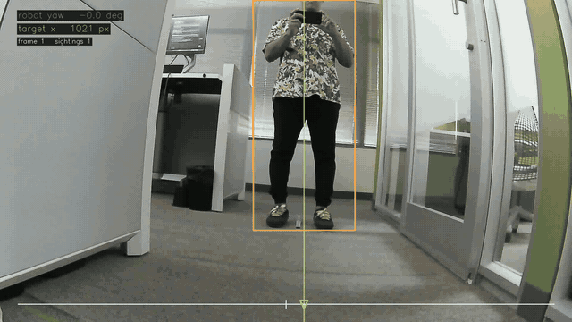
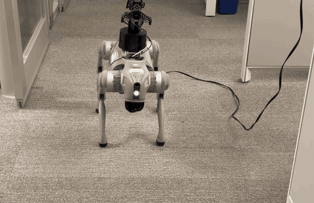
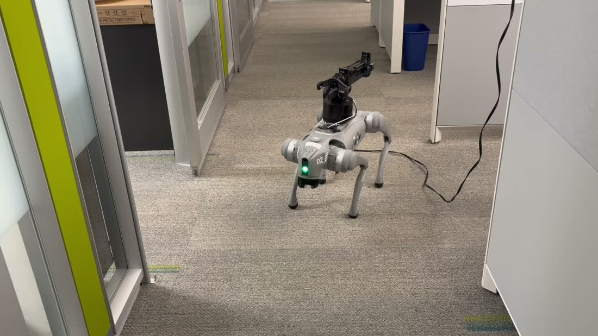

# Unitree Go2 — visual navigation (RGB-only, person-aware)

Full reasoning, measured numbers and limits are in **[`README.md`](README.md)** — this
skill is the agent entry point. Runnable: [`visual_nav.py`](visual_nav.py).


**Hardware-verified.** The robot walks 2.0 m to a dead-reckoned waypoint and arrives
0.96 m from it, giving way to a person crossing its path. Boxes are detections with
their monocular range and which size prior produced it; the top-right inset is the plan
view — tracked people with velocity arrows, the latched goal, and the arc the planner
chose. Of 107 control ticks: 63 `goal`, 24 `avoid`, 20 `hold`. **Every one of the 12
ticks where the gap went negative commanded a full stop.** GIF is real time (5.75 fps,
the rate perception actually achieved under walking load).

## When to use

- Drive the Go2 **to a goal on camera alone** — no LiDAR, no depth, no motion capture.
- **Avoid people who are moving**, where a static occupancy grid would chase their trail.
- **Go around one known static prop** — a *specific* object you can name by colour
  (`--static-prop`) or a VOC class. Mapped in odom so it survives leaving the frame.
- **Walk at a detected object** rather than a printed marker (`--goal-class chair`).
- **Range something monocularly** from a known size (`camera_model.range_from_span`).
- Tune or regression-test detection/tracking/segmentation **without a robot**
  (`replay.py`, including `--static-prop` for the colour gates).

Do **not** use it to avoid walls, furniture or doorframes — it still cannot see them.
`--static-prop` finds ONE known colour that passes three shape gates; it is not
static-obstacle sensing and does not make the lane safe. General static geometry is
[`../lidar_sight`](../lidar_sight) plus [`lib/navigation.py`](../../../lib/navigation.py).

## How to use

```bash
source ../install/setup_env.sh                # mandatory: RPC segfaults without it

# measure the camera — no tape measure, no fiducial. Operator stands ~2.5 m in
# front and stays still; the robot turns and fits against its own yaw odometry.
python3 calibrate_camera.py --spin --live --object-class person \
        --spin-rate 0.8 --spin-max-yaw 35 --start-delay 20 --latch-arm \
        --record calib.mp4 --out go2_front_camera.json
python3 visual_nav.py --calibration go2_front_camera.json --robot-radius 0.25 \
        --record dry.mp4                                    # rehearse
python3 visual_nav.py --calibration go2_front_camera.json --robot-radius 0.25 \
        --live --record run.mp4
```

`--live` is the ONLY flag that moves a leg. Everything else runs the real camera,
detector, tracker and planner and just prints the commands.

Goal is an ArUco marker by default; `--waypoint FWD LEFT` dead-reckons instead, and
`--goal-class chair --goal-height 1.0668` walks at a detected object.

```bash
# the staged scene: walk at a CHAIR, around a blue BIN, giving way to people
python3 visual_nav.py --calibration ~/go2_front_camera.json \
        --goal-class chair --goal-height 1.0668 --goal-width 0.62 \
        --static-prop bin --arrive 0.8 --confidence 0.45 --record run.mp4

# tune the colour gates offline against a recording — no robot involved
python3 replay.py scene.mp4 --calibration ~/go2_front_camera.json --static-prop bin
```

**Feeding something downstream?** Use `--telemetry run.jsonl`, not the console log. One
JSON object per control tick: pose, goal in odom, every obstacle with position/velocity/
radius, the command and its reason, and the index of the matching `--record` frame.
The console log carries the pose exactly ONCE per run and no camera data, and its fields
change to stay legible — `people=0` became `obst=[binx1,personx1]` in one week.

**Measure the props.** Every range scales linearly on `--goal-height` and the profile's
height, so they are tape-measure numbers, not estimates. On the staged scene the
operator's pacing put the bin at "about 3 m" and the camera measured **2.15 m** — a 40%
error, and the ranges would have inherited all of it.

## Self-calibration: what it looks like and what it measured

The robot turns on the spot while tracking a target, and **its own yaw odometry is the
angular ruler**. No tape measure, no size prior, no printed fiducial. As it yaws one
way the target slides the other; that the two move by equal and opposite angles *is*
the calibration.

Left: the robot's own camera, with the two fitted quantities burned in — `robot yaw`
and `target x`. Right: the same run from outside.

| The camera's view (annotated) | The robot |
| --- | --- |
|  |  |

Full-length source video of the external view (45 s, unclipped):
https://github.com/user-attachments/assets/12ace366-d2d8-4dc9-81ae-f6997fb6eece



### Measured, on this robot

<picture>
  <source media="(prefers-color-scheme: dark)" srcset="images/go2-calibration-charts-dark.png">
  
</picture>

**Two spin runs, and what changed between them.** The only difference is *when the
robot's heading was sampled*. Run A read it after the detector returned; run B reads
it when the newest JPEG arrives locally, off `Frame.stamp`:

| | run A — yaw sampled late | run B — yaw at frame arrival |
| --- | --- | --- |
| sightings / yaw span | 40 / 70.5° | **53 / 80.1°** |
| focal length | 1349.7 px | **1290.2 px** |
| HFOV | 81.51° | **85.27°** |
| fit residual | 5.03° RMS | **3.13° RMS** |

At the ~27 °/s the sweep achieves, frame age turns straight into heading error, and it
**flips sign with sweep direction** — which inflates the residual without moving the
fitted value much. Hence `Go2Camera(stamp_fn=...)`. The RPC does not expose a sensor
shutter timestamp, so transport latency is still included in the fit and safety margin.

**The residual is the target, not the lens.** 3.13° sounds like a bad fit until you
measure the target's own noise: a person's bounding-box centre wobbles **70 px = 3.12°**
frame to frame (weight shifts, arm swing, SSD box jitter). That accounts for
essentially all of it — `spin_fit_quality()` now reports the split, so the tool says
so itself instead of blaming the model. Standard error on the fit: **±0.43°**.

**Independent cross-check.** A completely different method — the static
`--object` fit against a 10-inch canister at a tape-measured 20 inches — gives
**86.66°** against the spin's **85.27°**. Two methods with unrelated error sources,
agreeing to **1.6%**.

**The yaw deadband that broke the first attempt.** The first sweep achieved only 6.7°
of yaw and the `MIN_SPIN_YAW_DEG` guard correctly refused to emit a calibration:

| commanded | achieved | tracking |
| --- | --- | --- |
| 0.30 rad/s | 0.02–0.04 | **7–14%** |
| 0.80 rad/s | 0.45–0.49 | 56–61% |
| 1.50 rad/s | 0.55–0.58 | 37% (saturated) |

**Use ~0.8 rad/s** — this is now the `--spin-rate` default (`SPIN_RATE_RAD_S`), so the
flag in the command above is belt-and-braces rather than a correction. Below ~0.4
(`SPIN_DEADBAND_RAD_S`) this robot does not reliably initiate a turn at all.

⚠️ **Calibration runs displace the robot.** `_return_to_yaw` restores the *heading*
(to protect the Ethernet tether) but nothing restores *position*: an in-place turn on
carpet with a 3 kg cantilever slips, and the odometry drifts with it. Observed across
runs: ~0.2 m per sweep typical, once 1.2 m of reported `x`. **Re-stage between runs.**

`go2_front_camera.json` in this directory is the measured result for **this unit**.
It is not transferable — every robot needs its own.

## Pre-flight: lock the D1 back arm before ANY motion

> **Hard requirement.** This applies to walking as much as to spinning. `visual_nav.py`
> latches the arm by default and refuses to run if the latch did not take; pass
> `--no-latch-arm` only if it is already locked by other means. `calibrate_camera.py`
> takes `--latch-arm` before a sweep.

The D1's base yaw (`angle0`) has nothing to rest against, so an **unpowered arm
swivels while the robot turns** — measured on this unit at **6.2° → 19.6°, i.e. 13.4°**
across one turning test. That is 3.15 kg moving off the centreline mid-turn, and it is
a real balance disturbance, not a rounding error.

**Procedure** — the operator does step 1, `--latch-arm` does 2–4:

1. **Hand-pose it.** A discharged D1 back-drives freely: place it by hand flat along
   the dorsal centreline, as low as it goes. Support its weight; never lift the robot
   by the arm.
2. **Verify.** Forward kinematics must put the jaw inside `STOWED_REACH_M` (0.30 m).
   Latching an extended arm would freeze a 3 kg lever out over the robot's side.
3. **Latch.** funcode 5 damp-enable (`D1Arm.enable()`). Each joint holds the angle it
   is **already at** — no trajectory is commanded, so the arm cannot move to get there.
   This is the only D1 command on this unit that cannot fling it.
4. **Confirm.** Re-read the angles and check the drift. `enable_status` is unreliable
   on this firmware, so the proof is that the joints stopped moving.

**Measured dorsal-stow coordinates on this robot** (`safety.DORSAL_STOW_ANGLES_DEG` /
`DORSAL_STOW_JAW_XYZ_M`) — a reference to check a pose against, **not** a set-point;
nothing commands the arm to them:

| Quantity | Value |
| --- | --- |
| Joint angles J0..J5 (deg) | `1.4, -90.5, 88.0, 1.3, 20.0, -0.5` |
| Jaw in arm-base frame (m) | x `+0.074` fwd, y `+0.002` left, z `+0.116` up |
| Reach from base | **0.138 m** (stow limit 0.30, max reach 0.733) |
| Drift right after latching | **0.10°** |
| Base-yaw creep over a later turning test | **5.3° latched**, vs **13.4° unpowered** |

`y = +0.002 m` is the number that says "on the centreline". J0 ≈ 0 is what puts it
there.

⚠️ **The latch reduces the swivel; it does not abolish it.** Do not assume a latched
arm is rigid. And to undo the latch, discharge only while the arm is folded low as
above — discharging a *raised* arm drops it.

## Safety

- The run starts and ends **prone**; the robot stands only while it has a move to
  make, and lies back down if blocked for `--rest-after` seconds. This is because the
  3.15 kg D1 arm loads the hind legs continuously.
- `safety.py` **refuses to walk** unless the D1 arm is stowed (forward kinematics: jaw
  within 0.30 m of the arm base) and aborts on motor temperature or battery.
- Envelope defaults are the arm-fitted conservative profile: 0.35 m/s forward,
  0.20 m/s strafe, 0.70 rad/s yaw. `--derate` scales the lot. **Those are the numbers
  COMMANDED, not the numbers achieved — see below.**
- ⚠️ **The derated robot delivered about 0.45 of the velocity it was commanded.** Over the 116
  standing ticks of the approved run it travelled **2.09 m against 4.32 m commanded**;
  a least-squares fit of pose-derived body velocity against the command gives **0.45**
  for translation and **0.44** for yaw, with 0.07 m/s of residual. The POSE is what
  settles this — fitting against `measured` instead charges the whole shortfall to noise
  and reports an unbiased 0.17 m/s, but the estimator's own error is only 0.041 m/s
  against pose-derived velocity, so the shortfall is real motion. **Anything that plans
  in time must halve its speed assumption**: "2 m at 0.35 m/s = 6 s" is out by a factor
  of two, and `--max-seconds` set from it is a budget the robot cannot meet. One run,
  tethered, with the 3.15 kg arm, on the derated envelope — a property of that
  configuration rather than of a Go2. A later full-command run measured 0.70, so budget
  with the gain measured at the envelope actually being used; do not interpolate through
  the gait floor below.
- **`--robot-radius` defaults to 0.40 m and every recorded run used 0.25.** The default
  is the half-diagonal of the whole body, which is a defensible worst case and is not
  what anybody has flown: the GIF at the top of this file, the approved run and every
  telemetry header in `evidence/` were all `--robot-radius 0.25`. Run at the default and
  you plan with a footprint 60% larger than every published measurement, so expect more
  `hold`s and wider berths than this document describes. **Pass it explicitly.**
- Reverse is never commanded — this unit has no rear-facing sensing.
- Keep the lane clear of static obstacles and an operator on the remote.

## Gotchas

- 🛑 **THE ROBOT WILL NOT WALK BELOW ~0.35 m/s.** Below roughly the shipped `--max-vx`
  the gait never engages: it stands up, shuffles a few one-or-two-leg steps, then stands
  **perfectly still** while still being commanded forward — no fall, no fault. Measured
  0.21 m/s → stalled on **5 of 5 runs** across two controllers; 0.35 m/s → 2.07 m in 9 s,
  arrived. It is a **floor, not a threshold**: 0.21–0.35 is untested.
  **The reason this is expensive:** the encoders read 0.0° of swing and odom correctly
  reports no motion, so the stall gate fires with *"something is holding the robot —
  check the tether"* and every instrument corroborates a cause that isn't there.
  Watch for the two ways to get here without typing a slow number: **`--derate 0.6` is
  exactly 0.21 m/s**, and a "speed-matched" A/B control caps *both* arms below the floor,
  which makes the result look environmental. See `MIN_GAIT_COMMAND_M_S` in `avoidance.py`
  — `visual_nav.py` prints a loud warning below it.
- **Un-calibrated by default.** Without `--calibration` the metric scale is a nominal
  120° FOV; the code says so every run. Ranges are proportional to this one number.
- **A person closer than ~2.1 m has their head out of frame.** Handled (the ranger
  switches to a width prior and caps the result) — but it is why range accuracy is
  worse close in than far out, which is the opposite of most sensors.
- **Perception is a few hundred ms behind reality** — median 309 ms / p90 436 with the
  colour and goal passes on, against a 0.6 s guard whose worst cycle was 0.598 s.
  Tracks are extrapolated and inflated to
  cover it; someone changing direction sharply inside that window is modelled worst.
- **Detection thins out past ~6 m** (a person is then under ~72 px in the network's
  squashed input). Not a camera limit — a detector limit.
- `--input-size 224` is a 1.7× speed knob that costs small-object recall.
- **A distant object can be invisible at full frame and obvious on a crop.** SSD
  squashes its input to 300×300, so a chair 240 px wide in a 1920 frame is 37 px to the
  network. `chair` did not fire once at full frame with confidence dropped to 0.15; on a
  half-size centre crop it fired 8/8 at 0.98. Reach for `--goal-crop` before concluding
  a goal is unusable — and note the crop edge is a second truncation the frame-edge
  check cannot see, so a goal must sit clear of it (the staged chair cleared the top
  edge by 33 px of 540).
- **A second detector pass costs a perception cycle.** Person @300 full frame is 114 ms,
  the goal pass @224 on a half crop is 69 ms, colour segmentation is 10.2 ms. Running
  the goal pass every cycle pushed perception age past the 0.6 s staleness guard several
  times a run; `--goal-refresh 3.0` (the default) keeps the worst cycle at 194 ms.
- **The default confidence produces a phantom person in this office.** A dark doorway
  with a plush on top scores `person` 0.41–0.45 on ~6% of frames at 2.91 m — sparse, but
  a hit every 3 s holds a track alive indefinitely, right in the path. The phantom never
  exceeds 0.45; every real-person detection from issue #9 survives at 0.45. Use
  `--confidence 0.45` for this staging and read `obst=[...]` in the log to catch it.
- **`hold` and `avoid` are decided with hysteresis** (`PlannerConfig.reason_hysteresis_m`).
  Neither can be damped by `weight_smooth`: `hold` is a fallback that never competes on
  cost, and `avoid` is a label applied after the choice.
- ⚠️ **`hold` can be terminal. There is no recovery behaviour.** Those two facts —
  `hold` is a fallback taken when the feasible set is empty, and reverse is never
  sampled — together mean the planner can walk itself into a position where nothing
  clears the hard gap and then hold until the run budget expires. Measured in
  closed-loop simulation over 30 seeded scenarios with one static obstacle 0.9–1.9 m out
  and within ±0.35 m of the straight line, in a 3 m arena: **14/30 arrived, 14/30 timed
  out holding, 2/30 collided.** A representative failure parks at 0.09 m of clearance —
  inside `STATIC_HARD_GAP_M` — and emits `hold` for the remaining 40 s without moving.
  Raising the actuator model to perfect tracking recovers it to 23/30, which says the
  deadlock is substantially driven by the velocity gain above: the rollout assumes the
  command is achieved, so the planner over-estimates its own progress and commits to
  gaps it then cannot make. **A stationary `hold` is not necessarily transient**, and an
  agent supervising a run should treat a long one as needing intervention rather than
  patience.
